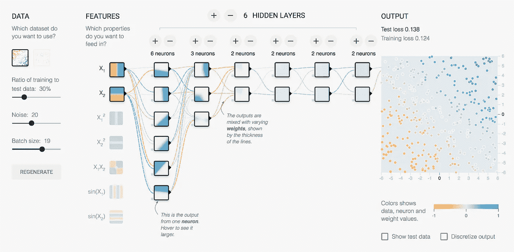
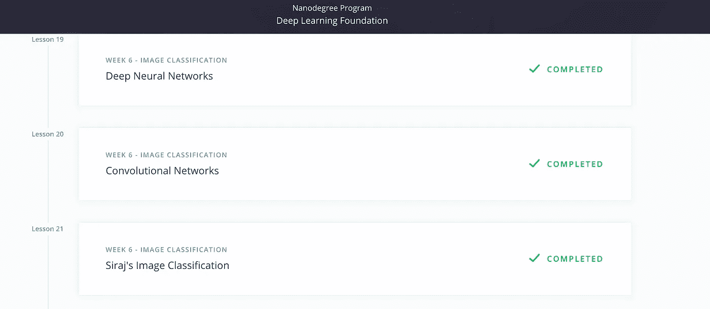
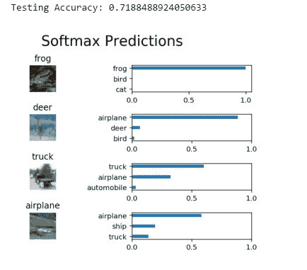
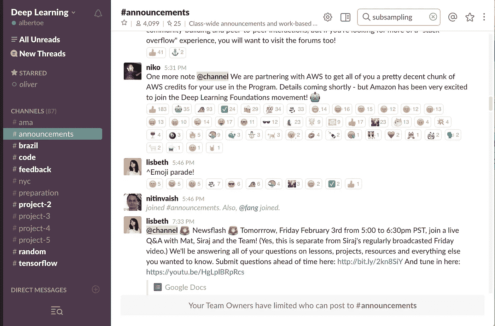

# 为什么我要获得深度学习的(纳米)学位

> 原文：<https://towardsdatascience.com/why-im-getting-a-nano-degree-in-deep-learning-a2e7aee3f641?source=collection_archive---------3----------------------->

“活着吧，就像你明天就会死去一样。要像永远活着一样去学习。”
――圣雄甘地

深度学习已经出现在搜索、通信、广告、商业、金融、医学、媒体和许多其他领域。在未来的岁月里，它的影响力只会增加。当你意识到随着计算能力的激增而增强的大型数据集的[可用性才刚刚开始，这让你想了解更多。](https://docs.google.com/spreadsheets/d/1AQvZ7-Kg0lSZtG1wlgbIsrm90HaTZrJGQMz-uKRRlFw/edit#gid=0)

作为一名顾问、导师和投资者，我与任何愿意与他人分享知识的人都有联系。在大范围内，在互联网上，我们看到人们愿意分享每一个话题。有多种格式的内容可供使用，包括数兆字节的文本、数年的音频和视频。虽然互联网是一个巨大的知识来源，但对于特定的学科，它有助于遵循结构化的学习方法。

去年我参加了吴恩达教授的斯坦福/ [Coursera 机器学习课程](https://www.coursera.org/learn/machine-learning)来更新一些旧的概念。在那之后，我在 Udacity 开始了一个类似的课程，当时他们宣布了一个新的深度学习纳米学位。虽然它不是免费的，而且意味着更大的时间承诺(它长达 17 周)，但我决定复习一些自学的 Python 和几十年前的线性代数并注册。

这就是为什么我相信这将值得我的时间和金钱。

## **结构。**

如果你像我一样，结构有助于在你迷失方向之前保持你的注意力。很容易发现自己在阅读一篇关于新的卷积神经网络应用的学术论文——毕竟每天都有新的新闻。但我更愿意学习什么是一个 CNN，如何在此之前自己实现一个。此外，这个结构帮助我提前计划我需要投入多少时间(晚上或周末)来和其他人保持同步。如果你落后了，FOMO 会狠狠地打击你，让你想要迎头赶上。

Structure is good

## **作业。**

我喜欢作业的挑战，因为它们给你安慰，让你觉得你真的在学习。通过自己做一些事情，并看到结果是一种很好的感觉。这让我想起了我在大学里写的第一个程序。

My program can see!

## **向最优秀的学习。**

技术有这个周期，每当有一个新的热门话题，所谓的专家、大师和忍者不知从哪里冒出来，试图通过重复流行词汇或无用的建议来赚钱。你已经看到聊天机器人的趋势了。这是一个很难的主题，所以没人能这么容易地愚弄人。但是我能直接从最优秀的人那里学到东西，这有多好？仅举几个:牛津大学的研究员，或者百度的[首席科学家，或者 Udacity 的自动驾驶团队。](https://www.coursera.org/learn/machine-learning)

哦，我有没有提到 [Siraj](https://www.youtube.com/watch?v=bHSDYa95mMo) ？

## **社区。**

来自世界各地的学生组成了一个超级充满活力的社区(不幸的是，☹️.仍然是男性主导的)因为这是一门基础课程，所以有不同层次的专业知识。你会发现年轻的学生或像我这样的人都在寻找新的知识，或者只是对这个主题感到好奇。一个松散的董事会让每个人都保持联系，虽然它可能有点混乱，但你可以让人们 24/7 询问和提供帮助。永远不会无聊。

Slack board for students

## **行业背景和人脉。**

接近社区和在这个行业工作的人会让你对正在发生的事情有更好的了解。只要浏览科技新闻，就能看到自动驾驶汽车是现在的热门话题。深度学习领域的 Udacity 纳米学位可以让你快速进入自动驾驶汽车工程师纳米学位(第一批 250 个名额有 1.1 万名申请人。)仅此一点就吸引了许多人，他们认为这是在该领域尝试职业生涯的一个切入点。像宝马、滴滴、优步、Kaggle、梅赛德斯-奔驰这样的公司都在等待招聘最有才华的人。

***更新:*** *我现在已经开始学习所有关于自动驾驶汽车的技术。截至 2018 年 1 月，我即将开始第三个也是最后一个学期的* [*自驾工程师纳米学位*](https://www.udacity.com/course/self-driving-car-engineer-nanodegree--nd013) *。比我下面写的深度学习课程要复杂一点。课程开始类似于深度学习课程，但后来进入了计算机视觉、机器人和许多令人敬畏的科目。我毕业的时候会在 5 月份写一篇类似的文章。同时，享受阅读我完成的具体任务的乐趣:*

*   [实现自动驾驶汽车的模型预测控制](https://medium.com/@cacheop/implementing-a-model-predictive-control-for-a-self-driving-car-7ee6212a04a8)
*   [自动驾驶的 PID 控制](https://medium.com/@cacheop/pid-control-for-self-driving-1128b42ab2dd)
*   [前置摄像头的车辆检测与跟踪](https://medium.com/@cacheop/vehicle-detection-and-tracking-from-a-front-face-camera-a9b83c842f58)
*   [自动驾驶汽车的高级车道检测](https://medium.com/@cacheop/advanced-lane-detection-for-autonomous-cars-bff5390a360f)
*   [计算机视觉技术实现一种改进的车道寻找算法。](https://medium.com/@cacheop/advanced-lane-detection-for-autonomous-cars-bff5390a360f)
*   [利用深度学习克隆驾驶行为](https://medium.com/@cacheop/using-deep-learning-to-clone-driving-behavior-30100c0782f6)