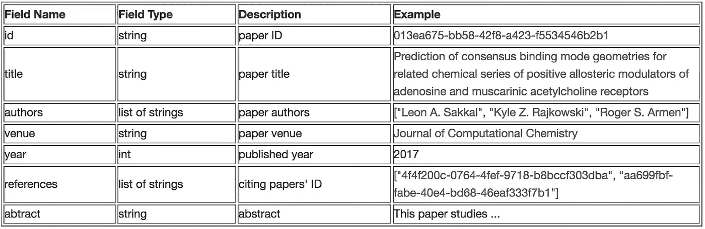
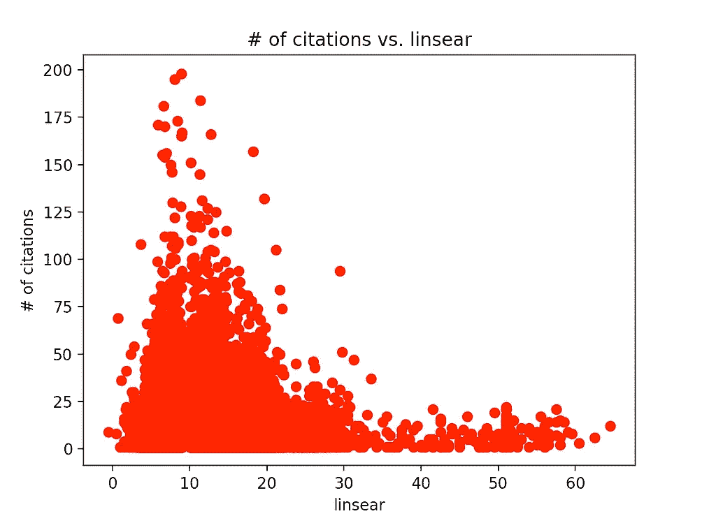
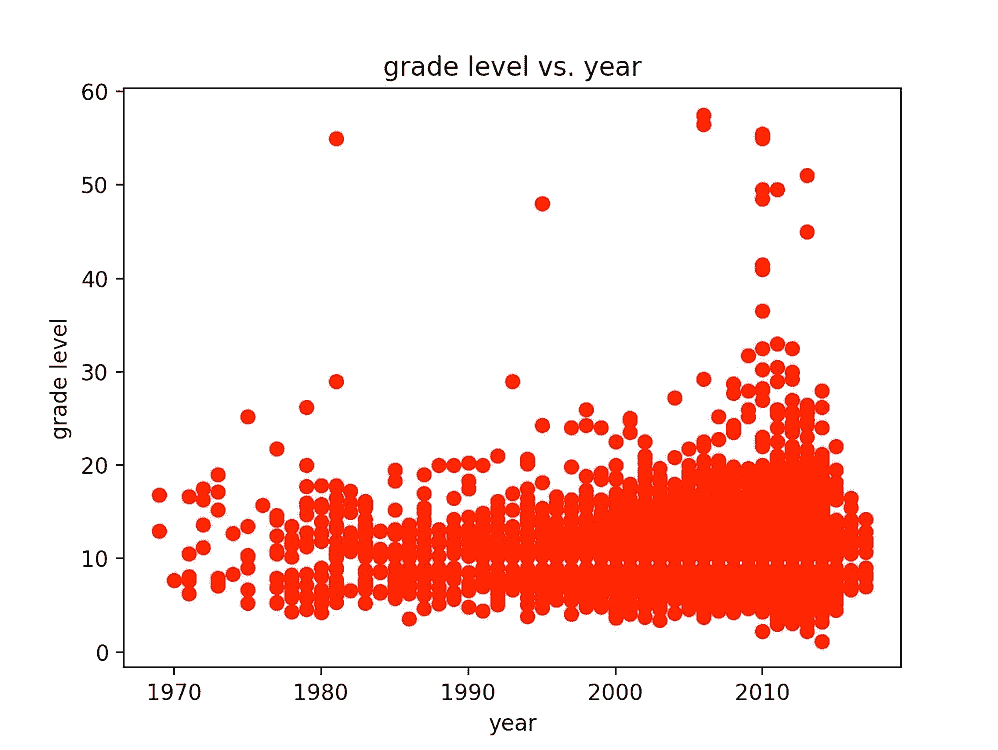
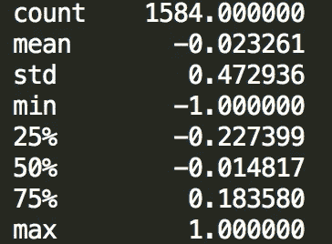

# 为什么学术写作如此密集？

> 原文：<https://towardsdatascience.com/why-is-academic-writing-so-dense-88ca11cb368c?source=collection_archive---------10----------------------->

我分析了 100K 篇论文来找出答案。

# 动机

最近，我很长时间没有在媒体上发帖了。斯坦福大学公共财政课程的第二部分是关于结构评估的。这些论文很容易就达到 100 页/张，而且充满了希腊字母和冗长复杂句子。

> 这一痛苦的经历让我思考:为什么研究人员没有动力写得更简单？

# 理论和可检验的预测

## 学术写作应该简单一点吗？

*   **理论 1:** 你可能认为这是显而易见的——简单的写作更容易理解，这反过来会导致更多的引用。**【是】**
*   不幸的是，同行评议出版游戏有时会相当混乱。作者可能会写冗长、复杂的论文来转移任何可以想象的批评。他们可能还会用复杂程度或篇幅来表明论文的质量——毕竟，没有人想读 100 页的希腊字母，即使是审稿人也不想。**【否】**
*   **理论三:**一个更无伤大雅的观点是，复杂的文字对于表达复杂的思想是必要的。**【否】**

## 可检验的预测

*   **预测 1:** 越简单的论文引用越多。
*   **预测二:**复杂论文获得更多引用。
*   **预测三:**引文不受写作风格影响。

# 结果预览

我找到了三种理论的证据:

*   学术著作如此密集，因为引文似乎不受其影响。在某些情况下，研究人员甚至可能因此获得奖励，可能是因为这使得缺陷更难发现。
*   基于主题和文化背景，有很多异质性。
*   我的结果绝不是最终的——因为可能还有其他我没有考虑到的混杂因素。如果你对我如何使我的分析更严谨有任何建议，请给我留言。

我们开始吧:)

# 数据

为了回答这个问题，我使用了 2008 年 SIGKDD 论文 [*ArnetMiner:学术社交网络的提取和挖掘*](https://aminer.org/citation)*中的引用数据，该数据收集了 300 万篇论文的以下信息:*

**

# *结果基于前 10 万篇论文*

## *100K 样品*

*由于我的处理能力和内存有限，所以我把前 100K 的论文作为我的样本。如果你对复制我的分析感兴趣，我在这篇博客的结尾提供了我的 Python 代码。我们可以比较我们的结果，看看第一个 100K 的论文是否具有代表性。*

## *可读性度量*

*我计算每篇论文摘要的 [Linsear-write](http://linsear write) 分数。我选择 Linsear-write 是因为据说它是由美国空军开发的，用来计算他们的技术手册的可读性，而不是一些随机的学术构造。*

*我含蓄地做了两个假设:*

*   *摘要的复杂性很好地代表了论文的复杂性。*
*   *Linsear-write 是衡量文本复杂性的一个很好的方法。*

## ***相关系数:***

*   ***Corr[# of 引文，可读性]** : -0.026。*
*   ***Corr[年份，可读性]** : 0.013*

****

## *观察*

***引文数量和 Linsear 可读性分数之间的关系是非线性的，并且高度可变:**在 10 年级理解之前，引文数量随着写作复杂性而增加；十年级后的理解，引文数量随着写作的复杂性而减少。但是这种关系似乎很弱——因为在十年级左右有很多变化。*

*【Linsear 分数和年份的关系就不那么明显了:随着时间的推移，每年都有更多的论文被发表。因此，容易试卷的数量和难试卷的数量都增加了。相对于简单试卷的数量，硬试卷的数量增加更多。随着时间的推移，硬纸变得越来越硬。*

# *因果解释*

## *相关！=因果关系*

*是什么阻止我得出复杂的写作导致低引用率的结论？让我检查一下我是否陷入了因果推理陷阱:*

*   ***反向因果关系:**低引用导致文风复杂？*
*   ***巧合关联:**关联是由于随机的偶然性。鉴于样本量大，不太可能。但是严谨一点，我可以做 t 检验。*
*   *第三个因素导致了复杂的写作风格和低引用率。*

***遗漏变量偏差是一个真正的问题。导致复杂写作风格和低引用率的第三个可能因素是:***

*   ***例 1:理论领域术语更硬，研究人员更少。**但是由于这些术语被该领域的所有研究者普遍使用，它们不会给读者带来太多负担；低引用率仅仅是因为该领域很少有研究者引用它们。*
*   ***例 2:** **随着时间的推移，领域变得更加高级和专业化。更高级的概念可能需要更复杂的写作，更专业的问题可能产生更少的引用。***
*   ***解法:** (1)对于每篇论文，用当年期刊平均值贬低引文量和复杂度。(2)计算每个期刊贬低的引用和贬低的复杂性之间的相关性。*
*   *注意:我的解决方案处理了我认为最重要的两个被忽略的变量偏差。可能还有其他我漏掉的混淆因素。*

# *贬低的相关系数*

*对于每份期刊，我计算了贬低的引用和贬低的可读性之间的相关性。这是 1584 份期刊的相关系数分布。*

**

## *观察结果:*

> ***平均而言，一篇比同行更复杂的论文被引用的次数略少。但是效果真的很小——这表明学术人员不会因为写了深奥的论文而受到处罚。***

***有大量的异质性:**我们有很多负相关、零相关和正相关的期刊，为这三个理论都提供了证据。*

# *追问:正相关、零相关或负相关的期刊有哪些？*

*点击[此处](https://medium.com/@vivian_zheng/demeaned-correlations-between-readability-and-citations-38d849ab0463)查看完整列表。*

## *经济学*

*对我来说不幸的是，这个样本中仅有的两个顶级经济期刊有真正的正相关关系:*

*   *经济理论杂志:0.18*
*   *游戏和经济行为:0.35*

*这与复杂的论文更难发现缺陷的观点一致，更多的读者会购买结论并引用它。这证实了该领域资深研究人员的许多轶事。*

## *计算机科学*

*大多数计算机械协会(ACM)期刊都有很强的负相关性。这是意料之中的——因为大多数后续论文需要重复其结果。如果很难理解，后面的论文可能就不想复制了。*

## *词云*

***更正[可读性，引文] < -0.22:底部四分位数***

**

***Corr[可读性，引文] > 0.18:前四分位数***

**

***观察:***

*   ***作者是否因写复合句而受到处罚取决于主题:**第一个词云的特点是更实用的主题，而第二个词云的特点是更抽象的主题。*
*   *有重要的文化差异。来自亚洲，我可以证明老师们非常重视写复合句和使用新奇的词汇。当我第一次来到美国的时候，我不得不抛弃我的许多旧习惯。*

# *结论*

*我找到了三种理论的证据:*

*   *学术著作如此密集，因为引文似乎不受其影响。在某些情况下，研究人员甚至可能因此获得奖励，可能是因为这使得缺陷更难发现。*
*   *基于主题和文化背景，有很多异质性。*
*   *我的结果绝不是最终的——因为可能还有其他我没有考虑到的混杂因素。如果你对我如何使我的分析更严谨有任何建议，请给我留言。附录:Python 代码*

# *附录:Python 代码*

*让我们导入一些 Python 模块:*

```
**import* re
*import* json
*import* numpy *as* np
*import* pandas *as* pd
*import* matplotlib.pyplot *as* plt
*from* wordcloud *import* *
*from* textstat.textstat *import* textstat*
```

*将 JSON 对象加载到 Pandas 数据框中:*

```
*df = pandas.read_json('inPath',lines=True)
df = df.head(100000)*
```

*删除缺少数据的行:*

```
*df1=df.dropna()*
```

*统计引用次数:*

```
*df['num_citation']=df['references'].apply(*lambda* x: len(re.split(',',str(x))))*
```

*使用 Linsear 度量计算摘要的可读性。*

```
*df['linsear'] = df['abstract'].apply(*lambda* x:textstat.linsear_write_formula(x))*
```

*根据可读性绘制引用数量图:*

```
*plt.plot(df['linsear'],df['num_citation'],'ro')
plt.ylabel('# of citations')
plt.xlabel('linsear')
plt.title('# of citations vs. linsear')
plt.show()*
```

*贬低引用和可读性:*

```
*demean = *lambda* df: df - df.mean()
df1=df.groupby(['venue', 'year']).transform(demean)
df['demeaned grade level']=df1['grade level']
df['demeaned citation'] = df1['num_citation']
correlations = df.groupby('venue')['demeaned grade level','demeaned citation'].corr().unstack()
correlations = correlations['demeaned grade level','demeaned citation'].sort_values()*
```

*标绘文字云:*

```
*neg_corr=correlations[(correlations<-0.22)]
pos_text=pos_corr.index.str.cat(sep=',')
neg_text=neg_corr.index.str.cat(sep=',')
common_set = set(pos_text.lower().split()) & set(neg_text.lower().split())
common_list=[]
*for* e *in* common_set:
    *for* w *in* re.split('\W+',e):
        *if* w!='':
            common_list.append(w)
common_list=common_list+['Review','Letters','Application','Personal']

wc= WordCloud(stopwords=common_list).generate(neg_text)
plt.imshow(wc,interpolation='bilinear')
plt.axis('off')
plt.savefig('your path to word cloud with negative correlations')*
```