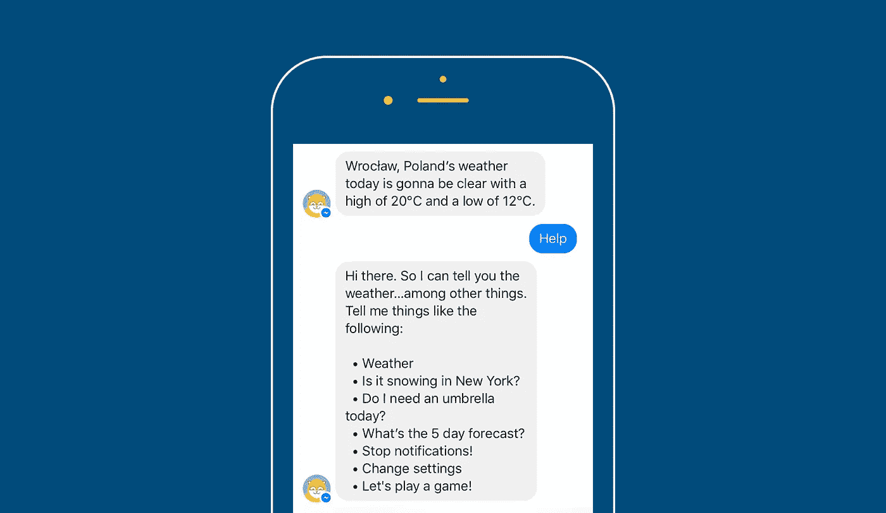
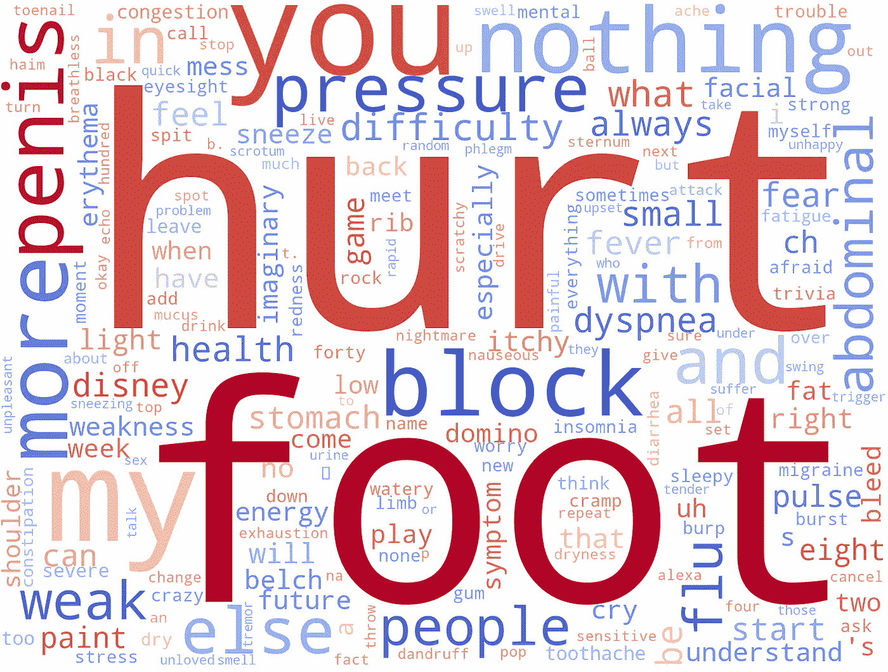

# 为什么很难培养一种对话式的 Alexa 技能

> 原文：<https://towardsdatascience.com/why-its-hard-to-develop-a-conversational-alexa-skill-b8689f57a7f?source=collection_archive---------13----------------------->

**2019 注** : *本文提及的技术方案截至目前不再有效。亚马逊采取了一个有争议的方向，这实际上禁止技能开发者制作像这里描述的对话技能。据我所知，没有任何变通办法可以让技能理解用户的自由文本或任何相近的内容(不，* [*这个*](https://developer.amazon.com/blogs/alexa/post/a3142024-75cf-46bb-924a-0ab3524a5c07/5-techniques-to-replace-amazon-literal-and-improve-skill-accuracy) *甚至都不相近)。可悲的是，唯一的选择似乎是完全放弃这个平台，转而使用谷歌助手。*

大多数 Alexa 技能似乎符合执行用户命令的简单模式。这些命令中的一些可能有参数，如歌曲名称或城市名称，但通信通常不会超出这个范围。但是如果你想在你的技能范围内进行一次真正的对话，有趣的事情就会发生。在接下来的部分中，我将分享我们的经验和一些提示，它们可能会帮助您解决将要面临的一些问题。您还将看到人类与机器对话时使用的语言。

注:本文原载[于 Infermedica 博客](https://blog.infermedica.com/why-its-hard-to-develop-a-conversational-alexa-skill/)。这里有一个稍微更新的版本。Lukasz Przywarty 拍摄的图片。

# 症状检查技能

我们已经发布了[一个 Alexa 技能，要求你说出你的症状](https://www.amazon.com/Infermedica-Symptom-Checker/dp/B071JFJWZC/)并进行一个简单的采访，以确定你健康问题的可能原因。这项技能是使用我们的 API 构建的，它具有症状检查引擎和 NLP 功能(捕获英文消息中提到的症状)。该技能旨在作为概念验证，鼓励其他人使用我们的 API 产品开发自己的语音应用程序。

在这一过程中，我们遇到了一些障碍，这些障碍超出了我们的预期。请注意，我们甚至没有尝试处理完全自由形式的对话；我们的对话结构或多或少是固定的。然而，这种固定的流程对于传统的技能设计过程来说已经是一个挑战。

# 对话不友好

你可能会觉得亚马逊不鼓励你与用户交流。在他们的[开发者门户](https://developer.amazon.com/public/solutions/alexa/alexa-skills-kit/getting-started-guide#what-kind-of-skill-do-you-want-to-create)上列出的十个例子中，只有一个是对话性质的(玩危险游戏)。剩下的归结起来就是按照一个简单的要求行动，然后放弃(查找简单的答案，吐出一条新闻，或者控制灯光或音频播放器)。

> “亚马逊可能已经预料到，给开发者太多自由会导致持续缺乏理解，最终，这将归咎于 Alexa 本身。”

我能想到两个可能的原因。首先，这些应用被认为是增强主要体验的附加*技能*，从而给人一种主要对话发生在特定应用之外的印象。其次，亚马逊可能已经预料到，给开发者太多自由会导致持续缺乏理解，最终，这将归咎于 Alexa 本身。

## 意图和位置

Alexa 的交互模式不是对话友好的。用 Alexa 的话来说，这种互动可以通过使用“定制技能”类型来实现。然而，如果你期望找到一个方便的框架来实现自定义聊天，你会失望的。即使在使用“自定义技能”时，你也不得不列举一组固定的*意图*，让用户表达出来。意图可能是想要点咖啡或找到电影名称。确认(回答问题时说“是”)和否认(“否”)也是意图。一些意向可能有用于参数的*槽*，比如城市名称或咖啡类型。您必须指定每个插槽的类型；您可以使用一种预定义的类型，或者您需要—您猜到了—枚举一组固定的值。很难想象一次随意的聊天会有这种程度的严谨。

> *“Alexa 的交互模式对对话不友好。”*

现在想象一下，你正试图创造一种技能，可以阅读你的症状并缩小其最可能的原因(就像我们所做的那样)。虽然输入我们的医学知识库中目前定义的超过 1，400 种症状的名称在技术上是可行的，但是不可能为每个值提供多个同义表达(例如，“耳痛”、“我耳朵痛”、“耳朵疼”)。即使这是可能的，保持这种独立于主要知识库的列表会立刻扼杀任何现实生活中的项目。

## 你能做什么

有一个行之有效的解决方法。你需要做的是迫使 Alexa 认为:

1.  无论用户说什么，都符合一个唯一的包罗万象的意图。
2.  这个意图本身就是一个巨大的`SearchQuery`类型的槽。这种类型是我们通向自由的门票——它使得[捕捉任何文本](https://developer.amazon.com/blogs/alexa/post/a3142024-75cf-46bb-924a-0ab3524a5c07/5-techniques-to-replace-amazon-literal-and-improve-skill-accuracy)成为可能。

注意，要使技能被认可，你还需要加入三个强制性的意图:呼救、取消当前动作和要求气缸闭嘴。

菜谱有两部分:[意图模式](https://gist.github.com/adam-ra/01c335833bea7da2d2797fcca5e818a4)和[样本话语](https://gist.github.com/adam-ra/e5cee2ed87e65976bfc392fade325d82)。通过这种方式，你可以有效地防止 Alexa 试图捕捉用户话语中的意图和片段，让你通过 Alexa 语音服务获得从用户语音转录的完整原文。这意味着你只能独自处理非结构化的文本信息，而你的应用程序应该会发送回文本回复。进入聊天机器人的[世界！](https://blog.infermedica.com/three-challenges-youre-going-to-face-when-building-a-chatbot/)

# 处理听错的话

尽管有各种宣传和荣耀，但底层语音识别平台 Alexa Voice Services 相当令人失望。一个已知的问题是[有不标准的口音](https://www.wired.com/2017/03/voice-is-the-next-big-platform-unless-you-have-an-accent/)。但实际问题似乎远不止于此。

> *“我们应该预料到一些错误会出现，特别是如果话语不典型或者很短——没有足够的上下文来消除歧义。”*

对自然语言处理感兴趣的读者应该知道，没有大规模的[统计语言建模](https://www.microsoft.com/en-us/research/project/language-modeling-for-speech-recognition/)，现实生活中的语音识别是不可能的。声音信号是高度不明确的，系统需要大量已知的一个接一个单词的模式来决定实际上在说什么。如果这对你来说似乎有悖常理，试着回忆一下你最后一次试图通过电话告诉别人姓氏、地址或 wifi 密码是什么时候。像这样的信息交流是很困难的，因为接收者的大脑没有足够的语言模型。

这就是说，我们应该预料到一些错误会出现，尤其是如果话语不典型或者很短——没有足够的上下文来消除歧义。

## 你是电子邮件还是电子邮件？

缺乏上下文是一个常见的问题。在我们采访的某些时候，我们需要了解用户的年龄和性别。后一个问题引起了惊人的麻烦。如果答案是“男性”，那就根本没这么理解。最常听到的(错误的)回答是“mail ”,然后是一些更长的短语，如“I a mail ”,甚至是“can you mail”。由于我们无法获得语音记录，我们只能猜测用户想说什么。日志中出现的一些意想不到的单词可能来自喃喃自语，甚至来自房间中的多人说话。Alexa 的语言模型在解释“女性”方面问题较少，但在文字记录中看到“电子邮件”并不罕见。

我们如何处理这些？嗯，在这个简单的二选一问题中，我们硬编码了最常见的模式，并假装没有什么不寻常的事情发生。

当曲解的话语是开放式问题的答案时，一个更大的问题出现了。是的，当我们试图理解用户健康问题的描述时，这种情况经常发生。对匿名日志的一次挖掘发现了许多关于“棺材”和“咖啡”的投诉(咳嗽？).这些采取各种形式，例如，“我有一个驱动棺材发烧”(干咳和发烧？)，还有一个戏剧性的表白:“我是咖啡”(我在咳嗽？).我们还发现了 Alexa 对迪士尼的怪异亲和力(*头晕*，或许还有*呼吸困难*)。

我们仍然没有找到解决这个问题的好办法。这个问题本身就是我们的技术名声不好的主要原因。相比之下，[我们的谷歌助手集成受到了称赞](https://assistant.google.com/services/a/uid/000000a04396478b)，尽管两者是由完全相同的语言理解后端驱动的。

## 最好的语言模型是领域相关的

这些问题中的许多都可以用特定于领域的语言模型来解决。不幸的是，Alexa 只提供了一个通用的语音识别器，无法注入额外的语言环境。一个理想的解决方案将允许我们从几个预先训练好的特定领域模型中选择一个，如医疗领域、IT 和管理、休闲八卦和生活方式等。能够提高某些预期短语(例如“女性”和“男性”)的概率也是有帮助的。我们希望两者最终都能在所有主要的语音平台上提供。

谷歌语音识别引擎的出色表现表明，训练数据的规模和可变性确实会产生影响。

# 语音交流鼓励更自由的语言

聊天语言随意。在聊天机器人的例子中，通过使用即时响应模板，用户的语言被部分驯服。此外，一些聊天机器人会给出冗长的介绍，为接下来的对话定下基调。

Poncho bot giving verbose suggestions. You can’t afford this on Alexa!

语音界面的本质鼓励随意的日常语言。技能设计者可能会使用介绍和插曲来引导对话者使用机器友好的语言，但不要让用户厌烦得要死，这是一项棘手的任务。Alexa 缓慢的语速加上我们不断缩短的注意力持续时间几乎没有解释的余地。

这种表达的自由让我们的用户更难理解，尤其是因为有些话根本就是听错了。

## 如何比较语言变体

让两个对话代理执行同一种健康检查使我们能够比较与 Alexa 对话时使用的语言和与聊天机器人打字时使用的语言，至少对于这个特定的领域是如此。

[症状](https://symptomate.com/chatbot/)(网络聊天机器人)和[症状检查器 Alexa skill](https://www.amazon.com/Infermedica-Symptom-Checker/dp/B071JFJWZC/) 都有类似的对话流程。在对话的第一阶段，用户被要求用自己的话描述他们的症状。我使用这些描述(记录在匿名日志中)来寻找这些语言的不同之处。

比较两个语言样本以发现相似性和差异是语料库语言学和词典学的一个基本问题。虽然原则上有更多的东西，但它通常被简化为比较词频来发现不规则性。如果你对这个话题感兴趣，最好的起点是已故的 Adam Kilgarriff 的开创性论文。

## 口语单词、打字单词

口语和书面语是不同的，这不足为奇。但是到底有多大的不同，这对系统有什么影响呢？让我们来比较一下，在对聊天机器人打字时，哪些单词更受欢迎，在对 Alexa 说话时，哪些单词更受欢迎。下面的可视化显示了最能区分聊天机器人和语音症状检查器所用语言的单词。一个单词的大小反映了它对这些语言变体的具体程度(使用*对数似然比*度量计算)。红色单词更频繁地对 Alexa 说(根据 Alexa 听到的)，而蓝色单词更频繁地输入到 Symptomate 聊天机器人。

Words used in communication with the chatbot (blue) and with the voice assistant (red).

Alexa 收到了更直接、更个性化的语言。你可以在人称代词的出现中看到这一点(*你*、*我的*)。此外，疼痛更经常用动词*伤害*(我的胃痛而不是*胃痛*)来描述。聊天机器人见过更多的医学术语和正式语言(如*腹部*、*呼吸困难*、*压力*、*难度*)。

平均而言，我们的聊天机器人可以比我们的 Alexa 技能多理解 13%的故事(粗略估计)。很难说这有多少是由于语音识别错误，又有多少是由于我们的 NLP 系统对正式语言的偏好。

# 摘要

在这篇文章中，我已经指出，建立一个对话式的 Alexa 技能是相当困难的。首先，Alexa 技能套件的设计在这方面并没有真正的帮助。您需要滥用技能配置来将您的应用程序从僵化的意图中解放出来——否则会扼杀任何自由形式的对话。然后，您需要处理底层语音识别技术的错误，或者等待并希望这将随着时间的推移而改善。你的技能将为每一个语音识别错误受到指责，用户甚至不会知道不是你的技能没有理解简单的语言，而是亚马逊的平台。你的领域越开放，你就越有可能面临这些问题。最后但同样重要的是，你的用户将会使用比他们在聊天机器人上打字时更随意的语言。

所有这些观察都是在发展我们的[症状检查技能](https://www.amazon.com/Infermedica-Symptom-Checker/dp/B071JFJWZC/)时进行的。请随意尝试，并自己判断我们是否已经设法克服了这些困难。