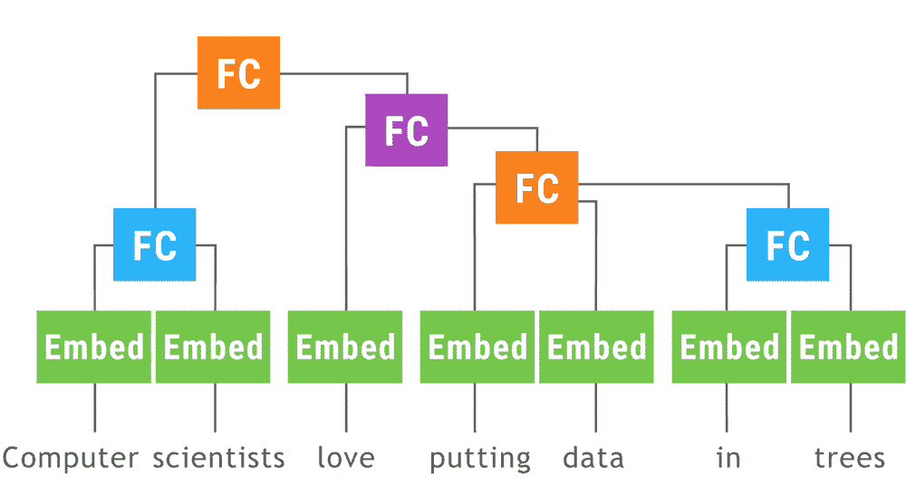

# 为什么训练一个具有动态结构的神经网络不再困难！

> 原文：<https://towardsdatascience.com/why-its-not-difficult-to-train-neural-network-with-dynamic-structure-anymore-bc5e2f67fef0?source=collection_archive---------0----------------------->

TLDR；最后，开源社区解决了神经网络中动态结构的需求。在过去的 3 个月中，我们看到了 3 个支持动态结构的主要库版本。

1.  [张量流折叠](https://github.com/tensorflow/fold)(谷歌)
2.  [达内](https://github.com/clab/dynet) (CMU)
3.  [Pytorch](https://github.com/pytorch/pytorch) (Twitter、NVIDIA、SalesForce、ParisTech、CMU、数字推理、INRIA、ENS)

在 [Innoplexus](https://www.innoplexus.com/) ，我们从结构化、非结构化和半结构化来源收集信息，以帮助我们的客户做出实时决策。为了达到这个速度，我们将自然语言中的文本从非结构化的源转换成适当结构化的表示。由于速度是一个主要的瓶颈，我们的 NLP 系统是基于语言的递归结构，这是由于工具的可用性和计算在多台机器上的分布。

随着时间的推移，我们意识到递归方法的局限性，如 LSTM 和 GRU 试图将递归自然语言纳入一个序列框架。这导致在信息处理任务中语法信息的丢失。但不幸的是，从头开始实现递归神经网络可能会变成一场噩梦，因为它涉及到以非常高的精度编写复杂的反向传播代码。

大多数 ML 库，如 Tensorflow、Torch 或 Theano，允许创建静态网络，该网络限制了作为输入函数的网络结构的变化。这被证明是自然语言处理/理解中的重大限制，其中句法信息被编码在作为输入文本的函数而变化的解析树中。像[句法分析](https://github.com/clab/lstm-parser)、[机器翻译](https://github.com/neubig/lamtram)和[情感分析](http://nlp.stanford.edu/~socherr/EMNLP2013_RNTN.pdf)这样的许多应用需要句法信息和语义信息。由于没有任何框架可用，开发人员不得不在 Numpy 中实现培训过程。这被证明是非常容易出错的，并且是必须以高精度执行的单调乏味的任务。

我们在 [Innoplexus](https://www.innoplexus.com/) 实现实体提取器时遇到了类似的问题。它使用语义统一的递归神经网络，具有树状结构。由于没有任何支持动态结构的框架，我们最终在 Tensorflow 中实现了它。这给我们的计算图带来了沉重的负担，使得我们的训练过程缓慢，内存效率低下。此外，决定批量大小来刷新图表成为训练过程中的一个关键问题。正当我们准备在 Numpy 中重写整个训练过程以加快速度时，我们遇到了 Dynet。

> DyNet(原名 [cnn](http://github.com/clab/cnn-v1) )是由卡耐基梅隆大学和其他许多人开发的神经网络库。它是用 C++编写的(使用 Python 中的绑定)，设计为在 CPU 或 GPU 上运行时都很有效，并且适用于具有针对每个训练实例而变化的动态结构的网络。

我们在 Dynet 中重构了代码，对 Tensorflow 代码做了微小的修改。就可用功能而言，Dynet 不如 tensorflow 成熟，因此我们最终为 Tensorflow 编写了实现。另一方面，PyTorch 更加成熟，并得到了更广泛的社区的支持。您可以创建这样的动态图形:

PyTorch: Dynamic Graph Construction

Google 最近推出了 Fold，它包含了比 tensorflow 更广泛的 Python 对象。它提供了对结构化数据的支持，比如嵌套列表、字典和[协议缓冲区](https://developers.google.com/protocol-buffers/)。这克服了 Tensorflow 的静态图形限制。它的方法与 PyTorch/Dynet 完全不同。它使用[动态批处理](https://arxiv.org/abs/1702.02181)来并行化多个实例图中的操作。仔细看看，这很酷。简而言之，它是这样工作的:

Tensorflow Fold: How it works.

在自然语言处理领域，语言可以有不同的表达长度，因此动态计算图是必不可少的。人们可以想象语法是如何被解析来实现对堆栈和动态内存以及动态计算的需求的。Carlos E. Perez 在他的[文章](https://medium.com/intuitionmachine/pytorch-dynamic-computational-graphs-and-modular-deep-learning-7e7f89f18d1#.b0o0sfqzo)中恰当地总结了这一重大进展。

> 随着这一发展，预计深度学习架构将走过与传统计算相同的进化道路将是合理的。也就是从单一的独立程序到更加模块化的程序。引入动态计算图就像引入过程的概念，而以前只有“goto”语句。正是过程的概念使我们能够以可组合的方式编写程序。当然，有人会说 DL 架构不需要堆栈，但人们只需要看看最近对超网络和拉伸网络的研究。在研究中的网络中，像堆栈这样的上下文切换似乎是有效的。

我们正在使用这些库来重构我们的代码，以便通过较小的修改从递归系统转移到递归系统。这极大地改进了我们现有的模型，并使我们能够解决以前无法解决的问题。我希望这能帮助你实现和我们一样的转变！

快乐黑客:D