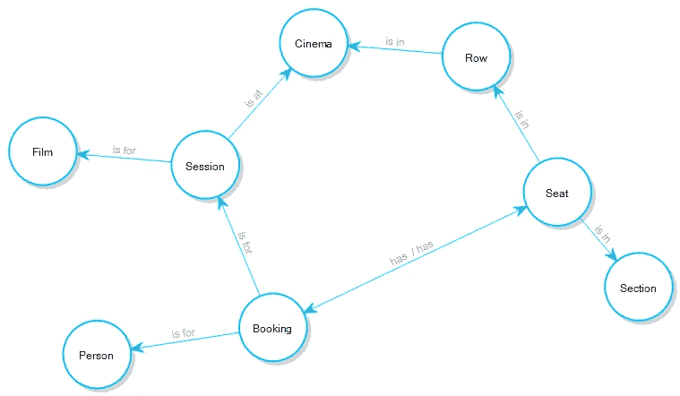
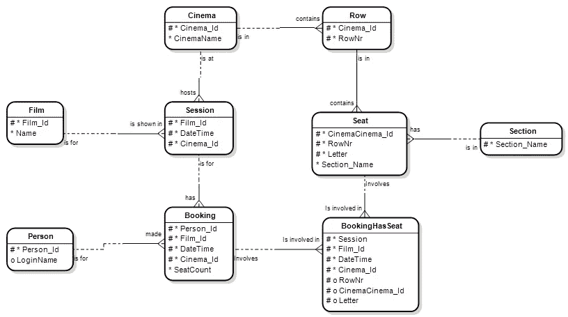
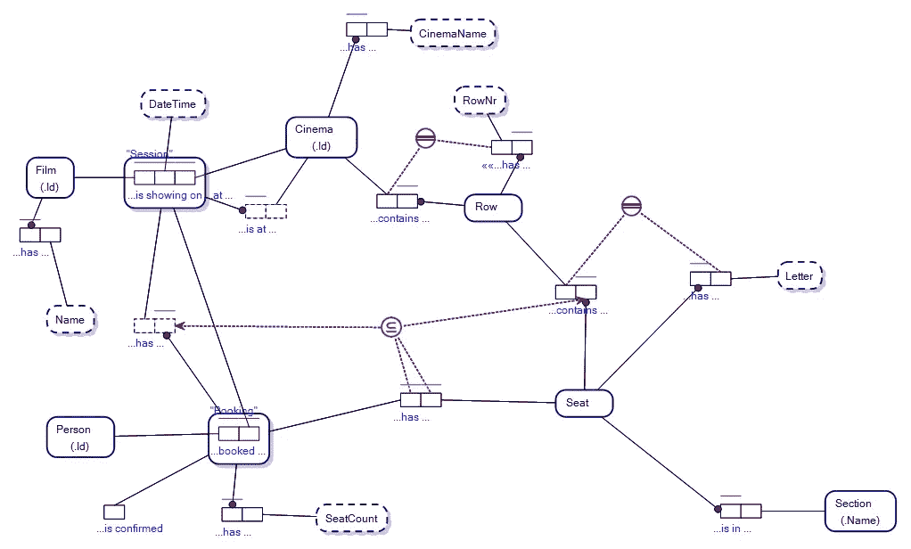
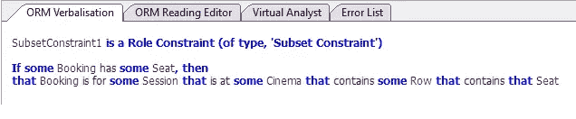

# 为什么要学习对象角色建模？

> 原文：<https://towardsdatascience.com/why-learn-object-role-modelling-4eebd93dcda2?source=collection_archive---------7----------------------->

## 对象-角色建模(ORM)是一种为高精度数据/本体建模而设计的概念建模语言。

在过去的 40 年里，ORM 在信息通信技术领域鲜有建树；人们更喜欢使用像实体关系图、属性图模式和 UML(统一建模语言)类图这样的方法。

我认为这是因为使用后者更容易与他人交流思想。

这就是我们开发波士顿的原因；概念建模软件，让您创建概念模型作为对象-角色模型，并轻松地将这些模型转换成实体关系图和属性图模式。

人们自然会问:“为什么要学习对象-角色建模？为什么先做 ORM 里的模型？”

原因是多种多样的，但是最有用的答案是 ORM 比现在存在的几乎所有其他概念建模语言更具语义表达性。由于语义更加冗长，将 ORM 图翻译成 ERD 或 PGS 图很容易，但反过来就不那么容易了。事实上，用 ERD 和 PGS 图来表达一些东西是不可能的，因为用 ORM 来表达它们是标准的做法。

从逻辑上讲，很容易将 ORM 的注入或满射映射到其他建模语言，但是(在许多情况下)反过来是不可能的。

ORM 是一种[基于事实的建模(FBM)](/what-is-fact-based-modelling-106ba15649fa) ，概念建模语言家族，包括 FCO-IM(流行于荷兰，逻辑之乡)。

无论是从自然语言还是从基于逻辑的角度来看，FBM 语言都比大多数其他概念建模语言更具表现力。

通俗地说，与其他建模语言相比，使用 ORM 可以做更多的事情，这就是 ORM 和其他基于事实的建模语言受到概念建模专家欢迎的原因，这些专家一看就知道质量。

这并没有减损应急关系司/PGS 的效用，而只是肯定了 ORM 的效用。

在 Viev(【www.viev.com】T2)，我们相信，从更广泛的实用角度来看，像实体关系图和属性图模式这样的语言更重要；因为更多的人理解他们，并能容易地与他们联系起来。不可否认，实体关系图和 PGS 图直接映射到广泛使用的数据库结构(关系数据库和图形数据库)。

我们还认为，从建模专业人员的角度来看，ORM 更重要，他们希望在概念建模方面得到最好的东西。

# 多模型数据库

我们认为，当世界正朝着包含关系模型(由 er 图充分服务)和图模型(由属性图模式充分服务)的多模型数据库发展时，试图用一种或另一种语言来支配思维共享是没有意义的。现代多模型数据库(如 SQL Server 2017)需要关系和图形模型的建模。波士顿允许你同时为其中一个或两个做模特。

当您学习 ORM 时，您可以在一种建模语言中为关系数据库、对象关系数据库和图形数据库建模。

这就是为什么我们觉得学习对象角色建模很重要。

## 例子

我所讲的一个简单的例子将展示你可以在 ORM 中做的事情，这些事情你在几乎所有其他概念建模语言中都做不到。

以下面的概念模型为例，表示为属性图模式。

在我们的波士顿建模软件中，你[控制]-点击一个节点类型来查看它的属性。

该模型是一个话语世界(UoD ),我们正在寻找一个电影院的座位预订设施。

电影院有成排的座位和放映电影的时段。一个人可以在电影院预订一个或多个座位，以便他们可以去观看预订的电影(在一个会话内)。

下面以实体关系图的形式显示了相同的模型:

PGS 模型和 ERD 模型都缺少重要的信息，这是一个约束条件:

> 如果某个预订有一些座位，那么该预订是在某个电影院的某个时段，该电影院包含包含该座位的某个行。

即，在没有放映该人想要观看的电影的电影院预订座位是没有意义的(在一个会话内)。

这个约束是作为子集约束在 ORM 图中创建的，由子集约束符号表示:

Subset Constraint Symbol in ORM

相应的 ORM 图如下所示:

我们相信任何有理性的人都会说属性图模式是最容易可视化的(就所分析的概念而言)。接下来是实体关系图。但是 PGS 和 ERD 都没有抓住关键的限制因素:

*“如果一些预订有一些座位，那么该预订是针对在一些电影院的一些时段，该电影院包含包含该座位的一些行”。*

在开发和测试 IT 系统以满足我们的影院预订需求时，这些关键约束可以节省宝贵的时间。

因为 ORM 是基于自然语言和专门的谓词逻辑的，虽然图表很有用，但是点击约束并让基于 ORM 的软件用自然语言表达约束的意思是无价的。

Verbalisations in Boston

业务分析师可以用 ORM 开发模型，并用自然语言表达系统的需求。

子集约束是可以在 ORM 中表达的八种不同约束之一。ORM 中的一些约束有许多变体，涵盖了八种主要类型之外的各种场景。

本文中提供的例子说明了为什么您可能喜欢学习对象-角色建模。使用像 Boston 这样的软件，您将模型表示为属性图模式或实体关系图的愿望得到了尊重，如果您正在使用多模型数据库，Boston 就是专门为您的需要而设计的。

我希望这有所帮助。如果时间允许，我会写更多关于 ORM、ERDs 和 PGS 的文章。

注意:对象-角色建模版本 2 (ORM 2)的图形符号有其局限性，我将在本文中讨论这些局限性:[对象-角色建模和模糊性](https://medium.com/p/5da1ae4928f4)

**NB** 本文表达的模型原始版本版权归 DataConstellation 所有，在 GitHub 上的 ActiveFacts 项目下共享:【https://github.com/cjheath/activefacts】T4

— — — — — — — — — — — — — — — —