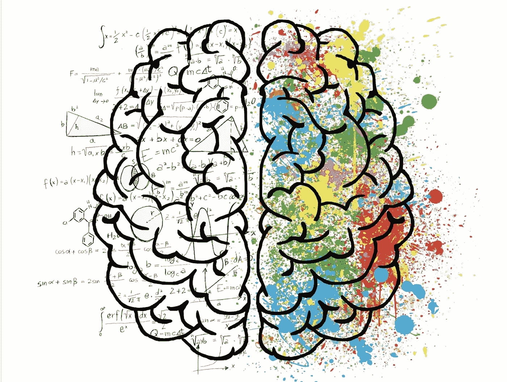
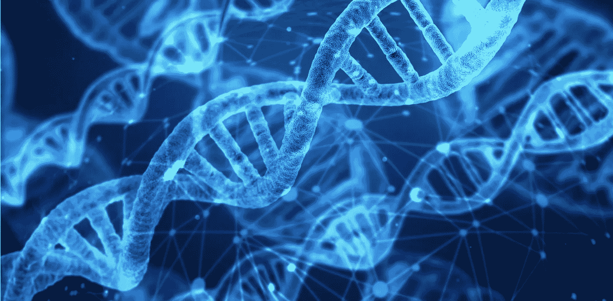
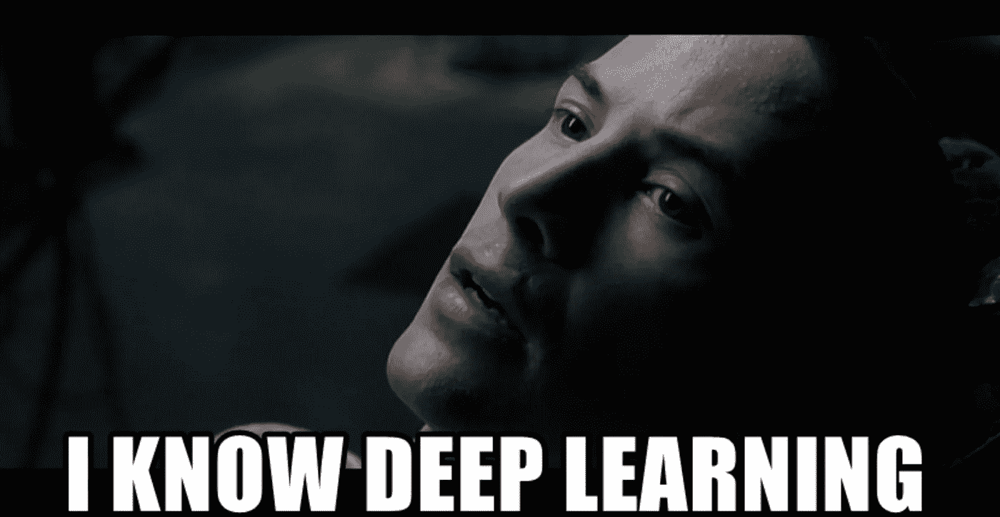

# 为什么机器学习是世界上最好的领域

> 原文：<https://towardsdatascience.com/why-machine-learning-is-the-best-field-in-the-world-af010245228e?source=collection_archive---------9----------------------->

## 很迷人，很多样，不魔幻，很有创意，很科学，很自由！

几年前，当我还是一名初级软件工程师时，我和我们的一名算法开发人员一起解决了一个问题。我以为我找到了突破点:有一个算法做错了。我问开发者为什么算法会这样做，我得到的答案是:

> “我不知道”

“你不知道”是什么意思？这是你写的，对吗？让我换个说法:有一个你创造的机器，它做一些你无法解释的事情？

当然，有时在软件开发中，我们会遇到难以解释的事情。但是在这种情况下，没有调试它的选项:一步一步慢慢地让图片变得更清晰。在这种情况下，有一行代码返回了一些值，但不可能(或者很难)知道为什么。

让我目瞪口呆。创造一些你无法解释的东西的能力让我着迷。在那一天，我决定我要做一些对我来说很难解释的事情。

今天，我知道机器学习(或深度学习，人工智能，数据科学和计算机科学)是最好的领域。造成这种情况的原因有很多，让我着重讲这六个:

**太迷人了**

正如我上面提到的，在远非简单的系统上工作，能够执行真正非凡的任务，是非常令人兴奋的。以“文本”为例。今天，我们拥有能够**理解**我们所说或所写的系统/代理。好吧，不是很明白，但它能够代表我们的语言，可以帮助我们完成许多任务，如翻译、问答、分类(如垃圾邮件检测)等等！我们许多人认为机器为我们做的事情是理所当然的。当然不仅仅是在“文本”中。在许多其他领域，机器解决了我们的许多问题/任务(稍后将详细介绍)。身处这场革命的中心给我们带来了最有趣的挑战。

**多种多样**

今天，机器的能力是无限的。很难找到一个领域不受益于机器学习(如果有，它会变得有趣得多)。如今，自然语言、图像、医疗数据、广告、人力资源等领域越来越多地使用机器学习。机器可以玩游戏、雇人、交易加密货币、驾驶汽车、帮助诊断疾病、在你的手机上推荐应用程序、在脸书上给你看广告、帮助你开车到达目的地等等。通过进入机器学习领域，你几乎可以在任何其他领域工作。

**这不是魔法**

技术和魔法可能看起来有些相似，但它们有一个关键的区别。当你看到伟大的技术和很酷的魔术时，一开始你会感到惊讶。然后，你很好奇想知道引擎盖下。在大多数情况下，当你理解了魔术的工作原理，你会对它的愚蠢和简单感到失望。然而，对于技术，当你更好地理解它是如何工作的，它会让你更加惊讶。在机器学习中，解决方案是卓越的和创造性的，这让我想到了我的下一个观点:

**它包含了无限的创造力**

在许多领域都是如此，尤其是在数学和计算机科学领域。在机器学习中，有无尽的解决问题的方法和无限的想法可以尝试和研究。一开始你什么都没有。你从一张白纸/文件开始。你开始从零开始构建你的系统/代理/模型。你可以使用以前尝试过的许多方法中的一种，你可以修改和改进它们，使它们更适合你的任务，或者你可以从事一些全新的工作。解决方案并不简单，很多时候，为了达到最佳效果，我们必须非常有创意。

**这是科学**

无论你是否通过积极的研究和发表你的工作积极地为科学做出贡献，当你处理机器学习时，你必须跟上最新的进展。而且还有很多。像 ICML 和 NeurIPS 这样的会议以及来自谷歌、脸书和其他研究实验室的论文带来了许多科学进步。这个科学领域很“活”。有很多方法可以跟上最新的报纸。让它成为“科学”的是这样一个事实，即每天我们都会发现一些关于我们世界的新东西。适用于重要领域的新方法，改进算法的新技术。这是真正的进步，它改变了我们的生活。

**它是开源的**

就像软件开发一样，你的大部分资源(除了计算能力)都是免费的！工具、框架、ide 等等。想想 sci-kit learn，tensorflow，keras，jupyter noteook 等。所有这些免费工具让我们的生活变得更加轻松，让我们专注于真正重要和有趣的部分。但不仅仅是工具。所有的知识都是免费的。今天，你可以通过使用不同的 MOOCs、免费书籍和数百万博客帖子和教程，免费获得所有相关资源。只要在谷歌上搜索一些你想学的话题，你就会得到无穷无尽的资源

我总结一下，机器学习很可能并不适合所有人。我肯定还有其他人喜欢其他事情，但对我和更多人来说，机器学习是世界上最好的领域。