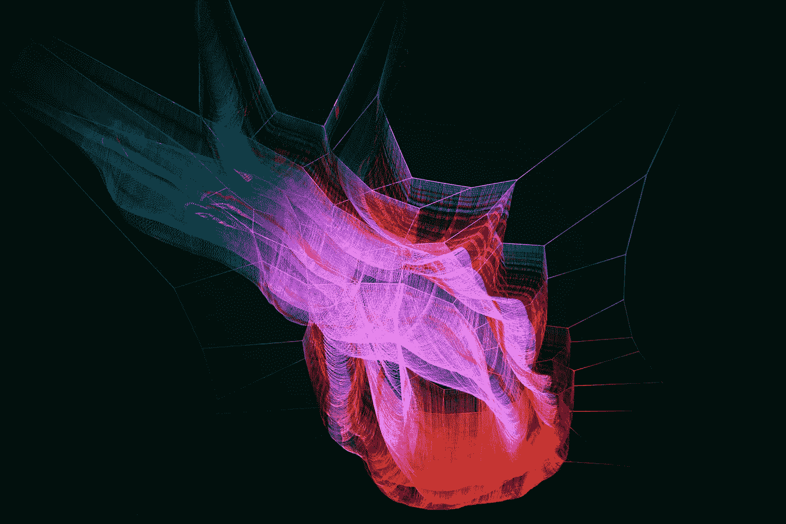

# 为什么许多重要人物都认同人工智能的生存风险

> 原文：<https://towardsdatascience.com/why-many-important-minds-have-subscribed-to-the-existential-risk-of-ai-a55cfc109cf8?source=collection_archive---------4----------------------->

Photo by [Arif Wahid](https://unsplash.com/photos/y3FkHW1cyBE?utm_source=unsplash&utm_medium=referral&utm_content=creditCopyText) on [Unsplash](https://unsplash.com/search/photos/intelligence?utm_source=unsplash&utm_medium=referral&utm_content=creditCopyText)

埃隆·马斯克(Elon Musk)一直在就人工智能给人类物种带来的生存风险敲响警钟。他是一位杰出的领导人，拥有公众眼中最敏锐的思维，因此，对他来说，对我工作的领域感到担忧，并感觉不到这种存在风险，已经造成了相当大的认知失调。我本能地不同意像他这样的人，以及像尼克·博斯特罗姆、斯蒂芬·霍金斯和比尔·盖茨这样的人，这让我很好奇。他们都更关心这个话题(至少在媒体上),而不是像全球变暖这样突出的问题。

尼克·博斯特罗姆(Nick Bostrom)写了畅销书《超级智能》(Super Intelligence)，描述了一个机器智能主宰人类智能并以我们的灭绝而告终的世界。尽管这种世界观令人沮丧，但博斯特罗姆用理性和宽松的时间表来接近它。他为研究人工智能控制问题提出了一个强有力的论点，在这个问题上，如果人工智能行为不当，我们人类有能力轻易关闭它。博斯特罗姆的书激发了许多讨论、会议和知名人士的参与，并使这个假设的问题合法化。这已经成为一个新的研究领域。

未来生命研究所发布了一封人工智能公开信，警告人工智能的风险，并鼓励确保系统有益于社会的研究。签名的科学家数量惊人，包括 Deepmind 的联合创始人 Yann LeCun、Yoshua Bengio 和 Geoffrey Hinton。

下面总结了我在与这种认知失调作斗争并得出解决方案后的分析。

首先，一些快速定义:

**人工通用智能(AGI)** 是机器的智能，它可以做人类能做的任何任务。

**超级智能(SI)** 是一种能力远远超过最聪明和最有天赋的人类思维的智能体。

## 为什么他们是对的

智能是信息处理的一种功能。我们的大脑是一个信息处理发电站，我们并不完全了解，但我们知道如果我们把大脑切成两半，我们的智力会下降，因为核心信息路径被破坏了。

摘自《关于[健壮有益的人工智能研究重点的公开信》(Russell 等人):](https://futureoflife.org/data/documents/research_priorities.pdf)

> 随着这些领域和其他领域的能力跨越从实验室研究到有经济价值的技术的门槛，一个良性循环开始形成，即使很小的性能改进也价值不菲，从而刺激更多的研究投资。现在有一个广泛的共识，即人工智能研究正在稳步前进，它对社会的影响可能会增加。

我们在技术上建立的信息处理系统在不断改进。这个领域有一个改进和再投资的最佳时机，可以产生越来越强大的信息处理和情报能力。像比尔·盖茨和埃隆·马斯克这样的人比大多数人更了解复利，并从从业者和研究人员可能没有的角度观察了人工智能领域的这一现象。

近年来深度学习和强化学习的产量，产生了像 AlphaGo，Alexa 等系统。已经表明，我们不仅发展了系统，我们还把系统发展到了我们还没有完全理解的程度。我在周末看了 AlphaGo 关于网飞的纪录片，有所收获。我们已经在狭窄的领域建立了几个真正比我们自己更聪明的系统，要理解为什么这个系统会做出任何给定的选择是很困难的。在任何一种复合增长中，我们将建立信息处理系统，在足够多的领域超越我们，被认为是“一般智能”。

与此同时，研究人员会争辩说，我们现在不知道如何训练、教授或编程这样的系统。我每天都在训练深度学习模型，我不认为自己会在短期内意外训练出 AGI。关于神经科学、学习理论和智力，我们有太多东西要学，以至于我们不可能知道什么时候我们会知道得足够多。

我敢打赌，他们对此的回答是，我们目前在哪里并不重要，重要的是改进的速度。

## AGI 问题是不对称的

随着我们在这一领域的技术进步，那些支持博斯特罗姆关于人工智能构成生存风险的观点的人将增加他们正确的概率。即使从 0.000000001 到 0.000000002，这仍然是 100%的概率改善。如果你想在 continuum 中站在正确的一边，你应该站在博斯特罗姆和他的公司一边。

如果 100 年后:

*   我们还没有建成一个 AGI，他们会说，“嗯，我们比以往任何时候都更接近了”
*   我们已经建立了一个，但这不是一个问题，他们可以说，“唷！我们的努力得到了回报！我们很高兴我们给这个领域带来了足够的关注，因此我们建立的人工智能对社会有益”
*   我们已经建立了超级智慧，导致了大规模的人类痛苦和死亡，他们将是正确的，并将成为我们的光和真理的灯塔。如果他们变得甚至像神一样，我也不会感到惊讶。
*   我们已经建立了导致我们灭绝的超级智能，那么一切都不重要了。

像埃隆·马斯克和比尔·盖茨这样的名人有兴趣站在历史的正确一边，因为他们已经在未来几个世纪的书籍和传说中永垂不朽。埃隆·马斯克(Elon Musk)经营着一家销售无人驾驶汽车的汽车公司，他甚至有更多的理由保持警惕和彻底的偏执。由恶意或不了解的力量控制的自动驾驶汽车的联网信标可能是灾难性的。从个人的角度来看，他偏执的唯一坏处是因为偏执而受到指责。一个短期的好处可能是，他的员工在为特斯拉和 Space X 制造的车辆设计安全的自主系统时，会把他的担忧放在心上。

总之，高调的相关人士对此有可怕的看法越来越重要，但这并不意味着它们是真的。是的，这种可能性可能在缓慢前进，但是很少有显著的进步预示着即将到来的普遍智能。一般来说，你不必担心马斯克和扎克之间的争论，因为他们在社会和历史中的角色是他们争论的关键。马斯克站在历史的角度，而扎克站在当下。事实上，如果您在不同的时间跨度内度量正确性，它们的语句都可能是正确的。

然而，随着人工智能系统比以往任何时候都更加自主地训练和部署，理解和控制这些系统的任务变得巨大，因此风险也很高。在人工智能安全的不同问题领域，大量的研究正在蓬勃发展，许多聪明人正在从事这项工作。我猜测，未来三到五年，顶级科技公司对这些研究人员的需求会很大。如果关于 AGI 的耸人听闻的无法证实的说法产生了涓滴效应，导致了这项急需的研究，这可以被视为净效益。[这里有一篇很棒的文章](https://futureoflife.org/2018/06/26/a-summary-of-concrete-problems-in-ai-safety/)关于人工智能安全中的一些具体问题，在这里你可以触及一个停飞的研究领域的表面，而不是把它的头埋在沙子里。