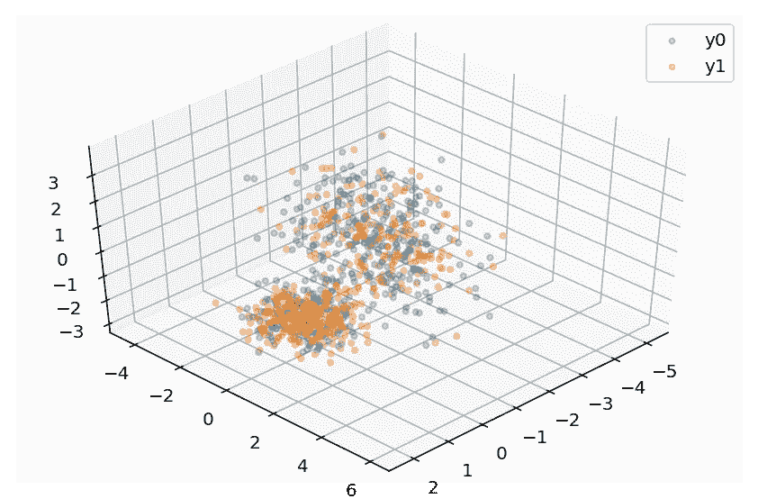
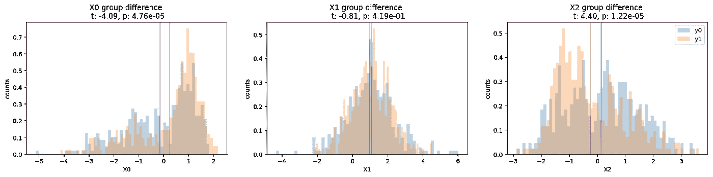
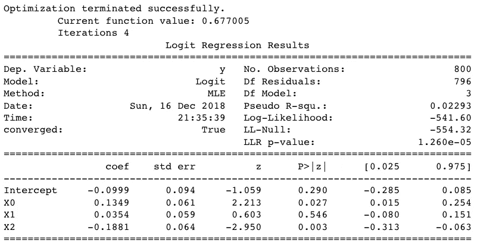
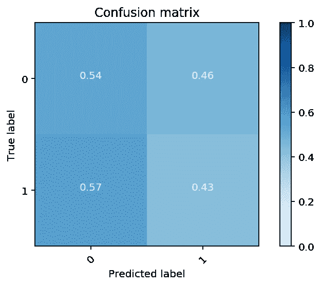
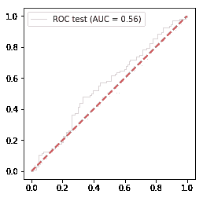
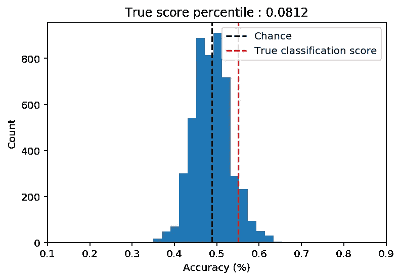

# 为什么有重要变量的模型可能是无用的预测器

> 原文：<https://towardsdatascience.com/why-models-with-significant-variables-can-be-useless-predictors-3354722a4c05?source=collection_archive---------13----------------------->

## 理解你的回归


*Photo by Rakicevic Nenad from Pexels*

## 统计模型中的重要变量不能保证预测性能

在数据科学或实验科学课上，你首先要学习(或应该学习)的一件事是解释模型和预测模型之间的区别。解释模型通常测试关于变量之间关系的假设，例如它们是否显著协变，或者组之间是否存在显著的数值差异。另一方面，预测模型关注的是经过训练的模型能够在多大程度上估计出未在训练中使用的结果。不幸的是，在解释模型中有多个重要变量并不能保证预测模型的高准确性。

这两种模型类型经常被混为一谈，例如将回归模型中的自变量描述为“预测”因变量。专注于统计建模的研究人员也可能假设这种高显著性(例如 p <.001 in="" their="" variables="" may="" be="" an="" indicator="" of="" prediction="" ability="" the="" model.="" this="" confusion="" permeates="" not="" only="" class="ae mk" href="http://science.sciencemag.org/content/355/6324/486" rel="noopener ugc nofollow" target="_blank">社会科学以及其他数据丰富的科学学科，如[遗传学](https://www.pnas.org/content/112/45/13892)和[神经科学](https://www.ncbi.nlm.nih.gov/pmc/articles/PMC5761318/))。

如此多的研究人员仍然将这两者混为一谈的原因之一可能是他们经常通过文本示例[而不是数字示例](https://www.psychologytoday.com/us/blog/perception-and-performance/201801/hypotheses-versus-predictions)来了解二者的区别。为了说明模型中的显著性如何不能保证模型预测，这里有一个快速模拟，它创建了一个合成数据集来显示假设检验模型中的显著变量如何不能用于预测实际结果。

首先，让我们加载所需的库并生成一些合成数据。我们可以使用 sci-kit learn 的`[make_classification](https://scikit-learn.org/stable/modules/generated/sklearn.datasets.make_classification.html)`功能轻松做到这一点。我们有意通过翻转 80%的 y 标签来使分类变得困难。将有 1000 个样本和 3 个特征，其中 3 个特征将在它们与 y 变量(0 和 1)的关系中提供信息。我们还将人工数据分为训练集(80%)和测试集(20%)。

```
%matplotlib inline
%config InlineBackend.figure_format = 'retina'
import numpy as np, pandas as pd, matplotlib.pyplot as plt
from sklearn.datasets import make_classification
from sklearn.model_selection import train_test_split# Generate synthetic data
X,y = make_classification(n_samples=1000, n_features=3, n_informative=3, n_redundant=0, n_classes=2, n_clusters_per_class=1, flip_y=.8, random_state=2018)
colnames = ['X'+str(col) for col in range(X.shape[1])]
X_train, X_test, y_train, y_test = train_test_split(X,y, test_size=.2, random_state=1)df_train = pd.DataFrame(np.concatenate([X_train,np.expand_dims(y_train,axis=1)],axis=1), columns = np.concatenate([colnames,['y']]))
df_test = pd.DataFrame(np.concatenate([X_test,np.expand_dims(y_test,axis=1)],axis=1), columns = np.concatenate([colnames,['y']]))
```

现在让我们以散点图的形式可视化数据，其中轴代表变量。每个点代表一个样本，颜色表示 y 标签，0 或 1。

```
from mpl_toolkits.mplot3d import Axes3Dfig = plt.figure()
ax = fig.add_subplot(111, projection='3d')
ax.view_init(elev=45., azim=45)
for _y in [0,1]:
    ax.scatter(X.T[0,y==_y],X.T[1,y==_y],X.T[2,y==_y],alpha=.3,s=10,label=f'y{_y}')
plt.legend()
plt.tight_layout();
```



散点图看起来很乱，但正如预期的那样，因为我们使分类变得困难。为了查看变量中是否有任何显著的组差异，让我们分别绘制每个变量的分布。我们还可以进行简单的假设 t 检验，以确定两组在这些变量上的差异。

```
from scipy.stats import stats
kwargs = dict(histtype='stepfilled', alpha=0.3, density=True, bins=60)
f,axes = plt.subplots(1,len(colnames),figsize=(20,4))
for ix, x_label in enumerate(colnames):
    y0 = df_train.query('y==0')[x_label]
    y1 = df_train.query('y==1')[x_label]
    ax = axes[ix]
    ax.hist(y0, **kwargs,label='y0')
    ax.hist(y1, **kwargs,label='y1')
    ax.axvline(np.mean(y0),color='b',alpha = .5)
    ax.axvline(np.mean(y1),color='r',alpha = .5)
    # Run t-test between groups 
    t, p = stats.ttest_ind(y0,y1, equal_var=False)
    title = f"{x_label} group difference \n t: {t:.2f}, p: {p:.2e}"
    ax.set(xlabel=x_label,ylabel='counts',title=title)
plt.legend()
plt.show();
```



从显示组均值和 t 检验结果差异的直方图中，我们可以看到，两个变量 X0 和 X2 显示了两组之间的统计学显著差异。

作为一个更稳健的测试，我们通过用 X 变量拟合关于 y 的逻辑回归建立一个解释模型，假设 X0 和 X2 在估计 y 的值时显著相关

```
import statsmodels.formula.api as smf
formula = 'y~'+'+'.join(colnames)
mod = smf.logit(formula=formula,data=df_train)
res = mod.fit()
print(res.summary())
```



咻，我们的假设被证实了，X0 和 X2 显示出与 y 标签的显著关系。因为我们有两个重要的预测变量，一个是 p <.05 and="" the="" other="" p="" one="" might="" assume="" that="" we="" can="" do="" really="" well="" in="" class="nl">预测 y 标签。

我们来看看是不是这样。

为了测试我们的 Xs 是否能够很好地预测 y 标签，我们在训练集上拟合了一个逻辑回归模型，但在测试集上评估了它的预测准确性。

```
from sklearn.linear_model import LogisticRegressionclf = LogisticRegression(solver='lbfgs')
clf.fit(y=df_train['y'], X= df_train[colnames])
print("Training Accuracy:", clf.score(df_train[colnames],df_train['y']))
mean_score=clf.score(df_test[colnames],df_test['y'])
print("Test Accuracy:", clf.score(df_test[colnames],df_test['y']))>> Training Accuracy: 0.58625 
>> Test Accuracy: 0.55
```

我们的结果显示准确性(55%)略高于偶然性(50%)，但没有当你看到 p <.01./>

Let’s look at what these performance look like graphically in a [混淆矩阵](https://scikit-learn.org/stable/auto_examples/model_selection/plot_confusion_matrix.html#sphx-glr-auto-examples-model-selection-plot-confusion-matrix-py)和 [ROC(接收器操作特性)曲线](https://scikit-learn.org/stable/auto_examples/model_selection/plot_roc.html#sphx-glr-auto-examples-model-selection-plot-roc-py)时肾上腺素激增那么令人印象深刻。

```
from sklearn.metrics import confusion_matrix, roc_curve, aucdef plot_confusion_matrix(cm, classes,
                          normalize=False,
                          title='Confusion matrix',
                          cmap=plt.cm.Blues):
    """
    This function prints and plots the confusion matrix.
    Normalization can be applied by setting `normalize=True`.
    """
    import itertoolsif normalize:
        cm = cm.astype('float') / cm.sum(axis=1)[:, np.newaxis]
        print("Normalized confusion matrix")
    else:
        print('Confusion matrix, without normalization')
    plt.imshow(cm, interpolation='nearest', cmap=cmap,vmin=0,vmax=1)
    plt.title(title)
    plt.colorbar()
    tick_marks = np.arange(len(classes))
    plt.xticks(tick_marks, classes, rotation=45)
    plt.yticks(tick_marks, classes)fmt = '.2f' if normalize else 'd'
    thresh = cm.max() / 2.
    for i, j in itertools.product(range(cm.shape[0]), range(cm.shape[1])):
        plt.text(j, i, format(cm[i, j], fmt),
                 horizontalalignment="center",
                 color="white" if cm[i, j] > thresh else "black")plt.ylabel('True label')
    plt.xlabel('Predicted label')
    plt.tight_layout()

cm = confusion_matrix(y_true = df_test['y'], y_pred = clf.predict(df_test[colnames]))
plot_confusion_matrix(cm, classes=clf.classes_,normalize=True)
```



如果这是一个非常好的模型，我们会在混淆矩阵的对角线上看到强烈的深色细胞。单元格之间缺乏区分说明了我们的模型在区分标签方面表现不佳。它在 54%的时间里准确地预测了 0 标签，而对标签 1 的预测只有 43%。

绘制 ROC 曲线是说明模型的敏感性和特异性的一种方式，其中一个好的模型将由偏离对角线最远的[曲线来说明。](https://en.wikipedia.org/wiki/Receiver_operating_characteristic)

```
y_score = clf.decision_function(X_test) fpr, tpr, thresholds =roc_curve(y_test, y_score) roc_auc = auc(fpr,tpr) plt.plot(fpr, tpr, lw=1, alpha=0.3,label='ROC test (AUC = %0.2f)' % (roc_auc)) plt.legend() plt.plot([0, 1], [0, 1], linestyle='--', lw=2, color='r', label='Chance', alpha=.8); plt.axis('square');
```



我们的 ROC 线几乎没有与对角线分开，再次显示了它的糟糕表现。

最后，由于[机会本身并不是模型显著性的良好指标](/chance-is-not-enough-evaluating-model-significance-with-permutations-e3b17de6ba04)，让我们测试一下随机模型与其他随机可能模型相比表现如何。

```
from sklearn.model_selection import KFold, RepeatedKFold
from sklearn.linear_model import LogisticRegressionCVnp.random.seed(1)
kfold = RepeatedKFold(n_splits=5, n_repeats = 5)
n_permute = 200
permuted_scores = []
count = 0 
for train_ix, test_ix in kfold.split(X):
    X_train, X_test = X[train_ix], X[test_ix]
    y_train, y_test = y[train_ix], y[test_ix]
    train_df = pd.DataFrame({'y':y_train})
    for permute_ix in range(n_permute): 
        count+=1
        if count%100==0:
            print(count,end=',')
        y_train_shuffled = train_df[['y']].transform(np.random.permutation)
        clf = LogisticRegressionCV(cv=5)
        clf.fit(X_train,y_train_shuffled.values.ravel())
        score = clf.score(X_test,y_test)
        permuted_scores.append(score)
train_shuffled_score = np.mean(permuted_scores)
score_percentile = np.mean(mean_score < permuted_scores)
title = f'True score percentile : {score_percentile}'
f, ax = plt.subplots() 
plt.hist(permuted_scores,bins=15)
ax.axvline(train_shuffled_score,color='k',linestyle='--',label='Chance')
ax.axvline(mean_score,color='r',linestyle='--',label='True classification score')
ax.set(xlim=[0.1,.9],xlabel='Accuracy (%)',ylabel='Count',title = title)
plt.legend();
```



我们 55%的比机会更好的准确性证明并不比其他随机模型好多少(p=.0812)。这最终表明，解释性模型中有重要的预测因素并不能保证预测模型的性能。

# 我们学到了什么

上面的例子说明了解释或假设检验模型的重要变量可能无法保证预测的重要性能。当然，会有重要模型确实提供良好预测的情况，但重要的是要记住这种模拟并不总是如此。

# 结论

下次你的假设检验朋友告诉你，他们不需要运行预测模型，因为他们的变量非常重要，确保你用模拟数据的例子向他们说明，他们在模型中的重要变量根本不能保证预测的准确性。

标签:`[machine-learning](http://jinhyuncheong.com/tag/machine-learning)` `[significance](http://jinhyuncheong.com/tag/significance)` `[permutations](http://jinhyuncheong.com/tag/permutations)` `[analysis](http://jinhyuncheong.com/tag/analysis)` `[data](http://jinhyuncheong.com/tag/data)` `[prediction](http://jinhyuncheong.com/tag/prediction)` `[simulation](http://jinhyuncheong.com/tag/simulation)` `[python](http://jinhyuncheong.com/tag/python)`

*原载于 2018 年 12 月 12 日*[*jinhyuncheong.com*](http://jinhyuncheong.com/jekyll/update/2018/12/12/Significant_predictors_that_cant_predict.html)*。*