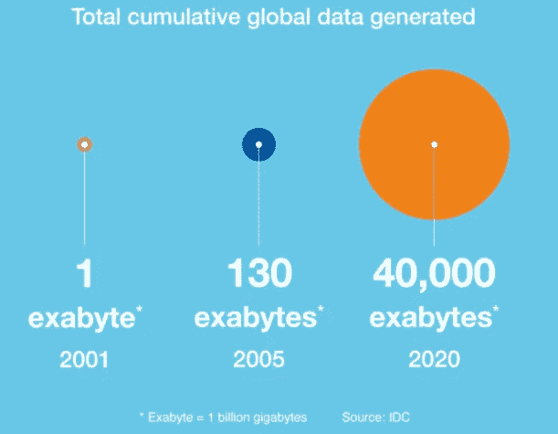
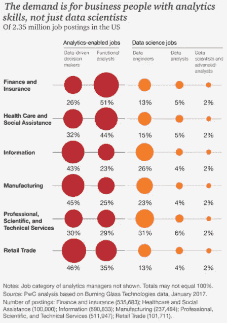
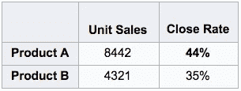
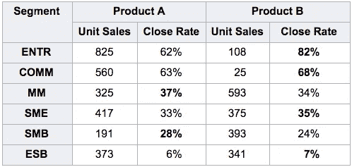

# 为什么大多数公司错过了数据革命(以及他们可以做些什么来跟上)

> 原文：<https://towardsdatascience.com/why-most-companies-are-missing-out-on-the-data-revolution-and-what-they-can-do-to-keep-up-63bfded77783?source=collection_archive---------9----------------------->

世界上 90%的数据是在过去两年内创建的，到 2020 年，将有超过 340 亿个对象产生数据(1，2)。我们正处于一个信息爆炸的时代，其规模之大，常常令人难以理解。它已经完全改变了我们的运作方式。试着想象一个没有 Yelp 评论、Waze 导航或烂番茄配乐的简单电影之夜。数据分析已经迅速渗透到我们日常生活的方方面面。

*图 1:生成的全球累计数据总量(来源:IDC /凯捷)*

对企业来说，这种影响是革命性的。数据对商业决策变得如此重要，以至于《经济学人》最近宣称它是世界上最有价值的资源(3)。数据智能是新的竞争优势。毫不奇怪，五个最有优势的数据经纪人——苹果、Alphabet、微软、脸书和亚马逊——是目前世界上最有价值的五家上市公司(4)。

公司的适应能力最终将更少取决于技术技能，而更多地取决于他们阅读和解释统计结果的能力。正如马克·吐温所说，有“谎言、该死的谎言和统计数据。”员工将越来越多地根据数据中的故事做出决策，因此他们拥有确定这些故事是否真实的工具至关重要(你可以在下面测试你的技能)。

# 每个人现在都是数据科学家

最近数据爆炸的一个有趣结果是越来越多的人将自己归类为数据科学家。

该职业用于描述在机器学习、统计和面向对象编程方面具有独特的跨职能专长的个人。现在，它似乎包含了所有了解 SQL 和 Tableau 的人。

从许多方面来看，这是一个积极的发展。当组织拥有专门的数据科学团队时，这些团队可能很难理解其问题的完整业务背景。具有基本分析技能的业务经理可以通过向数据科学团队传达意义，或者只是通过自己运行分析来弥合差距。

在未来五年，对这些支持分析的业务经理的需求预计将远远超过对核心数据科学家的需求。普华永道估计，到 2020 年，美国商业分析工作的数量将达到 235 万(5)。

*图 2:需求是具有分析技能的商务人士，而不仅仅是数据科学家(来源:普华永道/ BHEF)*

这种发展的不利方面是，数据解释需要比通常理解的更多的训练。核心数据科学家通常拥有统计学博士学位，以帮助辨别有意义的趋势和随机差异。支持分析的经理通常不会。他们可能有提取和可视化数据的技能，但他们通常缺乏正确解释数据所需的专业知识。

# 从噪音中分离出信号的困难

考虑一个简单的场景。一位销售经理正在尝试对有限的资源进行优先排序，根据下表，他决定将所有新的营销活动集中在产品 A 上。毕竟，数据显示产品 A 的成交率比产品 b 高得多。

然而，分部观点揭示了相反的事实。推动成交率的真正因素不是产品，而是客户群。一旦你将这个因素标准化，很明显产品 B 实际上有更好的成交率。把新的活动集中在产品 A 上会被误导，而且代价高昂。

这是尤尔-辛普森效应的一个例子，一种损害数据解释的偏见。当统计趋势的方向取决于数据的汇总方式时，就会出现尤尔-辛普森效应。

像这样的偏差在统计分析中非常普遍。其他例子包括确认偏差(无意中想要证明一个假设，而忽略相反的证据)，选择偏差(意外选择一个非代表性的数据样本)，或异常值管理(不恰当地包含或排除极端数据点)。

# 分析训练应该专注于意义，而不仅仅是机制

对于企业管理者来说，培养分析能力是绝对值得的。数据分析的重要性在未来几年只会越来越大。懂得如何利用数据洞察力的公司和员工将会蓬勃发展。那些无法适应的人将会被抛在后面。

不幸的是，分析培训项目通常专注于数据分析、提取和可视化的方法——但排除了数据解释的微妙策略。这是适得其反的。这相当于教一个青少年如何开车，但不解释一般的道路规则。

由于各种各样的原因，像上面这个例子这样的误解时有发生。此外，由于数据分析有助于增加员工决策的份额，这样的错误无疑将变得更加普遍和更具影响力。假设一位人力资源经理试图辨别好的*表现者*和好的*表现者*。数据可能会讲述某个故事，人力资源经理需要确定这个故事是否真实。人力资源经理读取数据的准确程度会决定一名员工是被提升还是被解雇。

# 在 Correlation One，我们帮助公司正确使用数据。

期望每个支持分析的经理都成为统计大师是不现实的。但是我们可以教管理者如何避免最常见的思维和数据推断错误。对于任何在分析软件工具上投入大量资金的公司来说，尤其如此。如果你正在为你的员工配备工具以做出更好的决策，你需要确保他们知道如何正确使用这些工具。

点击下面的链接，根据几个示例测试问题来衡量您自己的数据解释技能，并取得联系，了解如何提高您组织的决策能力。

# [测试自己的技能](https://quiz.correlation-one.com/test/rq-test-demo-short-163)

___________________________________________________________________

来源:

【https://www-01.ibm.com/common/ssi/cgi-bin/ssialias?】①T2htmlfid=WRL12345USEN

2)[http://www . business insider . com/IOT-生态系统-物联网-预测-商机-2016-2](http://www.businessinsider.com/iot-ecosystem-internet-of-things-forecasts-and-business-opportunities-2016-2)

3)[https://www . economist . com/news/leaders/21721656-数据-经济-需求-新方法-反垄断-规则-世界-最有价值-资源](https://www.economist.com/news/leaders/21721656-data-economy-demands-new-approach-antitrust-rules-worlds-most-valuable-resource)

4)截至 2017 年 8 月 24 日

5)[http://www.pwc.com/us/dsa-skills](http://www.pwc.com/us/dsa-skills)