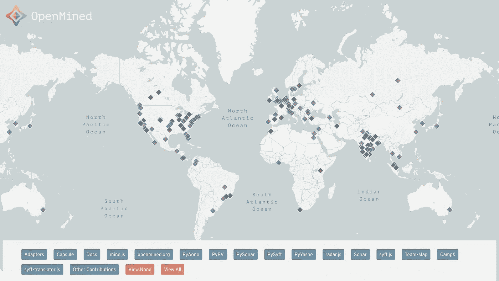
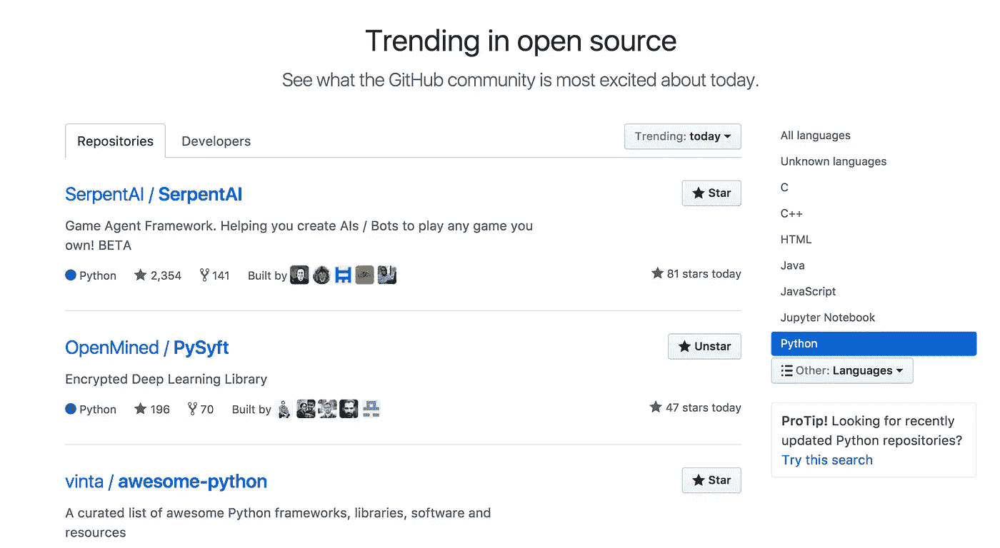

# 为什么 OpenMined 成为开源项目的榜样

> 原文：<https://towardsdatascience.com/why-openmined-is-becoming-a-role-model-for-open-source-projects-ae11749fc577?source=collection_archive---------0----------------------->

这不是我第一次写关于 [OpenMined](https://openmined.org) 的文章，这是一个关于加密和分散人工智能的开源项目。在我开始写我对他们的 [GitHub](https://github.com/OpenMined) 库的深入研究之前，我想把这篇文章献给他们的发展，不仅仅是他们的软件开发，还有他们的社区。我是在 2017 年 7 月多伦多的一次活动中首次了解到 OpenMined 的。不到 3 个月，他们的成长让我惊讶，我真的认为未来的项目可以从观察他们的步骤中受益，不仅是他们正在开发的东西，还有成为 OpenMined 项目的一部分意味着什么。

# 什么是露天开采？

我在以前的帖子中写过关于它们的文章。简而言之，这是一个开源项目，旨在构建软件来促进数据所有权的去中心化，以及无需成为这两个领域的专家就可以使用或构建的机器学习和深度学习库。为了实现他们的目标，该项目基于三个支柱:

*   **去中心化**:通过区块链技术。
*   **所有权**(隐私):通过同态加密。
*   **智能**:通过机器学习和深度学习。

# **世卫组织**露天开采？

一个多样化、分布式、开源的社区，拥有超过 1259 名成员，分别来自 GitHub 上的 [Slack](https://join.slack.com/t/openmined/shared_invite/enQtMjQzNjExMzkwODgyLTQ5YWNiOWE0OTRkNDhjNDNhOTkwZThjOTJiZWVhOGE1ZGU1Njg0YTRhNWYxZWY1NTZmNWZmY2EyMGI1NjA5N2M) 和 [**58 名贡献者**](https://github.com/orgs/OpenMined/people)**19 个库**。贡献者不仅仅在软件上工作，还包括设计、交流等等。每个人都在自己最感兴趣的领域和力所能及的地方提供帮助。

OpenMined Team Map

# 你为什么要加入 OpenMined？

出于实际原因:我认为他们的工作涉及非常相关的领域，这些领域的结合使得这个项目极具创新性。我知道有一些困惑和避免流行词的倾向，但与区块链、加密或人工智能一起工作是目前强烈推荐的职业选择。它碰巧也是 GitHub 和 Python 上最流行的项目之一。对于开发人员来说，为开源项目做贡献是展示技能或学习新东西的最好方式，同时，最重要的是，从中获得乐趣！

Trendy projects on GitHub

还有其他原因:除了社区以惊人的速度增长之外，我个人觉得 OpenMined 的社区比我所在的任何其他社区都要温暖得多。也许是特拉斯克对表情符号的热爱(还有真正好玩的表情符号！)，也许是因为每一个关闭的拉动请求都受到了欢迎，也许是因为 [Slack](https://join.slack.com/t/openmined/shared_invite/enQtMjQzNjExMzkwODgyLTQ5YWNiOWE0OTRkNDhjNDNhOTkwZThjOTJiZWVhOGE1ZGU1Njg0YTRhNWYxZWY1NTZmNWZmY2EyMGI1NjA5N2M) 上的每一个新成员都受到了热烈欢迎，也许是因为成员们的响应非常积极。谁知道呢？可能以上都有吧！

Emoji love ❤

但最重要的是，OpenMined 需要你！o(>ω