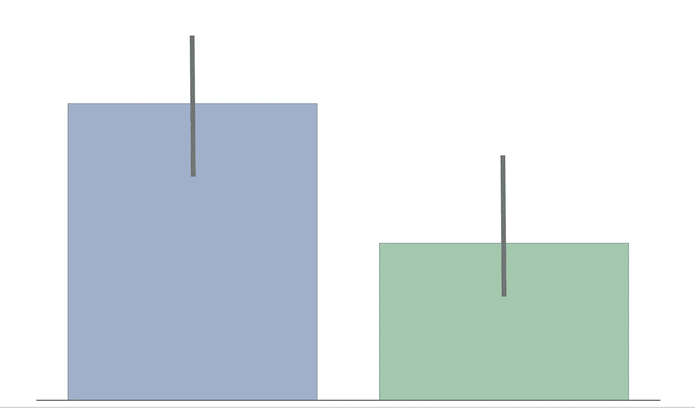
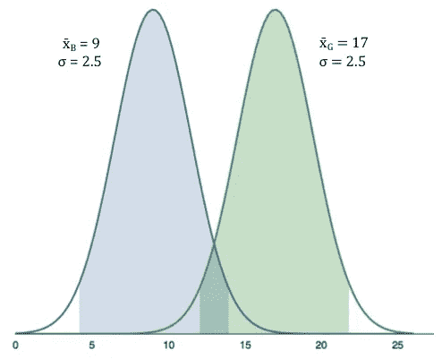
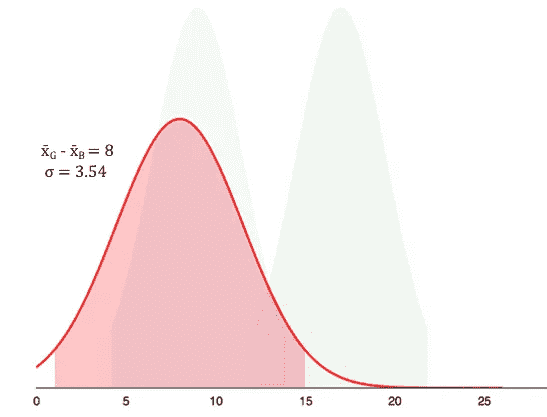
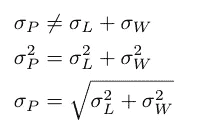
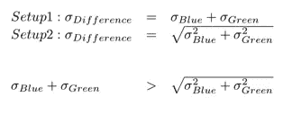

# 为什么重叠的置信区间对统计显著性毫无意义

> 原文：<https://towardsdatascience.com/why-overlapping-confidence-intervals-mean-nothing-about-statistical-significance-48360559900a?source=collection_archive---------1----------------------->

> “两组的置信区间重叠，因此差异在统计学上不显著”——很多人

上面的说法是错误的。重叠的置信区间/误差线对统计显著性没有任何意义。然而，许多人错误地推断缺乏统计学意义。可能是因为相反的情况——非重叠的置信区间——意味着统计意义。我犯了这个错误。我认为它如此普遍的部分原因是，它经常没有解释为什么你不能比较重叠的置信区间。在这篇文章中，我将尝试用直观的方式来解释这一点。提示:这与我们如何跟踪错误有关。

## 设置 1 —不正确的设置

*   我们有两组——蓝色组和绿色组。
*   我们正试图了解这两个群体之间是否存在年龄差异。
*   我们对各组进行抽样，找出平均年龄 x̄和标准误差σ，并为每组建立一个分布:

Distribution of Mean Age

*   蓝色组的平均年龄为 9 岁，误差为 2.5 岁。格林组的平均年龄是 17 岁，误差也是 2.5 岁。
*   阴影区域显示了 95%的置信区间(CI)。

根据这种设置，开头引用的同一批人会错误地推断，因为 95% ci 重叠，所以各组之间在年龄上没有统计学显著差异(在 0.05 水平)，这可能是正确的，也可能是不正确的。

## 设置 2 —正确设置

*   我们不是为每个组建立一个分布，而是为各组之间的平均年龄差异*建立一个分布。*
*   *如果差异的 95% CI 包含 0，那么组间年龄没有差异。如果不含 0，那么组间有统计学显著差异。*

**

*Distribution of Difference in Mean Age*

*由于 95%置信区间(阴影区域)不包含 0，因此差异具有统计学意义。*

## *为什么？*

*在第一个设置中，我们绘制分布，然后找出差异。在第二个设置中，我们找出差异，然后画出分布。两种设置看起来如此相似，以至于我们得到了完全不同的结果，这似乎违背了直觉。差异的根本原因在于[错误传播](https://en.wikipedia.org/wiki/Propagation_of_uncertainty)——这是我们跟踪错误的一种奇特方式。*

## *错误传播*

*假设你试图估算一个边长为 ***L*** *，* ***W*** 的矩形的周长 ***P*** 。用直尺测量边长，估计每边的测量误差为 0.1(σ_ L =σ_ W = 0.1)。*

**

*为了估计周长的误差，直觉上你会认为它是 2(σ_L + σ_W) = 0.4，因为误差会累加。几乎是正确的；误差相加，但是[它们以正交方式相加](http://www.colorado.edu/physics/phys2150/phys2150_fa12/2012F%20WHY%20INDEPENDENT.pdf) *(平方然后取和的平方根)。换句话说，误差相加的*方块*。要了解为什么会出现这种情况，请看这里的证据。*

## *盘旋回来*

*我们从 2 个设置中得到不同结果的原因是我们如何传播年龄差异的误差。*

**

*Sum of 2 positive numbers is always greater than their sum in quadrature*

*在设置 1 中，我们简单地添加了每组的误差。*

*在设置 2 中，我们添加了正交误差，即平方和的平方根。*

*对于任何两个正数，它们的和总是大于它们的正交和。*

*因此，我们*高估了*第一次设置中的误差，错误地推断没有统计学意义。*

****作者简介*** *我是 NYU 的一名博士生，研究信息系统。你可以在推特上关注我@*[*prasanna _ parasu*](https://twitter.com/prasanna_parasu)*。**

****脚注*** *零假设:x̄_B = x̄_G.*

** *假设它们的误差相互独立*

****参考文献***
1。错误传播[https://en.wikipedia.org/wiki/Propagation_of_uncertainty](https://en.wikipedia.org/wiki/Propagation_of_uncertainty)*

*2.why Error add in Quadrature[https://www . Colorado . edu/physics/phys 2150/phys 2150 _ fa12/2012 f % 20 why % 20 independent . pdf](https://www.colorado.edu/physics/phys2150/phys2150_fa12/2012F%20WHY%20INDEPENDENT.pdf)*

*3.重叠置信区间[http://www . cscu . Cornell . edu/news/stat news/ST news 73 insert . pdf](http://www.cscu.cornell.edu/news/statnews/Stnews73insert.pdf)*