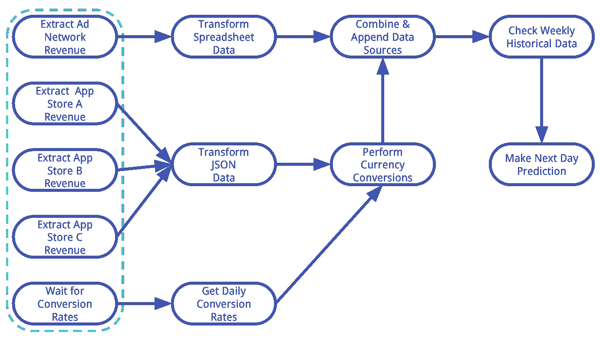
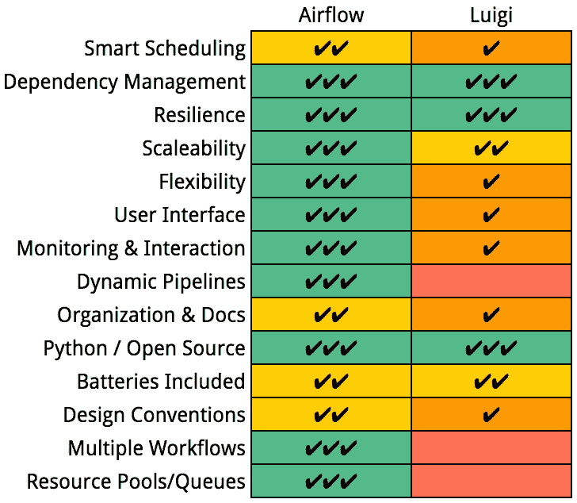

# 为什么 Quizlet 选择 Apache Airflow 来执行数据工作流

> 原文：<https://towardsdatascience.com/why-quizlet-chose-apache-airflow-for-executing-data-workflows-3f97d40e9571?source=collection_archive---------0----------------------->

## 四部分系列的第二部分

在关于[奎兹莱特的](https://quizlet.com) [在](https://medium.com/@dustinstansbury/going-with-the-air-flow-quizlets-hunt-for-the-best-workflow-management-system-around-1ca546f8cc68)前后寻找最佳工作流管理系统的这个系列的[第一部分](https://medium.com/@dustinstansbury/going-with-the-flow-part-i-an-introduction-to-workflow-management-systems-19987afcdb5e)中，我们描述并激发了对工作流管理系统(WMS)的需求，作为超越 CRON 等任务调度框架的自然步骤。然而，我们主要指出了 CRON 在处理复杂工作流方面的缺点，并提供了一些指南来确定一个伟大的 WMS 应该是什么样子。事实证明，可用的工作流管理器前景广阔。当我们评估候选人时，我们提出了一个梦想中的工作流管理器应该包括的特性列表(大致按重要性排序):

**Figure 2.1: An example data processing workflow.**

1.**智能调度**。调度任务执行显然是 WMS 的最低标准。然而，我们也希望任务执行更加“数据感知”因为一些任务的完成时间可能比它们的执行时间表更长(想象一个每小时调度一次的任务，其中每个任务需要 3 个小时执行)，所以我们希望确保我们使用的任何框架在调度依赖任务时能够考虑到这些不一致的时间段。

2.**依赖关系管理**。这是我们与 CRON 完全不同的地方。我们需要一个简单、简洁的界面来定义任务间的依赖关系。依赖性管理不仅要处理任务执行的依赖性，还要处理失败和重试。我们还想要一个系统，它可以利用任务间任何*缺乏*的依赖性来提高工作流效率。例如，在[系列第一部分](https://medium.com/@dustinstansbury/going-with-the-flow-part-i-an-introduction-to-workflow-management-systems-19987afcdb5e)中介绍的工作流示例中，图 2.1 中**最左边的五个任务(用虚线标出)都是相互独立的，可以并行执行。此外，可以有一个任务，许多其他子任务依赖于它的完成。在这种情况下，我们希望父任务尽早执行。我们还想要一个可以考虑单个任务优先级的系统。**

3.**韧性**。如上所述，工作流总是会意外运行，任务会失败。我们需要一个能够重试失败任务的框架，并提供一个简洁的界面来配置重试行为。此外，我们希望能够妥善处理超时，并在出现故障或任务执行时间超过正常时间时(即违反服务级别协议或 SLA 条件时)向团队发出警报。

4.**可扩展性**。随着 Quizlet 扩大其用户群并继续开发更多数据驱动的产品功能，工作流的数量和复杂性将会增加。通常，这种类型的扩展需要更复杂的资源管理，其中特定类型的任务在专门分配的资源上执行。我们需要一个框架，它不仅能满足我们当前的数据处理需求，还能随着我们未来的增长而扩展，而不需要大量的工程时间和基础架构变更。

5.**灵活性**。我们的梦想框架将能够执行一个多样化的(好吧，无限的！)任务范围。此外，我们希望系统是“可被黑客攻击的”，允许我们根据需要实现不同类型的任务。我们还希望避免将工作流局限于特定类型的文件系统(例如 [Oozie](http://oozie.apache.org/) 或 [Azkaban](https://azkaban.github.io/) )或预定义的操作集(例如仅 map-reduce 类型的操作)。

6.**监控&交互**。一旦我们的 WMS 启动并运行，我们希望它提供对任务状态、登陆时间、执行持续时间、日志等信息的集中访问。该诊断信息不仅应该是可观察的，还应该潜在地是可操作的:在同一个界面上，我们希望能够做出影响管道状态和执行的决策(例如，对特定任务的重试进行排序，手动设置任务状态等)。).我们还希望对诊断信息的可配置访问和工作流交互对所有数据利益相关者可用。

7.**程序化管道定义**。大量的工作流管理器使用静态配置文件(如 XML、YAML)来定义工作流编排(如[詹金斯](https://github.com/jenkinsci/pipeline-plugin)、[达特](https://github.com/RetailMeNotSandbox/dart)、 [Fireworks](https://github.com/materialsproject/fireworks) )。一般来说，这种方法不是一个问题，因为大多数工作流的结构是相当静态的。然而，许多工作流的*源*和*目标*(例如文件名、数据库记录)通常是动态的。因此，在给定我们的数据仓库的当前状态的情况下，能够以编程方式动态地生成工作流将是相对于静态的基于配置的方法的一个优势。

8.**组织&文件**。出于显而易见的原因，我们优先考虑那些有可靠的未来路线图、足够的文档和示例的项目。

9.**开源/ Python** 。Quizlet 的数据科学团队在数据处理和工作流的所有权和执行方面发挥了很大作用。我们也以分享和贡献开放项目为荣，每个人都可以使用和学习(包括我们自己！).如果我们能够有一个同样植根于 Python /开源社区的框架，那将是一个巨大的进步。

10.**包含电池**。Quizlet 需要它昨天的数据！当今的商业世界瞬息万变，商业智能宜早不宜迟。如果数据科学团队忙于实施基本的工作流功能，就无法提供这些见解。我们想采用一个相当即插即用的框架，上面的大部分功能都已经内置了。

## 为什么我们选择气流

使用上面的愿望清单作为评估 WMS 项目的指南，我们能够从这些项目中选择三个主要候选人: [Pinterest 的 Pinbal](https://github.com/pinterest/pinball) l、 [Spotify 的 Luigi](https://github.com/spotify/luigi) 和 [Apache Airflow](https://github.com/apache/incubator-airflow) 。

这三个项目都是开源的，都是用 Python 实现的，到目前为止一切顺利！然而，在研究了 Pinball 之后，我们对他们的路线图的重点和他们社区背后的动力并不信服。在写这篇文章的时候，Pinball Github 项目有 713 个明星，但只有 107 个提交，12 个贡献者，在过去的一年里只有少数几个提交。相比之下，Github 对 Luigi/Airflow 项目的统计细分分别如下:Stars: 6，735/4，901；提交:3410/3867；投稿人:289/258。因此，Luigi 和 Airflow 都拥有我们一直在寻找的活跃的开发者和活跃的开源社区。我们的首要决定是在 Luigi 和 Airflow 之间做出选择。

Luigi 和 Airflow 在很多方面都很相似，都从我们的愿望清单上勾选了很多选项(**图 2.1** )。这两个项目都允许开发人员定义任务之间的复杂依赖关系，并配置执行优先级。两者都允许并行执行任务，重试失败的任务，并且都支持历史回填。这两个项目都支持一系列数据存储和接口，包括 S3、RDBs、Hadoop 和 Hive。两者都可以使用`pip`轻松安装，而且一般来说，功能相当丰富。也就是说，这两者之间有一些明显的差异，这促使我们选择了 Luigi 上空的气流。

**Figure 2.2: Side-by-side Comparison of Airflow and Luigi.** Each row ranks Airflow and Luigi on their implementation of various features and functionality. Ranking ranges from no checkmarks (worst) to three checkmarks (best).

首先，Airflow 的未来路线图似乎更加集中，开发社区的势头目前似乎比 Luigi 的更强。虽然最初是由 AirBNB 开发的，但 Airflow 项目已经成为 Apache 孵化器项目，这增加了它未来成功和维护的概率。

我们也更喜欢很多由气流而不是 Luigi 选择的设计惯例。例如，与 Luigi 的基于源/目标的方法相比，我们更喜欢 Airflow 的基于时间表的任务执行策略，这种策略更“设置好就一劳永逸”，因为 Luigi 的基于源/目标的方法需要用户与工作流执行进行更多的交互。我们还认为，通过定义新的操作符(我们很快就会谈到操作符)来扩展 Airflow 更加直接，而不是像 Luigi 那样必须从一组特定的基类继承。

气流还提供了许多 Luigi 所没有的功能。具体来说，Airflow 的 UI 提供了广泛的功能，允许监控多个元数据来源，包括执行日志、任务状态、登陆时间、任务持续时间等等。一个巨大的优势是，相同的用户界面还可以用于管理实时工作流的状态(例如，手动强制重试、成功状态等)。).这是一个非常强大的范例，因为它不仅使诊断数据容易获得，而且允许用户基于对数据的洞察直接采取行动。相比之下，Luigi 也提供了一个简单的 UI，但它的功能远不如 Airflow 丰富，并且不提供与活动进程的交互功能。

Airflow 提供但 Luigi 没有的一些其他功能包括定义多个专门工作流的能力、在工作流之间共享信息的能力、动态编程工作流定义、资源池(在 Airflow 中称为“队列”)和 SLA 电子邮件。因此，Luigi 能够从我们的愿望列表中选择框 1-5 和 9-10，但是 Airflow 也能够选择其余的框。所以我们决定全速前进！

这一系列博客文章的其余部分详细介绍了我们在 Quizlet 这里获得气流并运行的经验。特别是，[第三部分](https://medium.com/@dustinstansbury/going-with-the-flow-part-part-iii-airflow-in-detail-a96efed52b1a)通过实现本系列的[第一部分](https://medium.com/@dustinstansbury/going-with-the-flow-part-i-an-introduction-to-workflow-management-systems-19987afcdb5e)中介绍的工作流示例，展示了 Airflow 的一些关键概念和组件。[第四部分](https://medium.com/@dustinstansbury/going-with-the-flow-part-iv-airflow-in-practice-a903cbb5626d)记录了一些与 Quizlet 部署气流相关的实际问题。