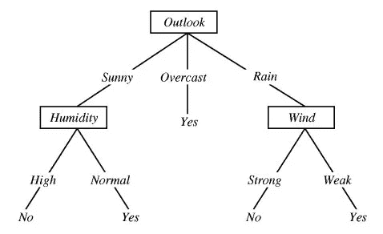
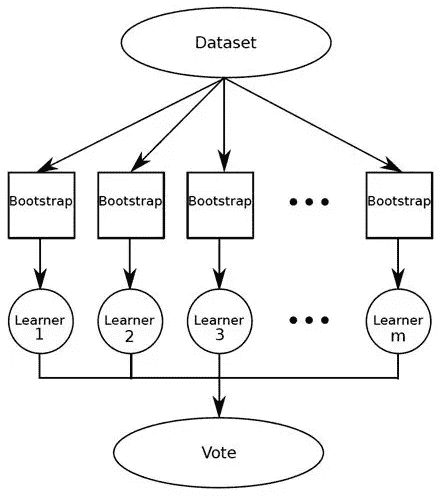

# 为什么随机森林是我最喜欢的机器学习模型

> 原文：<https://towardsdatascience.com/why-random-forest-is-my-favorite-machine-learning-model-b97651fa3706?source=collection_archive---------0----------------------->

## 发现现实世界中随机森林的优点和缺点

“green trees on foggy forest” by [Julien R](https://unsplash.com/@djulien?utm_source=medium&utm_medium=referral) on [Unsplash](https://unsplash.com?utm_source=medium&utm_medium=referral)

“模特就像一副护目镜。它让某些事情成为焦点。”—我的数据科学导师。

在选择机器学习模型时，没有单一的算法占主导地位。有些在大型数据集上表现更好，有些在高维数据上表现更好。因此，评估模型对特定数据集的有效性非常重要。在本文中，我将对随机森林的工作原理做一个高层次的概述，并讨论这种模型在现实世界中的优缺点。

> 从本质上讲，如果您想要高性能且较少需要解释，随机森林是一个很好的模型。

在回归模型之后，随机森林总是我的首选模型。让我告诉你为什么。

# 什么是随机森林？

随机森林是**打包的决策树**模型，每次分裂时在**特征子集**上分裂。这是一个很长的话题，所以让我们先看一个单独的决策树，然后讨论袋装决策树，最后介绍对一个随机特征子集的分割。

**决策树**

本质上，决策树根据数据的特征将数据分割成更小的数据组，直到我们得到一个足够小的数据集，其中只有一个标签下的数据点。让我们看一个例子。下面是一个人是否应该打网球的决策树。

Image courtesy of [http://science.slc.edu/~jmarshall/courses/2005/fall/cs151/lectures/decision-trees/](http://science.slc.edu/~jmarshall/courses/2005/fall/cs151/lectures/decision-trees/)

在上面的例子中，决策树在多个特征上分裂，直到我们得出结论“是”，我们应该打网球，或者“否”，我们不应该打网球。沿着树的线条来确定决策。例如，如果天气阴沉，那么“是的”我们应该打网球。如果天气晴朗，湿度高，那么“不”我们不应该打网球。

在决策树模型中，这些分裂是根据纯度度量来选择的。也就是说，在每个节点，我们希望信息增益最大化。对于回归问题，我们考虑残差平方和(RSS ),对于分类问题，我们考虑基尼指数或熵。我不会在这方面讲太多细节，但是如果你有兴趣了解更多，可以看看这个[讲座](https://www.slideshare.net/marinasantini1/lecture-4-decision-trees-2-entropy-information-gain-gain-ratio-55241087)。

**袋装树**

现在采用决策树概念，让我们应用自举原理来创建袋装树。

**Bootstrapping** 是一种抽样技术，我们从数据集中随机抽样替换。

> 旁注:自举时，我们只使用了大约 2/3 的数据。大约 1/3 的数据(“袋外”数据)没有在模型中使用，可以方便地用作测试集。

**Bagging** 或 bootstrap aggregating，是我们通过创建 *X* 数量的决策树来创建袋装树，这些决策树在*X*bootstrap 训练集上进行训练。最终的预测值是我们所有 *X* 决策树的平均值。一个单独的决策树具有很高的方差(倾向于过度拟合)，因此通过将许多弱学习者打包或组合成强学习者，我们将方差平均掉。这是多数票！

Image courtesy of [https://www.kdnuggets.com/2016/11/data-science-basics-intro-ensemble-learners.html](https://www.kdnuggets.com/2016/11/data-science-basics-intro-ensemble-learners.html)

**随机森林**

随机森林对 bagging 进行了改进，因为它**通过引入对特征**的**随机子集的分割来使**树去相关。这意味着在树的每次分裂时，模型只考虑特征的一个小的子集，而不是模型的所有特征。也就是说，从可用特征集合 n 中，随机选择 m 个特征的子集(m =的平方根)。这一点很重要，这样方差就可以被平均掉。考虑一下如果数据集包含一些强预测因素会发生什么。这些预测器将始终被选在树的顶层，所以我们将有非常相似的结构树。换句话说，这些树是高度相关的。

综上所述，随机森林是袋装决策树模型，在每次分裂时分裂特征子集。

# **为什么随机森林这么酷？**

**令人印象深刻的多功能性**

无论您有回归或分类任务，随机森林都是满足您需求的适用模型。它可以处理二元特征、分类特征和数字特征。需要做的预处理非常少。数据不需要重新缩放或转换。

**可并行化**

它们是可并行化的，这意味着我们可以将流程拆分到多台机器上运行。这导致更快的计算时间。相比之下，增强模型是连续的，需要更长的时间来计算。

> 附注:具体来说，在 Python 中，要在多台机器上运行它，需要提供参数“n _ jobs =-1”。-1 表示使用所有可用的机器。更多详情见 [scikit-learn](http://scikit-learn.org/stable/modules/generated/sklearn.ensemble.RandomForestClassifier.html) 文档。

**高维度大**

随机森林非常适合高维数据，因为我们处理的是数据子集。

**快速预测/训练速度**

它比决策树训练更快，因为我们只处理这个模型中的一个特征子集，所以我们可以轻松地处理数百个特征。预测速度明显快于训练速度，因为我们可以保存生成的森林供将来使用。

**对异常值和非线性数据稳健**

随机森林通过本质上的宁滨处理离群值。它对非线性特征也漠不关心。

**处理不平衡数据**

它有平衡类总体不平衡数据集中的误差的方法。随机森林试图最小化整体错误率，因此当我们有一个不平衡的数据集时，较大的类将获得较低的错误率，而较小的类将具有较大的错误率。

**低偏差，中等方差**

每个决策树都有很高的方差，但偏差很小。但是因为我们平均随机森林中的所有树，我们也平均方差，所以我们有一个低偏差和中等方差模型。

# **弊端**

1.  模型的可解释性:随机森林模型并不都是可解释的；它们就像黑匣子。
2.  对于非常大的数据集，树的大小会占用大量内存。
3.  它可能会过度拟合，所以您应该调整超参数。