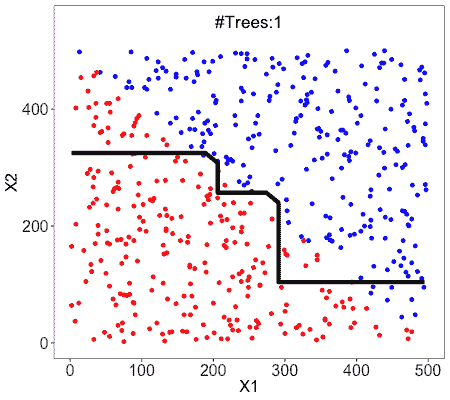
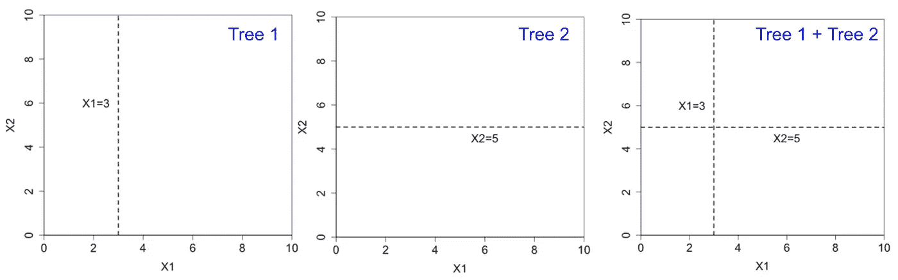
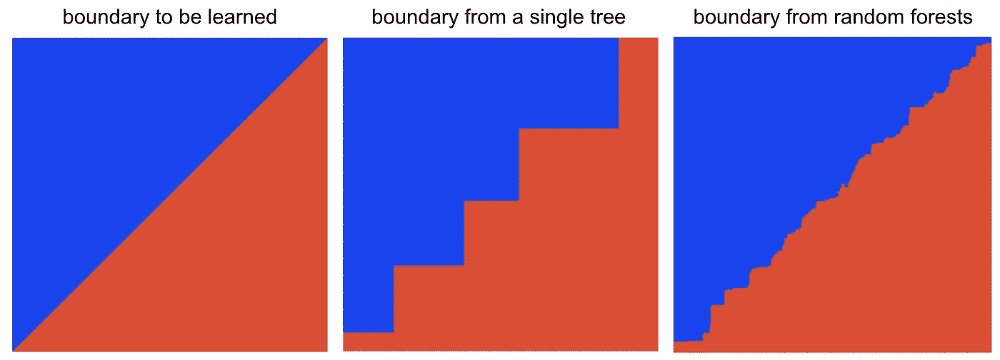
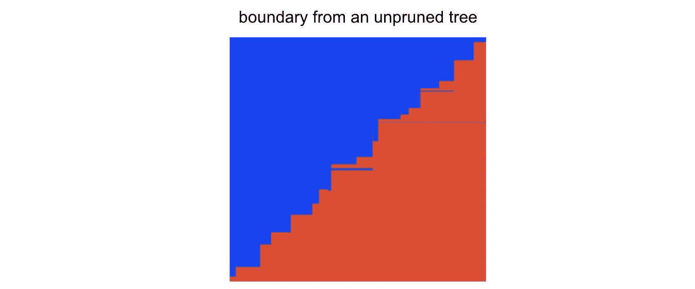
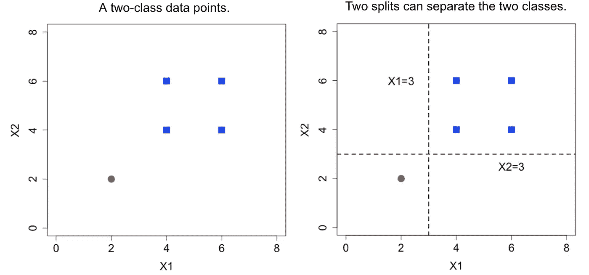
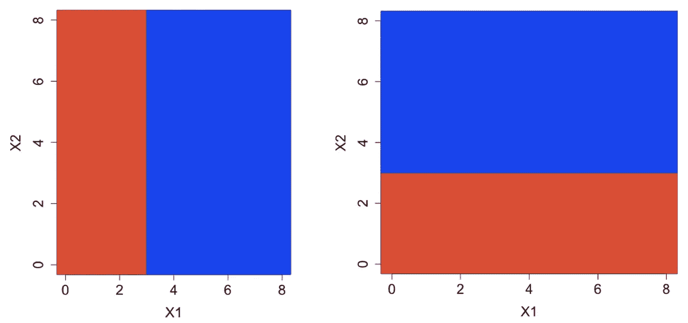
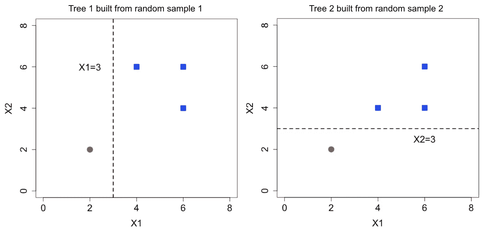
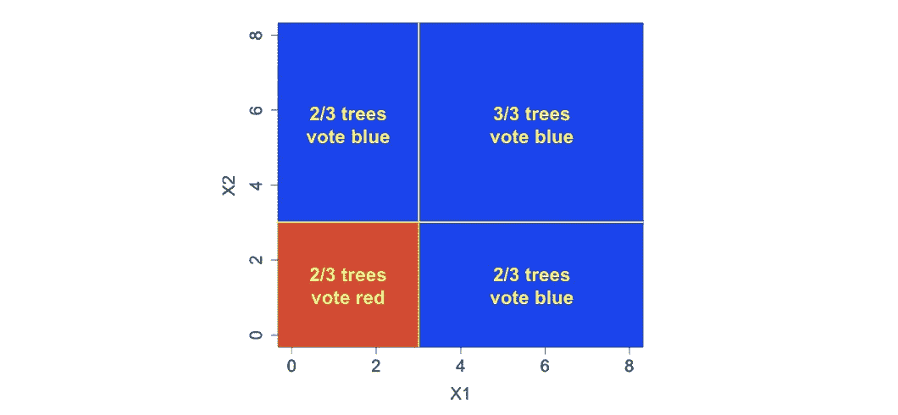

# 为什么随机森林优于决策树

> 原文：<https://towardsdatascience.com/why-random-forests-outperform-decision-trees-1b0f175a0b5?source=collection_archive---------2----------------------->

## 说明了两个直观的原因

Pine forests at Rampart Lakes. Photo by @sakulich

随机森林由多个单独的树组成，每个树都基于训练数据的随机样本。它们通常比单一决策树更准确。下图显示了随着更多树的添加，决策边界变得更加准确和稳定。

Decision boundary from random forests (as more trees are added)

这里我们将提供随机森林优于单决策树的两个原因。

**特征空间中更高的分辨率**

**树木未修剪**。虽然像 CART 这样的单个决策树经常被修剪，但随机森林树是完全生长和未修剪的，因此，自然地，特征空间被分成更多和更小的区域。

**树木多种多样**。每个随机森林树是在随机样本上学习的，并且在每个节点上，考虑一组随机特征用于分裂。这两种机制都创造了树木的多样性。

下图显示了两个随机树，每个都有一个分割。对于每棵树，可以给两个区域分配不同的标签。通过组合这两棵树，有四个区域可以被不同地标记。

未修剪的和多样的树导致特征空间中的高分辨率。对于连续要素，这意味着更平滑的决策边界，如下所示。

**处理过拟合**

单个决策树需要修剪以避免过度拟合。下面显示了来自未修剪树的判定边界。边界更平滑，但会出现明显的错误(过度拟合)。

**那么随机森林如何在不过度拟合的情况下建造未修剪的树呢？**

对于下面的两类(蓝色和红色)问题，两个 splits x1 = 3 和 x2=3 都可以完全分开两类。

然而，这两种分裂导致了非常不同的决策界限。决策树通常使用第一个变量进行拆分，因此训练数据中变量的顺序决定了决策边界。

现在考虑随机森林。对于用于训练树的每个随机样本，样本中丢失红点的概率为

因此，大约三分之一的树是用所有蓝色数据构建的，并且总是预测蓝色类。另外 2/3 的树在训练数据中有红点。由于在每个节点都考虑了随机的特征子集，我们预计大约 1/3 的树使用 x1，其余 1/3 使用 x2。这两种树的分割如下图所示。

通过聚合这三种类型的树，下面显示的决策边界现在对于 x1 和 x2 是对称的。只要有足够多的树，边界应该是稳定的，不依赖于变量的排序等无关信息。

随机森林中的随机性和投票机制很好地解决了过度适应问题。

虽然随机森林是准确的，但它们被认为是黑盒模型(很难解释)。这篇[文章](/random-forest-3a55c3aca46d)阐述了如何解读它们。

在 [dataanalyticsbook.info](https://dataanalyticsbook.info/) 可以找到我的书的更多内容。