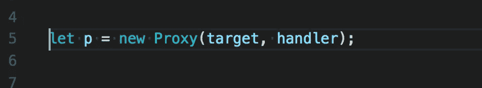
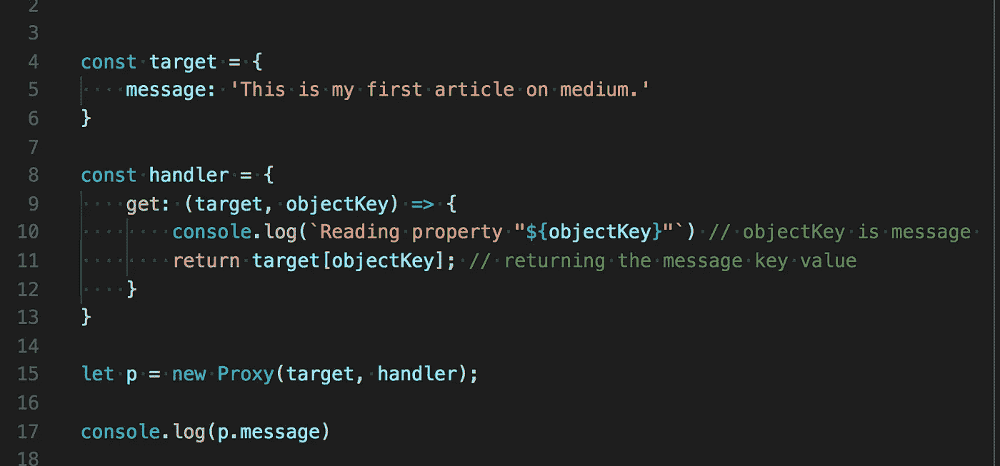
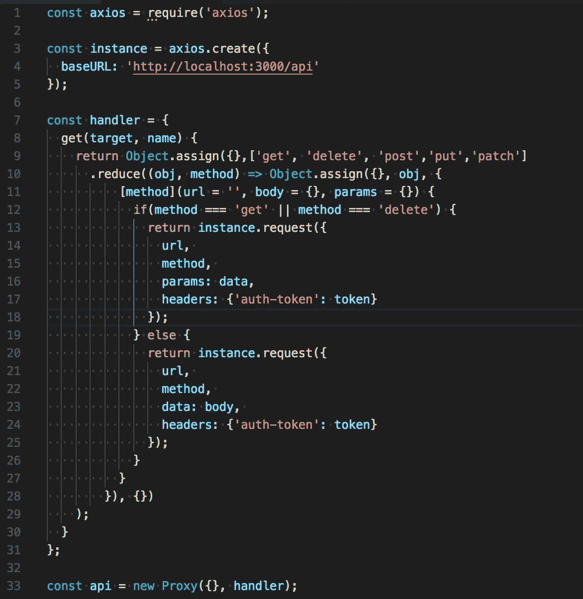
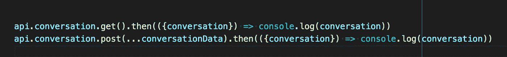

# Javascript —代理

> 原文：<https://towardsdatascience.com/why-to-use-javascript-proxy-5cdc69d943e3?source=collection_archive---------5----------------------->

## 最近，我在阅读一些不太出名的 Javascript 特性，发现了 Javascript 代理。

在探讨为什么这很重要之前，让我们先了解一下它是什么。如果你已经知道了，可以跳过几段。

Proxy are magic methods

> 代理是 javascript 中的一个对象，它封装了一个对象或一个函数，并通过一个叫做目标的东西来监控它。而不管包装的对象或函数是否存在。代理类似于其他语言中元编程。

在继续之前，我们需要了解 3 个关键术语:

1.  **目标:**被代理的对象或功能。
2.  **处理程序:**对被代理的对象或函数做某些事情的函数。
3.  **陷阱:**这些是一些用来作用于目标的函数。点击这里阅读更多关于陷阱的信息。

下面是我们对它的定义

Syntax

我们使用 ES6 中的代理类，参数，目标是包装对象，处理程序将是使用陷阱在目标上执行某些操作的函数。

下面是一个 ***简单的*** 用法的例子

Basic example for proxy

我们制作了两个对象，分别叫做 target 和 handler，target 是一个带有消息键的简单对象，handler 是一个带有 get 键的对象，该键带有一个与之相关联的函数。我们在代理类中传递 2 个对象，作为回报，我们接收一个代理对象，通过它我们可以访问目标对象的消息属性。

下面是一个如何使用它对对象值的 ***验证*** 的小例子

Validation of object key’s

我们使用一个空对象作为目标对象，并使用一个处理程序在目标对象上设置陷阱并进行验证。很简单对吧！

让我们看看如何使用它来制作 ***API 调用包装器*** 。

我们已经使用了 [axios](https://github.com/axios/axios) ，然后用我们的基本 URL 创建了一个实例，为一个代理创建了一个处理程序，它返回一个要使用的 get、post、put、delete、patch 函数的对象，最后创建了一个 API 对象，它是一个空对象目标的代理对象。

然后，我们可以将它用作:

Calling API proxy object

这可以扩展到验证、值修正、跟踪属性访问、未知属性警告、负数组索引、数据绑定、访问 restful web 服务(方法调用)、可撤销引用、监控异步函数、类型检查等等，[阅读此处了解更多信息](http://exploringjs.com/es6/ch_proxies.html#sec_proxy-use-cases)

我个人发现 javascript 代理在 restful web 服务、验证、监控异步功能中非常有用。我会探索更多。

***边注*** *:使用的例子可以优化。*

你可能也会喜欢我的其他文章

1.  [Javascript 执行上下文和提升](https://levelup.gitconnected.com/javascript-execution-context-and-hoisting-c2cc4993e37d)
2.  [Javascript —生成器-产出/下一个&异步-等待🤔](https://medium.com/datadriveninvestor/javascript-generator-yield-next-async-await-8442d2c77185)
3.  [理解 Javascript‘this’关键字(上下文)](https://medium.com/datadriveninvestor/javascript-context-this-keyword-9a78a19d5786)。
4.  [带有映射、归约、过滤的 Javascript 数据结构](https://levelup.gitconnected.com/write-beautiful-javascript-with-%CE%BB-fp-es6-350cd64ab5bf)
5.  [Javascript- Currying VS 部分应用](https://medium.com/datadriveninvestor/javascript-currying-vs-partial-application-4db5b2442be8)
6.  [Javascript ES6 —可迭代程序和迭代器](https://medium.com/datadriveninvestor/javascript-es6-iterables-and-iterators-de18b54f4d4)
7.  [Javascript —作用域](https://medium.com/datadriveninvestor/still-confused-in-js-scopes-f7dae62c16ee)

# 如果你喜欢这篇文章，请随时分享，帮助别人找到它！

**谢谢！**