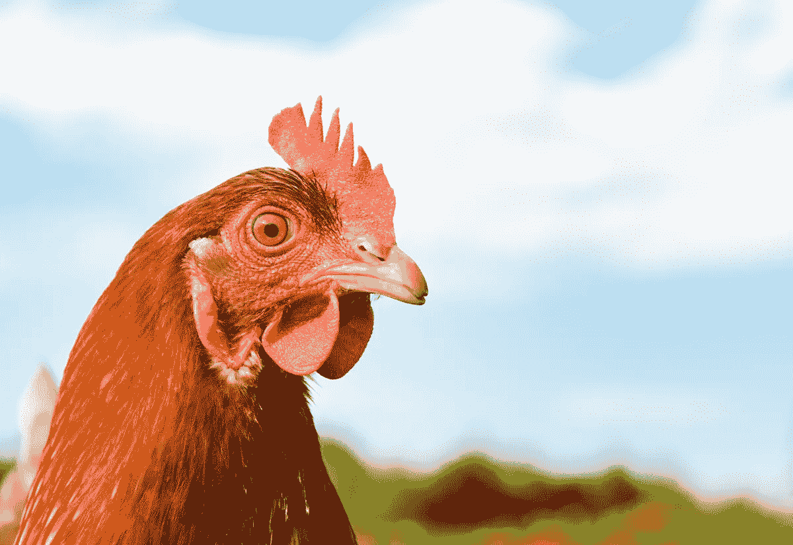
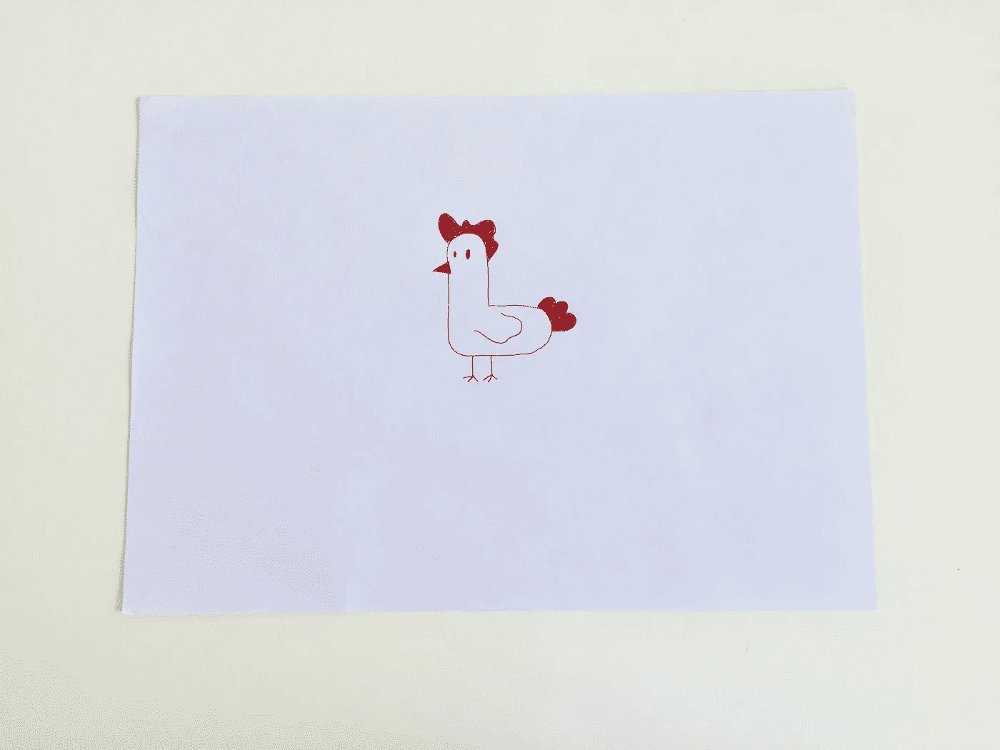
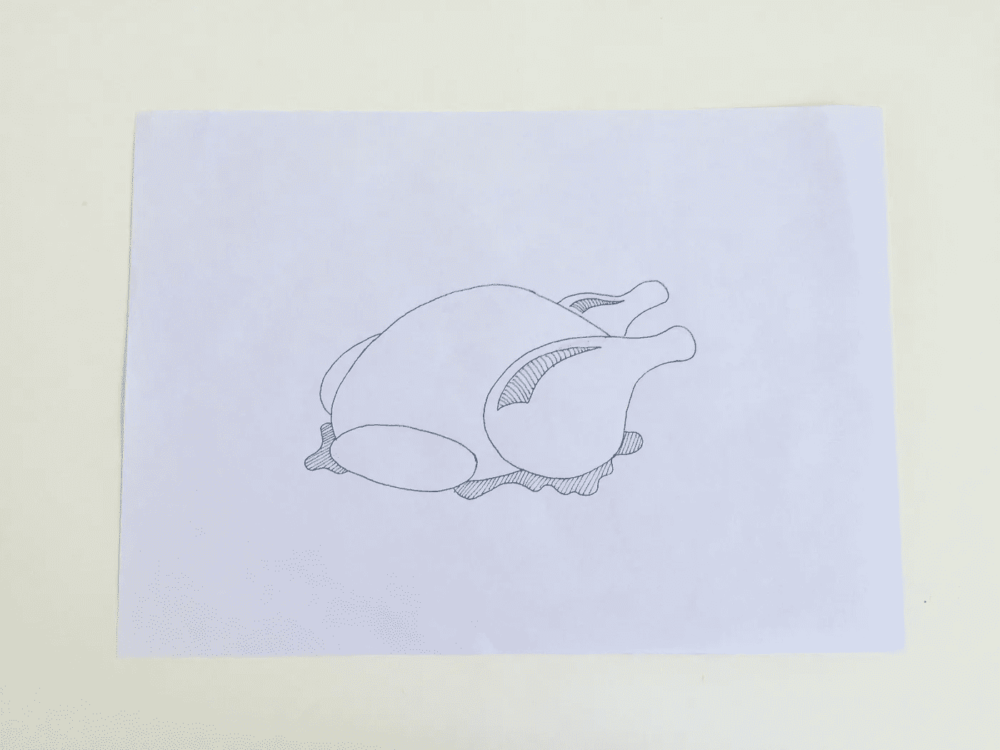
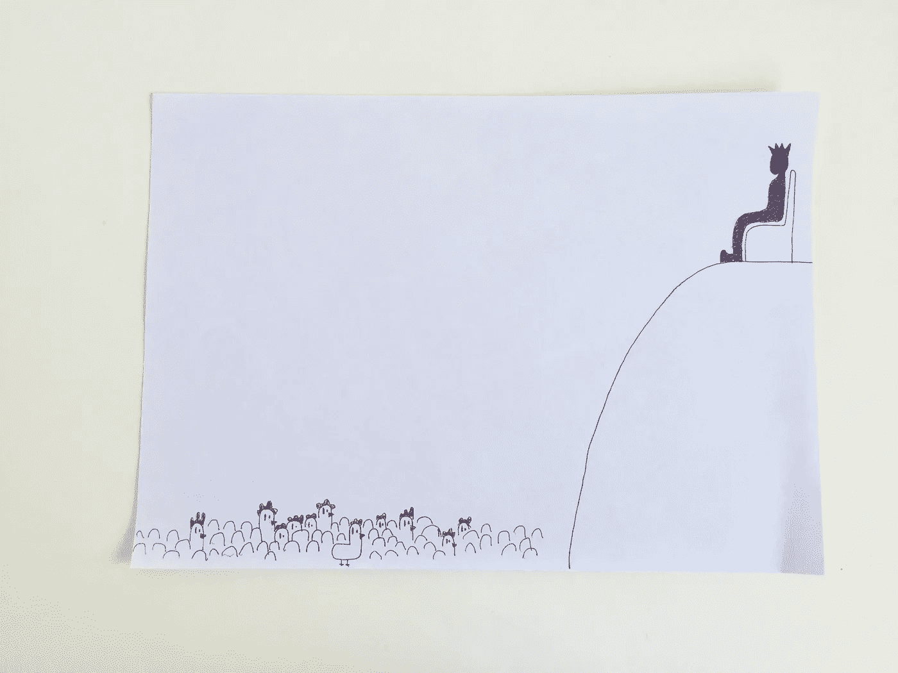

# 由于这个令人难以置信的独特原因，普遍基本收入是必要的

> 原文：<https://towardsdatascience.com/why-universal-basic-income-is-necessary-it-isnt-what-you-think-ab602f62a207?source=collection_archive---------3----------------------->

## 答案在于鸡……

反对普遍基本收入的一个最常见的论点是，它将允许数百万工人变得懒惰并退出劳动力市场，从而导致经济的巨大下滑。

虽然普遍基本收入确实有许多细微差别和技术细节，并且公然声明它是好是坏是非常幼稚的，但我不认为 UBI 会引起大规模的懒惰转变。

原因是鸡。

让我们假设。想象一下，所有人的财物都被拿走，换成一只鸡。

50%的人饥饿、烦躁、易怒，会把鸡杀了当晚餐吃。

大约 48%的人会忍饥挨饿，等待鸡生蛋。他们现在会有源源不断的食物供应。

剩下的 2%会坚持更长时间，找到一只异性的鸡，孵化出更多的鸡。最终，他们不仅可以从鸡那里获得源源不断的食物，还可以发展出一个鸡肉帝国，向 50%没有任何鸡肉的人出售煮熟的鸡肉。

如果你认为 UBI 是共产主义的一种形式，它会导致每个人懈怠，这个例子说明了为什么它不会。

总会有一小部分人愿意推迟即时满足，努力壮大他们的(鸡)帝国。这些是鸡的精英。

还有一些人明白这个想法，但不了解全部情况，他们用鸡来下蛋，但并不总是吃饱，因为下蛋需要时间。**这是小鸡中产阶级。**

最后，有些人无法控制即时满足感，也无法规划未来。他们立即吃他们的鸡，在第一天有一个伟大的盛宴，但此后永远在饥饿中匍匐前进。**这就是鸡穷。**

这个类比可以用来证明 UBI 是无用的，因为每个人都将回到他们的阶级——穷人到穷人，中产阶级到中产阶级，精英到精英，但是有一个问题。

有成千上万的人，通过正确的教育和机会，可以成为像鸡精英。问题是，他们一开始就没有“鸡”。

**这就是 UBI 如此重要的原因**。随着自动化的到来，夺走了非熟练工人甚至一些熟练工人的工作，那些没有我们认为理所当然的机会如良好的教育、互联网接入和工作的人将无法生存。

> 重要的是人要有成功的机会，不能多，也不能少。

给定一份基本收入，那些有成功欲望的人可以战略性地利用它去他们想去的地方，而真正懒惰的人会留在原地。

在各自领域的专家中，越来越多的公众认为普遍基本收入是未来的发展方向，我希望这个类比能帮助你理解为什么。

*你对 UBI 有什么看法？如果你能回复我，我会很高兴的。*

感谢阅读，

¯\_(ツ)_/¯

萨尔瓦夫

***看看我的其他故事吧！***

***你一直在使用完全错误的介质***—[https://medium . com/swlh/You ve-be-use-medium-complete-error-52 df 28 f 95876](https://medium.com/swlh/youve-been-using-medium-completely-wrong-52df28f95876)

**你是不是完全低估了 AI？—**[https://medium . com/swlh/are-you-complete-低估-ai-96c7083cfd50](https://medium.com/swlh/are-you-completely-underestimating-ai-96c7083cfd50)