# 为什么要可视化梯度下降优化算法？

> 原文：<https://towardsdatascience.com/why-visualize-gradient-descent-optimization-algorithms-a393806eee2?source=collection_archive---------3----------------------->

# 先决条件-简介

在多层感知器 *(MLPS* )中，我们使用 *tanh* 或 *sigmoid 函数*作为激活函数进行学习，而不是使用阈值阶跃函数的基于逻辑的麦卡洛克皮茨神经元的苛刻判断。MLPs 为我们提供了输入的平滑且有界的实值输出函数，具有良好定义的导数的优点，这使得学习权重更容易。我们可以将学习这些权重和偏差的问题视为优化问题，并对其应用不同的算法。假设我们这里的函数是损失为 *L* (w，b)的 sigmoid 逻辑函数。

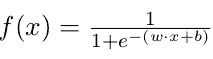

Sigmoid Logistic Function

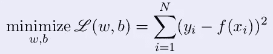

Loss Function, to minimize(Training Objective)

为这些算法和它们的收敛方式提供视觉效果，将为设计者选择最佳方案提供深刻的见解。现在，假设我们没有学习权重的算法。我们将如何解决这个学习问题？**随机猜测**将是我们的方法，用我们大脑的一些启发来固定 *w* 和 *b* 的值，使得误差达到最小。让我们看看这样的过程，只有两个数据点进行训练。

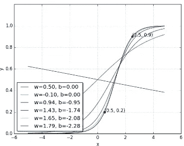

Loss with w=-0.10 comes out greater then first iteration w=0.50\. Hence, changing our approach with iteratively better values for w and b. Also, in guess work knowing that with higher ‘w’ values behavior approaches step functions & with higher ‘b’ values it shifts towards left is helpful.

很明显，我们需要明确定义的方法来学习权重和避免随机化方法。**但是为什么要梯度下降呢？**为了理解这一点，假设我用小的∏θ移动矢量θ，以检查损耗是否减少。有效矢量可由矢量加法平行四边形定律写成θnew =θ+η∏θ。现在，**应该用什么∏θ**？我们把泰勒级数应用在上面，观察一下。η是学习率。

> l(θ+ηu)= l(θ)+η∫u t ∇l(θ)[η一般很小，所以η 2，η 3，… → 0]。因此，应选择 l(θ+ηu)l(θ)< 0 的值，即 u T ∇L (θ) < 0。
> 
> 设β为 u T 和∇L 之间的角度(θ)。因此，当 cos(β)= 1 时，即当β为 180°时，l(θ+ηu)l(θ)= u t∇l(θ= k∫cos(β)为最大负值。因此，向梯度的相反方向移动。这是梯度下降的方程式。现在，我们可以在这之后开始想象。

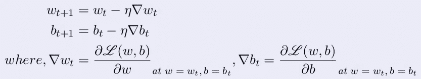

Gradient Descent Method’s Equations. In one epoch GD is calculated once only taking into account all the points.

# 先决条件-可视化

理解误差曲面和等高线图的概念是必需的，然后我们就可以开始可视化不同的优化算法了。让我们首先来看误差表面，红色代表高误差，蓝色代表相反的误差。

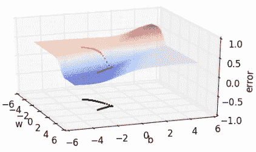

**Gradient Descent Convergence.** Also, notice that for steeper surface it converges faster visible with less dense point representation.

3D 表示可能很麻烦，并增加了表示工作量。相反，误差表面的 2D 等高线图可以提供等效的表示能力。让我们分析上述误差表面的等高线图情况，其中相同的颜色表示该区域中相同的误差值。此外，更陡的坡度或坡度的快速变化可以用该图中的线箭头来分析。和具有类似线状结构的密集点的缓慢变化。

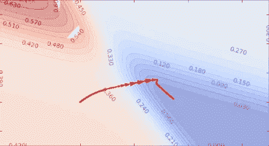

Contour Map with GD applied on it. Arrows represent faster fall in error value. Flat surfaces represented by constant color regions.

# 选择哪个梯度下降变体？

虽然 **Adam** 是许多深度学习模型的标准，但理解每个梯度下降优化变体的基本功能很重要，因为**取决于误差表面，不同的优化可能执行得更好**。就像，许多论文表明 SGD 与动量加退火η也表现很好。出于这个动机，本文旨在通过可视化这些算法来理解，同时也试图保持简洁。这里，在本文中只讨论在大多数实际用例中观察到的一般情况和行为。

This post at [Trask](https://medium.com/u/27c3e4437cc4?source=post_page-----a393806eee2--------------------------------)’s twitter account was main major motivation for this post. Courtesy: [Sebastian Ruder](https://medium.com/u/e3999e445181?source=post_page-----a393806eee2--------------------------------)

# 我们开始吧。终于！！😉

现在，从以上梯度下降的可视化可以清楚地看出，对于平坦表面，表现缓慢，即需要更多的迭代才能收敛到更平坦的表面。让我们考虑这样一个场景:在一个未知的区域定位一所房子，同时询问地址。如果多人指向同一个位置，随着每个肯定的肯定，我们将开始以越来越快的速度向同一个方向移动。就像一个自由落体的球。我们直到现在才利用这个事实。如何利用错误表面的这一事实？在**中，基于动量的梯度下降**值的变化也考虑到了历史。

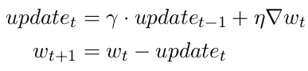

Equation for Momentum based Gradient Descent

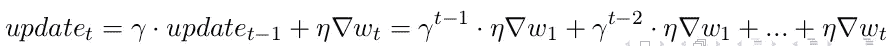

Exponentially weighted average is being taken. Earlier responses are less weighted. With this it is able to take faster steps in flat surfaces. Even after shooting away it returns faster with U-turns.

有了更早的 surface 它肯定会表现得更好。现在，让我们来看一个新的误差曲面，它具有更窄的极小曲面。

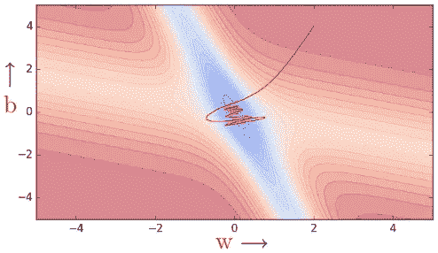

It oscillates in the valley of minima. Take lot U-turns, still converges faster than Vanilla GD.

收敛有很多振荡，这意味着 sigmoid 函数在相反的方向上反复多次。导致可以避免的客观过冲。**但是怎么做呢？在纵身一跃之前，先简单地向前看，如何？**

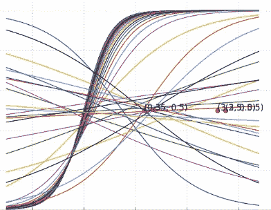

x(2-unit)-y(0.2-unit) plot of sigmoid function. For Momentum Based Gradient Descent.

**内斯特罗夫加速梯度**比动量法收敛更快。移动一点，计算该点的梯度，然后更新权重和偏差。

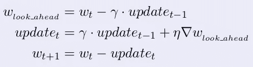

Similar Equation will be there for ‘b’ also.

看这里的一个观察，所有的 U 形转弯都是在 NAG 基于动量法的范围内进行的。因此，这减少了振荡。当然修正要快得多。现在，我们有一个令人满意的解决方案，可能不是一个最佳的解决方案。例如，有多个最小值，很难避免较小的振荡，但可以通过不同的初始化来处理。因此，我们有满意的解决方案，现在让我们把一些重点放在减少计算时间。

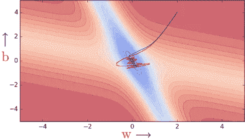

Comparison b/w NAG(blue) v/s Momentum Based Method(Red)

考虑到有大量的数据点，假设一百万个数据点之后只有一次更新，这将消耗太多的时间。但是，正如上面的证明所发现的，其正确的使用方法，即对应于每个数据点的损失梯度的总和应该最小化。为了提高效率，在这种情况下，可以使用概率方法进行近似。

用**随机方法近似:**该算法将对每个点进行更新，它将像一个时期中百万个点的百万次更新。这也是一个令人满意的解决方案，因为近似法不能保证每一步的损耗都会减少，就像扔硬币一样。

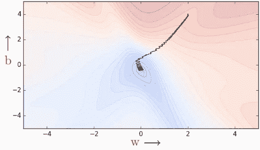

Many oscillations with greedy decision making. As, each point pushes parameter in a direction most favorable to it. Almost like data points are competing with one another.

贪婪决策将参数推向最需要的方向，在这种情况下可能并不需要。对于狭窄的表面，这种行为将随着更多的振荡而放大。只有在观察到某一批点后，我们才能通过创建批和更新参数来解决振荡问题。这种方法叫做**小批量梯度下降**。对于大型数据集，它的收敛速度会更快。实际上，k 的典型值是 16、32、64。

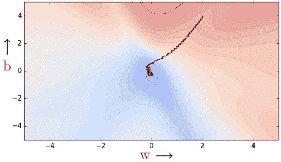

Less oscillations can be seen for k=2 itself.

另外，GD 方法在一个历元中只需要 1 步。随机 GD 在一个历元中走 N 步。其中为小批量 GD 优化的 N/B 步骤。类似于这种随机版本的基于动量的方法和 NAG 可以存在。在概率方法中，NAG 相对于基于动量方法的优势仍然存在。此外，这两种方法都比随机梯度下降法表现得更快。同样，为了获得更小的振荡和更好的性能，这些器件需要小批量实施。

考虑调整学习率超参数的场景。因为在讨论了所有算法变型之后，这种变型被忽略了。我们不能有大的学习率，因为它会放大梯度，即使对于平坦的误差表面，事实上，学习率值的逐渐变化将是一个好主意来结束我们的分析。同样，我们的第一个粗略的方法将是尝试不同的**随机**学习率，并在反复试验后找到最佳的一个。大脑启发法不是一个好的战略解决方案。其他方法可以是**退火**像阶跃衰减，指数衰减，1/t 衰减可以是一个替代选择。退火动量可以是一种更快收敛的方法，再次逃脱最小值将是一个问题。

**线搜索**，按顺序选择一串学习率，计算相对较好的η值的梯度。更新不同η值的“w”和“b ”,并保留最佳值。它很快离开缓坡，而不是粘在上面。振荡取决于学习率集的选择。但是，每一步的计算都会增加。我们需要更少的计算！！有什么解决办法？大家多讨论一下。

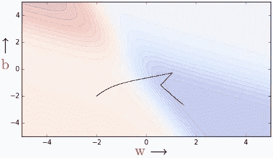

Faster than Vanilla GD approach. Small oscillations, different from Momentum & NAG.

**自适应学习速率**，这背后的想法我们可能需要不同的学习速率来实现不同的功能。**为何如此**？一个变量可能很稀疏，但如果它没有得到正确更新，或者没有得到足够更新，模型将无法做出正确预测，那么它可能非常重要。比方说，每当院长给一个班上课时，几乎所有的人都出席了，但是只有一个院长。这是一个稀疏的变量，但却是不同班级出勤趋势用例中的主要控制案例之一。

因此，合成方法将具有更多与其更新历史成比例的衰减。更多，更新意味着更多的腐烂。

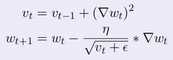

Adagrad update rule, similar one for ‘b’

让我们考虑这样一种情况，沿着‘b’进行初始化，在‘w’轴上很少移动。这意味着我们已经假设‘w’本质上是稀疏的，它经历很少的更新。现在比较不同的 GDs 变体。在这里，GD 是黑色，Momentum 是红色，NAG 是蓝色，Adagrad 是绿色。

It ensures ‘w’ has larger learning rate for more updates. For ‘b’ learning rate decreases as denominator is growing.

从上面的视觉化来看，阿达格拉德在接近收敛时卡住了，不再能够向 b 的方向移动。在 Adagrad 中，衰减率太大，因此频繁的参数将开始接收非常小的更新。为了防止这种快速增长，我们可以通过使分母项为β及其补数的分数之和来减少分母项。 **RMSprop，**利用这一特性，在频繁变量中进行不太激进的衰变。

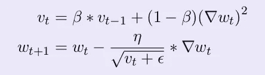

以上是 RMSprop 的更新规则，类似的公式也适用于偏差。此外，它会积累历史，但不会迅速衰减。这里，术语“v”是用指数衰减平均值计算的，而不是梯度的总和。

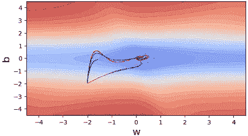

Here, the new magenta line added above green of Adagrad is RMSprop

在前面讨论的 RMSprop 逻辑中，忽略了动量，可以通过考虑步骤的历史来添加动量。考虑到这一点的方法是 **Adam** 优化方法。它对 CNN，大型序列间模型非常有效。

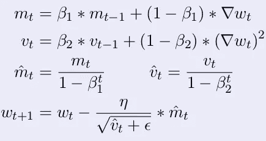

m(hat) is bias correction. Why bias correction is required ?

与上面讨论的方法相比，收敛通常更快。Adam 现在似乎或多或少是默认选择(β 1 = 0.9，β 2 =0.999，ε= 1e 8)。一些研究表明在某些情况下不会收敛。但是对于初学者来说，这是一个很好的入门选择。

现在，为什么需要**偏差校正**，然后我们终于可以休息了。注意，我们取梯度的移动平均值为‘m*t*’。我们这样做的原因是我们不想太依赖当前梯度，而是依赖梯度在许多时间步长上的整体行为。感兴趣的是梯度的期望值，而不是时间“t”处的单点估计。然而，我们不是计算 E[∇w *t* 而是将 m *t* 计算为指数移动平均值。理想情况下，我们希望 E[m *t* 等于 E[∇w *t* 。从数学角度来看这个案子。

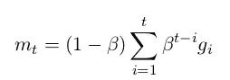

Derived From m(t) = β1 ∗ m(t−1) + (1 − β1 ) ∗ g(t) | Let ∇wt as gt

表达双方的期望。此外，假设所有 gi 来自相同的分布，即 E[g i ] = E[g] ∀ i。然后应用 GP sum，β作为公共比率。

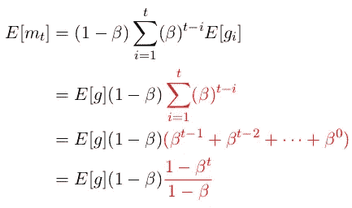

Expectation both sides | After assumption of E[g**i** ] = E[g]

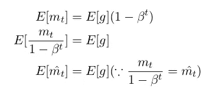

Bias Correction applied as expected value of m̂**t** is the same as the expected value of g**t**.

我希望以上所有的分析和可视化能够清楚所有与优化算法相关的主要概念，需要开发更新的算法，并对在哪里使用算法有直观的理解。为了保持文章简短，没有讨论所有的优化变量。**请继续关注**这些算法的实现细节，以及后续文章系列中对不同用例的深入分析。感谢阅读！！

# **鸣谢**

Mitesh M. Khapra 教授和他助教们在创建深度学习的非常丰富的课程方面做了出色的工作。这些图片都是从那里借来的。此外，这些内容来自 Ryan Harris 的“可视化反向传播”(可在 youtube 上获得)[和 Andrej Karpathy 的课程 cs 231](http://cs231n.stanford.edu/2016/)。我只是试图用简洁的方式解释它们。热情问候。