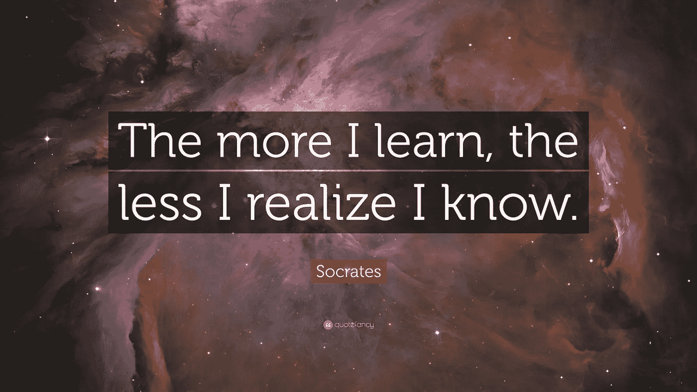

# 为什么我们不擅长医学

> 原文：<https://towardsdatascience.com/why-we-suck-at-medicine-20c78c7bccd4?source=collection_archive---------8----------------------->

## 任何告诉你他们知道某事的人都是在胡说八道

我想不出比我们现在的总司令更好的例子了。他不断请求我们“相信”没有人比我更了解(此处插入字面意思)这件事，这引起了那些仍有兴趣观看这场闹剧的人紧张的笑声。但是这说明了这篇文章更广泛的观点:如果我们**已经知道**东西，那么**还有学习**东西的空间吗？

> “1500 年前，每个人都知道地球是宇宙的中心。500 年前，每个人都知道地球是平的。15 分钟前，你知道*人类在这个星球上是孤独的。想想明天你会知道什么。—(特工 K，黑衣人)*

上面的引用(来自我最喜欢的一部电影)提供了两个人类通过发现过程成功推进“已知”的历史例子。第三次没有发生，但我可能错了。让我们来看一个更具体的例子:

# **美国宇航局 EmDrive 打破牛顿第三定律**

由于我是一个科幻迷，我不得不把这个放在这里。基本上，该发动机——2001 年开发，2014/15 年测试，[2016 年](http://arc.aiaa.org/doi/full/10.2514/1.B36120)发布——是一个无螺旋桨推进系统，这意味着该发动机不使用燃料来引起反应。在这里阅读这项技术及其对太空探索的意义。无推进器推进系统“违背了我们目前对物理学的基本理解:一个动作(推进一艘船)在没有反应(点燃燃料和排出物质)的情况下发生是不可能的。对于这种事情的发生，这将意味着一种“尚未定义的现象正在发生——或者我们对物理学的理解是完全错误的。"

现在，仅仅通过在网站上阅读这篇文章，我能知道我们对物理学的理解是否完全错误吗？当然不是(我**什么都不知道**，记得吗？).但它强化了这样一种观念，即在“东西”停止争论数百年后，人类将继续发现关于“东西”的东西。这让我想到了我的下一个观点:我们大脑处理信息的能力有限，导致我们通过二元透镜对我们的世界进行分类(对与错，真与假，真与假，等等。)出于方便。在牛顿第三定律的情况下，每一个单独的动作都需要一个反作用，因此任何不遵守相同原则的动作都被认为是不可能的。我们出于方便对事物进行分类的倾向是这一知识进步难题的本质。

# **为什么我们的医学“知识”限制了我们治疗疾病的进展**

分类帮助我们简化我们周围的复杂世界——没有它，我们正常化感觉输入和发展神经通路(我们称之为学习)的能力将受到极大限制。然而，当分类的目标不是明确地学习和改进时，我们实际上最终增加了阻碍进步的复杂性。这就是我们目前在医学大数据分析中所处的位置。

为医学发展的分类系统的主要目标是创造管理效率。虽然与“了解什么有效”(即医学的目标)的目标没有直接的对比，但两者之间出现的不一致往往会通过确认实际上不存在的信号来扭曲知识的聚合体。这到底是什么意思？

## 垃圾进，垃圾出

我们为了简化而分类，最终得到的是不完整的数据。电子病历中的结构化信息虽然易于传输和访问，但在患者病历中仅占大约 20%的医疗相关数据。让我们暂停一下，尝试理解这意味着什么。如果我们只有五分之一的医疗信息用于结构化分析，那么五分之四的医疗信息仍然是非结构化和未使用的？

## 是的。

显然，我们已经如此有效地浓缩了我们关于人体和疾病过程的知识，以至于我们只需要很小一部分数据就可以确定以下内容:

*   所有重大疾病的临床指南
*   每种批准药物的安全性和有效性
*   过去 15 年的公共卫生政策…(大口)

在现实世界中，这种认为我们“知道”如何治疗疾病的信念转化为一些可怕的后果。

 [## 研究人员称，医疗失误是美国人死亡的第三大原因

### 约翰霍普金斯医学院的研究人员进行的一项研究表明，医疗差错应该列为第三大死亡原因…

www.npr.org](http://www.npr.org/sections/health-shots/2016/05/03/476636183/death-certificates-undercount-toll-of-medical-errors) 

这一严酷的现实源于我们对医学知识最终结果的信念，以及整个行业对解决系统性和棘手问题的抵制——缺乏对完整临床数据的访问。过去 15 年的进步，特别是在学习如何治疗慢性疾病方面的进步，显示了我们还有多少尚未开发的 80%有待学习。绘制人类基因组是一个巨大的飞跃，但这仍然只是我们开始弄清楚事情所需的一小部分数据。精确医疗的梦想是可以实现的，但只有在我们找到如何建立完整和一致的数据来源之后。现在，想象那看起来像什么…

## 黄金场景—完整、结构化的临床数据

解决上述系统性棘手问题的每一步在技术上都很简单，在操作上很复杂，在文化上也不太可能。

**第一步——把所有东西都放在一个地方**:了解慢性病——我在这里只关注慢性病，因为这是一个不完整数据如何摧毁我们所有人的切实例子——我们需要纵向信息。每一份医生笔记、进展报告、出院总结，每一位医生、医院、紧急护理部门——你见过的任何提供者——提供的任何未解释的医学意见。全部拿走！明白了吗？好了，现在我们有 1000 页覆盖每个慢性病患者 15 年的数据(美国有 1.6 亿人)，所以我们有 1600 亿页未分类的非结构化数据。让我们一起玩吧！

**第二步——将所有内容提取到一个数据湖中:**来自各个领域的医生领导聚集在一个巨大的仓库中，开始通读每一页，突出任何包含独特生物医学概念的句子(例如，症状、观察、程序、过敏、药物治疗等)。).这些句子按时间顺序为每个病人标记，创造了 1.6 亿个纵向叙述，这些叙述描述了每个病人的经历，而不是分类。现在，有了我们的病人经验库，我们可以进入最难的部分了。

**步骤 3——将所有内容分解成离散的概念:**将句子文本中的离散生物医学概念联系起来，并为每个元素分配一个代码，这需要使用四个关系向量来确定文本概念值。首先是词汇向量，它说明了同一术语的词汇变体(同义词)(例如呕吐=呕吐)；第二个是字符串向量，它说明了单词的拼写/大小写的变化(例如，呕吐=呕吐)；第三个是原子向量，它充当从字符串到医学中常用编码词汇(例如，ICD-10、CPT、SNOMED-CT 等)的链接。);第四个是概念向量，它作为“元向量”位于其他向量之上，允许离散的非结构化但相同的概念在单个结构化代码下相关联。对每个句子中的每个生物医学概念都这样做，并将结果代码连接成一串代码，从而为每个叙述带来结构。现在再做一亿六千万次。[这是可能的。](https://www.ncbi.nlm.nih.gov/books/NBK9684/)

恭喜你！你刚刚创建了一个完整信息的数据库——现在坐下来，输入机器学习算法，看着计算机教我们如何行医！

还记得第一步吗？[这是它的样子](https://www.youtube.com/watch?v=C0HSmDb5WnU)。

20 年前，上述三个步骤甚至没有被考虑，因为这个问题仍然隐藏在我们推动高效药物的背后。10 年前，由于信息科学的局限性，这些步骤被认为是不可能的。现在，我们再也没有借口了。我们不能继续让我们积累的知识扼杀学习过程；我们必须利用我们所掌握的每一种工具来开发这一知识体系，从而创造出一条通向“医学智慧”的道路。

未能构建完整的信息意味着我们放弃了精确医疗和“编码人类”的梦想——我还没准备好认输，你呢？

matt sinder brand | matt@betterpath.com better path 公司联合创始人兼首席执行官