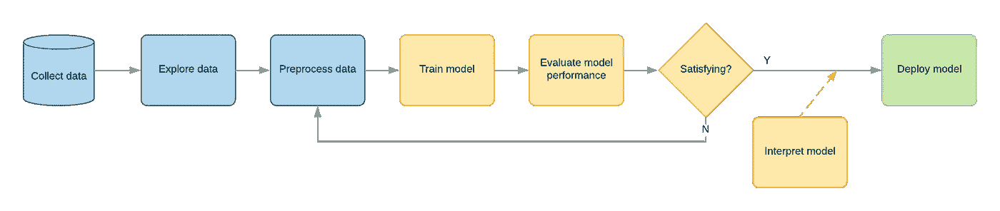
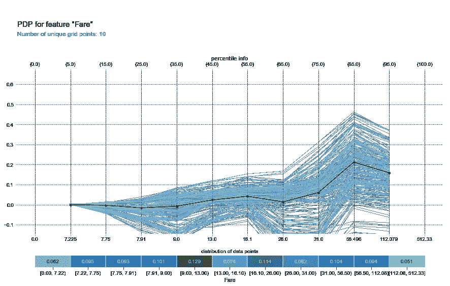
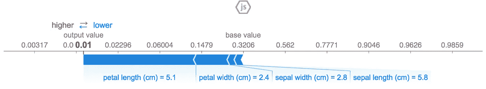

# 为什么你需要关注可解释的机器学习

> 原文：<https://towardsdatascience.com/why-you-need-to-care-about-interpretable-machine-learning-58b45d332c08?source=collection_archive---------14----------------------->

机器学习(ML)模型正在进入现实世界的应用。

我们都听说过关于 ML 系统的新闻，比如信用评分系统 T1、T2、医疗保健系统 T3、T4、犯罪预测系统 T5。我们很容易预见一个由 ML 驱动的 [**社交评分**系统](https://www.wired.co.uk/article/china-social-credit)。由于 ML 研究的快速发展和在受控实验中获得的巨大成果，越来越多的人现在似乎对统计模型统治我们生活重要部分的可能性持开放态度。

然而，大多数这样的系统被视为黑箱。产生简单是/否答案的晦涩难懂的数字计算机器；最多答案后面跟着一个不满意*“信心百分比”*。这通常是全面采用这种系统进行关键决策的一个障碍。

在医疗保健或贷款领域，专家不会检查庞大的数据库来找出复杂的关系。**专家应用先前的教育和领域知识为给定的问题做出最佳决策。**很有可能是基于数据分析的评估，甚至涉及自动化工具的帮助。但是，最终，这个决定是由一个合理的、可解释的推理支持的。这就是为什么拒绝贷款和医疗有动机。此外，这样的解释经常帮助我们判断一个好的专家和一个坏的专家。

我们大多数人倾向于拒绝接受看似武断的决定；理解决策的重要性是至关重要的。[这篇优秀的文章](https://arxiv.org/pdf/1606.03490.pdf)描述了可解释 ML 系统的一些现实目标:

*   **信任**:对系统预测的信心
*   **因果关系**:有助于推断自然界的属性
*   **概括**:应对不稳定的环境
*   信息含量:包括关于决策过程的有用信息
*   **公平**和**道德** **决策**:防止歧视性结果

很明显，社会关心可解释的机器学习。

我想更进一步:那些构建 ML 系统的人也应该关心可解释性。ML 从业者和工程师应该追求可解释性，作为建立更好模型的一种手段。

本文的目的并不是介绍可解释性工具和技术的细节以及如何应用它们。相反，我想提供一个为什么这样的工具对机器学习实践如此重要的愿景，并回顾几个我最喜欢的工具。

ML 系统(例如用于分类)被设计和优化为在**海量数据**中识别模式。建立一个能够发现输入变量和目标类别之间非常复杂的相关性**的系统是非常容易的。结构化数据？扔个 XGBoost 给它。非结构化数据？某深网来救援！**

典型的 ML 工作流包括探索数据、预处理特征、训练模型，然后验证模型并决定它是否准备好用于生产。如果没有，返回，通常为我们的分类器设计更好的特征。大多数时候，模型验证是基于预测能力的度量:例如，ROC 曲线下的[区域通常是相当可靠的。](https://developers.google.com/machine-learning/crash-course/classification/roc-and-auc)

Fig. 1 — How model interpretation fits in the common ML workflow

然而，在模型构建过程中，许多设计决策可能会稍微改变模型。不仅仅是分类器的选择，而是每个预处理步骤中无数的决定。事实证明，给定一个非平凡的问题，**有无数个具有高预测能力的模型，每一个都讲述了关于数据**的一个完全不同的故事。有些故事可能就是错误的，尽管它们似乎适用于特定的数据集。

这被美其名曰 [*罗生门效应*](http://www2.math.uu.se/~thulin/mm/breiman.pdf) 。我们应该在生产中部署哪些模型来做出关键决策？是否应该一直取绝对 AUC 最高的模型？我们应该如何区分好的和坏的设计决策？

可解释的机器学习方法和工具帮助我们做出这个决定，更广泛地说，**做** **更好的模型验证**。这不仅仅是简单地查看 AUC，而是要回答这样的问题:模型输出如何随每个特征的值而变化？这些关系是否符合人类直觉和/或领域知识？对于特定的观察，什么特征最重要？

我们可以粗略地将可解释性分为全局分析和局部分析。

全局分析方法将使您对特征和模型输出之间的关系有一个大致的了解。比如:房子大小如何影响未来三个月被卖出的几率？

局部分析方法将帮助你理解一个特定的决定。假设对于给定的贷款申请有很高的违约概率(未偿还)。通常，您想知道哪些特征导致模型将应用程序分类为高风险。

# **全局方法**

对于全局分析，从使用[部分依赖图](http://scikit-learn.org/stable/auto_examples/ensemble/plot_partial_dependence.html)和个体条件期望(ICE)开始。

> 部分相关图显示了给定不同特征值时某一类的概率。这是一种全局方法:它考虑了所有实例，并对某个特征与预测结果之间的全局关系进行了陈述。【演职员表:[可解释机器学习](https://christophm.github.io/interpretable-ml-book/pdp.html)

部分相关图让您了解模型如何响应特定特征。它可以显示目标和特征之间的关系是线性的、单调的还是更复杂的。例如，该图可以显示平方米对房价的单调增长影响(这很好)。或者你可以发现一个奇怪的情况，当花更多的钱对你的信用评分更好的时候——相信我，它发生了。

部分相关图是一种全局方法，因为它不关注特定实例，而是关注整体平均值。单个观察值的 PDP 的等价物被称为个体条件期望(ICE)图。ICE 图为每个实例绘制一条线，表示当特征改变时实例的预测如何改变。

Fig. 2 — Partial Dependence Plot (the bold line) with Individual Conditional Expectations. Credits: [https://github.com/SauceCat/PDPbox](https://github.com/SauceCat/PDPbox)

作为一个全局平均值，PDP 可能无法捕捉来自特征间交互的异质关系。用冰线来装备你的部分依赖图通常是好的，以获得更多的洞察力。

# 本地方法

最新的和最有前途的局部分析方法之一是 [**SHapley 加法解释**](https://github.com/slundberg/shap) 。它旨在回答问题*为什么模型为一个实例做出那个特定的决定？* SHAP 为每个特征分配一个特定预测的重要性值。

Fig. 3 — An example of SHAP values for Iris dataset. You can see how the petal length influences the classification much more than sepal length. Credits: [https://github.com/slundberg/shap](https://github.com/slundberg/shap)

在生产之前，您可以在测试环境中部署您的模型，并提交来自维持测试集的数据。为该测试集中的观察值计算 SHAP 值可以表示一个有趣的近似值，即要素将如何影响生产中的模型输出。在这种情况下，我强烈建议提取“过时”的测试集，也就是说，最近的观察结果就是维持数据。

从 ML 模型中得到的可解释的决策已经成为在现实世界中应用它们的重要需求。

在许多关键的 ML 应用中，解决方案一直是只考虑固有的可解释算法——例如线性模型。这些算法无法捕捉特定于训练数据集的细粒度模式，只能捕捉一般趋势。趋势很容易解释，并与领域知识和直觉相匹配。

可解释的工具为我们提供了另一种选择:使用强大的算法，让它捕捉任何模式，然后使用你的人类专业知识来删除不需要的模式。在所有可能的模型中，选择一个能正确描述数据的模型。

当您的训练模型产生可解释的结果时，您可以利用这种可解释性。上述工具的输出可以构成业务人员能够理解的简要报告。毕竟，你需要向你的老板解释为什么你的模型如此有效。可解释的模型可能会引导你的老板和所有利益相关者做出更好的商业决策。

# **结论**

有时人们说，只有高度管制的应用中的 ML 从业者才应该关心可解释性。我认为相反:每个 ML 从业者都应该使用可解释性作为建立更好模型的额外工具。

感谢阅读。我喜欢你的反馈。