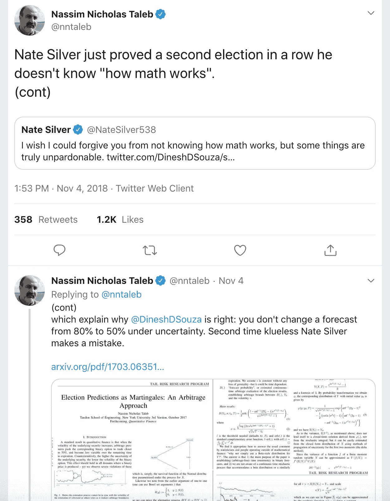
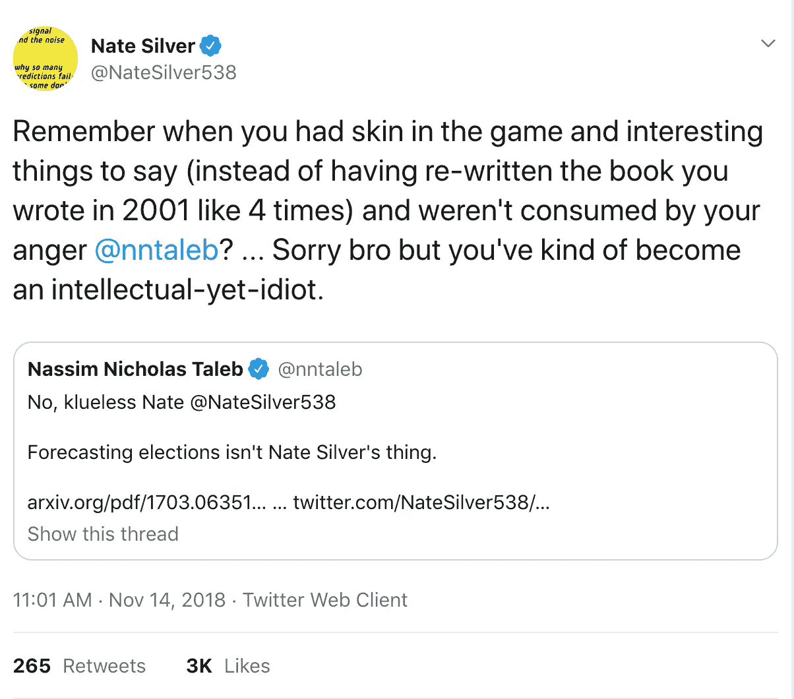
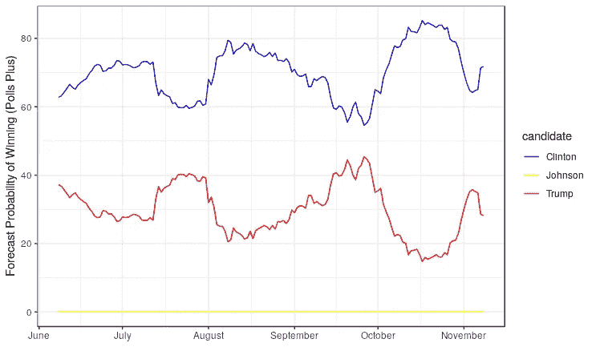
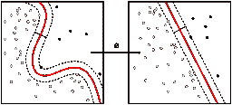
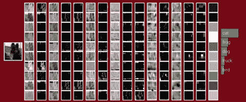
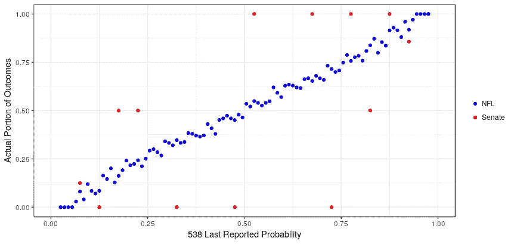
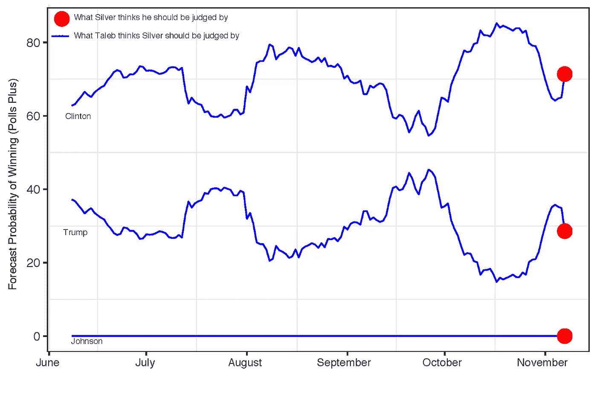

# 为什么你应该关心内特·西尔弗和纳西姆·塔勒布的推特之战

> 原文：<https://towardsdatascience.com/why-you-should-care-about-the-nate-silver-vs-nassim-taleb-twitter-war-a581dce1f5fc?source=collection_archive---------0----------------------->

## 两个数据专家怎么会有这么大的分歧？

过去一个月，一场不为人知的争议再次浮出水面。定量分析社区的两个图标在最伟大的公共舞台 Twitter 上发生了冲突。你可能会被原谅没有跟踪这场争论:我将为门外汉做一个快速回顾。用于创建本文的所有代码和数据都可以从这个 Github Repo 中派生出来。

内特·西尔弗是[538](https://fivethirtyeight.com/)的联合创始人。一个非常受欢迎的专注于数据的博客，因其准确预测 2008 年美国大选的结果而闻名。Silver 使用一种聪明的民意调查汇总技术来生成预测，这种技术考虑到了偏见，例如民意调查者只给使用座机的人打电话。

作为一名训练有素的统计学家，通过经济学，他将自己对棒球(sabermetrics)和扑克分析的热情引入了政治领域。事实上，FiveThirtyEight 这个名字是对美国选举人票数(538 张)的认可。然而，博客也涵盖了其他兴趣领域，如体育。内特把他的博客卖给了 ESPN，并接受了主编的工作。他们(ESPN)利用它作为一个平台，向观众提供体育赛事的预测，FiveThirtyEight 后来搬到了美国广播公司。对他们网站的例行访问是政治和体育文章的混合，带有详细的预测和数据可视化。

[Silver (left) in conversation with NY1’s Pat Kiernan](https://commons.wikimedia.org/wiki/File:Nate_Silver_in_Conversation_with_NY1%27s_Pat_Kiernan.jpg)

内特的预测能力已经成为大众媒体公认的标准。他是许多全国电视节目的常客，在每个全国选举周期讨论他的预测。因此，当畅销书作家、量化风险专家纳西姆·塔勒布(Nassim Taleb)公开宣布 FiveThirtyEight 不知道如何正确预测选举时，人们感到非常震惊！

对塔勒布来说，由于他对现实世界中概率的敏锐理解，他已经变得非常成功。他的书既有哲学的，也有技术的，重点是不确定性和风险。具体来说，他认为实践中使用的绝大多数定量模型都没有充分考虑到现实世界的风险。相反，它们给人一种短期价值的错觉(比如在一些很好理解的情况下是准确的)，但当不知情的用户经历模型设计不理解的情况时，他们会面临巨大的系统风险。

Nassim Taleb

塔勒布之所以出名，部分是因为他通过暴露自己的财富将自己的哲学付诸实践。马尔科姆·格拉德威尔在《纽约客》上写了一篇文章，讲述了塔勒布是如何将他的风险哲学转化为一个极其成功的投资策略的。此后，他在不可预见的市场事件中获得了巨额财富，如黑色星期一、俄罗斯债务违约和 2008 年金融危机。塔勒布现在花很多时间写作和硬拉(我很嫉妒这一点)。他不羞于公开告诉别人他不同意他们的观点:内特·西尔弗就是其中之一。

Taleb’s Tweets directed at Silver November 2018

然而，西尔弗并没有屈服于这些侮辱！

Silver 和 Taleb 分别拥有 300 万和 30 万粉丝，在这些交易所中引起了巨大的轰动(从 2016 年开始)。然而，快速浏览评论线程，你会发现很少有人理解这些论点。甚至西尔弗自己似乎也被塔勒布的攻击弄得措手不及。

然而，我认为这是一个数据科学专业人员(或有抱负的专业人员)更深入挖掘所讲内容的绝佳机会。这对我们如何选择以可靠和可验证的方式建模和展示我们的工作有影响。你必须自己决定塔勒布是否有道理，或者只是一个有太多空闲时间的疯狂富人。

## 并非所有介于 0 和 1 之间的实数都是概率

围绕 FiveThirtyEight 预测的争议和困惑的主要来源是它们是“概率性的”。实际上，这意味着他们不预测赢家或输家，而是报告一种可能性。使问题更加复杂的是，这些预测被报告为点估计(有时带有模型隐含误差)，远在事件发生之前。例如，在民意调查开始前六个月，这是他们对 2016 年总统选举的预测。

FiveThirtyEight Running Forecast of the 2016 Presidential Election

他们的预测过程是用专家知识(选举、体育赛事等)建立一个系统的定量复制品。)然后运行一个[蒙特卡洛模拟](https://en.wikipedia.org/wiki/Monte_Carlo_method)。如果模型接近真实世界，模拟平均值可以可靠地用于概率陈述。所以 FiveThirtyEight 实际上说的是:

> x%的时间我们的蒙特卡罗模拟导致了这个特殊的结果

问题是模型不是真实世界的完美复制品，事实上，在某些方面总是错误的。这种类型的模型构建允许在构建中有一定的主观性。[例如，Silver 曾在许多场合表示，其他竞争模型没有正确纳入相关性。](https://fivethirtyeight.com/features/the-media-has-a-probability-problem/)在描述建模方法时，他还清楚地表明它们会调整结果[(比如基于事件发生前的时间人为增加方差或类似的调整)](https://fivethirtyeight.com/features/how-the-fivethirtyeight-senate-forecast-model-works/)。这就产生了一个关于谁的模型是“最好的”或最像真实世界的无限递归的争论。当然，要判断这一点，你可以看看从长远来看谁表现得更好。这就是事情有点偏离轨道的地方。

因为 FiveThirtyEight 只预测概率，他们从来没有对结果采取绝对的立场:正如塔勒布所说的那样，没有“参与游戏”。然而，这不是他们的读者效仿的东西。在公众眼中，他们(FiveThirtyEight)是根据有多少预测概率高于和低于 50%的事件分别发生或没有发生(在二元设置中)来判断的。或者，他们(读者)只是选择最高的报道概率作为预期的预测。例如，当“在 2008 年总统竞选中正确说出 50 个州中的 49 个”[之后，他们获得了大量的赞誉。内特·西尔弗被列入《时代周刊》100 位最有影响力的人名单](http://content.time.com/time/specials/packages/article/0,28804,1894410_1893209_1893477,00.html) t。如果他没有在任何一个州说出获胜者，他就不应该接受这一荣誉！

公众未经询问就使用 50%规则是情有可原的。例如，在监督机器学习中，分类模型必须有一个称为“决策边界”的特征。这通常是先验决定的，并且是在模型被训练之后理解模型质量的基本部分。在这个界限之上，机器相信一件事，在这个界限之下则相反(在二进制的情况下)。

Example Decision Boundary in Classification Problems

对于标准模型，如逻辑回归，默认决策边界被假定为 50%(或 0 到 1 范围内的 0.5)或具有最高值的替代值。为分类而设计的经典神经网络通常使用 softmax 函数，这些函数就是以这种方式解释的。这是一个使用计算机视觉执行图像分类的卷积神经网络示例。甚至这个基本的人工智能模型也能做出决定。

[Convolutional Neural Network with Decision Boundary Prediction](http://cs231n.stanford.edu/)

如果 FiveThirtyEight 没有规定的决策边界，那么很难知道他们的模型实际上有多好。由于隐含的决策边界，在 2008 年和 2012 年，随着水晶球般精确的陈词滥调，当他们被加冕并愉快地接受它时，这种困惑变得更加复杂。然而，当人们指责他们错了时，他们会回过头来说一句简单的俏皮话:

> 你就是不懂数学和概率。

通常这是 f [的后续报道，他们只报道了 x%，所以这意味着(1-x)%也可能发生](https://fivethirtyeight.com/features/the-media-has-a-probability-problem/)。这是一个完美的场景。他们永远不会错！我们都应该如此幸运。当然，这种概率论证可能是有效的，但如果它看起来不真诚，就会引起一些焦虑。[甚至《华盛顿邮报》也有一篇观点文章，在 2016 年选举期间发表了同样多的观点。](https://www.washingtonpost.com/opinions/no-matter-who-wins-the-presidential-election-nate-silver-was-right/2016/11/08/540825dc-a5eb-11e6-ba59-a7d93165c6d4_story.html?noredirect=on&utm_term=.47a35c316189)

不清楚的是，FiveThirtyEight 读者隐藏了一个因素。预测有两种不确定性；**偶然性**和**认知性**。随机不确定性与基础系统有关(在标准骰子上掷出六点的概率)。认知不确定性与系统的不确定性有关(骰子有几个面？掷出 6 的概率是多少？).有了后者，你要去猜测博弈和胜负；像选举一样！

像 FiveThirtyEight 这样的定制模型只向公众报告偶然的不确定性，因为它涉及到它们的统计输出(在这种情况下由蒙特卡洛进行推断)。麻烦在于认知的不确定性很难(有时不可能)估计。[例如，为什么 FiveThirtyEight 的模型没有在事情发生之前，考虑到科米可能会重新调查克林顿的电子邮件？相反，这似乎导致了预测变异的巨大峰值。可能是因为这个事件无法预测。](https://fivethirtyeight.com/features/the-comey-letter-probably-cost-clinton-the-election/)

相反，认识论上的不确定事件被先验地忽略，然后 FiveThirtyEight 假设来自不可预见事件的预测中的剧烈波动是预测的正常部分。这应该让我们问‘如果模型忽略了一些最重要的不确定性，我们真的得到了一个可靠的概率吗？’

为了进一步扩展这一点，我已经综合了 FiveThirtyEight 的一些预测，[使用他们的开源数据](https://data.fivethirtyeight.com/)，针对两种非常不同类型的事件；美国参议院选举和国家橄榄球联盟(NFL)比赛。这里是对最终预测概率和实际结果比例的比较。

Stated Probabilities Compared with Average Portions

体育数据(NFL 比赛)具有极好的线性关系。这些比例是使用 30K 个数据点构建的，因此，如果我们假设系统是稳定的，我们已经平均掉了任何采样误差。然而，正如你所看到的，实际比例与预测值仍有 2-5%的显著差异。这是未解决的认知不确定性的信号。这也意味着你不能轻信这些预测概率。

体育运动，像其他碰运气的游戏一样，有着非常明确的机制，这些机制有助于进行统计分析。另一方面，高度非线性的事件，如有争议的选举，可能不会。通过更少的数据点，你可以看到参议院预测的变化是巨大的。衡量模型在这类事件上的表现变得加倍困难。还不清楚一个预测是错误的，是由于模型的质量(认知的)还是仅仅是运气(偶然的)。

这种预测方法最令人不安的一点是，它打开了叙事谬误的潘多拉魔盒。克林顿为什么会输？科米？电子邮件服务器？然后，人们可以通过目测预测变化周围发生的事件来证明可能的虚假推断。看看天气预报是如何变化的吧，所有这些新闻！

我想这就是塔勒布竭力反对的原因。这个博客给人的感觉更像是一个圆滑的推销，充斥着量化的流行词汇，而不是不带偏见的分析(尽管它很可能是)。如果一个预测不符合一些基本特征，它就不应该作为一种可能性被推销。更重要的是，一个预测应该从发布给公众的时候就开始判断，而不仅仅是在事件发生之前。预测者应该对偶然性和认知性的不确定性负责。

从这个角度来看，很明显 FiveThirtyEight 报告了导致事件的过多噪音，而没有足够的信号。这对于驱使用户阅读同一主题的一长串相关文章来说是很棒的，但并没有严格到可以赌上你的财富。塔勒布和西尔弗对 FiveThirtyEight 应该如何判断的看法可以这样形象化。

Taleb vs. Silvers Different Take On How FiveThirtyEight Should be Judged in 2016

因为像选举这样的非线性事件有太多的不确定性，所以报告早期预测可能被合理地认为是轻率的。这样做的唯一可能的原因是捕捉(并货币化？)渴望知道未来的公众的兴趣。[我不会深入讨论技术问题，Taleb 已经撰写并发表了一篇关于关键问题的论文，并给出了解决方案。](https://arxiv.org/pdf/1703.06351.pdf)

这里我们可以有把握地说，538 次预测并不总是可靠的概率。然而，它们伪装成 1，介于 0 和 1 之间。这是塔勒布的主要论点；FiveThirtyEight 的预测不像包含所有不确定性的概率那样表现，也不应该被当作概率。

我不想暗示五三八在他们的手艺上是糟糕的。他们可能是业内最好的民意调查聚合者。如果我们只看最近报道的概率预测，并使用公众的决策边界，他们比任何其他试图完成相同任务的来源都更成功。然而，无论结果如何，都要让自己看起来正确，让用户推断自己的决策界限，过度报告预测，以及忽略认知的不确定性，这些都不应该被忽视。FiveThirtyEight 的声誉如何，数据社区的声誉也如何。

明确你建议的决策界限、概率陈述、关于不确定性的假设，你就不太可能误导利益相关者。

[所有代码和数据都可以从这个 Github repo 中派生出来。](https://github.com/isaacfab/tinker/tree/master/taleb_silver_article)

在 LinkedIn 上关注我:【https://www.linkedin.com/in/isaacfaber/ 