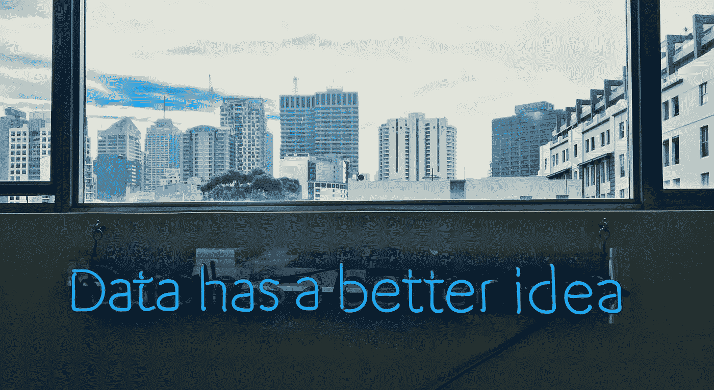
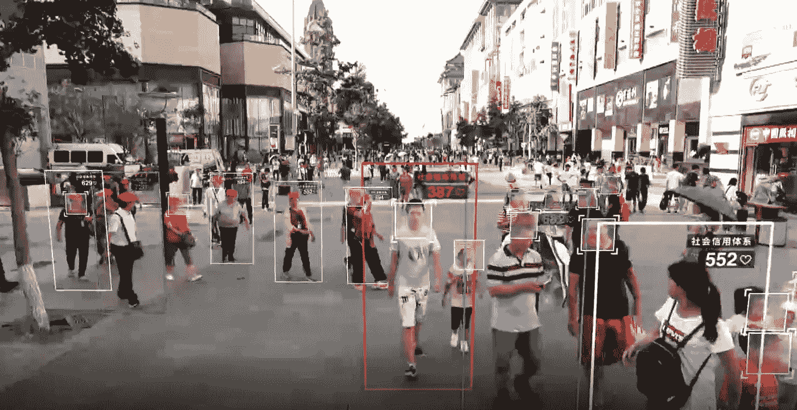

# 为什么您现在应该熟悉数据

> 原文：<https://towardsdatascience.com/why-you-should-familiarize-with-data-today-958db7979e64?source=collection_archive---------24----------------------->

跟踪和处理不断增长的数据的能力正在改变我们对世界和万物的认知。数据，尤其是“大数据”，影响着我们的日常生活——工作、政治、医疗保健、锻炼、购物……主要与机器学习、深度学习、预测分析或 AI(人工智能)等时髦词汇结合在一起。

*朋友和家人问我为什么对这个话题感到兴奋，为什么要在这个特殊的学科上做硕士。我的回答总是一样的:我们不能逃避。有无穷无尽的“数据”机会，但也有严重的风险因素。没有人必须研究这个话题——但是理解要点是不可避免的。在下面你可以找到我的三大理由* ***为什么我认为每个人都应该理解当今世界“数据”*** *背后的原理。不要期待一篇只有极客才能理解的技术文章——期待一些你钻研这个话题的动力。*

**后果。** 数据只是信息的另一种说法。但在计算方面，数据通常是指机器可读的信息——无论是结构化数据还是非结构化数据。通过技术进步，特别是所谓的“使能技术”的进步，例如计算能力、互连性、廉价数据存储等的大量增加，使用这些信息的可能性比以往任何时候都多。正如我们所知，这个世界上并不是每个人都将整体福祉列在议程的首位，有很多机会可以通过数据的力量操纵或控制我们。

“Social Credit” China

例如，中国将会或者已经部分实施了他们的“社会信用”系统。这是怎么回事？每个公民都有信用，他可以收集，当然也可以失去。因此，大量的数据被处理和组合——来自政府记录等来源的大数据，包括教育和医疗、安全评估和财务记录，将被输入到个人得分中，并与来自您自己设备的数据相结合。

现在人们可以说——太好了！一切都将更加安全，“好”公民将获得更多特权，并获得他们所赚取的。但是谁来定义好公民呢？完全正确:为评分设置指标的人。对系统持批评态度的人会直接得分很低。他将不会被纳入社会福利，甚至可能不会被纳入他通常的社会群体，因为其他人也担心得分低。现在我们有了:通过数据的反乌托邦独裁。

但是在收集数据的时候，不仅仅是坏的事情。让我们以医疗保健中的大数据为例:如今，医学研究人员可以访问大量关于癌症患者治疗计划和康复率的数据。这使得医生在制定治疗计划和给患者用药时能够做出更好的决定。收集的数据越多，链接到其他数据库的数据越多，产生的见解就越多。现在让我们进入下一个阶段:更多的训练数据，为人工智能处理和准备数据的能力允许医生部分自动化诊断过程。医生不必害怕——这并不意味着他/她会丢掉工作。这意味着比以往更多的人可以接受治疗。没有足够的钱来支付这种诊断的病人可以得到治疗。并且额外的资源将被释放用于更困难的或单独的程序。这是一个转变整个医疗保健行业治疗流程的巨大机遇。

上面的两个例子都表明，如何使用数据有不同的选择。不管这种力量是出于善意还是恶意，最重要的是理解每个选项背后的基本原理和后果。作为普通公民，你不必成为人工智能、人工智能、深度学习、神经网络等领域的专家。但是你有责任了解你的数据是用来做什么的，会有什么后果。

**数据是你生活的一部分。**
大数据影响着我们的日常生活。术语“大数据”描述的是大型数据集的集合，其规模如此之大，以至于您无法使用普通的数据库系统来处理、分析、挖掘或生成见解。数据的增长是巨大的。假设存储的所有数据中有 90%是在过去两年中产生的。但是，让我们开始一段简短的旅程，看看我们每个人是如何遇到大数据的:

从家里开始。通过智能恒温器和电表，我们每天都能在家中省钱。通过识别个人行为，我们的能源消耗得到了优化和大幅降低。但不仅仅是能源消耗变得智能，我们完整的家也可以变得“智能”。一切都是连接的(你肯定听说过 IoT——物联网)，并在设备之间和设备与制造商之间发送数据。在你的咖啡机坏之前，制造商已经联系了你，所以你可以像往常一样继续享用你的拿铁咖啡。

开车去上班时，您的汽车已经有了最新的交通数据。你会注意到提供的方向越来越好，越来越详细，有自行车和公共交通的选择。更令人兴奋的是，它可以告诉你是否会遇到交通堵塞，这不是因为有人观察到了交通堵塞，而是因为经过这一路段的汽车群正在报告交通堵塞。虽然你仍然可以自己驾驶汽车，但传感器可以识别街道上你周围的一切，并在你的汽车中处理这些数据。如果有人一个小孩跳到你的车前，车会比你更快地坏掉。在工作中，你不必再做任何重复性的工作。一个智能助手正在安排你的会议( [x.ai](https://x.ai) )，让你知道你必须在什么时间去哪里。下班后，你的健康跟踪器建议你做一些运动，因为你今天没有做足够的运动(顺便说一下，69%的美国人跟踪他们的健康数据)。在一天结束的时候，你可以坐在沙发上看一部令人惊叹的网飞系列片——这是在收集的行为用户数据的帮助下，以你真正喜欢的方式制作的。

在提出所有这些简单的例子时，信息如下:没有人能够再隐藏数据使用。它是我们日常生活的一部分，我们想不想用它不再完全是我们的决定。因此，还有什么比挖掘对你的日常生活有如此巨大影响的事物更好的动力呢？

**决策优势。** 35.000——这是我们每天有意识和无意识做出的决定的数量。有些比其他的更重要。丹尼尔·卡内曼分享了他关于做出重要决定的建议:“你应该放慢脚步，从某个特定的人那里获得建议。一个喜欢你，但不太在乎你感受的人。那个人更有可能给你好的建议。” [*](https://www.ubs.com/microsites/together/en/nobel-perspectives/laureates/daniel-kahneman.html)

但是还有什么在影响我们的“重要”决定呢？那些我们放慢脚步的决定，那些我们花了很多时间去做的决定，不管是私人的还是商业的。F [关于决策的行为者](http://www.inquiriesjournal.com/articles/180/decision-making-factors-that-influence-decision-making-heuristics-used-and-decision-outcomes)在科学研究中已经比在这篇博文中被更好地指明。但为了说明我的观点，让我们简单地将影响因素分为内部和外部两类:

*   内部因素或个人特征:以前的经历、个人背景、价值观、风险、兴趣、哲学、偏见(尤其是不同形式的认知偏见)等等。
*   外部影响和形势:在什么时候做出决定。决策者在什么地方。围绕在决策者身边的人。

现在让我们把这些影响因素放在决策的基础上:事实。内部和外部因素使个人总是做出不同的决定，但事实和实际信息这一参数既不能改变也不能忽略。它让我们可以选择更客观地调整决策过程

如前所述，数据是一种信息形式。如果个人、企业主或任何类型的群体能够在技术的帮助下访问和处理越来越多的数据，并根据有见地和更完整的信息采取行动，结论很简单:信息越多，决策就越全面。无论你在哪个领域，为自己使用这种可能性，应该有足够的动力去理解用于它的数据的基本概念。

**现在该怎么办？**

在那篇文章的结尾，希望你对进入数据领域感到非常兴奋，并了解它对你、你的企业、你的朋友，...但是现在如何入门呢？
现实一点，你不必为了简单地学习基础知识而去读硕士或类似的课程。更重要的是，你已经阅读了这篇文章，它让你思考数据。所以问问你自己:

*   数据对你和你的同伴有什么影响？
*   你想用数据做什么？您希望在哪里贡献您的数据？

你对数据反思的越多，问题就会出现的越多。最后，你对它在政治、法规和自由数据流方面的需求有自己的看法和理解。

***************************************************************

期待在评论中听到您的反馈，或者给我发邮件至 florian@investory.io。

***************************************************************

另一篇你可能喜欢的文章:
[结合定性&定量数据分析你的产品粘性](https://productcoalition.com/combining-qualitative-quantitative-data-to-analyse-the-stickiness-of-your-product-7c070c053c02)