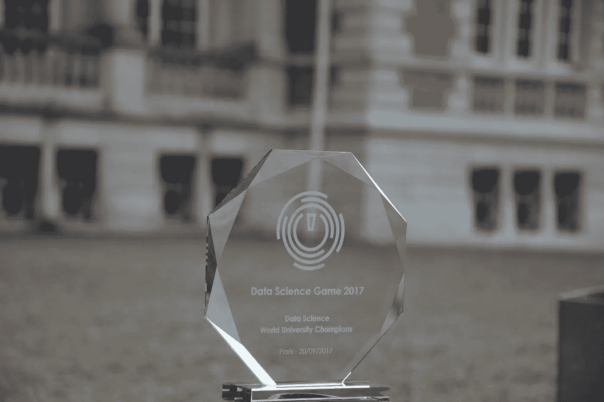
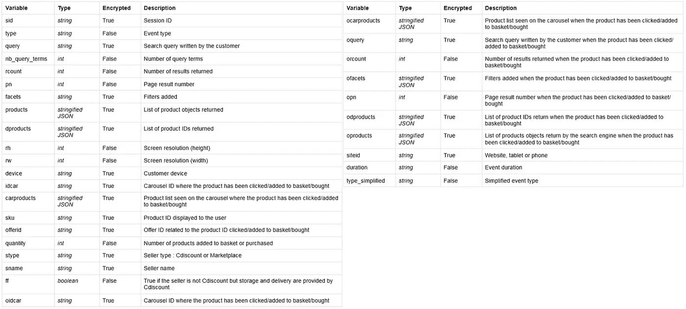
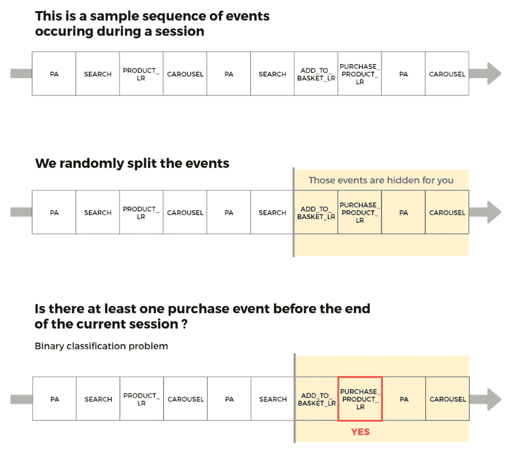
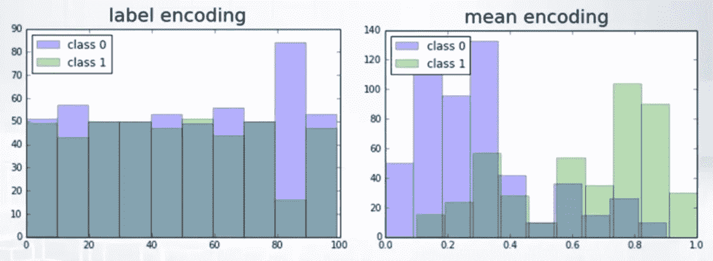
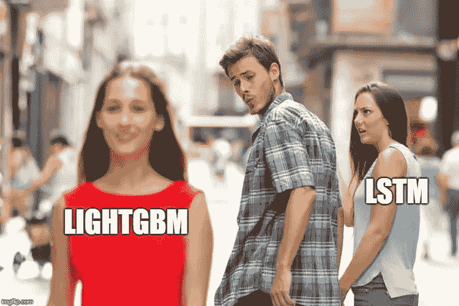
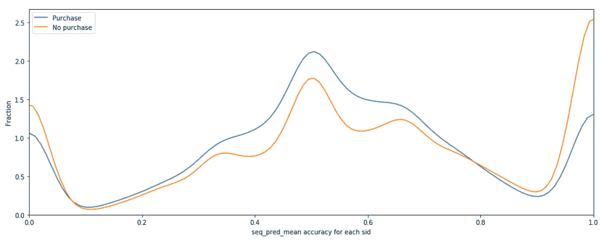
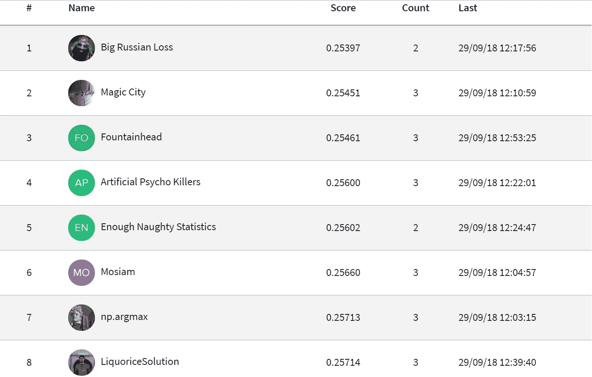
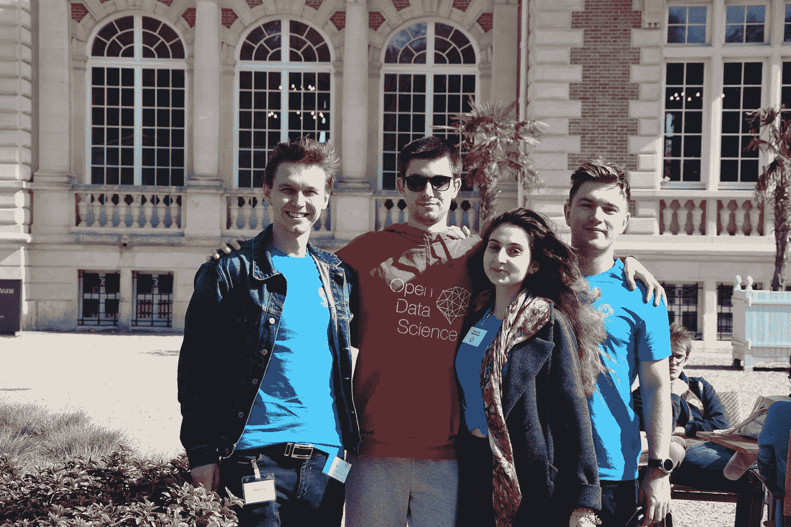

# 为什么你不应该连续编码 30 个小时

> 原文：<https://towardsdatascience.com/why-you-should-not-code-30-hours-in-a-row-a3a471301826?source=collection_archive---------17----------------------->



First place prize of the last year, but believe me, it looks the same each year :) (photo source: [DSG FB group](https://www.facebook.com/datasciencegame))

9 月的最后一周，我参加了 2018 年数据科学比赛(DSG)的决赛，这是最著名的致力于机器学习和数据科学的天才学生国际比赛。今年，来自世界各地的 26 支队伍来到巴黎挑战自我。这项赛事的任务始终是一场类似卡格尔的比赛，但时间有限:参赛者只有 30 个小时来取得最好的成绩。

我和我的团队代表芬兰参加了这次活动。在 DSG 历史上，芬兰第一次进入了 DSG 的决赛，并进入了前 10 名的决赛排行榜。这篇文章将是关于比赛的任务，我们在比赛中面临的挑战，我们的解决方案的描述，以及我们在 30 小时的编码冲刺中学到了什么。

# **任务和数据**

这项任务是由法国电子商务网站 [Cdiscount](https://www.cdiscount.com/) 承担的，该网站提供广泛的产品:包括文化用品、高科技、IT、家用电器、个人电器和食品等多种产品。Cdiscount 向竞争对手提供了一个由导航跟踪元素组成的数据集，以及一个描述产品类别层次结构的数据集。

考虑到用户的隐私，Cdiscount 主动在没有任何用户身份的情况下将挑战置于会话级别。因此，所有类型的个人数据都已从数据集中删除。此外，所有与产品相关的信息都已加密，以确保所有参与者(讲法语的人和其他人)之间的公平。



Description of provided data

我们被要求预测在最后一次观察和会话结束之间发生购买行为的概率(对于给定用户，会话被定义为一系列事件，当两个连续事件之间的时间超过 30 分钟时，会话结束)。这个任务是一个二元分类，竞争的度量——对数损失。



The illustration shows how the target was built

# 我们的解决方案

在比赛开始时，组织者提供了三个数据集:训练、测试和产品的层次结构。最后一个有点问题，组织者正在试图在活动期间修复它；所以，我们决定完全不用它。训练数据集由 130 万行组成，代表大约 13 万个会话。在测试中，我们有关于 90k 个会话的信息。因此，类别是不平衡的:在 train 数据集中呈现的所有会话中，只有 9.4%导致购买。

这项任务相当困难，原因有很多:建议的数据集相当原始(如果没有一些预处理，我们无法运行简单的拟合预测)，每个会话都包含一个序列组件(数据的本质是用户的动作序列)，绝大多数特征都是匿名的。然而，我们以前也面临过类似的情况；所以，我们知道该怎么做。数据集由几种类型的要素组成，这就是我们以不同方式处理它们的原因。我们来详细讨论一下。

## **时间特征**

`Duration`是数据集中唯一的时间特征。它显示了从会话开始到打开当前页面之间的时间。绝对值对模型没有意义；因此，我们决定计算用户在当前页面和前一个页面上花了多少时间。然后，我们像处理数字特征一样处理这两个特征。

## 字符串特征

这次比赛有很多弦乐特色。它们代表不同的东西:一种页面类型(和一种简化的页面类型)、页面上或用户购物篮中各种商品的 id、用户使用的过滤器、转盘 id、搜索行和站点 id。

处理这些功能最常见的方法是将它们组合在一起，像处理文本功能一样处理它们(准确地说，使用 NLP 任务中常用的工具)。我们对每个会话的连接字符串执行 TF-IDF 或计数矢量器；在这种情况下,“or”意味着我们为每个字符串列选择了一种策略(不是同时选择两种策略)。当我们处理多个模型时，我们测试了预处理的各种组合。此外，我们对每个模型使用了不同的 TF-IDF 超参数集和计数矢量器。我们这样做主要是因为我们希望我们的模型给我们不同的预测(即，在不同地方“出错”的模型)，以便我们可以在以后堆叠或混合它。

此外，我们从这些字符串中提取了一些数字特征:每个用户的每列的值的数量，每个用户的每个字符串列的唯一值的数量，等等。

## 分类特征

我们决定获取每个字符串列中最频繁出现的值，并像处理分类特征一样处理它。更重要的是，我们以一个类别的形式添加了 first、first two、last 和 last 两个动作。

我们使用了几种策略来处理分类特征:标签编码、一个热点编码和均值编码。许多团队使用均值贝叶斯编码(参见[ka ggle 内核以更好地理解这个想法)，它试图对罕见类别的概率进行正则化。根据我的经验，这不是执行均值编码的最佳方式。正确的方法如下:我们将训练数据集分成`k`个折叠，`k-th`个折叠将用于验证，而`k-1`个折叠将用于计算该类别所有级别的平均目标，并转移到测试数据集和验证部分。然后将`k-1`褶皱分成`t`褶皱，重复同样的操作(`k`和`t` —有些数字，我们用了`k=10`、`t=5`)。使用这种策略，我们不需要任何类型的正则化；我们经常取得更好的成绩。然而，这种方法需要更多的计算时间。](https://www.kaggle.com/ogrellier/python-target-encoding-for-categorical-features)



[The concept of mean encoding](https://www.coursera.org/lecture/competitive-data-science/concept-of-mean-encoding-b5Gxv): classes will become more separable with it

## 数字特征

在这场竞赛中，处理数字特征的最佳方式是通过`sid`和一些分类列进行聚合，然后计算一些统计数据:

```
import pandas as pd 
import numpy as np
from scipy import statscat_columns_list = """ all cat columns """
num_columns_list = """ all numberical columns """ 
# nearly all sids contained at least one NaN in each numerical feature
functions_dict = {
    'max': np.nanmax,
    'min': np.nanmin, 
    'ptp': lambda x: np.nanmax(x) - np.nanmin(x),
    'mean': np.nanmean,
    'std': np.nanstd,
    'mean_div_std': lambda x: np.nanmean(x) / (np.nanstd(x) + 1) # std==0 sometimes
    'median': np.nanmedian,
    'skew': lambda x: stats.skew(x, nan_policy='omit')
}num_features_dfs = []
for cc in cat_columns_list:
    for fc in num_columns_list:
        for fnc_d in functions_dict:
            fnc_f = fnc_d.keys()
            fnc_name = d.values()
            grb_df = df[['sid'] + cc + fc].groupby(['sid'] + cc).agg(fnc_f).reset_index()
            new_col_name = fc + 'l_grouped_by_' + cc + 'l_agg_' + fnc_name
            grb_df = grb_df.rename({fc: new_col_name}, axis=1)
            piv_df = grb_df.pivot(index = 'sid', columns = cc, values = new_col_name)
            num_features_dfs.append(piv_df)
```

## **序列预测特征**

如上所述，每个会话的数据包含页面序列和用户的一些操作(进行搜索、添加过滤器或放入购物篮，等等)。处理这些序列最常见的方法是使用 RNN 或 LSTM 模型来预测目标变量，但我们没有这样做。我们认为，由于每个会话的长度不同(从页数和每页花费的时间来看)，这些模型给我们的分数很低(免责声明:我们是对的；试用这些模型的竞争对手报告说这种方法得分很低)。



为了捕捉数据的序列性质，我们做了一件完全不同的事情。对于每个会话，我们都知道他访问过的某类页面的顺序。我们制作了一个预测下一页的模型，给出了前`n`页的信息(我们尝试了不同的`n`，`n=3`根据我们的验证分数是最好的一个)。我们将训练和测试数据集结合在一起，并为会话进行了 OOF(分组折叠策略)预测；然后，我们计算了每次预测的准确性。这个特性用于预测目标变量——用户是否会购买某样东西。最后，这个特性是最重要的特性之一。



The illustration of the new feature distribution

## 模型

我们试图在这场比赛中使用前馈神经网络，但它们给我们的分数比基于树的模型更差。我们采用了一个具有`l`层和每层中的`n`神经元的网络(我们尝试了`l`和`n`的不同值，使用以下参数获得了最佳结果:`l=6`和`n=256`，但仍然太差而无法工作)。对于分类特征，我们尝试了 OHE 和嵌入层。在每一层之后，我们使用了一个脱落层。事后，其他参与者告诉我们，NN 在这项任务中帮助不大。

在我们的最终解决方案中，我们在各种特征子集上训练了几个基于树的模型(使用了不同的预处理策略)。我们使用 CatBoost 和 LightGBM 以及我们自己调整的超参数。XGBoost 训练很慢，最后我们没有太多时间；所以，我们没有使用它。根据公共排行榜和验证的加权分数，我们最终提交的是最佳模型的前 5 名:

`w_score = (log_loss_public * n_samples_public + log_loss_cv * n_samples_cv) / (n_samples_public + n_samples_cv)`

# **经验教训和成果**

在大部分比赛时间里，我们都在公共排行榜的前 1-前 5 名，但有些地方出了问题。我们连续工作了 30 个小时，只睡了 1.5 个小时，这显然是我们的失误。临近截止日期时，我们感到极度疲劳，无法做到最好:我们的想法变得肤浅，我们在代码中犯了几个错误。最终，我们被那些决定花时间在床上，而不是在显示器前的团队，或者那些采用 2 乘 2 方案的团队打败了:两个在睡觉，两个在工作。我认为这是我们的主要错误，也是我们最终排名第八的主要原因。由于一个战略错误，我们失去了所有的战术优势。

下次，我们会更加注意时间管理。



Final leaderboard

然而，我对结果很满意。我第一次参加数据科学比赛，但是有几个团队，他们参加了两次。我们面临的挑战是艰巨的，但我们没有放弃。最后，它让我们变得更强大:就我个人而言，我发现了许多可以改善我的机器学习竞赛管道的领域(强大的特征工程，预处理期间的多信息输出)和许多新想法，我可以在即将到来的挑战中尝试新数据(主要与特征选择相关)。

最后，我要感谢这次盛会的所有组织者；感谢微软在 Azure 上的免费积分和一个有趣任务的 Cdiscount。特别感谢所有参加 DSG 2018 的人，没有如此强大的竞争对手，参加就没意思了。

这是一场精彩的战斗。我会尽我所能参加数据科学游戏 2019。



Our team: [Dmitrii Mikheev](https://www.linkedin.com/in/dmitrii-mikheev), [Denis Vorotyntsev](https://www.linkedin.com/in/denis-vorotyntsev/), [Margarita Pirumyan](https://www.linkedin.com/in/margarita-pirumyan), [Nikita Ashikhmin](https://www.linkedin.com/in/nashikhmin)

更多关于 DSG 的信息:[数据科学游戏网站](https://datasciencegame.com/)

附注:根据 NDA 政策，我既不能发布数据也不能发布代码:(