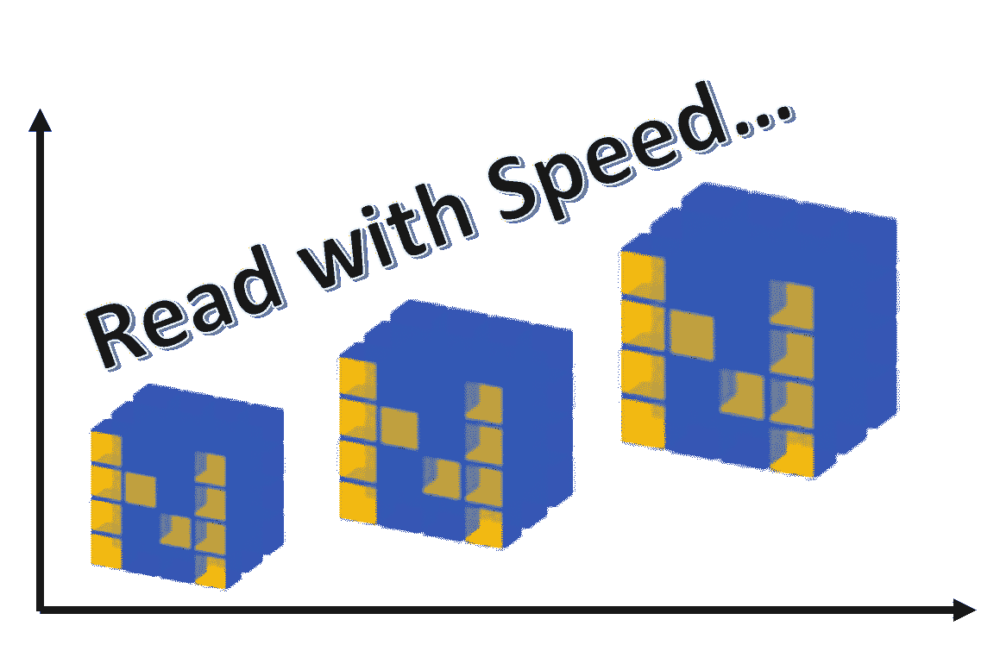
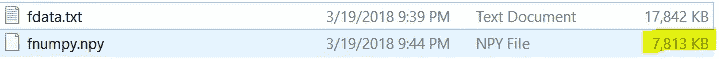

# 为什么你应该开始使用。npy 文件更频繁…

> 原文：<https://towardsdatascience.com/why-you-should-start-using-npy-file-more-often-df2a13cc0161?source=collection_archive---------1----------------------->

## 数据科学/机器学习需要数据的快速计算和转换。Python 中的原生 NumPy 对象提供了优于常规编程对象的优势。它的工作就像从磁盘上的文件中读取数字数据集一样简单。我们用几行代码展示了它的优势。



## 介绍

N umpy，简称[数值 Python](http://numpy.org) ，是 Python 生态系统中高性能科学计算和数据分析所需的基础包。它是几乎所有高级工具如[熊猫](https://pandas.pydata.org)和 [scikit-learn](http://scikit-learn.org/) 的基础。 [TensorFlow](https://www.tensorflow.org) 使用 NumPy 数组作为基本的构建模块，在此基础上他们构建了用于深度学习任务的张量对象和 graphflow(在长列表/向量/数字矩阵上大量使用线性代数运算)。

已经有很多文章展示了 Numpy 数组相对于普通 Python 列表的优势。在数据科学、机器学习和 Python 社区中，您会经常遇到这样的断言:Numpy 的速度要快得多，这是因为它的矢量化实现以及它的许多核心例程都是用 C 语言编写的(基于 [CPython 框架](https://en.wikipedia.org/wiki/CPython))。这确实是真的([这篇文章很好地展示了使用 Numpy 可以使用的各种选项](http://notes-on-cython.readthedocs.io/en/latest/std_dev.html)，甚至可以使用 Numpy APIs 编写基本的 C 例程)。Numpy 数组是同构类型的密集数组。相反，Python 列表是指向对象的指针数组，即使它们都是同一类型。你得到了[参考位置](https://en.wikipedia.org/wiki/Locality_of_reference)的好处。

[***在我的一篇被大量引用的关于走向数据科学平台***](/why-you-should-forget-for-loop-for-data-science-code-and-embrace-vectorization-696632622d5f) 的文章中，我展示了使用 Numpy 向量化操作相对于传统编程结构(如 *for-loop* )的优势。

> 然而，不太为人所知的是，当涉及到从本地(或网络)磁盘存储中重复读取相同数据时， **Numpy 提供了另一个名为。npy 文件格式**。这种文件格式使得**的阅读速度比从纯文本或 CSV 文件中阅读**快得多。

问题是——当然，您第一次必须以传统方式读取数据，并创建一个内存中的 NumPy `ndarray`对象。但是如果您使用同一个 CSV 文件来重复读取相同的数字数据集，那么将`ndarray`存储在`npy`文件中，而不是从原始 CSV 文件中一遍又一遍地读取它，这是非常有意义的。

## 这是什么？NPY 文件？

这是一种标准的二进制文件格式，用于在磁盘上保存单个任意的 NumPy 数组。该格式存储了正确重建数组所需的所有形状和数据类型信息，即使在另一台具有不同体系结构的计算机上也是如此。在实现其有限目标的同时，格式被设计得尽可能简单。该实现是纯 Python 的，并作为主 NumPy 包的一部分分发。

该格式必须能够:

*   表示所有 NumPy 数组，包括嵌套的记录数组和对象数组。
*   以本机二进制形式表示数据。
*   包含在一个文件中。
*   在不同架构的机器上存储重建数组所需的所有信息，包括形状和数据类型。小端和大端数组都必须得到支持，具有小端编号的文件将在任何读取该文件的机器上生成小端数组。这些类型必须根据它们的实际大小来描述。例如，如果具有 64 位 C“long int”的机器写出具有“long int”的数组，则具有 32 位 C“long int”的读取机器将产生具有 64 位整数的数组。
*   被逆向工程。数据集通常比创建它们的程序存在的时间更长。一个有能力的开发人员应该能够用他喜欢的编程语言创建一个解决方案，来阅读他得到的没有多少文档的大多数 NPY 文件。
*   允许数据的内存映射。

## 使用简单代码进行演示

和往常一样，你可以从我的 [Github 库](https://github.com/tirthajyoti/PythonMachineLearning)下载[样板代码笔记本](https://github.com/tirthajyoti/PythonMachineLearning/blob/master/Pandas%20and%20Numpy/Numpy_Reading.ipynb)。这里我展示了基本的代码片段。

首先，读取列表中的 CSV 文件并将其转换为 ndarray 的常用方法。

```
import numpy as np
import time**# 1 million samples**
n_samples=1000000**# Write random floating point numbers as string on a local CSV file**
with open('fdata.txt', 'w') as fdata:
    for _ in range(n_samples):
        fdata.write(str(10*np.random.random())+',')**# Read the CSV in a list, convert to ndarray (reshape just for fun) and time it**
t1=time.time()
with open('fdata.txt','r') as fdata:
    datastr=fdata.read()
lst = datastr.split(',')
lst.pop()
array_lst=np.array(lst,dtype=float).reshape(1000,1000)
t2=time.time()print(array_lst)
print('\nShape: ',array_lst.shape)
print(f"Time took to read: {t2-t1} seconds.")>> [[0.32614787 6.84798256 2.59321025 ... 5.02387324 1.04806225 2.80646522]
 [0.42535168 3.77882315 0.91426996 ... 8.43664343 5.50435042 1.17847223]
 [1.79458482 5.82172793 5.29433626 ... 3.10556071 2.90960252 7.8021901 ]
 ...
 [3.04453929 1.0270109  8.04185826 ... 2.21814825 3.56490017 3.72934854]
 [7.11767505 7.59239626 5.60733328 ... 8.33572855 3.29231441 8.67716649]
 [4.2606672  0.08492747 1.40436949 ... 5.6204355  4.47407948 9.50940101]]>> Shape:  (1000, 1000)
>> Time took to read: **1.018733024597168 seconds**.
```

这是第一次阅读，无论如何你都要做。*但是如果您可能会多次使用同一个数据集*，那么，在您的数据科学过程完成之后，不要忘记在**中保存 ndarray 对象。npy**格式。

`**np.save('fnumpy.npy', array_lst)**`

因为如果你这样做了，下一次，从磁盘读取将会非常快！

```
t1=time.time()
array_reloaded = np.load('fnumpy.npy')
t2=time.time()print(array_reloaded)
print('\nShape: ',array_reloaded.shape)
print(f"Time took to load: {t2-t1} seconds.")>> [[0.32614787 6.84798256 2.59321025 ... 5.02387324 1.04806225 2.80646522]
 [0.42535168 3.77882315 0.91426996 ... 8.43664343 5.50435042 1.17847223]
 [1.79458482 5.82172793 5.29433626 ... 3.10556071 2.90960252 7.8021901 ]
 ...
 [3.04453929 1.0270109  8.04185826 ... 2.21814825 3.56490017 3.72934854]
 [7.11767505 7.59239626 5.60733328 ... 8.33572855 3.29231441 8.67716649]
 [4.2606672  0.08492747 1.40436949 ... 5.6204355  4.47407948 9.50940101]]>> Shape:  (1000, 1000)
>> Time took to load: **0.009010076522827148 seconds**.
```

如果您想以其他形式加载数据，这并不重要，

```
t1=time.time()
array_reloaded = np.load('fnumpy.npy').**reshape(10000,100)**
t2=time.time()print(array_reloaded)
print('\nShape: ',array_reloaded.shape)
print(f"Time took to load: {t2-t1} seconds.")>> [[0.32614787 6.84798256 2.59321025 ... 3.01180325 2.39479796 0.72345778]
 [3.69505384 4.53401889 8.36879084 ... 9.9009631  7.33501957 2.50186053]
 [4.35664074 4.07578682 1.71320519 ... 8.33236349 7.2902005  5.27535724]
 ...
 [1.11051629 5.43382324 3.86440843 ... 4.38217095 0.23810232 1.27995629]
 [2.56255361 7.8052843  6.67015391 ... 3.02916997 4.76569949 0.95855667]
 [6.06043577 5.8964256  4.57181929 ... 5.6204355  4.47407948 9.50940101]]

>> Shape:  **(10000, 100)**
>> Time took to load: **0.010006189346313477 seconds.**
```

事实证明，至少在这种特殊的情况下，磁盘上的文件大小对于。npy 格式。



## 摘要

在本文中，我们演示了使用原生 NumPy 文件格式的效用。npy over CSV，用于读取大型数值数据集。如果需要多次读取同一个 CSV 数据文件，这可能是一个有用的技巧。

点击阅读更多关于这种文件格式的细节。

*喜欢这篇文章吗？成为* [***中等会员***](https://medium.com/@tirthajyoti/membership) *继续* ***无限制学习*** *。如果您使用下面的链接，* ***，我将收取您的一部分会员费，而不会对您产生额外费用*** *。*

[](https://medium.com/@tirthajyoti/membership) [## 通过我的推荐链接加入 Medium—Tirthajyoti Sarkar

### 作为一个媒体会员，你的会员费的一部分会给你阅读的作家，你可以完全接触到每一个故事…

medium.com](https://medium.com/@tirthajyoti/membership)