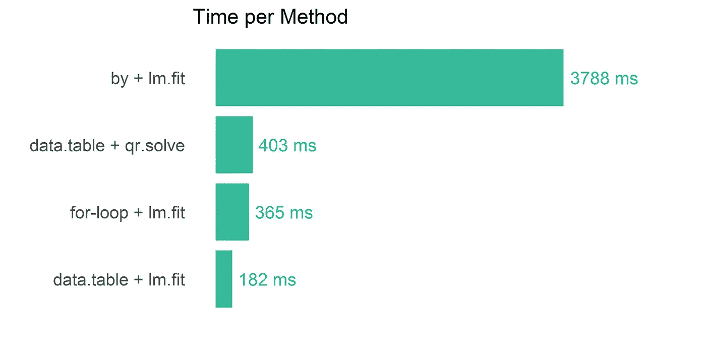

# 为什么您仍然应该考虑 R 中的老式 For 循环

> 原文：<https://towardsdatascience.com/why-you-should-still-consider-good-old-fashioned-for-loops-in-r-6f2f9d0db14a?source=collection_archive---------5----------------------->


当我第一次开始使用 R 时，我对这种语言的计算效率(速度)有点失望。这并不会妨碍大多数数据科学家，但对于生产代码或大型数据集来说就不那么好了。然而，就像生活中的许多事情一样，为了让 R 做你想做的事情，你需要更加努力地工作，走出普通的道路。

在之前的一篇文章中，我比较了四种不同编程语言中拆分-应用-合并原理的时间，在几次尝试之后，R 实际上在我的用例中名列前茅。最好的结果是使用了 data.table 包，它主要是在 Rcpp(R 的 c++接口)中构建的。

有趣的是，我现在正与另一位工程师合作，在我们的一个商业包中实现一种分割-应用-组合的方法，使用 R 中的预开发代码来快速地在客户那里得到东西(持续开发等等)。不幸的是，我们被告知不能使用 GNU GPL 开源许可。

这意味着:

*   没有数据。表:(
*   没有 dplyr:(
*   没有使用有效的 Rcpp 代码…

# 现在怎么办？

没有这些精美的软件包，数据科学家应该做些什么呢？什么都要自己写？以 R 为基数？哦不！这是一场噩梦，对吗？但是，事实证明，你学到了 r 基的一些有趣的方面。

所以我还是要速度。我的应用程序肯定不会成为瓶颈。绝对不会。我代表质量。代替这种用户体验的是:

*点击开始按钮。预计计算时间:15 分钟。“唉，我再去喝一杯咖啡。”*

我更喜欢这种用户体验:

*点击。嗖嗖。完成了。“嘿，这个漂亮的图表在这里做什么？”*

因此，我的一般规则是:“当我的算法运行时，顾客不能喝咖啡。”幸运的是，我的同事也有同样的想法，显然他甚至牺牲了对经理的好感，在代码优化上花时间。所以我觉得这将是一次有趣的合作。

那么我们如何获得速度呢？一般你用众所周知的互联网智慧。这是 R 中宣扬的主要范式:

你不应该使用 for 循环！您应该使用应用功能！

并不总是对的…

我喜欢函数式编程，但有时你必须尝试什么最有效。在 base R 中，对数据帧中的每个组应用操作的默认方法是函数`by`。最重要的是，R 中典型的线性建模接口是`lm`。将这两个功能结合起来，在一个简单的用例上的计时超过 9 秒(在更现实的情况下，打哈欠、喝咖啡会很快达到几分钟)。我可以用基 R 函数把它降低到 0.4 秒。这是超过 25 倍的改进！

# 我们是如何加快速度的？

函数`lm`很慢，因为它进行字符串解释和许多其他计算，使用户的生活更容易。假设您有一个包含 A、B 和 Z 列的数据框架，那么通常情况下，您会对多项式回归进行如下操作:

```
**# The easy way of modeling**
model <- lm(Z ~ poly(A, B, degree=3, raw=TRUE), data = df)
```

比`lm`更快的方法是手动处理线性代数。在我之前的文章中，我使用了一个 QR 分解器，但是我的同事发现内部的`.lm.fit`功能甚至比它快两倍(我们有一点竞争)。对于那些不熟悉线性代数的人来说，这里最难的部分是为你的问题定义模型矩阵。

```
**# The harder way, first construct a model matrix**
M <- cbind(A*0+1, A, B, A*B, A², A²*B, B², A*B², A³, B³)

**# Then do the fit**
model <- .lm.fit( M, Z )
```

随着建模速度的提高，我们现在可以看看如何处理`by`功能。这个函数很慢，因为它在内部进行了大量的数据转换，一直在分配新的内存，这是完全没有必要的。最后，您会得到每个组的结果列表，您需要再次取消列表，这又是一次内存分配。这很容易改进。



A comparison of some of the results. I’m not even showing `by + lm`, that’s off the chart at 9 seconds.

`by`的另一种选择是 data.table，但不幸的是我们不能使用它。所以下一个最好的方法是一个简单的 for 循环！我们发现矩阵是循环中最快的索引数据类型，这是线性代数所需要的。为了让事情进展得更快，只要确保不要创建太多不必要的变量，尤其是避免将事情转换成列表。

对于那些喜欢钻研代码的人，我已经在我的 github 库中添加了一个关于这个主题的[单 R 脚本](https://github.com/matthijscox/many-models/blob/master/many_models_forloop.R)。

# 结论

结合所有这些改进和其他代码优化，我的同事成功地将一个典型用例的 5 分钟计算时间减少到了 2 秒钟！这是一个伟大的结果！现在的瓶颈在于数据加载，这仍然需要大约一分钟的时间，我们目前没有能力解决这个问题。但是总的来说没有时间再喝咖啡了！

因此，如果您正面临一些数据科学或编码问题，不要忘记尝试违背常规实践的方法！