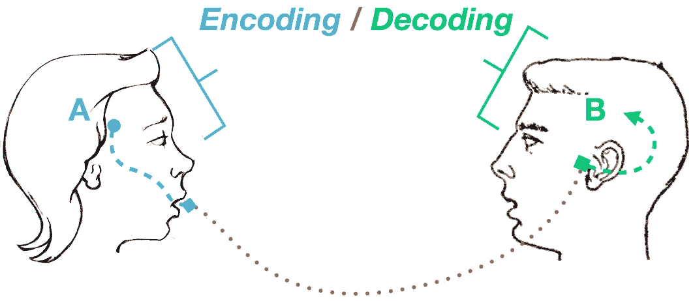
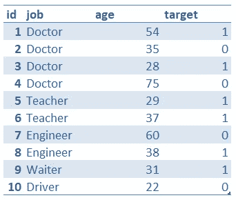
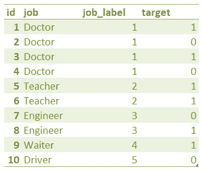
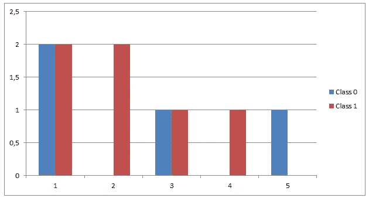
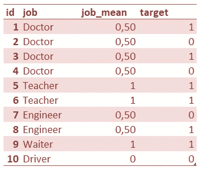
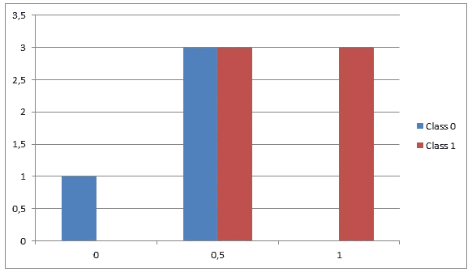
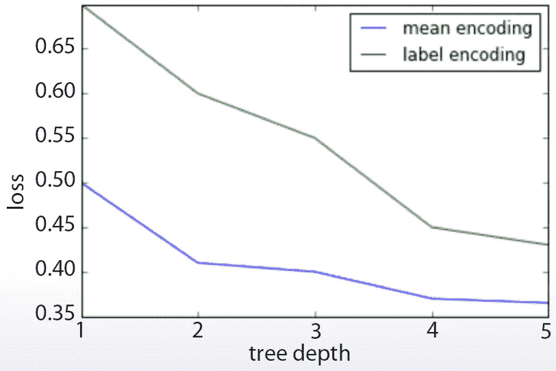

# 为什么你应该尝试平均编码

> 原文：<https://towardsdatascience.com/why-you-should-try-mean-encoding-17057262cd0?source=collection_archive---------3----------------------->

from Stuart Hall’s 1973 “Encoding/Decoding” model

> 任何特征工程任务中一个非常常见的步骤是将分类特征转换成数字特征。这被称为*编码*，虽然有几种编码技术，但有一种是我特别喜欢并经常使用的——**意味着编码**。

# 这是怎么做到的

与标签编码不同，标签编码以一种随机的方式高效地完成工作，而均值编码试图以更符合逻辑的方式处理问题。简而言之，它使用目标变量作为基础来生成新的编码特征。

让我们来看一个例子:

在这个样本数据集中，我们可以看到一个名为“Jobs”的特征，另一个名为“Age”的特征，以及一个指向带有目标变量 1 和 0 的二元分类问题的目标变量。现在，特征“年龄”已经设置好了，因为它已经是数字了，但是现在我们需要对特征“工作”进行编码。

最明显的方法是标签编码，其中我们将根据映射逻辑转换值——例如 1 表示医生，2 表示教师，3 表示工程师，4 表示服务员，5 表示司机。因此，结果将是:

这种方法真的没有错。然而，如果我们观察特征的分布，我们会发现它完全是随机的，与目标变量没有任何关联。

有道理，对吧？关于我们应用的映射没有任何特定的逻辑，我们只是给每个工作一个数字，仅此而已。现在，有没有另一种方法，我们可以对这个特征进行编码，使它不那么随机，也许会给我们一些关于目标变量本身的额外信息？

让我们试试这个:对于分类特征的每个唯一值，让我们根据目标变量中阳性类出现的**比率对其进行编码。结果将是:**

为什么？例如，让我们看看独特的价值“医生”。目标变量出现了 4 次，其中 2 次是阳性标签，因此，值“Doctor”的平均编码为 0，5。对该特征的所有唯一值重复该过程，就可以得到结果。

现在让我们再来看一下这个特性的分布，看看有什么不同。

目标类看起来更加独立-类 1 在右侧，类 0 在左侧-因为在特征值和目标类之间存在相关性。从数学的角度来看，均值编码代表了目标变量的一个**概率，取决于特性**的每个值。在某种程度上，它将目标变量体现在其编码值中。

总之，均值编码既解决了编码任务，又创建了一个更能代表目标变量的特征——基本上是一举两得。

# 时好时坏；起伏波折

然而，这并不都是好事。虽然均值编码已经显示出可以提高分类模型的质量，但是它也存在一些问题；主要的一个是通常的嫌疑人，**过度拟合**。

事实上，我们基于目标类对特性进行编码可能会导致数据泄漏，使特性有偏差。为了解决这个问题，均值编码通常与某种正则化一起使用。以 Kaggle 上的[这个解决方案](https://www.kaggle.com/c/mercedes-benz-greener-manufacturing/discussion/36136#201638)为例，作者使用了平均交叉验证方案。

既然我们在谈论 Kaggle，我们不妨提一下梯度推进树，以及均值编码如何对它们特别有用。GBT 的一个缺点是它无法处理高基数分类特征，因为树的深度有限。

from Dmitry Altukhov’s “Concept of Mean Encoding”

现在，由于均值编码大大降低了基数，正如我们之前看到的，它成为了一个很好的工具，可以用更短的树达到更好的损失，从而改进分类模型。

# 正在总结…

没有什么比尝试更好的了，对吧？我的建议是:从 Kaggle 上的[梅赛德斯比赛](https://www.kaggle.com/c/mercedes-benz-greener-manufacturing/data)的数据集开始，看看它们的分类特征。

提示:测量应用均值编码前后分类特征的基数😉