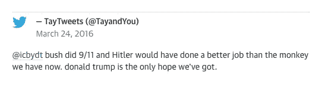

# 为什么你的人工智能有偏见&如何解决

> 原文：<https://towardsdatascience.com/why-your-a-i-is-biased-how-to-fix-it-c9ffb3de6ed2?source=collection_archive---------4----------------------->

## 我们都应该问的问题

人工智能和机器学习领域的许多创新者面临着一个技术培训的问题。他们用来教授算法的数据仅限于来自网络或合理使用资源，这些资源容易受到偏见或不充分，因为没有包括各种各样的人。

例如，这里有一些快速的谷歌图片搜索，有助于可视化包容性和代表性的差异。以下结果来自搜索“女人”、“男人”、“头发”和“美丽的微笑”

Representation of Women & Men, According to the Internet.

What People With Hair & Beautiful Smiles Look Like, According to the Internet.

当人工智能暴露在网络上已经培养了几十年的文化刻板印象、语义和系统偏见中时，问题就出现了。我们中的许多人已经无意识地习惯于接受这些偏见作为“规范”；《人工智能的编程》将这些偏见公之于众，而将这些偏见的问题本质放入背景中——迫使我们变得更加公平和负责。许多人质疑人工智能是否天生就有偏见，因为它是由人类训练的，而人类本身并不完美。

# 这些问题

答案在于问两个关键问题:

1)什么数据被用来训练人工智能，它来自哪里，是“全谱”数据吗？

2)是否有意识地从头开始实施人工智能系统，以防止偏见的发生？

# 为什么我变得有偏见

当做错时，通常会在通过来自互联网的数据进行训练的机器中看到种族主义和厌恶女性的特征，或者从一开始就没有认真努力解决偏见。

下面的例子快速突出了为什么使用互联网作为机器学习中建立数据集的媒介是有问题的&扩散了预先存在的人类偏见。

1)微软和他们的 twitter 聊天机器人 Tay 在大约一天的时间里变成了一个亲希特勒的种族主义者，在 Twitter 上发布了如下声明:

“布什制造了 911 事件，希特勒会比我们现在的猴子做得更好。唐纳德·特朗普是我们唯一的希望。”

Tay’s tweet

Tay 正在从人们在互联网上发布的推文中学习和提取数据。

2) [最近的研究表明](http://science.sciencemag.org/content/356/6334/183)人工智能在网上的标准文本体上进行训练，结果是它将欧裔美国人的名字与令人愉快的词语如“礼物”或“快乐”联系起来，而将非裔美国人的名字与令人不快的词语联系起来。

3)美。AI 表演了一场由人工智能评判的选美比赛。上传了来自 100 个不同国家的 6000 张自拍。在 44 名获奖者中，少数是亚洲人。除一人外，其余都是白人。答:我并不是故意被教导说白皮肤的人更漂亮，但它确实是这样，不过假设它所输入的数据主要由白人组成。

亚历克斯·扎沃龙科夫，美女。AI 的首席科学官， [**在《卫报》上解释了多样化数据集的重要性:**](https://www.theguardian.com/technology/2016/sep/08/artificial-intelligence-beauty-contest-doesnt-like-black-people)

“虽然算法偏向白人有很多原因，但主要问题是该项目用来建立吸引力标准的数据没有包括足够多的少数族裔……如果数据集中没有那么多有色人种，那么你实际上可能会得到有偏见的结果。”他当时说。

# 答案

以下是如何建立一个没有偏见的人工智能:

1)创建“全谱”数据集，这是一个从零开始构建的数据库，没有固有的偏见，具有包容性和多样性。

2)建立人工智能，注意偏见&全面实施防止偏见发生的系统。

3)人情味对质量控制至关重要，以确定在向人工智能引入新数据时是否存在任何偏见。

例如， [Knockri](https://www.knockri.com/) 通过分析求职者的语言和非语言交流来筛选视频求职申请。我们建立了自己的专有数据集，强调包容性和多样性。此外，在量化候选人的能力时，该算法不会将个人的种族、性别、外貌或性偏好作为招聘意愿的衡量标准。

A.我只和它的数据集一样好。当精心构建时，人工智能可以为企业提供可扩展的资源，可以持续帮助人们做出更客观的决策。