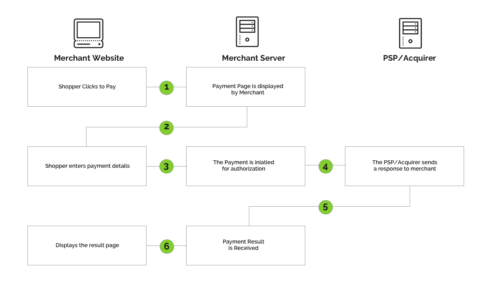
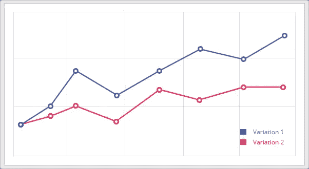
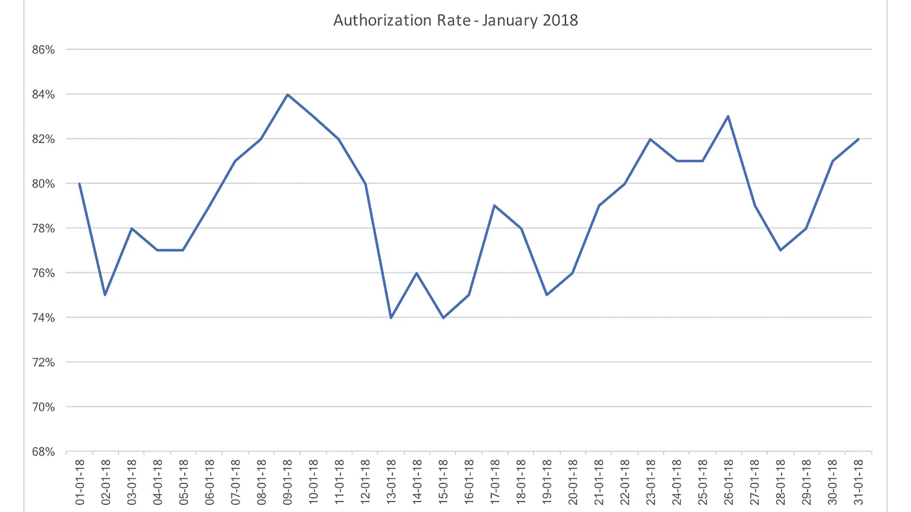

# 为什么你的授权率是后 PSD2 时代的一个衡量标准

> 原文：<https://towardsdatascience.com/why-your-authorization-rate-is-the-one-metric-to-measure-in-a-post-psd2-world-bc7c441af9f2?source=collection_archive---------2----------------------->

如果你有一家电子商务公司，每天要处理成百上千的交易，你应该问自己的问题是:

> 我的授权率是多少？

## 授权率是多少？

对于 PSP 和收单机构来说，授权率是最重要的指标之一，因为它通过跟踪所有提交交易中授权交易的数量，提供了对其平台性能的洞察。

在传统的电子商务支付流程中，购物者表示她想要“结帐”她的商品。她向商家提供她的信息，这些信息或者存储在商家的数据库中，来自以前的交易，或者在结账过程中提供。购物者继续选择支付方式并通过支付流程。

E-Commerce Payment Flow

对于提交给处理者的每一笔提交的交易，发行者可以**授权**或**拒绝**交易。因此，为了计算授权率，我们使用以下公式:

> ((授权交易)/(授权交易+拒绝交易))* 100 =授权率

例如，如果我们处理了 800 笔授权交易和 200 笔拒绝交易，授权率将为:

> ((800)/(800+200))*100 = 80%授权率

我之所以认为电子商务企业应该跟踪他们的授权率，是因为 ***授权率越低，对你的业务造成的财务伤害就越大*** 。

例如，如果您的授权率为 80%，这仍然意味着您的交易有 20%被拒绝，这意味着您无法收集和处理订单。当然，许多客户会再次尝试或使用不同的支付方式，但对于那些不这样做的客户来说，这意味着您正在失去收入，因为您的 PSP/收单机构无法处理您的交易或向您提供有关交易无法完成的原因的相关信息。

## 一个重要的指标

在[精益分析](http://leananalyticsbook.com/)中，作者 Alistar Croll 和 Benjamin Yoskovitz 讨论了一个重要的指标(OMTM)。《精益创业》的作者 Eric Reis 谈到了推动增长的三个引擎:粘性引擎、病毒引擎和付费引擎。虽然所有公司都使用每种引擎，但他警告说，一次只关注一种引擎。在分析和数据的世界里，这意味着选择一个你要跟踪的单一指标，来改进你正在经历的阶段。这就是 Croll 和 Yoskovitz 所说的一个重要的度量标准。

在支付领域，有许多指标可以跟踪，如交易、收入或退款。我之所以建议你应该开始跟踪授权率，是因为这是这个过程中你唯一不能完全控制的部分，但对你的底线影响最大。因此，无论你是处于启动(粘性引擎)、增长(病毒引擎)还是维持(付费引擎)阶段，跟踪你的 PSP 的表现对你的支付成功至关重要。

## 衡量和比较

如果购物者正在浏览您的网站，但没有将商品添加到购物车中，您可以 A/B 测试包括定价、图片和文案在内的变量。如果购物者正在向购物车中添加商品，但没有继续结账，您可以添加弹出窗口或电子邮件提醒来完成他们的购买。如果购物者正在结账，但在过程中中止，你可以增加页面数量或分散注意力，以帮助他们完成交易。但是当你将交易提交给你的 PSP/收单机构时，你就无能为力了，因为授权或拒绝完全取决于 PSP 或收单机构如何处理你的交易。这就是为什么我总是建议商家跟踪他们的 PSP/收购方的表现，并定期与其他 PSP/收购方进行比较。要么通过实施两个不同的 PSPs 收单机构并进行定期 A/B 测试，要么使用行业基准来比较它们的授权率。

A/B Testing Variations

## PSD2 将如何影响我的授权率？

随着[支付服务指令](https://en.wikipedia.org/wiki/Payment_Services_Directive) (PSD2)的出台，我相信授权率将是受影响最大的一个指标，除非商家采取适当的行动。

作为 PSD2 的一部分，强客户身份验证将适用于欧盟境内的在线支付，特别是当 PSP/收单机构和购物卡发行机构都位于欧盟境内时。

强客户身份认证将要求使用以下至少两个独立要素对在线支付进行身份认证:

1.  **只有客户知道的东西** *(例如:只有客户知道的密码、PIN 或代码)*
2.  **只有客户拥有的东西** *(例如:实体卡、手机或硬件令牌生成器)*
3.  **客户身份** *(例如:指纹、虹膜扫描或面部识别等生物特征)*

随着 [Apple Pay](https://www.apple.com/apple-pay/) 和 [Google Pay](https://www.android.com/pay/) 的推出，许多银行已经实施并积极使用 3D Secure、master card Secure code 或 Visa Verified 来减少欺诈，购物者可以选择通过移动或桌面进行支付认证，而本地支付方式，如 [iDeal](https://www.ideal.nl/) 、 [SOFORT](https://www.sofort.com) 和 [Bancontact](https://www.bancontact.com/) 已经在使用多因素认证。

*但是在支付流程中增加更多的步骤，会导致支付流程中更多的摩擦和更高的放弃率，从而导致更多的拒绝交易，从而降低授权率*。

## 如何开始跟踪我的授权率？

大多数 PSP 对你的授权率提供很少的洞察力，尤其是如果他们没有任何方法来控制或影响它。因此，如果您无法下载报告或使用分析套件来跟踪授权率，我建议您采取以下措施:

1.  **跟踪您的结账会话**(每次购物者使用您的网络分析点击结账，例如[谷歌分析](https://www.google.com/analytics)或 [KissMetrics](https://www.kissmetrics.com/) )
2.  **跟踪你的 WebHook 会话**(每次购物者返回你的感谢或支付失败页面)
3.  **跟踪您的成功付款**(根据您的 PSP，每笔授权/成功付款)

由于 PCI 合规性，您无法将 Web 分析添加到支付页面，跟踪结账会话，为您提供客户想要结账的次数的良好指示。

可以跟踪 WebHook 会话，并让您很好地了解成功或失败的会话数量。

要验证已启动的结帐会话数以及成功/失败的会话数，您可以将其与成功付款数进行比较。

根据您的业务模式(直销、订阅)、购物卡的发行方、PSP 和/或收单机构以及其他几个变量，授权率可以在 70%到 95%之间。通过每天跟踪您的授权率，您可以创建一个仪表板，让您更好地了解实际获得授权的交易百分比，并能够真正了解您的 PSP/收单机构的表现。

Authorization Rate Dashboard

## 感谢阅读；)，如果你喜欢它，请点击下面的掌声按钮，这对我意义重大，也有助于其他人了解这个故事。还添加了关注按钮，以接收我的每周博客。