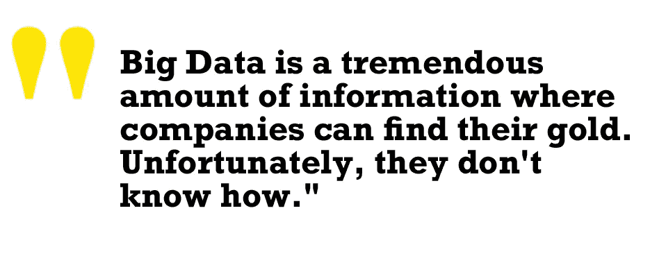
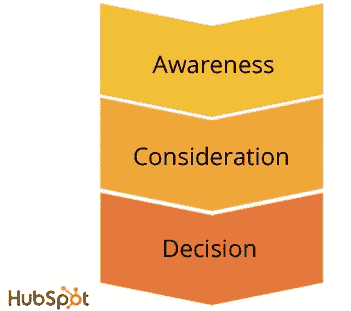
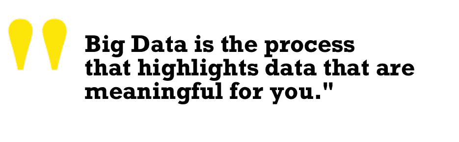

# 为什么您的公司应该关注大数据

> 原文：<https://towardsdatascience.com/why-your-company-should-care-about-big-data-2196423a45dd?source=collection_archive---------3----------------------->

Photo by [Gamze Bozkaya](https://unsplash.com/@gamzebozkaya?utm_source=medium&utm_medium=referral) on [Unsplash](https://unsplash.com?utm_source=medium&utm_medium=referral)

【**免责声明**:本文旨在提出“大数据”概念背后的基本思想。我想帮助人们熟悉它。这不是一种技术方法，所以我想否认在技术方面可能缺乏准确性。我不是技术人员，也不是数据科学家，而是企业家。其他比我更好的人可以在技术方面提供帮助。我想提供一个不同的，更“普通人”的观点。]

# 什么是“大数据”

你不讨厌周围人用流行语吗？它可能是“大数据”、“人工智能”或“数字自动化”。你点头，我很确定，对自己说:“新技术听起来很棒，但它们对我有什么帮助？

有恐惧，有怀疑，有许多问题注定没有答案。

你认为有人能告诉你什么对你更好吗？绝不！甚至你的父母，你的母亲，你的爱人都不能这样做！你是唯一能为自己做决定的人。

其实不是这样的。

是的，有人(或某物)可以知道，在某些情况下比你更清楚，什么是最好的决定。

人工智能可以做到这一点。它可以帮助你做决定。

你可以用其他数十亿人产生的数据来支持你所做的事情。

根据一个古老但仍然有效的定义，Gartner 这样定义“大数据”:

> 大数据是高容量、高速度和/或高多样性的信息资产，需要经济高效、创新的信息处理形式来增强洞察力、决策制定和流程自动化。— [高德纳公司](https://www.gartner.com/it-glossary/big-data)

让我更好地解释它。

# 大数据是高容量的

**充分接触许多不同的经历引起高音量。**

此外，我们做的各种互动，例如，在网上购买商品，导致高容量。今天你几乎可以追踪任何事情。

想想你自己在网店给宝宝买婴儿食品和纸尿裤。你的基本客户旅程是什么？

你上电子商务。
您过滤产品并选择您的偏好。
有优惠，所以你看买不同的数量，或者大小，可以省钱。
您登录或注册网站。
您用您的送货地址和信用卡信息完成订单。

通过简单的购买，您已经产生了大量的结构化和非结构化数据。
**人口统计数据**，例如，年龄、性别、地理区域、收入。**心理数据**:推动你购买的偏好、价值观和动机。

你购买过有机食品吗？你是一个关心宝宝健康的人，认为有机食品更贵但更好。

你订购可洗尿布了吗？你也关注环境，想要为拯救地球做出贡献。

你的地址靠近高污染区吗？或者，你住在乡下吗？
所有这些数据，应用于不同的人、产品、来源，达到难以置信的高容量。

# 大数据是高速的

让我们坚持婴儿食品采购的例子。

是你第一次做这种订单，你想为你的宝宝做好。

在你继续之前，你需要更多的信息。传统上，你必须从一个商店搬到另一个商店。你得比较产品。你求推荐。你向你的朋友、你的妈妈、你的岳母寻求意见，关于什么对你更好。与此同时，你们也讨论烟雾、污染和其他话题。

这是一种缓慢的信息收集方式，而且你只能收集到一些观点。

**多亏了科技，你可以追踪更多信息，让它们更容易获取。**

# 大数据种类繁多

**平行行动追踪任何事物的无限可能性，造成高音量。也造成了高品种。**

让我们展望未来，完成我们的婴儿食品购买示例。

当你在一家网上商店购物时，你会比较另一家商店的价格和报价。在另一个浏览器窗口，你可以在育儿博客上寻找建议。在一个社交网络群上，你寻找相似的经历。同时，你会收到你通常订阅的时事通讯。你会读到农业中杀虫剂的风险，空气质量水平，绿色习惯。

这些信息来自不同的来源，社交网络，视频，传感器。

你从一条信息跳到另一条，拓宽了你的可能性。

# 好，我有大数据，现在呢？

> "大数据分析检查大量数据，揭示隐藏的模式、相关性和其他见解."— [SAS](https://www.sas.com/it_it/insights/analytics/big-data-analytics.html)

让我们来完成我们的婴儿食品购买体验。

大数据分析系统可以匹配你的订单历史、其他客户行为、你的环保态度、你的地址等等。在此基础上，它可以建议你为你的家买一个空气过滤器。

你喜欢乡村。也许两三年后，你会搬到那里去。在未来，你孩子已经会走路了，你不再需要婴儿食品和尿布了。

**系统发现隐藏模式和相关性。它能发现你生活中的变化，以及你过去和现在的偏好。所以，它建议你买一辆自行车。更重要的是，它建议你为你和你的小男孩/女孩准备一辆自行车，现在可以和你一起跑了。**

**得益于大数据分析，建议成为可能。这是一个突出对您有意义的数据的过程。**

# 大数据和数字自动化的优势

让我用一句有意义的话来介绍使用大数据的好处:

> “企业希望获得数字化和自动化带来的好处，但他们并不总是信任驱动这些机器的底层分析。”— Ryan Rozich 在“[为什么人工智能和内容比人工和机器更重要](http://www.martechadvisor.com/articles/machine-learning-amp-ai/why-artificial-intelligence-and-content-is-more-than-manual-versus-machine/)

人们和公司对大数据以及人工智能持怀疑态度。

> 怀疑来源于复杂性。
> 
> 我们必须提取复杂性，以便您可以更好地运营您的业务。

**我们必须将大数据视为帮助我们完成任务的标准工具，就像厨房里的微波炉帮助我们烹饪食物一样。**

我们身边到处都有大量使用这些算法的合适例子。让我们看看大数据分析可以改善我们业务的 5 个方面。

# 大数据分析可以改善我们业务的 5 个方面

# 更好的决策

大数据分析有助于组织收集过去和新的信息，找出相似的模式。

Photo by [Jacek Dylag](https://unsplash.com/@dylu?utm_source=medium&utm_medium=referral) on [Unsplash](https://unsplash.com?utm_source=medium&utm_medium=referral)

这个操作是有帮助的。**它让人们对成功的决策和碰壁的决策一目了然。**

大数据和人工智能也有助于对比过去和现在。

像往常一样，让我们举个例子。

你喜欢啤酒吗？

想象你生产啤酒。您正在跟踪您的每个卖点的分销和消费情况。

使用大数据分析，你会发现哪些是最好的销售期，哪些是最差的销售期。你可以衡量最好和最差的分销商。你可以根据不同的时间和地点来组织生产和销售。您可以高效地节省时间和金钱。

**借助基于经验和市场预测的策略，您可以做出更好的数据驱动型决策。更明智地使用数据，您可以通过更高效的运营推动业务向前发展。**

> **更好的决策=降低成本**

不仅如此，你还可以发现新的机会。

# 发现新的机会

你也可以通过考虑新的额外变量来追踪啤酒消费的差异。

你是否有一个考虑到当地气候的分配计划？或者，当地的人口统计？有一个经销商最服务于家庭或当地超市？一个最服务于酒吧？

**根据不同的模式，使用数据驱动的信息创建差异化的分销计划。**

决策可以反映客户的需求或价值。例如，为家庭服务的当地超市的淡啤酒。

你有更高的利润和更满意的顾客。

““We like you too :)” written on a white brick wall” by [Adam Jang](https://unsplash.com/@adamjang?utm_source=medium&utm_medium=referral) on [Unsplash](https://unsplash.com?utm_source=medium&utm_medium=referral)

你还会发现缺乏对顾客需求的覆盖。客户特性是用来满足他们的。

你甚至可以发现一个尚未覆盖的利基。

听起来这可能是一个新的可爱产品的起点。

他们有价值。你和你的企业获得了价值。

> 新机会=新收入

# 节省时间

**利用大数据，你可以找到更有效的做事方法。**

例如:

*   书籍需要没有错别字，配有索引和参考书目。
*   管理者必须为利益相关者收集财务数据。

**重复的过程耗费大量资金。**

自动化，一个索引，一个书目，一个财务报告，今天更容易得到。建立良好的大数据分析和训练有素的人工智能系统。

> 节省时间=降低成本

# 主动面对市场

**利用大数据，您可以优化营销工作。**

举几个例子:

*   **细分**你的 CRM 数据，你可以比你的竞争对手更快地推出新的产品。
*   **分析**趋势对话，您可以锁定特定的客户群。跨越数据和应用人工智能你可以支持个性化策略。
*   所以，你给了你的销售部门一个竞争优势。

他们更好地以正确的方式和定制的报价接近正确的潜在客户。

这种策略非常适合银行，所以他们会根据市场变化更新报价。

这种策略对于专业卖家来说非常有效，可以从他们的营销和销售漏斗中获取价值。

> 积极=新收入

# 以客户为中心

积极主动的市场策略也带来了以客户为中心的个性化策略。

> 大数据分析和人工智能一起重塑了这个行业。

甚至传统的呼叫中心活动也可以利用这些技术。

如果你能更好地预测客户对报价的反应呢？

数字自动化系统:

*   分析历史数据。
*   将它们与实时趋势交叉。
*   做有意义的段子。
*   就如何进行(或不进行)下一次销售拜访或销售会议提出建议。

销售人员表现更好，这得益于支持他们说服技巧的数据。

了解你的前景，赢得他/她的心。

# 那么，公司为什么需要大数据呢？

数学家研究员约翰·图基曾经说过:

> “一张照片的最大价值在于它能迫使我们注意到我们从未想过会看到的东西。”

数据可视化就是图基提到的那个画面。数据可视化是显示数据内部内容的一种方式。然而，它需要发现哪些数据对业务来说是必不可少的，因此值得展示。