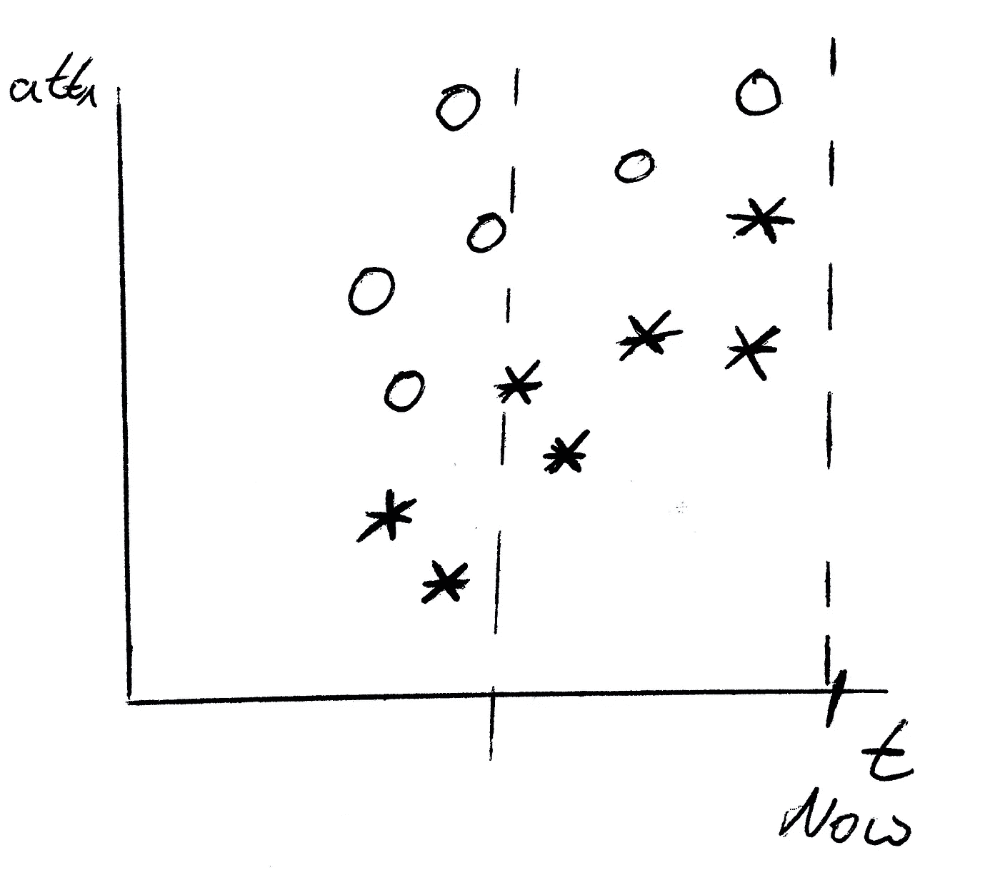
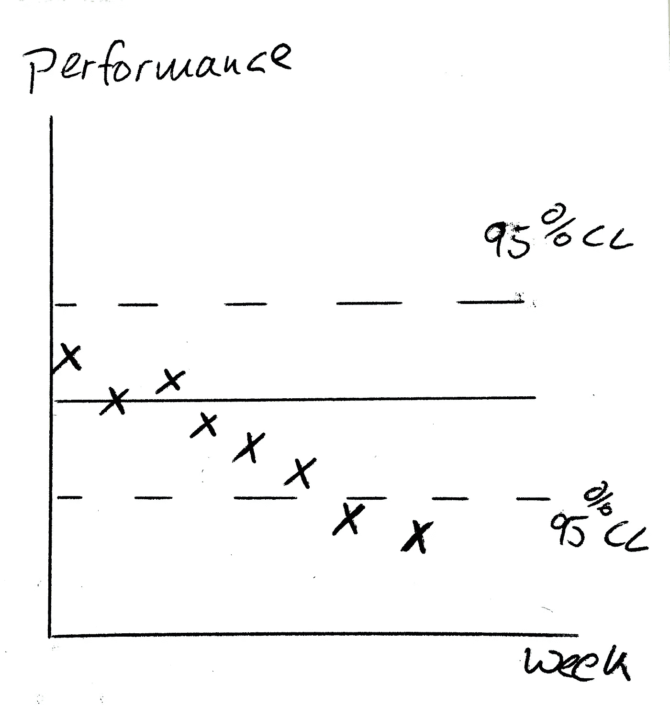

# 为什么您的模型需要维护

> 原文：<https://towardsdatascience.com/why-your-models-need-maintenance-faff545b38a2?source=collection_archive---------2----------------------->

[Photo by Ant Rozetsky,](https://stocksnap.io/author/38532) CC0

人们通常认为给定的模型可以永远投入使用。其实恰恰相反。你需要像维护机器一样维护你的模型。机器学习模型可以超时下车或者坏掉。这对你来说听起来很奇怪，因为它们没有移动的部分？嗯，你可能想仔细看看概念的变化和漂移。

**观念的改变**

让我们从一个例子开始。如果您试图为飞机建立一个预测性维护模型，您通常会创建如下列

*错误 5 _ 发生 _ 过去 _ 5 _ 分钟*

作为模型的输入。但是如果错误号 5 不再是错误号 5 会发生什么呢？软件更新会彻底改变您拥有的数据。它们修复已知问题，但也以不同的方式编码您的数据。如果您将更新后的数据作为更新前模型的输入，它会做一些事情，但不是您所期望的。这种现象叫做观念的转变。

**概念漂移**

一个非常相似的现象是概念漂移。如果变化不是剧烈的，而是缓慢出现的，就会发生这种情况。一个工业例子是传感器的外壳。随着时间的推移，这种情况会发生，测量的 100 度不再是 100 度。客户分析的一个例子是新技术的采用过程。人们没有马上使用 iPhones，而是慢慢适应了它。在 2007 年，像“HasAnIphone”这样的专栏意味着一个非常精通技术的人。今天，这表明一个普通人。

我能做什么？

An example for window based relearning. The pattern to detect circles moves over time. Only recent data points are included to built a model.

克服概念漂移的一种常见方法是基于窗口的重新学习。假设你的模型是建立在去年的数据之上的。这个窗口随着时间移动，因此你可以捕捉到概念的漂移。虽然这听起来很好，但它会遇到实际问题。一个问题是训练数据的限制。窗口越小，样本量越小。

这种方法通过减少概念漂移的问题帮助很大。但是观念的转变呢？

**处理概念变化**

需要报告由人类引入的并且可能影响模型的变化，并且需要调整模型。困难的是，负责变更的人需要意识到，模型会受到变更的影响。有 ML 意识的公司文化是成功的关键。最不可能的部分是，你有时不能在“新”硬件上建立一个模型。您只是没有新型号的数据，可能需要等待一段时间才能获得。

Graph resulting from backtesting. Real perforamnce (crosses) is compared to cross validation performances. It is decresing over time and results in a notification

另一个想法是回溯测试。在大多数情况下，你知道之后发生了什么。因此，您可以将您的模型预测与现实进行比较。另一方面，您的验证为您提供了对方法真实性能的评估。你可以用这两个平均值，做每日比较。如果基本概念改变了，您应该会看到性能下降。仪表板和通知方法是将此付诸实施的好方法。

**关键要点:机器学习能力至关重要**

本文展示了为什么“建模并运行”的常见实践是一种不好的实践。公司需要密切关注保持他们的机器学习能力。除了维护相关人员之外，拥有一个公共平台和良好记录的代码也很关键。