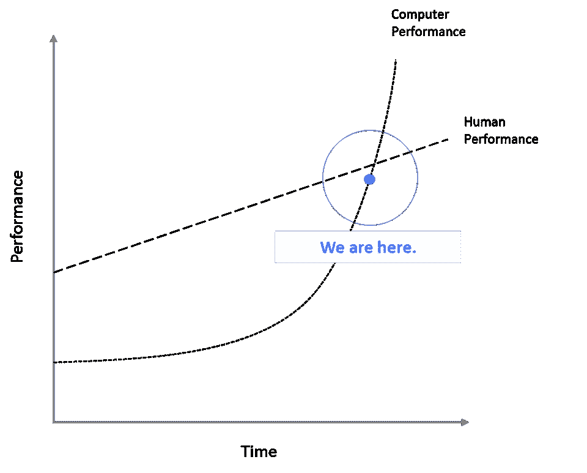
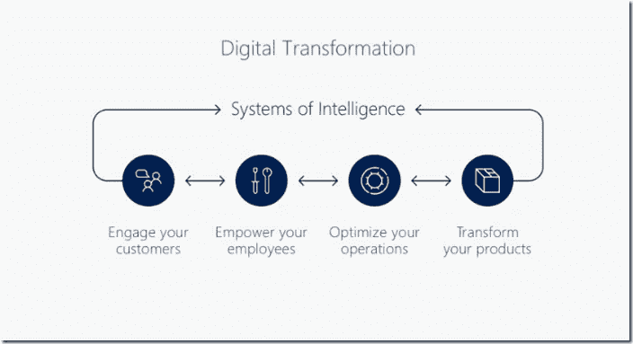
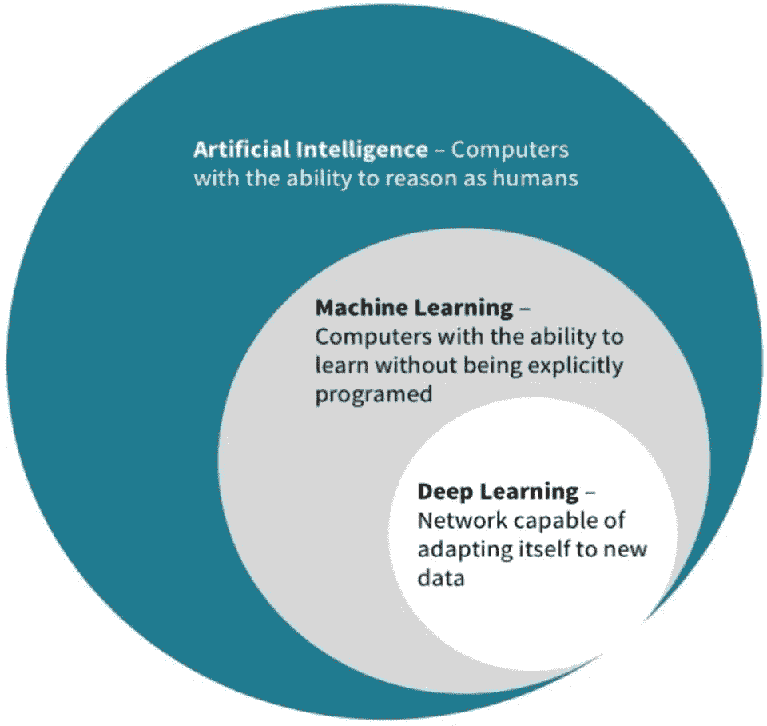
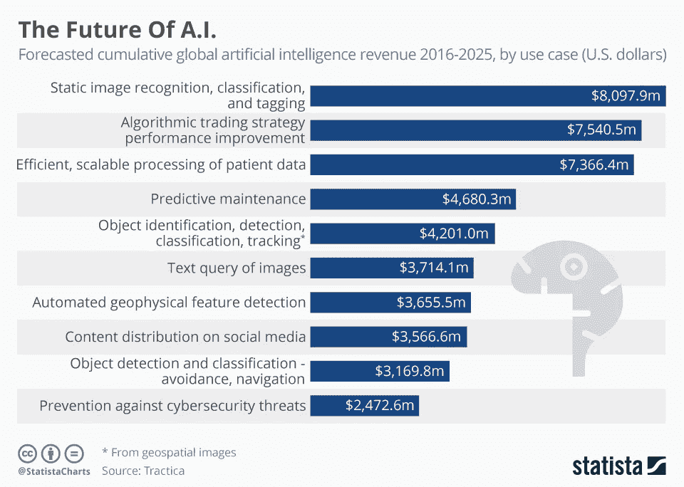

# 为什么你的组织不应该害怕人工智能

> 原文：<https://towardsdatascience.com/why-your-organization-shouldnt-be-afraid-of-ai-7f433d5012d8?source=collection_archive---------0----------------------->

> “事实是，今天你们中的每一个人…你们是一家软件公司，你们是一家数字第一的公司，你们正在构建核心的应用程序…而这些核心是数字产品”——微软首席执行官塞特亚·纳德拉——Ignite 2017

浏览一下你的 LinkedIn feed，不需要 90 秒就可以注意到，人工智能是“街上”关于收入电话的所有话题，是你 It 或营销部门大厅里咖啡聊天中希望或绝望的主要话题，甚至已经从反乌托邦式的 block buster Matrix/Terminator 模式扩散到我们的客厅，通过复杂的社会文化惊悚片，挑战我们“认为”我们是人类的动力(拜托，请告诉我你看过《西部世界》(Westworld)？).

现实是，关于人工智能的对话越来越重要，如此重要，以至于麻省理工学院的物理学家、《T2 T3 生命 3.0:成为人工智能时代的人类 T4 T5》的作者马克斯泰格马克(Max Tegmark)声称，这场对话是“我们这个时代最重要的对话”。 Max 有一个非常有趣的观点，对于各地组织的领导者来说，如果你关心员工和技术的互动将如何影响你组织的成功，你应该注意 Max 所说的话，因为正如你将看到的塞特亚·纳德拉的上述引用，每项业务都将成为软件/数据业务(你也可以 [**参考我的上一篇文章**](https://www.linkedin.com/pulse/pour-another-coffee-why-all-businesses-become-data-derek-russell/) 以了解有关该主题的更多信息)。目前，马克斯的论点停留在人类已经开发出一定数量的硬件(我们的身体)的观点上，为此我们可以“下载”或更新软件来学习:

> “我们有巨大的能力将新的“软件”上传到我们的大脑中……如果你决定要成为一名律师，你可以去法学院，法学院会将新的算法上传到你的大脑中，这样你就可以突然拥有律师的专业知识。正是这种设计我们自己的软件的能力，而不是等待进化给我们，使我们能够主宰这个星球，创造现代文明和文化。”

是的是的，我知道这次谈话的方向， ***这到底跟跑 P & L*** 有什么关系，告诉我这跟我有什么关系！？根据 Max 的工作，他谈到了软件能够开发更智能的硬件或“大脑”的能力，这些硬件或“大脑”可以比人类更快地记忆和学习。**“写软件的软件”，**是这些思想片段开始升级为人类如何互动和利用机器驱动的超级智能变得更加有效的地方。

# 「超级智能」和商业有什么关系？

[https://www.forbes.com/sites/greatspeculations/2017/10/25/getting-ready-for-prime-time-of-artificial-intelligence-investing/#4b824ff02010](https://www.forbes.com/sites/greatspeculations/2017/10/25/getting-ready-for-prime-time-of-artificial-intelligence-investing/#4b824ff02010)

一切。任何企业的成功都依赖于竞争，根据迈克尔·波特*(回想一下你的战略课程和 5 种力量)，*这并不意味着击败对手，而是意味着赚取利润。提高利润的最快方法是在现有资产范围内提高生产率和绩效，削减成本，让员工更快地获得更好的见解(更多信息请参见下面的*),这也将推动收入和新的增量收入来源。**我们正在迅速接近一个时期，在这个时期，我们的性能将被计算机性能超越，在整个组织中拥抱、构建、教育和部署人工智能的企业将加快他们的旅程，比他们采取“他们还没有为人工智能做好准备”的立场要快得多。**作为微软的一名员工，我当然对我们如何与企业合作并管理企业以帮助他们实现数字化转型的总体愿景抱有偏见，但我们的战略是建立在一个优雅的门户网站上，以促进企业进步和数字化转型。*

安:又来了，**“数字化转型”。**我们已经走得够远了，所以让我们一起努力:数字化转型*正在利用技术创造创新和颠覆，让员工和客户能够实现更多*。微软“数字转型”智能价值体系中的四个“支柱”说明了这个疯狂的人工智能对话与你的业务有什么关系，可能看起来像这样:

1.  真正地**吸引您的客户**利用智能机器人收集实时情报，了解您的客户真正重视什么，以及您如何更好地为他们提供服务，预测他们流失的潜力或提供服务/产品的机会，从而改善他们的生活。
2.  你将如何**授权你的员工**不仅仅是关于*“你在世界的前景或萧条上花了多少钱”*的对话，而是你为员工提供了多少访问关键业务指标的机会，这些指标可以告诉他们他们的 P & L 实时表现如何——仪表盘可以闪现漂亮的图片，但机器学习可以告诉你为什么图表会下降或上升，并可以生成数据可视化，让你现在做出更好的决策。
3.  **优化运营**是一些企业在全球化市场中生存的唯一途径，不管他们的产品有多好。假设你是一家食品制造/分销企业，影响你底线的三个趋势是 **1)商品成本增加 2)监管增加 3)竞争对手规模扩大以及大企业间的加速合并**。绝对有必要通过推断工厂车间的数据并使您的数据相互关联来削减成本，找出关键应用程序数据流之间的相关性，并了解每个流程如何相互影响。无论是通过深度学习图像识别、连接到机器并在边缘实时计算的智能边缘设备，还是通过机器学习模型查看历史数据并提出建议，这都是全球市场中竞争运营的现状。如果你不相信我，听说过[【牡蛎互联网】](https://www.youtube.com/watch?v=0EK15i7CUsY&feature=youtu.be)？
4.  最后，是通过人工智能优先/混合现实优先应用来转变产品的机会:“在今天的世界中，我的设计团队可能会制作一面镜子，我们必须以数字方式呈现，然后发送给工程师，让他们可以研究它，然后根据他们的反馈做出改变，”韦策尔说。“这需要时间，我们发现自己在这方面存在很多问题。但将工程和设计放在同一个空间，我们称之为共同创造的过程，可以简化这种互动。”**——**福特的设计技术运营经理说，他的团队采用了微软的 Halolens。

# 不可预测的人工智能:缓解交通流量，改善公司战略，并可能收紧婚姻

尼古拉斯·克里斯塔基斯，耶鲁大学的社会学家和医生，在他的校园社会学实验室进行了一项关于人类和人工智能互动的研究。这项研究由一个游戏组成，在这个游戏中，人类和机器人(简单的人工智能程序)必须合作做出定时决策。游戏网络显示，人类倾向于做出模式化的决策，智能机器人也是如此，它们平均产生类似的决策得分。除了一组机器人在 10%的时间里做出随机决策之外，这一组机器人最终在决策过程中制造了更多的“噪音”，引发了人类之间不同的反应思维，并导致了更快的决策。这种“愚蠢/猜测”的人工智能允许一个随机的环境，在这个环境中，由于机器人的“教学”性质，人类蓬勃发展，因为它们在允许**“人类自助”中扮演了一个助手角色。**

> *“没有机器人添加的噪音，人们经常陷入困境”*

那么，如果随机运行的计算机可以帮助人类做出更好的决策，高度复杂的人工智能可以帮助人类更好地执行特定任务 *(* [*如人工智能实体“AlphaGo”帮助人类玩家更好地玩游戏*](https://www.economist.com/news/science-and-technology/21730391-learning-play-go-only-start-latest-ai-can-work-things-out-without)*)*那么**为什么商业领袖将人工智能部署到团队内部人类交互的愿望与我们在世界上最大的企业中看到的实际人工智能足迹之间存在巨大差异？**问得好。

但是，利用愚蠢的人工智能并不意味着仅仅使用智能机器将随机场景引入一个群体环境中，以激发思维创造， ***“人们可以想象聊天机器人通过引导夫妇走向妥协而不屈服于愤怒或厌倦来调解关系治疗”*** 克里斯塔克斯博士说。这篇文章还引用了最近的一项研究，研究社交媒体机器人如何“羞辱”贬损性的推文，并降低 twitter 上种族诽谤的使用。

# “现在怎么办？”人工智能对话

我想在我们继续之前，这里的一个快速图表会对我们有所帮助。关于如何区分深度学习、机器学习和人工智能，一直存在很多困惑。这是一个很容易模糊的对话，但理解其中的差异是找出什么适合你的业务目标的关键一步。

[https://www.forbes.com/sites/greatspeculations/2017/10/25/getting-ready-for-prime-time-of-artificial-intelligence-investing/1#69daf8ea2010](https://www.forbes.com/sites/greatspeculations/2017/10/25/getting-ready-for-prime-time-of-artificial-intelligence-investing/1#69daf8ea2010)

通常，我们看到人工智能作为一个总括术语被用来涵盖右边概述的情况，但是让我们先做一点手脚，然后再深入。当我想到**人工智能**时，我会想到[“马尔默项目”](https://www.microsoft.com/en-us/research/project/project-malmo/)，这是微软研究&开发的新方法的一部分。它涉及一个人工智能代理和一个人类玩家在一个名为《我的世界》的游戏中合作建造物体。人类玩家教人工智能代理如何使用特定的工具来达到游戏的最佳水平，然后人工智能代理教人类玩家它自己学到的课程。**深度学习**更多地涉及一个多层神经系统，当它熟悉新数据时，它具有依次辨别和发现的精细能力——想想图像识别和机器需要做的所有事情，以识别手持冲浪板的女人和红色敞篷车之间的差异。

[https://www.statista.com/chart/6810/the-future-of-ai/](https://www.statista.com/chart/6810/the-future-of-ai/)

我看到的今天在企业中使用最多的用例是数字化的开端，是使用机器学习从新的见解中派生和自动化的。他们使用训练有素的模型来发现用例中的模式，以检测设备故障的原因和如何预测未来的故障，以及实时提供维护呼叫、智能采购零件和为技术人员提供潜在故障和需要哪些零件/工具的智能所需的措施，从而大幅降低运营成本和减少停机时间。一个好的**机器学习工作流程**通常是这样的:

1.  **数据采集**:寻找相关数据，开始评估你关心的变量，当然，还要确保这些数据是干净的，可供消费
2.  **分析**:人工定位和理解模式，数据科学的基础
3.  **重塑**:加入函数和数理统计，以确保正确的分类，并遵循连续迭代的流程
4.  **建模**:使用引擎创建一个模型，这不是一次性事件，该过程在特定的时间盒内反复重复
5.  **提炼**:做上面的步骤来增加准确的概率，模型越准确，预测就越好，越可信
6.  **部署**:由应用程序提供，随时可供员工或客户使用

随着我们从移动优先云优先技术生态系统转变为智能云智能边缘生态系统，**企业现在将能够发现新的数据环境，识别模式，并在用户授权的最尖端进行计算和发布:通过多传感器和多设备，在“边缘”。**

[https://www.gartner.com/technology/research/methodologies/hype-cycle.jsp](https://www.gartner.com/technology/research/methodologies/hype-cycle.jsp)

正如我们从上面 Gartner 的炒作周期中可以看到的，我们可以尝试走在像 AI 这样的新技术现在是否值得投资的前面，或者我们是否已经迟到了。根据图表，我们正处于 AI/ML/Cognition 取得一些巨大成功的时期，但也有许多失败。随着我们通过“幻灭的低谷”接近下一个 5 年，**确保组织与人工智能提供商保持一致将是极其重要的，这些提供商将继续与您、企业一起发展他们的思维方式、技能和工具集**。这不仅仅意味着说“我们已经完成了机器学习项目”，而是学习有多少项目成功了，哪些项目失败了，以及从那些失败中学到了什么。

# 所以让我们开始吧！…

在微软的“数字转型学院”(一个为微软销售组织提供的学习体验)期间，我看到了由 [**凯捷**](https://www.capgemini.com/service/digital-services/insights-data/) *(一个专门帮助企业围绕见解和数据制定战略的合作伙伴)*所做的令人信服的演示，内容是人工智能项目必须成功的关键要素，以及商业领袖在驾驭可能性艺术时应该关注的问题:

> *…对这些项目的数据有很好的理解，数据&人工智能只是达到目的的手段，而不是解决方案本身，所有人工智能项目都需要一种愿意改变的文化，并且必须以信任为中心，因为这是与人工智能互动的基石。*

请随时发表评论进行更多讨论，也可以在 [LinkedIn](https://www.linkedin.com/in/derekwesleyrussell/) 上关注我。