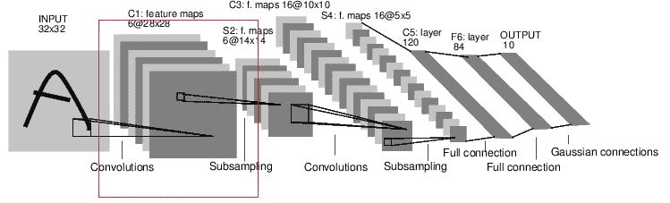
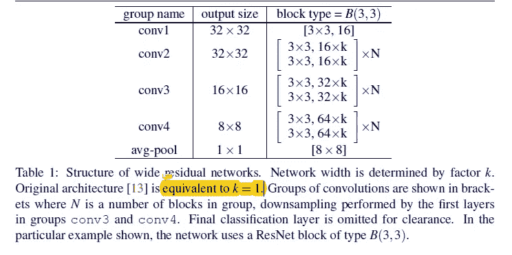
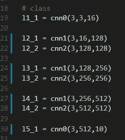
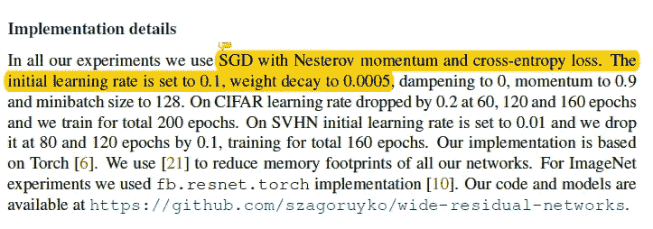
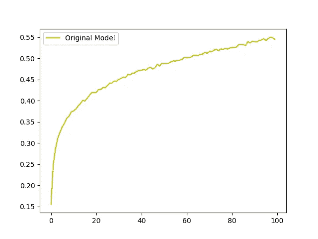
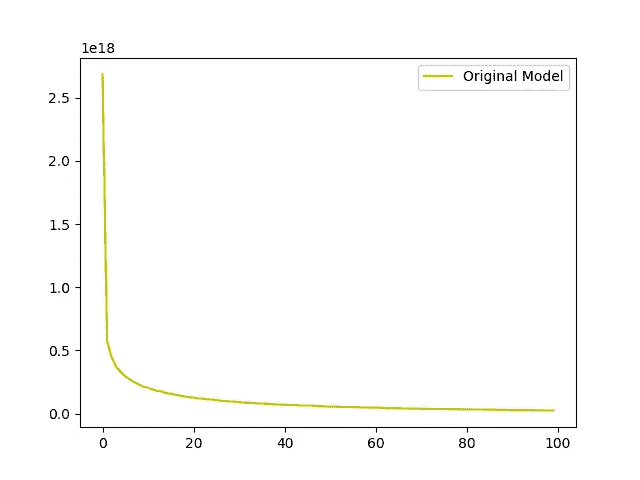
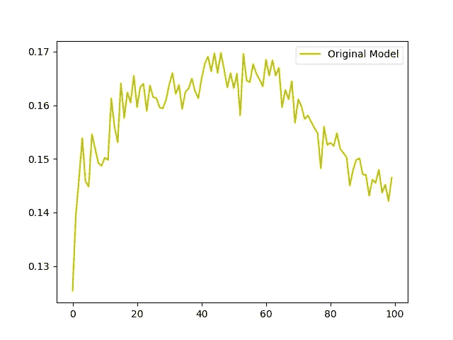
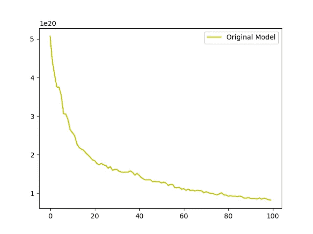
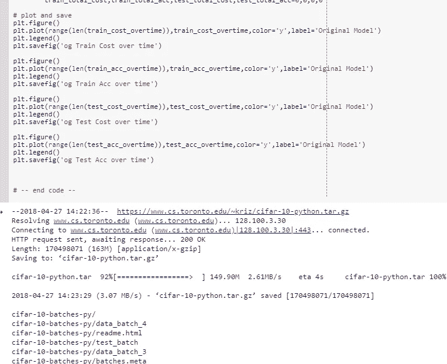

# 具有交互代码的宽剩余网络

> 原文：<https://towardsdatascience.com/wide-residual-networks-with-interactive-code-f9ef6b0bab29?source=collection_archive---------9----------------------->

Gif from this [website](https://giphy.com/gifs/highway-xdUIwnITXl3OM)

我的期末考试终于结束了，我想通过实现 wide res net 来庆祝一下。此外，这将是一个很短的帖子，因为我想回到写博客的心情，希望我不会让你失望！

**广残网**

Image from this [website](http://pytorch.org/tutorials/beginner/blitz/neural_networks_tutorial.html)

**红框** →卷积神经网络中增加的特征图数量

该论文的作者称之为宽残差网络的主要原因是由于每一层的特征地图大小的增加。如上所述，当我指的是特征图大小时，我指的是在每个卷积层上创建的通道数，但是，请记住，该特征图大小也可以减小。

**网络架构(层/全/面向对象)**

**红框** →我们要实现的网络层。

每一层与传统的残差网络几乎相同，然而如上所述，特征图的数量已经增加。现在，让我们来看看我们将要使用的完整网络体系结构。另外，请注意，上图中没有显示批处理规范化和 ReLu()激活。

以上是我们将要实施的完整网络架构，我们可以观察到两个变量，即 N 和 k。这里 k 是我们希望每层的特征图增加多少，N 是每层中卷积块的数量。因此，对于我们的网络，我将 N 设置为 1，K 设置为 8，因此我们的网络只有 8 层，但每层都有许多特征地图。现在让我们看看网络的 OOP 形式。

如上所述，网络本身并不深，但是我们可以观察到每一层都有大量的要素地图。

**优化**

正如上文所见，原始论文使用了具有内斯特罗夫动量的 SGD，对我来说，我将使用 ADAM，当然这将使模型过度拟合训练数据，有关此主题的更多信息请单击此处[。](https://shaoanlu.wordpress.com/2017/05/29/sgd-all-which-one-is-the-best-optimizer-dogs-vs-cats-toy-experiment/)

**结果**

**左上** →训练精度随时间变化
**右上** →训练成本随时间变化
**左下** →测试精度随时间变化
**右下** →测试成本随时间变化

考虑到 CIFAR 10 数据集由 50000 幅训练图像和 10000 幅测试图像组成，我们的 8 层宽 Resnet 仅在训练图像上表现良好。然而，我们可以清楚地观察到，该模型已经过度拟合于训练数据。(测试图像的最佳准确度只有 17%。)

**互动代码/透明度**

对于 Google Colab，你需要一个 Google 帐户来查看代码，而且你不能在 Google Colab 中运行只读脚本，所以在你的操场上复制一份。最后，我永远不会请求允许访问你在 Google Drive 上的文件，仅供参考。编码快乐！

要获取这篇[文章的代码，请点击这里。](https://colab.research.google.com/drive/1Db64YnpnZwG3zjulRC8spKuonmHQipaE)

为了让这个实验更加透明，我已经将我的命令窗口的所有输出上传到我的 Github，要从我的 cmd [访问输出，请点击这里。](https://github.com/JaeDukSeo/Daily-Neural-Network-Practice-2/blob/master/NeuralNetwork/WideResNet/wide_res.txt)

**最后的话**

看到结果令人失望，但我很有信心用正确的正则化技术，这个网络会表现得更好。

如果发现任何错误，请发电子邮件到 jae.duk.seo@gmail.com 给我，如果你想看我所有写作的列表，请在这里查看我的网站。

同时，在我的 twitter [这里](https://twitter.com/JaeDukSeo)关注我，并访问[我的网站](https://jaedukseo.me/)，或我的 [Youtube 频道](https://www.youtube.com/c/JaeDukSeo)了解更多内容。如果你感兴趣的话，我还做了解耦神经网络的比较。

**参考**

1.  Zagoruyko 和 n . Komodakis(2016 年)。广泛的剩余网络。arXiv 预印本 arXiv:1605.07146 。
2.  神经网络 PyTorch 教程 0.4.0 文档。(2018).Pytorch.org。检索于 2018 年 4 月 27 日，来自[http://py torch . org/tutorials/beginner/blitz/neural _ networks _ tutorial . html](http://pytorch.org/tutorials/beginner/blitz/neural_networks_tutorial.html)
3.  SGD >亚当？？哪一个是最好的优化程序:狗对猫玩具实验。(2017).萨卢。检索于 2018 年 4 月 27 日，来自[https://Shao anlu . WordPress . com/2017/05/29/SGD-all-the-one-is-the-best-optimizer-dogs-vs-cats-toy-experiment/](https://shaoanlu.wordpress.com/2017/05/29/sgd-all-which-one-is-the-best-optimizer-dogs-vs-cats-toy-experiment/)
4.  CIFAR-10 和 CIFAR-100 数据集。(2018).Cs.toronto.edu。检索于 2018 年 4 月 27 日，来自[https://www.cs.toronto.edu/~kriz/cifar.html](https://www.cs.toronto.edu/~kriz/cifar.html)