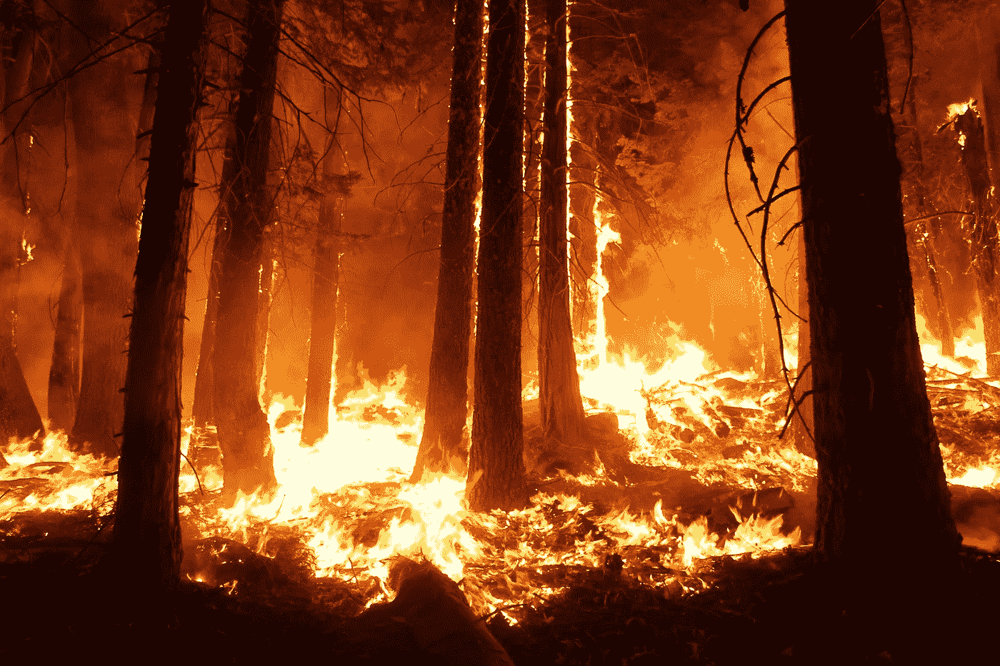
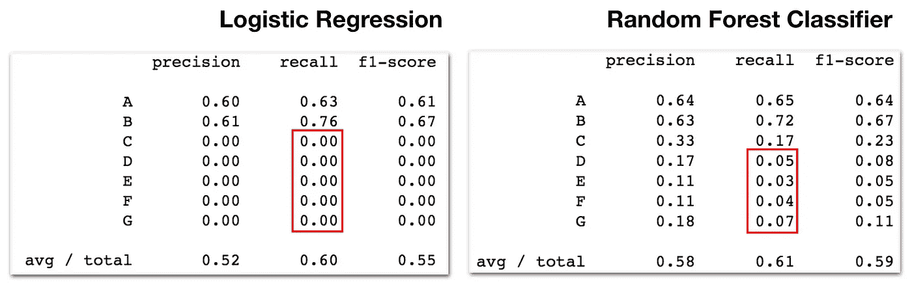
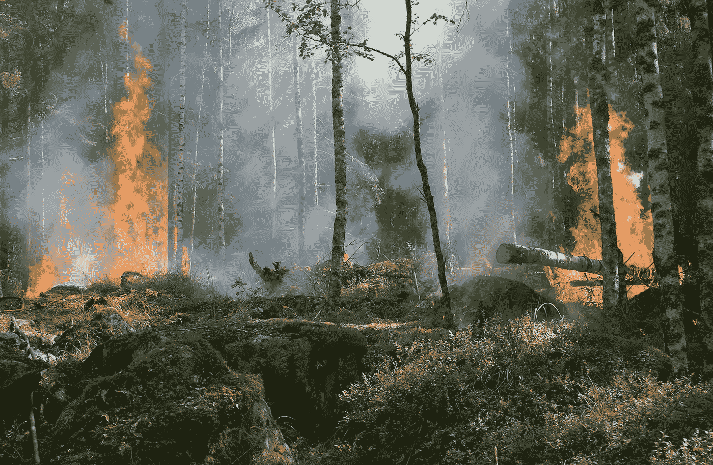
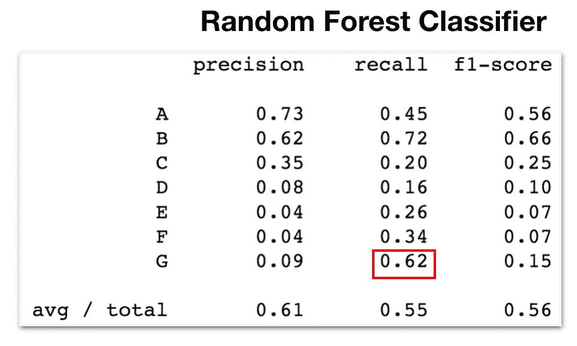
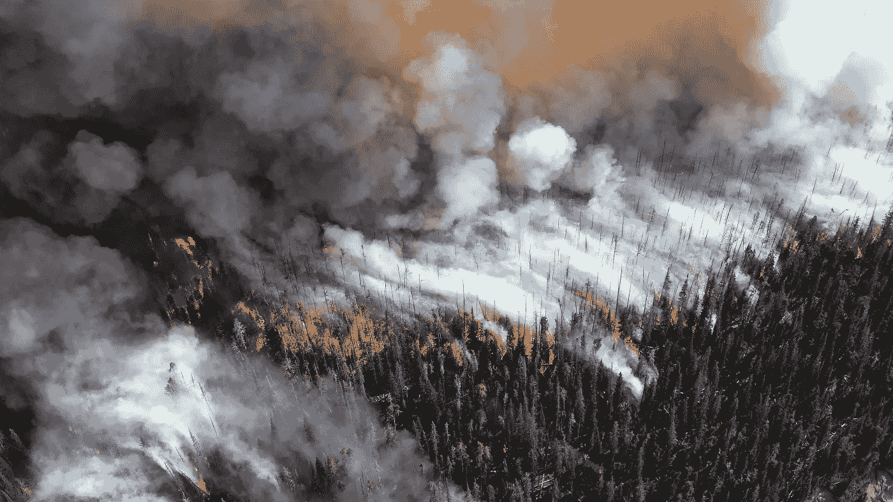

# 野火破坏——森林火灾的随机森林分类

> 原文：<https://towardsdatascience.com/wildfire-destruction-a-random-forest-classification-of-forest-fires-e08070230276?source=collection_archive---------5----------------------->

## 我们能预测野火会变得多大吗？

Image by [Mike McMillan](https://baynature.org/article/bay-area-filmmaker-looks-for-answers/rim-fire-photo-credit-usfs-mike-mcmillan/) on [baynature](https://baynature.org/wp-content/uploads/2018/09/Rim-Fire-photo-credit-USFS-Mike-McMillan.jpg)

信不信由你，美国每年大约有 80，000 起野火。其中大多数都很小，很少被注意到，只影响到几英亩无人居住的乡村，但有些会变成咆哮的、无法控制的森林大火，摧毁它所经之处的一切。2017 年 10 月至 12 月，仅在北加州([www.insurance.ca.gov](http://www.insurance.ca.gov))与野火相关的保险索赔就达到近 120 亿美元。不出所料，野火也非常危险，据报道，在 1920 年至 2015 年间，野火夺去了 1114 条生命(【www.nifc.gov】)。我们所能了解的任何关于引起野火的原因、推动其规模和蔓延的因素以及以任何方式对其行为有所贡献的因素的信息，都可能有利于灭火和预防工作，因此对于这个项目，我建立了一个模型来预测野火的规模，该模型使用了 1992 年至 2015 年约 188 万起火灾的信息，这些信息可在美国林务局档案馆找到，并整合了来自伯克利地球、劳伦斯伯克利国家实验室的历史气温数据(下面提供了链接)。

# 特性、探索性数据分析和基线

Photo by [Skitterphotoon](https://pixabay.com/users/skitterphoto-324082/) on [pixabay](https://pixabay.com/photos/easter-fire-bonfire-fire-flames-384602/)

美国使用一个分类系统，根据燃烧的总面积对野火进行分类，A 类燃烧不到 1/4 英亩，G 类燃烧超过 5000 英亩。我收集了用于分析的要素，例如发现野火的州、火灾发生地的所有者(联邦、州、部落、私人等)。)，火灾的最初起因(闪电、烟火、营火等。)、经度、纬度、气温；然后，我从已经获得的信息中设计了一些额外的特征，例如每个州的火灾总数和年平均气温。通过 SQL 将这些信息加载到 Python3 中，我隔离了 20%的总体数据(约 367，000 起火灾)作为子样本，以减少计算量，确保它是随机分层的，以便每个目标火灾规模类别在我的子样本中按比例表示，就像它们在我的完整数据集中一样。接下来，我将基于距离的逻辑回归和基于树的随机森林分类器(RFC)用于我的子样本，使用 5 重交叉验证技术，80%训练，20%验证基线分离，结果令人失望。

Image by Author

你可以在上面看到，逻辑回归对类别“C”到“G”产生了 0.00 的召回率，基本上说它没有成功地将任何火灾分类到这些组中，这是不好的。右边的随机森林分类器也好不到哪里去。

Video by Author

为了理解为什么我的模型对较大火灾的预测如此之差，我回到了完整的数据集，并探索了火灾类别的分布，结果表明，火灾小于 10 英亩的两个大小类别“A”和“B”构成了我的数据点的绝大部分；此外，与大多数其他类别相比,“G”类火灾的数量极低。这种火灾数量的不平衡在我的两个模型中都引起了非常明显的偏差。另一个非常重要的不平衡是，我没有量化每个类别中有多少起火灾，而是看了每个类别累计燃烧了多少英亩。通过这种方式，数据显示“G”类火灾虽然只占全国所有野火的 0.2%，但实际上已经燃烧了所有野火面积的 75%。上面是一个我用来说明这种关系的 D3 动画视频，第一个图形显示了火灾数量的不平衡，然后图形过渡到显示总燃烧面积的不平衡。红色部分代表全国最具破坏性、最危险和最罕见的火灾，因此，它预测这些“G”类火灾是我的模型的重点。

# 调整模型

因此，我回到了我的基线模型，并实施了权重分类来补偿数据点中的不平衡，这指示模型在训练时更加重视属于较罕见火大小的数据点的特征。在用新参数重新拟合和重新测试这两个模型之后，随机森林分类器再次优于逻辑回归以及其他基于距离的模型，所以我继续使用 RFC。这里需要注意的一个方面是，由于 RFC 是一个基于树的模型，并且不依赖于点之间的距离，所以我能够包括一些我最初收集的特征，但是直到现在还没有包括，因为数据不完整，使它们与逻辑回归不兼容。因为我想要两种模型类型的真实比较，所以我需要使用相同的数据作为基线。既然我已经决定了 RFC，并且基于树的方法不仅对于处理空值是健壮的，而且实际上可以收集包含在数据丢失的事实中的信息，我可以重新集成被排除的数据。除了添加包含空值的特征之外，我还能够使用 RFC 模型中的特征重要性分数来消除一些很少使用并且没有区分火灾规模等级的信号的特征。

Photo by [Ylvers](https://pixabay.com/users/ylvers-337353/) on [pixabay](https://pixabay.com/photos/forest-fire-trees-burning-forest-432870/)

在调优我的 RFC 时，最终对最高优先级目标类的召回产生显著影响的超参数是:模型在决定在哪里对数据进行分割时考虑的特征的数量，我在我的树模型集合“森林”的每棵树内允许的最大分割数量，在数据中创建内部分割所需的最小样本数量，以及在每棵树上创建终止叶节点所需的最小样本数量。一旦我在 20%分层子样本上拨入我的模型，我就用 Amazon Web Services 初始化一个实例，该实例具有足够的 RAM 和处理能力来在我的 188 万行上运行这些集成模型，使用另外 80%-20%的分割进行训练和测试，并重新调整我的模型，再次使用 5-CV K-Fold 方法来防止来自随机数据模式的误导性错误度量，最后在最终调整之前，我根据测试数据评估我的模型。

# 最终评估

Image by Author

最终的“G”级召回分数为 0.62，这个模型已经从它开始的地方走了很长的路。“G”精度测量有多少来自其他类别的火灾被错误地标记为“G ”,而召回测量有多少“G”火灾被正确地放置在“G”中。不幸的是，精确度非常差，但这只是我不得不做出的决定，也是我不得不接受的权衡。对于这个模型，我决定，我宁愿有一些小火，也许会得到额外的关注，被遏制，并最终成为假警报，以尽量减少潜在的巨大，破坏性火灾的数量。

# 这个模型能教给我们什么

除了我的随机森林分类器模型的基本预测能力(通过回忆最危险大小类别进行评估)之外，还有最后一个要点需要提出，即当查看我的最终模型的特征重要性分数时，我的模型使用最多的三个特征，以及在学习如何区分火灾大小类别时提供最多收益的三个特征是:经度、纬度和气温。这很重要，因为经度和纬度都可以代表真实的环境条件，如气温、湿度、降雨量、风力和海拔，我的模型确定，在预测野火的最终燃烧规模时，这些因素比初始原因和财产所有者等特征更有影响。从这个项目一开始，我就想在我的分析中加入更多的环境因素，但是时间限制了我在数据采集和数据争论上投入的精力。有了这些结果，如果我要继续改进这个模型，我肯定会将额外的环境特征集成到我的随机森林分类器中，希望增加它的预测能力。

一个真正准确、维护良好的模型可以实时识别在什么条件下野火最有可能蔓延到危险和破坏性的规模，从而帮助灭火专业人员有效地分配资源，并将他们的努力引向最具潜在破坏性的火灾，防止财产损失和拯救生命。

# **资源**

野火数据:
Short，Karen C. 2017。美国 1992–2015 年的空间野火发生数据[FPA_FOD_20170508]。第四版。柯林斯堡，CO:林务局研究数据档案。[https://doi.org/10.2737/RDS-2013-0009.4](https://doi.org/10.2737/RDS-2013-0009.4)T5[https://www.kaggle.com/rtatman/188-million-us-wildfires](https://www.kaggle.com/rtatman/188-million-us-wildfires)

气温数据:
[http://berkeleyearth.org/data/](http://berkeleyearth.org/data/)
[https://www . ka ggle . com/berkeleyearth/climate-change-earth-surface-Temperature-Data](https://www.kaggle.com/berkeleyearth/climate-change-earth-surface-temperature-data)