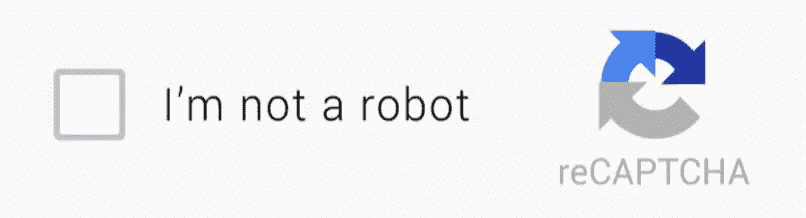
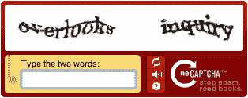
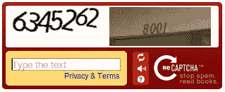
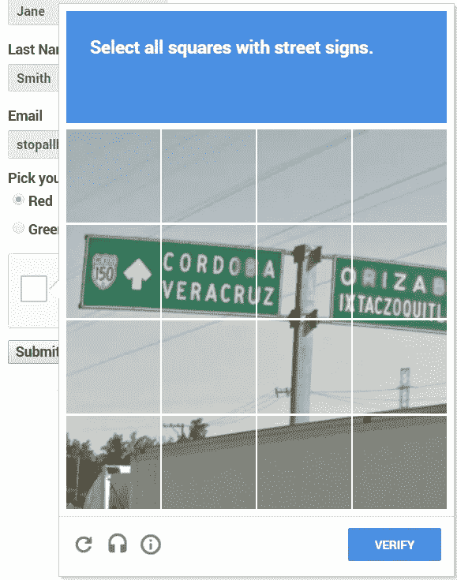

# AI 会杀验证码吗？

> 原文：<https://towardsdatascience.com/will-ai-kill-captchas-9d3bd07c3973?source=collection_archive---------3----------------------->

你好，

如果你过去 15 年没有呆在山洞里，你可能会在一个网站上遇到这种事情:

# 验证码

这些是验证码，又名“ **C** 完全地[A 自动的](https://en.wikipedia.org/wiki/Automatic_test_equipment)P 公共的[T 在测试期间](https://en.wikipedia.org/wiki/Turing_test)告诉 **C** 计算机和 **H** 人类 **A** 部分】。基本上，这是一种检查你的网站是否被人或机器人使用的方法。防止垃圾邮件非常有用。这些年来，它已经演变了很多，在机器人制造商背后正在玩一场“猫和老鼠”的游戏，他们努力自动解决这些问题，因为一旦你设法解决了这些问题，你就可以在大规模的在线上做几乎所有的事情，而不会被阻止。主要是黑帽(邪恶黑客)的东西，但不一定。

基本上，**滥用系统**。

例如，假设您有一项租借服务器的服务。您可以免费试用服务器 2 小时。如果它受到验证码的保护，作为一个机器人制造商，你不能滥用这个系统，因为它根本不可扩展:

你需要一直手动解决验证码。但是如果你能够自动注册新账户，那么你就可以有很多免费的服务器来做加密挖掘、ddos、垃圾邮件攻击等事情。

这些年来，我们看到了奇怪的字母，移动验证码和许多其他东西的出现，这些都是用传统方法解决的(又名不是人工智能)。例如，很多时候，如果你颠倒颜色(黑色变成白色，白色变成黑色)并调整对比度，你可以去掉很多垃圾(如随机的点、线等)，然后解决它。

# 人工智能的崛起

过了一段时间，对人工智能数据的需求增加了，我们开始看到这样的验证码:

这显然是从谷歌街景的巨大图像数据库中获取的图像，这使他们能够对数千个地址进行分类，然后训练自动驾驶汽车。这也有一个好处:如果谷歌必须收集数据来解决这些问题，并且不借助收集大量人类数据无法轻松解决这些问题，那么你的普通机器人制造商肯定也不会。

这被证明是非常有效的，并持续了一段时间。但这也引起了很多批评，因为解决验证码是令人讨厌的，耗时的，对残疾人的访问非常不好。

随着人工智能和深度学习的兴起，阅读扭曲的字母或门牌号变得很容易。所以他们不得不再次胜过装瓶者。

介绍 recaptchav2:

这解决了很多以前的问题:有一个本地检查，所以大多数时候如果你没有一台可疑的计算机(例如，如果你的 ip 试图解决 200 个验证码每小时)，你会通过检查，而不必解决任何问题，所以它很快，易于使用，安全，对残疾人有好处。随着大量图像要求对大量物体、建筑物等进行分类，对数据分类的需求不断增长。

问题是机器学习比以往任何时候都更好，并且在许多事情上击败了我们。这意味着，现在更难划清“是人，因为机器做不到这一点”的界限。例如，马里兰大学的一项学术研究创造了 [uncaptcha](http://uncaptcha.cs.umd.edu/) ，它可以以 85%的准确率解决验证码。

85%的准确率是 HUUUGE。

随着时间的推移，机器将能够越来越好地模仿人类，所以很快验证码将变得毫无用处。

那么能做些什么呢？现在有一种越来越普遍的解决方法。

# 电话验证

很明显，在网上获得一个电话号码并使用该电话号码进行验证是很容易的，许多服务都提供这种功能。但是它极大地提高了账户的价格。而如果你试图在一个已知的网站上注册(steemit？:D)你可能最终会为一个已经用过的电话号码付费。

这非常非常有效，但对隐私来说也是一个可怕的消息。现在你需要一部手机才能上网，很多人会知道你的电话号码，并可以把它卖给广告商。我相信这是一件坏事，但我们真的没有其他选择来阻止垃圾邮件发送者。

感谢阅读，你们觉得怎么样？

如果你想探索这个主题，还有一些资源:

【https://www . wired . com/story/how-your-phone-number-bec-the-only-username-that-matters/【https://www.google.com/recaptcha/intro/】[https://github.com/ecthros/uncaptcha](https://github.com/ecthros/uncaptcha)

如果你喜欢我的文章，请到我的博客来看看更多关于 https://brokencode.io/的内容