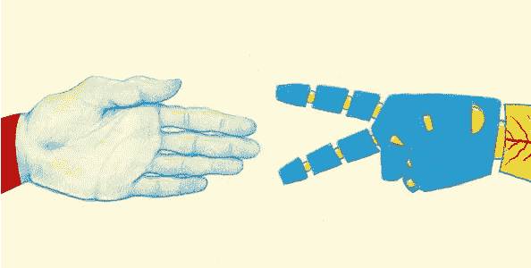
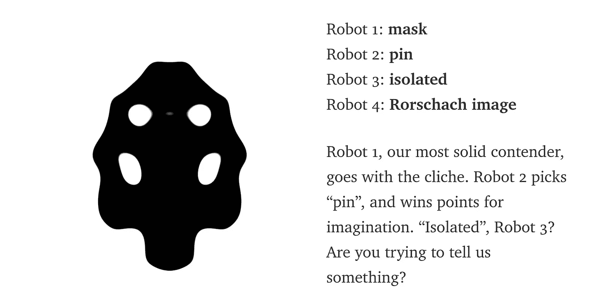
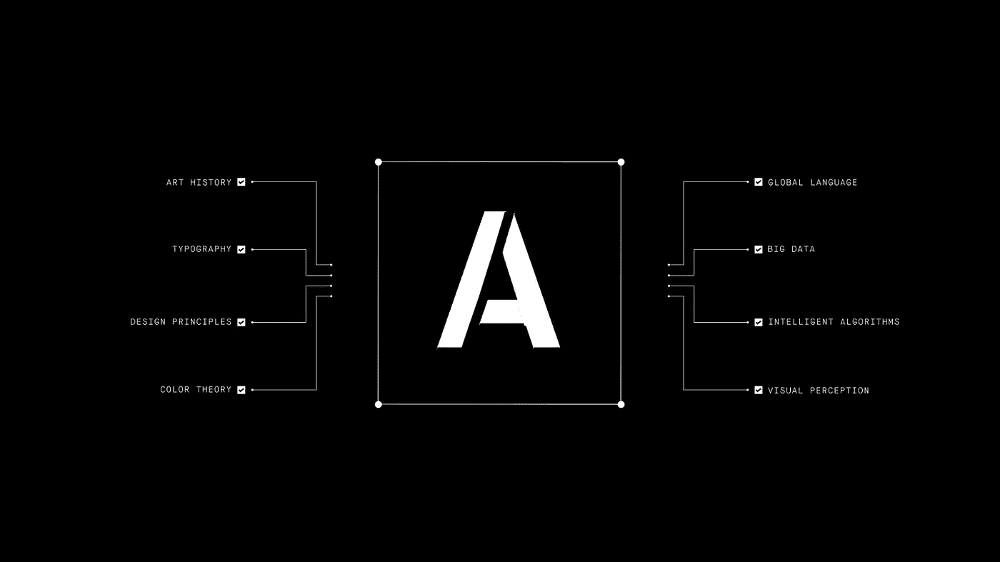

# 人工智能会让设计师脱离设计过程吗？

> 原文：<https://towardsdatascience.com/will-artificial-intelligence-remove-designers-from-the-design-process-5e6661430055?source=collection_archive---------1----------------------->

credit to Nathalie Foss

**前言:**

**这是两个设计师之间的写作实验；陈亦菲** [和 T5【蒂娜】潘](https://medium.com/@tinaphanner) **。设计师们同意了一个与设计学科相关的话题，并希望挑战彼此的视角。这种使用人工智能的对话有助于激发合作和讨论我们作为设计师的未来。这是关于展示可能没有被考虑到的不同观点。虽然我们同意这篇文章的重点不是在人工智能是坏还是设计师是不可替代的问题上表明立场，但我们对如何在核心价值、形式和规则制定的设计领域中对待人工智能有不同的立场。**

[**此处阅读 Phan 的论点。**](https://medium.com/@tinaphanner/will-humans-ever-allow-artificial-intelligence-to-be-truly-useful-as-the-designer-5609866448e3)

在这个时代，人工智能正在接管人类的工作，这是迫在眉睫的危险。即使是设计师，我们被认为是最有创造力的职业之一，也不排除。以一款有争议的新产品 [*网格*](https://thegrid.io/) 为例。*网格*的标语是“*人工智能网站自己设计*”，是一个算法驱动的网站生成器，它可以在没有任何指导的情况下自动生成体面设计的多个选择。这是计算机和算法层出不穷的一个缩影，也看起来像是设计师被从设计的核心驱逐到边缘的开始。那么，设计师是否有一天会被剔除出设计流程？人类设计师有哪些核心价值是人工智能无法替代的？

credit to The Grid

***核心价值观***

对设计至关重要的一点是个性。通过个性，我们识别自己，将自己与其他设计师区分开来，并发明我们自己的设计制作流程。作为人类经验的塑造者，我们将我们的直觉和感觉带入设计，将无序转化为有序。我们很难想象人工智能可以取代我们为项目带来的现场体验。但是我们如何验证人工智能是否具有潜在的人格呢？根据最近的研究，[两位谷歌工程师](https://medium.com/@hint_fm)开发了[一种创新方法](https://medium.com/@hint_fm/move-over-turing-23b26027f049)来测试图像识别程序是否具有相同的个性。使用由算法创建的“墨迹”图像，他们询问机器人他们看到了什么，并记录他们对每张图像的想法。结果证明，不同的机器人确实有不同的反应，这被研究人员解释为潜意识思想，但这仍然不是断言机器人肯定有个性的直接结果。

credit to Fernanda & Martin

但是性格真的是成为一名优秀设计师的决定因素吗？在潘的文章中，她认为设计不一定需要个性；她相信*“设计有一个模式、算法和原则的基础，使得人工智能可以产生的项目设计成功。”对于一个普通的设计，她的论点是站得住脚的。但对于一个非凡的设计来说，打破框架和挑战原则更为关键。*

***艾是形*** 的比喻

人工智能是形式的隐喻，指的是设计中所有可见的元素以及这些元素的结合方式，包括但不限于字体、设计语言和视觉感知。人工智能可以从经典的设计实例、基本的设计原则、新潮的设计形式中学习，在形式上做出精准的选择。但形式不能主宰一切。这个问题在音乐上有一个类比。基于占主导地位的音乐形式和基本的音乐理论，程序员开发了基于风格的音乐算法，可以自动分析和生成音乐。然而，人工智能甚至无法识别非主流音乐形式，因为存在各种难以量化的评估标准。也就是说，形式化的规则无法解释音乐的基本方面。这同样适用于设计。形式可以用定义明确的标准来评估，但思想不能。

在这一点上，Phan 认为*“使用人工智能作为交流想法的形式，设计师可以提出更好的解决方案来交流想法。”然而，事实是，如果你最初的想法很糟糕，单靠技术是无法拯救它的。在设计过程中，创意应该永远放在第一位。 [*“理念是设计的原动力，形式受理念的指引，必须服从理念。”*](http://daphne.palomar.edu/design/dprocess.html) 创意是设计师种下的种子，形式是设计师如何培育这些种子。栽培过程可以决定它看起来怎么样，但只有通过种子才能定义它的本质是什么。*

***规则制定者***

设计师是规则的制定者。只有设计师才能定义什么是设计。人工智能可以模仿人类操纵系统内的设计语言、声音和语气、模式和组件，但整个系统是由人类设计的。设计系统统治着我们周围的一切，设计师决定了系统是什么，如何组织和互动。为了回答复杂的沟通问题并使他们的工作标准化，设计师们发明了 [*【系统设计的系统方法】*](https://www.techopedia.com/definition/29998/system-design) 称为系统设计。它被用于许多学科，尤其是在信息论、运筹学和计算机科学等新领域。人工智能也包括在内。设计师制定规则，赋予机器它们的目的，并指导它们施展魔法。

在这一点上，Phan 认为，设计师可能会认为自己是规则的制定者，但人工智能迫使他们在澄清规则方面成为更好的规则制定者。诚然，设计师可以通过翻译自己的设计意图变得更加客观和清晰，但反思的过程并不一定有人工智能的参与。优秀的设计师在进行每一个设计决策时，都应该已经理解了设计原则，并养成了自我审视的习惯。设计师的力量在于他们可以自己制定和打破规则。

***未来设计教育***

由于人工智能，未来创意和生产工作之间的界限将更加明确。重复性任务将被卸载，这将使设计师从生产任务中解放出来，专注于创造性和基础性工作。所以我们的工作不会被拿走而是升级。那么，设计教育将会发生什么变化？作为未来的塑造者，现在是我们思考新的教学方法的时候了。

Credit to Lucien Ng’s “Artificium”

对于课程规划来说，首先会受到挑战的是我们现在的课程。像字体设计、设计语言和视觉感知等与形式相关的课程会减少甚至从教学大纲中删除吗？这些设计原则和基本知识可以被编程和激活吗？此外，将为我们开发更多课程，以适应人工智能和设计师之间的互利共生。我可以想象的一门必修课是使用新自动化系统的指南课程，其中包括学习如何用人工智能设计和使用人工智能工作。至少，要考虑设计师如何参与到算法的制作过程中。更重要的是，人工智能将促使我们重新关注设计思维的重要性。设计思维使我们能够观察和改进我们的思维过程、模式和方向。在接下来的几年中，关键问题将转移到如何建立新的系统和策略，如何应对和恢复新的情况，如何创造更有意义和持久的沟通方式。

那么什么样的设计学校适合新生代呢？这个问题没有确定的答案，但这也是我们不断挖掘、推测、挑战的原因。我们不仅是设计专业的学生，也是新一代的塑造者和新革命的创新者。有一个充满可能性的世界等待我们去探索。