# 贝叶斯思维介绍:为什么一个测试可能不足以检测你体内的病毒？

> 原文：<https://towardsdatascience.com/will-you-become-a-zombie-if-a-99-accuracy-test-result-positive-3da371f5134?source=collection_archive---------1----------------------->

Photo by [Drew Hays](https://unsplash.com/@drew_hays?utm_source=unsplash&utm_medium=referral&utm_content=creditCopyText) on [Unsplash](https://unsplash.com/s/photos/virus-test?utm_source=unsplash&utm_medium=referral&utm_content=creditCopyText)

假设世界上存在一种非常罕见的疾病。你患这种疾病的几率只有千分之一。你想知道*你是否*被感染，所以你做了一个 99%准确的测试…测试结果为阳性！你有多确定自己真的被感染了？

第二次测试如何影响你确实被感染的信念？

我在这里使用的例子来自真理频道。在这篇文章中，我想向**展示贝叶斯网络**下的逻辑。关于[贝叶斯定理](https://en.wikipedia.org/wiki/Bayes%27_theorem)的更多细节，我建议看视频。

**第一次测试**

由于这是一种非常罕见的疾病(1/1000 会受到影响)，您体内携带该病毒的概率由下表给出(称为条件概率表):

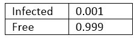

Virus CPT (Conditional Probability Table)

这张表显示，只有 1/1000 的人有这种病毒。这就等于说:1000 人中有 999 人没有感染这种病毒。

现在我们做一个类似的测试表:第二个表显示了测试的准确性。这就是测试辨别真伪的能力。因此，如果你被感染了，测试将有 99%的机会是真的，如果你没有被感染，测试将显示假的(99%准确),在这两种情况下错误率是 1%

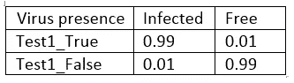

Test1 CPT (Conditional Probability Table)

下图显示了测试结果中的病毒存在取决于测试(如上表所示):

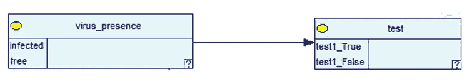

A simple and empty simple bayesian network

然后当我给出证据证明测试是真的。网络显示，在一次检测呈阳性的情况下，病毒在你身体上的存在率仅为 9%！

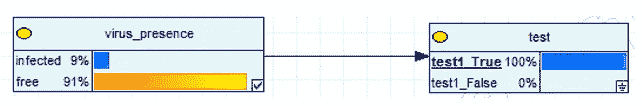

The same bayesian network with the evidence loaded of one positive test

**为什么会这样？**这个数来自贝叶斯定理:

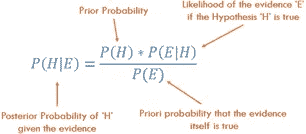

在这个问题中:

𝑃(H|E) = 𝑃(H) × 𝑃(E|H) / 𝑃(E)

𝑃(h|e)= 𝑃(h)×p(e | h)/(𝑃(e|h)×𝑃(h)+𝑃(e|hc)×𝑃(ec)

𝑃(h|e)= 0.99 * 0.001/(0.001 * 0.99+0.999 * 0.01)= 0.9 = 9%

# 所以，即使你做了 99%准确的测试，患这种疾病的几率也只有 9%

这种计算看起来很复杂，但是一旦用图表表示出来，我们对贝叶斯思维的工作方式就有了更好的直觉。

**针对两项测试:**

如果你参加第二次考试会怎么样？假设这个新测试也有 99%的准确率，我们有和第一个测试一样的表:

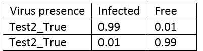

Test2 CPT (Conditional Probability Table)

对应的贝叶斯网络将是下一个:

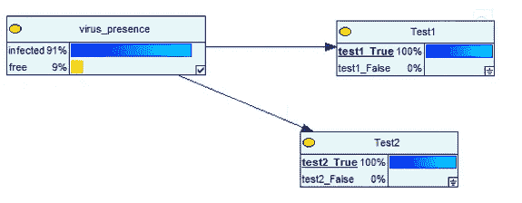

Bayesian network for two positive test

这意味着:对于两个阳性测试，患病的机会增加到 91%。上传之前的经验。这是一致的，患这种病的几率从 9%上升到 91%。但还不是 100%！

在另一种情况下，如果第二次测试是阴性的，有 100%的机会没有患病。

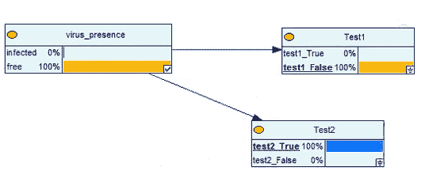

Bayesian network for one positive test and one negative test

**针对三项测试**

在三次测试的情况下，所有测试都具有相同的准确度，我们看到一些有趣的结果。如果你有证据证明 3 个测试都是真的，现在就 100%确定你感染了病毒。

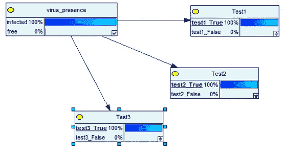

Bayes network for three positive test

但是由于一次测试是错误的，结果又变了，只有 91%的可能性病毒存在于你的体内:

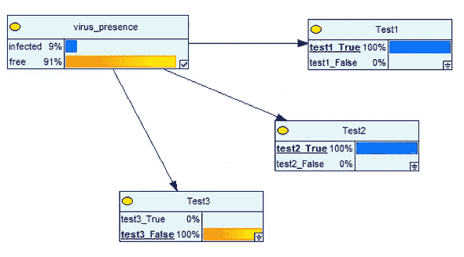

总之*、*、**、*贝叶斯网络有助于我们表现贝叶斯思维*、**，当要建模的数据量适中、不完整和/或不确定时，可以用在数据科学中。他们也可以利用专家的判断来建立或完善网络。它们允许“模拟”不同的场景。它们表示输入值(在本例中为病毒存在和测试的准确性)如何与输出的特定概率水平(实际患病的概率)相关联

在这篇文章中，我解释了如何建立贝叶斯网络，从贝叶斯定理开始。我目前正在研究贝叶斯网络来预测项目的成本和风险。我想分享一下构建如此强大的 [AI 工具](https://medium.com/@fesan818181/from-classic-ai-techniques-to-deep-learning-753d20cf8578)的基础知识。

**如果你想知道更多关于贝叶斯网络的知识:**

关于模型源轴上理论和数据之间的水平划分，贝叶斯网络有一个特殊的特征。贝叶斯网络可以从人类知识中构建，即从理论中构建，或者可以从数据中由机器[学习。因此，他们可以使用整个光谱作为模型源。此外，由于它们的图形结构，机器学习贝叶斯网络是视觉上可解释的，因此促进了人类的学习和理论建设。](/supervised-learning-algorithms-explanaition-and-simple-code-4fbd1276f8aa)[在这篇文章中，我](/how-to-implement-the-right-ai-technique-for-your-digital-transformation-projects-part-1-b3a628b6ff56)比较了 BN 和 S [监督学习算法](/supervised-learning-algorithms-explanaition-and-simple-code-4fbd1276f8aa)以及强化学习。

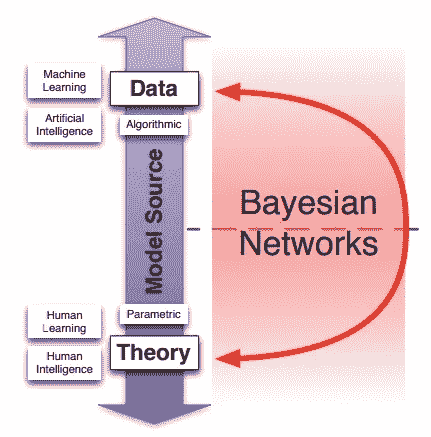

贝叶斯网络允许人类学习和机器学习协同工作，即贝叶斯网络可以从人类和人工智能的结合中开发出来。除了跨越理论和数据之间的界限，贝叶斯网络还具有关于因果关系的特殊性质。

然而，这种协作并不简单，为了构建贝叶斯网络，有必要适当地选择几个超参数。

在某些条件下，通过特定的理论驱动的假设，贝叶斯网络有助于因果推理。事实上，贝叶斯网络模型可以覆盖从关联/相关到因果关系的整个范围。

在实践中，这意味着 w [e 可以将因果假设(例如使用合成节点)](/bayesian-networks-and-synthetic-nodes-721de16c47e2)添加到现有的非因果网络中，从而创建因果贝叶斯网络。当我们试图模拟一个领域中的干预时，例如估计治疗的效果，这是特别重要的。在这种情况下，使用因果模型是非常必要的，贝叶斯网络可以帮助我们实现这种转变。

链接到这篇文章的完整研究可以在下一个链接中找到(这篇文章直到 2020 年 6 月都是免费的)

 [## 一种基于贝叶斯网络的提高项目管理成熟度的方法

### 提出了一种建立项目管理成熟度和项目超额成本之间因果关系的方法

www.sciencedirect.com](https://www.sciencedirect.com/science/article/pii/S0166361519309480?dgcid=author) 

# **感谢阅读！！**

如果你想继续关注如何建立贝叶斯网络，查看这篇文章:

 [## 贝叶斯网络中的超参数调整问题

### 在这段历史中，我们讨论了在基于贝叶斯理论建立模型时要考虑的结构标准

towardsdatascience.com](/the-hyperparameter-tuning-problem-in-bayesian-networks-1371590f470) 

如果你想了解更多关于贝叶斯网络的数学知识，以及如何用它们创建模型，请查看这篇文章:

 [## 贝叶斯网络和合成节点

### 在这篇文章中，我给出了一个更正式的观点，并讨论了建模的一个重要元素:合成节点。

towardsdatascience.com](/bayesian-networks-and-synthetic-nodes-721de16c47e2)