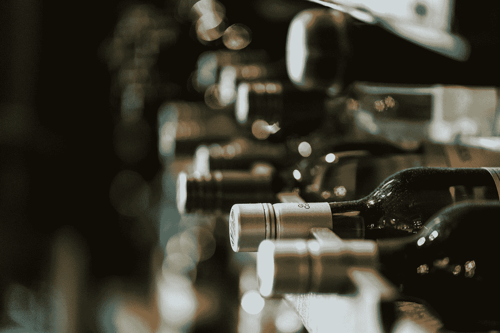
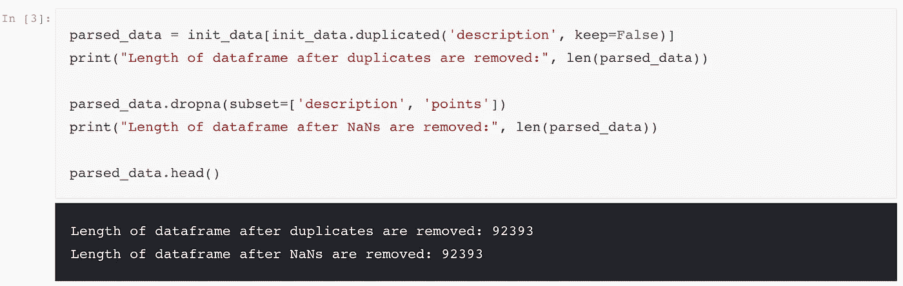
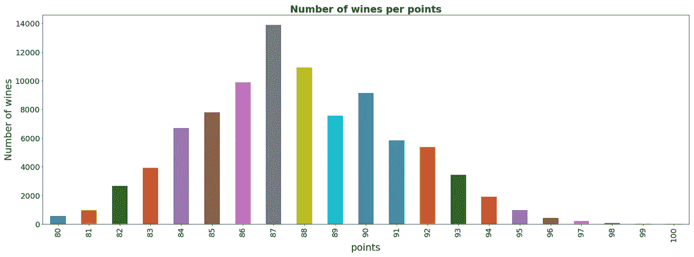
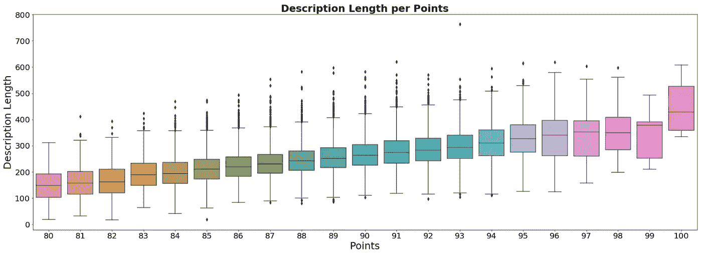
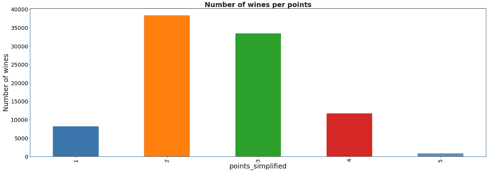
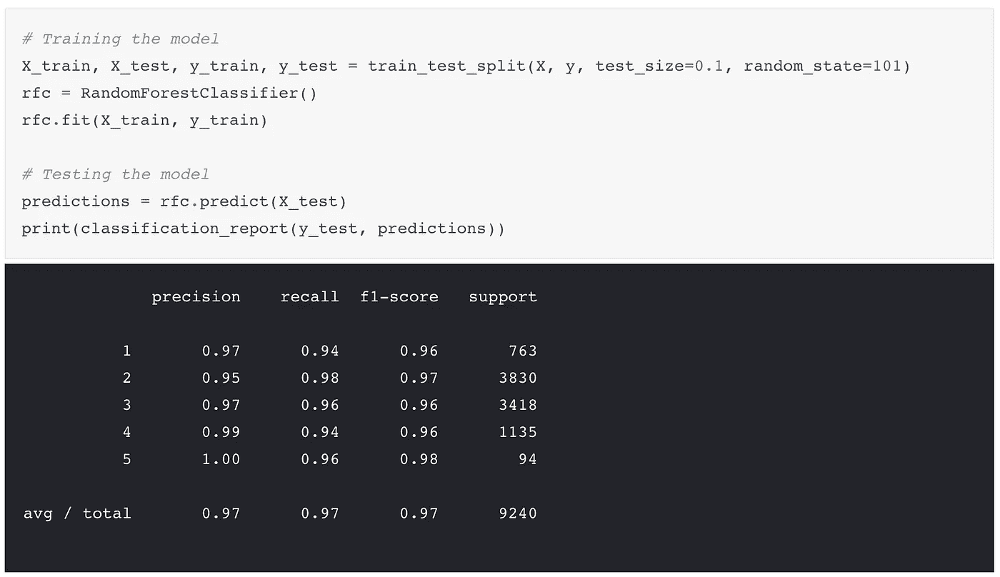

# 基于机器学习的葡萄酒等级预测

> 原文：<https://towardsdatascience.com/wine-ratings-prediction-using-machine-learning-ce259832b321?source=collection_archive---------4----------------------->

Photo by [Hermes Rivera](https://unsplash.com/@hermez777?utm_source=medium&utm_medium=referral) on [Unsplash](https://unsplash.com?utm_source=medium&utm_medium=referral)

我没有一天不从同事、黑客新闻等那里听到“机器学习”、“深度学习”或“人工智能”之类的话。现在的炒作超级强大！

在阅读了一些关于 ML 的书籍、文章、教程之后，我想从这个理论初级水平毕业。我需要在一个真实的例子上做实验。当主题是让我感兴趣的东西时，效果会更好。所以对于这个做法，我挑了酒(> <)。
酒牛逼，不得不说！我能说吗？嗯，太牛逼了！

喝葡萄酒这么多年来，在买一瓶酒之前，我一直在寻找一样东西:评级。以各种形式:要点、描述等…

我们设定了一个简单的目标:有没有可能通过机器学习，根据葡萄酒的描述来预测它的等级？
有人称这为情感分析，或文本分析。开始吧！

# 资料组

好吧，我不得不承认，我很懒。我不想为像 Robert Parker，WineSpectactor…
这样的葡萄酒杂志写文章，但幸运的是，在谷歌搜索了几下后，在一个银盘上发现了天赐数据集:收集了 WineMag 的 13 万种葡萄酒(包括评级、描述、价格等等)。

顺便说一下，感谢 [zackthoutt](https://www.kaggle.com/zynicide) 提供了这个令人敬畏的数据集。

# 先看数据

与通常的数据集一样，我学会了删除重复项和 NaN 值(空值):

我们只剩下 92k 的葡萄酒评论，足够玩了！
现在让我们看看数据集的分布。在我们的例子中，它是每点的葡萄酒数量:

83 到 93 分的酒很多。这也是符合市场的(好酒不多)。

作为一个有趣的注意，只是通过阅读一些数据，我发现葡萄酒越好，描述似乎越长。人们渴望对他们真正欣赏的葡萄酒发表更长的评论，这有点合乎逻辑，但我不认为数据会如此重要:

# 模型

看起来我们的数据集有太多的可能性。这可能会加重预测的负担。一瓶 90 分的葡萄酒和一瓶 91 分的葡萄酒并没有太大的不同，所以描述可能也没有太大的不同。

我们试着用 5 个不同的值来简化模型:
1 - >分 80 到 84(一般葡萄酒)
2 - >分 84 到 88(一般葡萄酒)
3 - >分 88 到 92(好酒)
4 - >分 92 到 96(非常好的葡萄酒)
5 - >分 96 到 100(优秀葡萄酒)

现在让我们看看我们的新发行版:

# …向量化…

如今，用最大似然法对文本进行分类的最简单的方法之一被称为词袋，或矢量化。

基本上，你希望在一个向量空间中表示你的文本，并与权重(出现的次数等)相关联，这样你的分类算法将能够解释它。

一些矢量化算法是可用的，最著名的(据我所知)是:
- CountVectorizer:如其名称所述，简单地通过单词计数进行加权
- TF-IDF 矢量化:权重随着计数成比例地增加，但是被单词在整个语料库中的频率所抵消。这被称为 IDF(逆文档频率)。这使得矢量器可以用“the”、“a”等常用词来调整权重

# 训练和测试模型

在机器学习中，这是测试的最后一部分。
您希望用数据集的一部分来训练模型，然后通过将数据集的剩余部分与预测进行比较来测试其准确性。

对于这个实验，90%的数据集将用于训练(大约 80k 酒)。10%的数据集将用于测试(约 9k 酒)。

我们将使用的分类器是 RandomForestClassifier (RFC)，因为它很酷，并且在许多情况下都工作得很好(>)尽管严重的是，RFC 不如其他一些分类器有高性能(内存和 cpu 方面)，但我总是发现它在处理小数据集时非常有效。

# 结果

Sugoiiii！这是一些惊人的结果！97%的情况下，我们仅仅根据葡萄酒的描述就能正确预测它的质量。
让我们快速浏览一下这些数字及其含义:
-精度:0.97 - >我们没有很多假阳性
-召回:0.97 - >我们没有很多假阴性
(F1-考虑精度和召回的分数)

# 结束注释

这些结果非常棒，但我们肯定可以改进它:
-所有数据(训练和测试)都来自 WineMag。拥有一些其他葡萄酒杂志的评级将会改进这个模型，使它更通用
- RFC 是一个很好的分类器，但是占用了大量的内存和 CPU。也许对于一个更大的数据集，多项式朴素贝叶斯会更好，性能更高
——我们没有过多地查看其他列(地区、价格等)。我们可以将它们二进制化/编码以进行分类。
-将代码发布为 Flask 或 Django API 将是一件很好的事情

# Kaggle 笔记本

所有数据集和 python 代码都可以在:
[https://www . ka ggle . com/olivierg 13/wine-ratings-analysis-w-supervised-ml](https://www.kaggle.com/olivierg13/wine-ratings-analysis-w-supervised-ml)获得

一会儿酒厂见！(>