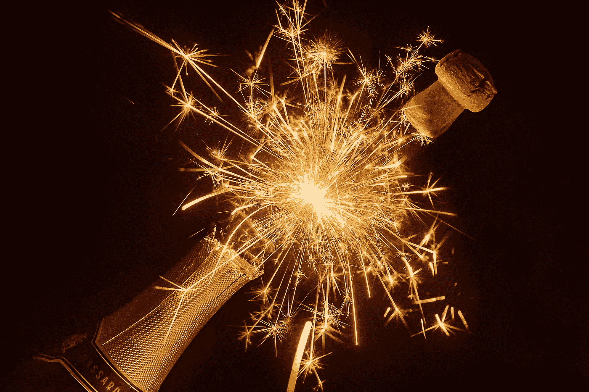
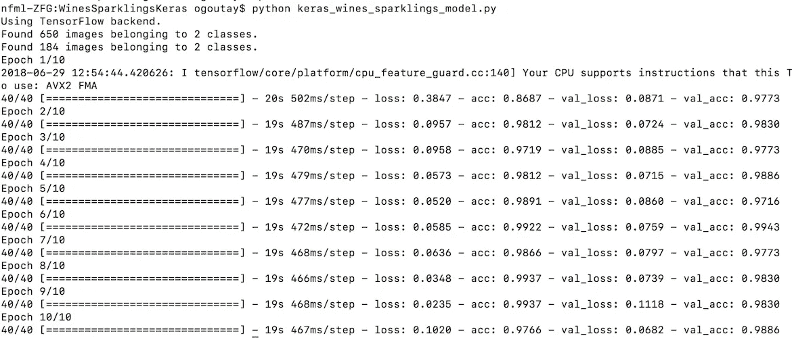
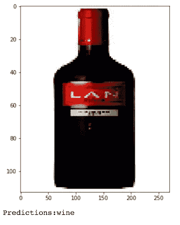
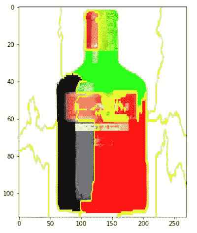
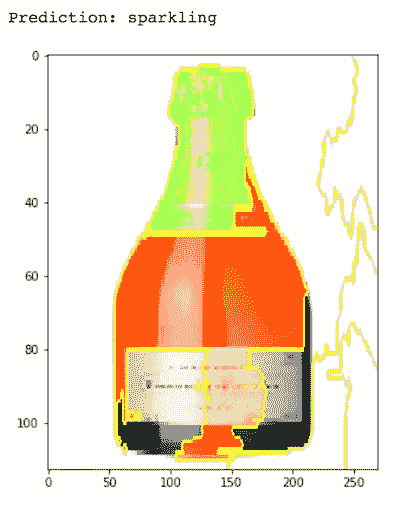

# 葡萄酒与起泡酒:一个神经网络图像分类解释

> 原文：<https://towardsdatascience.com/wine-vs-sparkling-wine-a-neural-network-image-classification-explained-99a6ac477bfa?source=collection_archive---------7----------------------->



[pixabay.com](https://pixabay.com/fr/photos/champagne-cierges-magiques-li%c3%a8ge-4734176/)

如果你看了我[之前的帖子](/wine-ratings-prediction-using-machine-learning-ce259832b321)，你就知道我喜欢酒。嗯，事实是，我不是特别喜欢汽酒！(☉_☉)

对于我第二次深入机器学习，我想看看卷积神经网络(CNN)对图像分类的可能性。顺便说一下，CNN 并不代表新闻频道(◠‿◠)

最近，一个朋友建议我去查看 Keras，这是一个神经网络库，超级容易使用，由谷歌的[弗朗索瓦·乔莱](https://medium.com/u/7462d2319de7?source=post_page-----99a6ac477bfa--------------------------------)开发。让我们马上进入正题，这个库太棒了:超级容易使用，超级高性能，文档写得很完美。你还能要求什么？

这个实验的目的是了解葡萄酒和起泡酒的图像的识别程度，或者简单地说，这种模型的精确度。

# 什么是 CNN？

我鼓励你阅读这篇写得很好的[文章](https://medium.freecodecamp.org/an-intuitive-guide-to-convolutional-neural-networks-260c2de0a050)，它详细解释了什么是 CNN。

简言之，CNN 在两个主要方面不同于常规的机器学习算法:

*   它由不同的过滤器(内核)和分类器组成。每个部分都是独立的，就像我们大脑的一部分，如果需要，CNN 可以删除、更新和调整这些部分。


Architecture of a CNN. — Source: [https://www.mathworks.com/videos/introduction-to-deep-learning-what-are-convolutional-neural-networks--1489512765771.html](https://www.mathworks.com/videos/introduction-to-deep-learning-what-are-convolutional-neural-networks--1489512765771.html)

*   CNN 将从经验中学习。它有能力回到数据集并从以前的训练中学习，例如，对效果最好的过滤器或分类器进行更多的加权。对数据集的一次迭代称为一个时期。

# 数据集

我为了这个不偷懒，就刮了一个不怎么出名的酒类网站。

结果是一个由 700 幅训练图像和 200 幅测试图像组成的数据集，足够用了。下一步就是简单地将 Keras 的博客例子调整到这个数据集。

# 训练和测试模型

为了你自己，我不会把这个项目的所有代码都粘贴在这里，但是 Github 的链接在本文的最后。

那么 Keras 是如何进行图像分类的呢？我认为有几个重要的部分:

*   构建您的神经网络模型:遵循文档

```
model = Sequential()
model.add(Conv2D(32, (3, 3), input_shape=input_shape))
model.add(Activation('relu'))
model.add(MaxPooling2D(pool_size=(2, 2)))[...More CNN layers...]model.compile(loss='binary_crossentropy', optimizer='rmsprop', metrics=['accuracy'])
```

*   使用 ImageDataGenerator 为模型提供更广泛、更多样的生成图像集

```
train_datagen = ImageDataGenerator(rescale=1\. / 255, shear_range=0.2, zoom_range=0.2, horizontal_flip=True)
```

*   训练和测试您的模型

```
model.fit_generator(train_generator, steps_per_epoch=nb_train_samples, epochs=epochs, validation_data=validation_generator, validation_steps=nb_validation_samples)
```

*   最后拯救你的体重和模型

```
model.save_weights('wines_sparklings_weights.h5')
model.save('wines_sparklings_model.h5')
```

运行 python 文件将输出类似这样的内容(10 个历元后精度约为 99%):



# 解释模型

可解释的人工智能今天被大肆宣传，所以我想给它一个机会。训练一个模型并信任它不是一件容易的事情。验证您的模型实际上不是纯粹偶然地神奇地对图像进行分类是一件好事，特别是如果它是一个真实的项目，并且将被推向生产环境。

我很幸运，不久前，Lime 库在 Github 上发布了，它最近获得了对 Keras 图像分类的支持。我想试一试！

在[笔记本](https://github.com/olivierg13/WinesSparklingsKeras/blob/master/keras_wines_sparklings_explanations.ipynb)上，我首先展示了一幅葡萄酒的图像，并使用我们之前训练过的 Keras 模型进行了预测:

```
show_img(wine_image[0])
print(model.predict(wine_image))
```



Using pyplot to show the image and printing the prediction

酷，预测是对的，用 pyplot 显示图像。下一步是使用石灰显示图像的哪些部分影响了分类决策:

```
# Explain
explanation = explainer.explain_instance(wine_image[0], model.predict, top_labels=2, hide_color=0, num_samples=1000)# Show image with explanation's masks
temp, mask = explanation.get_image_and_mask(0, positive_only=False, num_features=10, hide_rest=False)
show_img(mark_boundaries(temp / 2 + 0.5, mask))
```



Positive influence in Green, Negative in Red

很好。正如所料，葡萄酒的软木塞不同于气泡瓶(影响葡萄酒决策的绿色部分)。起泡的瓶子上的标签通常也较低，瓶子的形状较薄(红色部分影响非起泡的决定)。我用一瓶起泡葡萄酒继续分析:



Positive influence in Green, Negative in Red

此外，正如所料，瓶子的顶部和软木塞的形状积极地影响了对起泡葡萄酒的决定，以及瓶子本身的形状影响了对非葡萄酒的决定。

# 结论

总之，我们有一个超级有效的 CNN 模型，用大约 100 行代码训练和保存。我们知道这不仅仅是魔法在发生，因为我们解释了图像中识别的模式。

有哪些可以改进的地方？

*   拥有更加多样化的图像数据集。老实说，这个场景很容易操作，因为背景是白色的。
*   多解释几个图像。为解释而挑选的两张图片相当标准。解释模型做出错误预测的情况也很有趣。
*   将这个模型发布为 Flask/Django API，并编写一个移动应用程序，让人们用他们手机的图片来训练它

# 链接

*   美国有线电视新闻网(CNN):https://github.com/keras-team/keras
*   Keras 博客:[https://Blog . keras . io/building-powerful-image-class ification-models-using-very-little-data . html](https://blog.keras.io/building-powerful-image-classification-models-using-very-little-data.html)
*   石灰库(型号说明):[https://github.com/marcotcr/lime](https://github.com/marcotcr/lime)
*   本文的代号:[https://github.com/olivierg13/WinesSparklingsKeras](https://github.com/olivierg13/WinesSparklingsKeras)