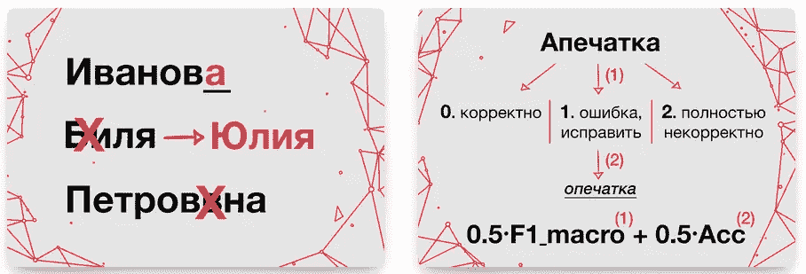
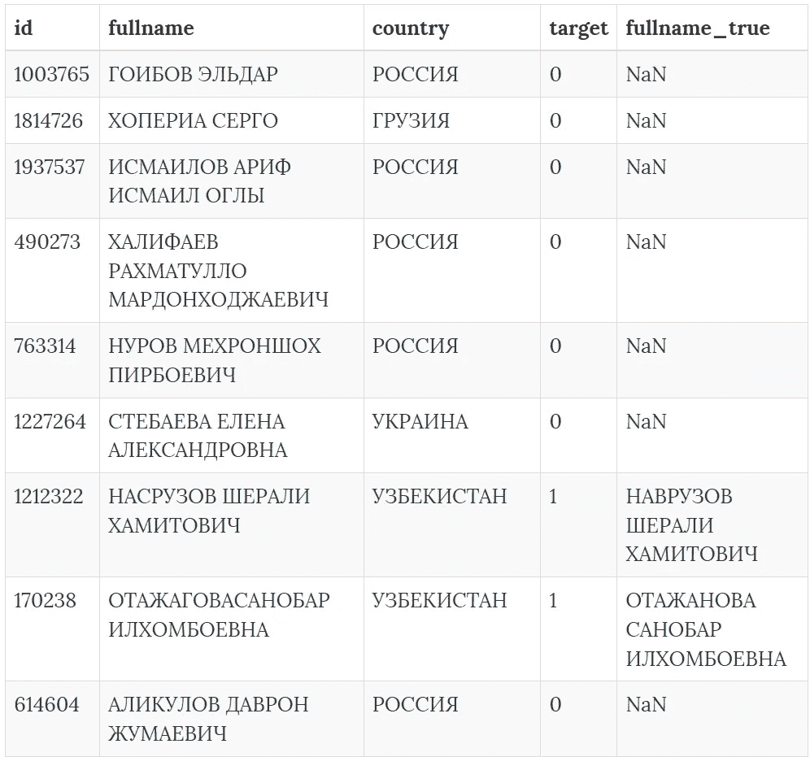
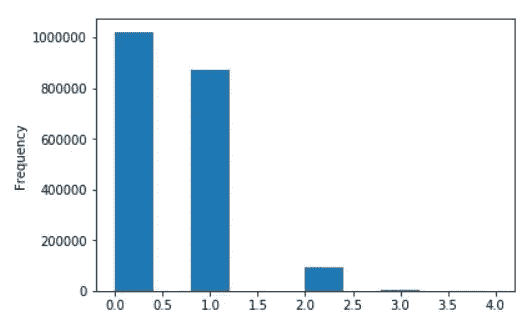
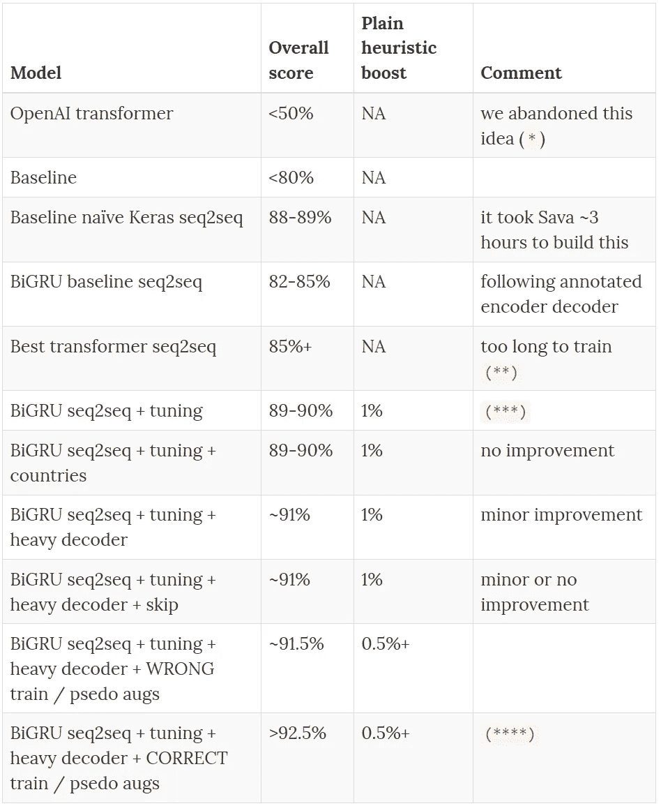
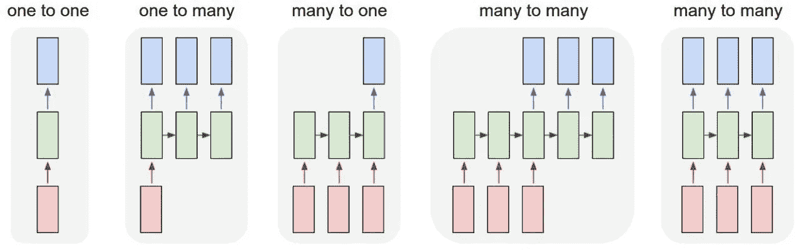
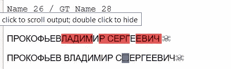
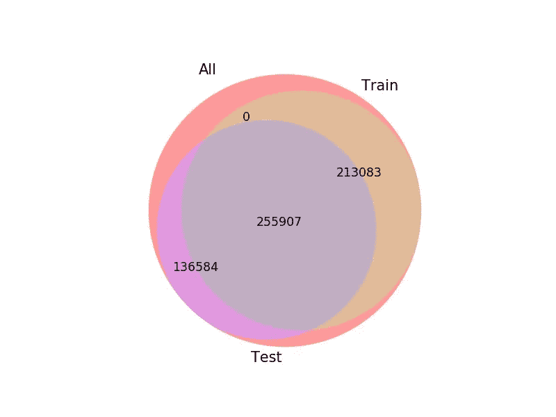
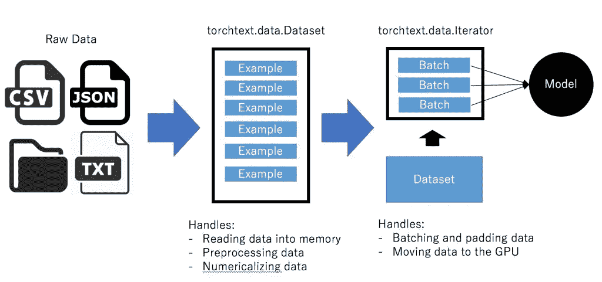

# 赢得 CFT 2018 拼写纠正比赛

> 原文：<https://towardsdatascience.com/winning-a-cft-2018-spelling-correction-competition-b771d0c1b9f6?source=collection_archive---------14----------------------->

# 或者在一个具有挑战性的领域中构建一个任务无关的 seq2seq 管道


*这是我们第一次一起赢得 ML 比赛*

一篇简短的哲学序言。

我们作为 [Profi.ru](https://profi.ru/) 团队(你真正的+ Dmitry Voronin 帮了点忙)和 Sava Kalbachou([Lucidworks](https://lucidworks.com/))参加，她是我在许多比赛中的老朋友，也是 NLP 的专家。对我们团队来说，这是一次漫长、艰难、紧张而又意外收获的旅程。

用一句话概括所有的经历— **旅程比目的地更重要**。这场比赛教会了我们很多关于坚持不懈，尝试新事物，跌倒了再站起来。

我个人为此任务编译/优化了 3 或 4 个管道，直到我能构建出最好的一个。同样，像往常一样，我们在终点线 xD 前一天发现了一个关键错误

# TLDR



我们设法将一些当前最先进的序列到序列模型应用于混合多任务/自动编码器设置中具有挑战性的领域中的真实`in the wild`问题。

任务的核心是——文本输入分类(**正确/需要纠正/随机不相关垃圾**)和输入纠正(本质上是拼写检查)。

**域名是——来自独联体国家的个人姓名:**

*   主要是俄罗斯、摩尔多瓦、乌兹别克斯坦、格鲁吉亚、塔吉克斯坦、哈萨克斯坦、乌克兰等；
*   名字通常由三部分组成(名、姓、父名)——`Иванов Иван Иванович`。有时在某些共和国，父名有附加的后缀作为第四个单词(`ОГЛЫ`，与俄语中的`вич`后缀相同，但却是一个独立的单词)；
*   有 2+个字母，总共约 70+个字符+数据中的大量噪声；

**最有效的模型**

*   序列间:
*   调优的序列间双向 GRU(详见下文)——`92.5%`wo 启发式、`93%` with 启发式、`93%+`in ensemble；
*   适当的序列间推理循环；
*   此外，Keras 中一个没有瓶颈且带有 Conv1D 输出层的更简单模型运行良好，最高得分为`88-89%`；
*   最强的天真启发法—如果 seq2seq 推理循环的输出与输入相同—那么输入是正确的；

**关键要点:**

*   Seq2seq transformer 花了**更多的时间来训练**，我们没能让它像传统模型一样工作。显然我们缺乏这方面的经验，但这是我第四次注意到**真人**提到《变形金刚》不适合“真人”(即不实用)；
*   我们的主要竞争对手(有大约 200 份提交)根本没有使用深度学习——他**基本上对主机**的增强管道进行了逆向工程——这是一项艰巨的工作，但无法扩展到其他领域；
*   批量 seq2seq 预测是快速推断的关键；
*   Beam search 虽然很难实现，但**对分数的提升并不显著**(明显的罪魁祸首——小词典)；

# 域/数据集描述

一个例证胜过千言万语。另请注意，在 train + test 中有大约 2000 个国家，即国家输入也非常嘈杂。

我们最终没有使用国家——因为添加国家嵌入并没有提高我们的指标



比赛的主持人也分享了一个强大而简单的[基线](https://github.com/datasouls/cft2018-fiotypos/blob/master/baseline/baseline.ipynb):

*   一个基于 n 元文法的线性回归分类器:
*   简单使用第三方库来纠正印刷错误；



*The distribution of the number of errors per query*

# 代码发布

我们不会费心复制整个培训过程(由于我们与竞赛主办方的协议)，因为有许多微调步骤，但总体而言**这些部分将可为您重复使用**:

*   [准备](https://github.com/snakers4/cft-contest-2018/blob/master/src/preprocessing_av.ipynb)竞赛数据集(见笔记本第一章)；
*   如果您在环境中遇到问题(当构建映像时，PyTorch 4.0 或 4.1 是主要版本，瞄准它，否则您将不得不使代码兼容)；
*   Keras 模型:

```
python preprocessing.py python spell_simple_seq2seq_train_predict.py
```

*   PyTorch BiLSTM seq2seq:
*   最佳模特培训:[utils](https://github.com/snakers4/cft-contest-2018/blob/master/src/pytorch/encoder_decoder_utils.py)；
*   最佳模特[类](https://github.com/snakers4/cft-contest-2018/blob/master/src/pytorch/encoder_decoder.py)；
*   最佳火车模型[流水线](https://github.com/snakers4/cft-contest-2018/blob/master/src/train_encoder_decoder_predict.py)；
*   典型的启动命令(标志名称不言自明):

```
CUDA_VISIBLE_DEVICES=0 python3 train_encoder_decoder_predict.py \ --resume weights/some_checkpoint.pth.tar \
 --heavy_decoder True --lr_factor 0.5 \
 --trn_df_path ../data/pseudo_aug2_proc_trn.csv \
 --tb_name test_name \
 --lr 1e-6 --epochs 100 \
 --batch_size 128 \
 --hidden_size 512 --dropout 0.2 \
 --num_layers 4 --num_classes 3 --emb_size 512 \
 --cn_emb_size 0 --num_cn 0 \
 --tensorboard True \
```

# 实现我们结果的关键里程碑



This is how our scores improved

*   `(*)`很可能我们没有在这方面投入足够的时间，但是基础管道的目标不同，所以我们放弃了这个想法；
*   `(**)`尽管最大的合理 BiGRU 模型训练了 15-20 个小时，但这将在一个 GPU 上训练至少一周才能达到类似的结果；
*   `(***)`车神大多腐朽，MOAR 层层！；
*   `(****)`我们两次在生成扩充数据时出错。起初，我在 50%的情况下混合了两列(源和目标)——并且模型一开始训练得更好。然后，我忘记了在扩充数据时更改目标标签



请参考这些**惊人的文章**了解我们使用的型号的更多螺母和螺栓:

**什么有效:**

*   用 biLSTMs ( `91%+`)进行序列对序列建模；
*   验证与 LB 精确匹配——我们没有尝试 K 倍验证，但是预先分割数据集已经足够精确；
*   使用简单的管道清除多余的字符和明显的错误；
*   伪标签和文本扩充(单个模型上的`91%`+`1.5%`)；
*   使用“整个”训练数据集，即使用所有正确的名称作为“正确的”名称，并使用所有不正确的名称。与额外的扩充(1 倍大小的训练数据集)配对—结果是我们单一的最佳预处理管道(单一模型上的`91%`+`1.5%`)；
*   后处理试探法(见下文)；
*   运行基于批次的推理循环(在带注释的编码器、解码器和转换器中，预测以批次大小为 1 进行处理)；

# 不可行的想法/解决方案/模式，或者我们没有尝试

*   [BPE /例句](https://github.com/google/sentencepiece) —我们尝试了几种词汇(500、1500、5000 令牌大小等。)通过句子片段在无监督的情况下获得。但它并没有真正帮助模型更快地收敛，结果比我们预期的更糟；
*   [波束搜索](https://github.com/snakers4/cft-contest-2018/blob/master/src/pytorch/encoder_decoder_utils.py#L353) —最有可能是因为模型置信度和词汇量小。它提高了一点分数，但没有提供太多的价值。这是一个棘手的问题，但我很失望，它没有我们预期的那样有效；
*   transformer model——当我采用并优化带注释的 transformer [管道](http://nlp.seas.harvard.edu/2018/04/03/attention.html)时，它工作了，但未能在有意义的时间内收敛；
*   来自开放 AI transformer 实验的 LM 辅助分类器——它根本没有收敛，很可能是因为它缺乏一个正确的 seq2seq 推理循环，对我来说这是一个容易实现的结果(我刚刚准备好这个管道，而 Sava 吹嘘他的初始 88%管道)；
*   多 GPU /集群/分布式训练——没试过；
*   动态运行增强——我相信你可以在 torchtext 中扩展这个[行](https://github.com/pytorch/text/blob/master/torchtext/data/iterator.py#L257)来这样做，但是我推迟了一点，然后就没有时间这样做了。但根据我的经验，这可能会使收敛速度加快 3 到 10 倍；

# 文本数据扩充

经过一些逆向工程过程(顺便说一下，基于单词 ngrams)，结果证明，组织者使用非常简单的错别字生成方法。有 5 种主要类型:

*   **插入**，最主要的类型( *~所有病例的 50%* )。只是在单词中随机取一个字母，并在它的前面或后面插入一个新字母。一个新字母是一个随机选择的最接近的字母(在键盘上)，例如，字母 **W** 、 **S** 或 **A** 如果选择了 **Q** 。**伊万**——**ICVAN**；
*   **改变**、 *~30%* ，只是将一个单词中的任意一个字母在一个 keybord 上改变成与其最接近的 random(就像**插入**的情况)。**伊万**—**IVQN**；
*   **Wwap** 两个最近的随机字母的位置， *~5%* 。**伊万**——**张牧阅**；
*   **两个字之间删除空格**，*~ 7.5%*；
*   **删信**(完全随机*~ 7.5%*)**伊凡**——**凡**；

每个有错别字的查询都包含上面列出的一个( *93%* )两个( *6%* )或三个( *~1%* )错误的组合。

因此，我们设法编写了自己的函数来生成额外的数据集，并将其与原始数据集一起用于训练。



# 后处理启发法

在建立第一个 seq2seq 模型后，我们注意到，有时模型预测类 0(短语不包含错误)，但预测的短语与原始短语不同。我们将此作为一种启发，将预测类从 0 更改为 1(短语包含错误)，这给了我们 0.5-1.5%的提升，这取决于模型的质量(对于强模型来说更少)。

另一个启发是在我们确定预测中有错误(模型预测类别 1，但是预测短语等于原始短语)的情况下，将预测类别/短语改变为来自完全不同的模型(如 Keras one)的预测。

# 不起作用的试探法，或者我们没有探索的试探法

在某个时刻，我们注意到，与“新”单词(名字/姓氏/父名)相比，网络更有可能在它“知道的”单词上犯错误。这意味着网络泛化能力很好，但尽管如此，我们还是尝试应用一种明显的启发式方法进行测试，本质上类似于伪标签。

显然，我们尝试使用字典启发式，即检查预测的单词是否出现在名称的词汇表中。它在验证上提供了显著的提升，但是在测试上没有提供合理的提升(很可能是因为有很少的名字被预测错误和/或在训练中不存在)。显然，我们试图添加预测的“正确”测试名称，但这没有帮助。



训练与测试单词字典重叠

# 集合模型

正如在比赛中经常发生的那样，在接近终点的某个时候，你必须做一些堆叠/组装来继续比赛并保持在 LB 的顶端。这场比赛也不例外。

我们使用拒识验证数据来寻找最佳的组合方式及其参数。对于分类的第一个任务，我们使用了各种不同模型预测概率的几何平均值。对于域名更正的第二步，我们实现了简单多数投票机制，该机制应用于预测域名的每个令牌。在每一步之后，也使用上述试探法。

这个简单而有效的组合给了我们最终 0.003%的提升和第一名。我们选择它和最佳单曲作为我们的两个最终提交:


# 改进带注释的编码器-解码器和带注释的转换器

如您所知，biLSTMs / biGRUs 和 transformers 是市场上最具挑战性的型号，例如:

*   神经机器翻译；
*   文本抽象；
*   序列对序列建模；
*   文本推理任务；

当重用这些教程[编码器解码器](https://bastings.github.io/annotated_encoder_decoder/)和[注释变压器](http://nlp.seas.harvard.edu/2018/04/03/attention.html)中的恒星管道时，我们站在巨人的肩膀上。

但是就像我们生活中的一切一样，它们并不完美。

**关键缺点:**

*   两者中的预测都是以一个批量处理的。当您运行大量端到端实验时，这并不理想；
*   带注释的编码器/解码器拥有损失加权，但没有解释当将其与次要目标配对时(就像我们的情况)，你必须格外小心加权损失的两个分量，以避免在一个任务上过度/不足；
*   虽然 torchtext 对于它的构建目的(加速 NMT 实验)——对于应用竞争 NLP 管道——来说是令人敬畏的，但是它有点慢和笨重，并且种子参数不直观。或许我应该更好地解决缓存问题，但我选择了最简单的解决方案，即我下面解释的 CSV 文件；
*   我完全理解 PyTorch 中的分布式/数据并行例程有点实验性，并且需要大量维护，但 ofc 注释的变形金刚多 GPU loss compute 函数在`PyToch 0.4+`中出现。我决定不解决这个问题，但是也许我应该解决，特别是对于变形金刚；

# 批量预测和波束搜索

在训练和验证模型时，这两种方法都非常注重有效地运行模型。但是由于某些原因，教程中介绍的推理贪婪搜索循环是为大小为 1 的批处理编写的。

您可能知道，这将使端到端验证速度降低了 10 倍。所以，我基本上写了 3 个函数:

# 所有这些来自 torchtext 的抽象…如何烹饪它们



显然这些是为 NMT 建造的。它们还以张量的形式将所有数据加载到 RAM 中，以加快迭代速度(在使用这些数据时，最好使用 python 中的迭代器，以避免更多的 RAM 使用)，这与标准的 PyTorch Dataset / Dataloader 类不同，后者更灵活一些。

**这些抽象的优点:**

*   代码重用和简单性；
*   它们是……高层次、抽象的；
*   创建、描述和预处理数据集的步骤简单且简化；
*   繁琐的步骤，如添加开始令牌，结束令牌，独特的令牌，填充令牌只是为你做的；
*   一旦掌握了拆分和字典构建——替换您的文本预处理函数来尝试不同的标记化方案就变得非常容易(例如检查这个[一个](https://github.com/snakers4/cft-contest-2018/blob/master/src/pytorch/encoder_decoder_utils.py#L111)和这个[一个](https://github.com/snakers4/cft-contest-2018/blob/master/src/pytorch/encoder_decoder_utils.py#L108))；

**缺点**:

*   在构建字典以使相同模型的重新运行兼容时，您必须非常小心泄漏(这实际上在开始时让我有点受不了)；
*   显然，这种开箱即用的方法只适用于数字和文本数据。任何其他形式的数据——你必须即兴创作/扩展类；
*   我不喜欢在那里实现拆分的方式——所以我们最终通过拆分一个单独的`.csv`文件来创建一个 hould out 数据集；
*   如果你有很多数据(例如 1000 万个输入目标对)，RAM 消耗非常高，所以如果你想有更多的数据/使用扩充，你基本上必须修改/扩展这些类；
*   虽然理论上扩展这些类来阅读`.feather`而不是`.csv`是很容易的，但是由于缺乏时间和注意力不集中，我没有这样做；
*   pickle 问题——由于读取`.csv`文件很慢，我试图 pickle 一些明显的对象——但是失败了——迭代器/生成器在 python3 中是不可 pickle 的。我想我应该用 dataset 类(而不是 BucketIterator 类)来完成它；

# 典型风味

在某个时候，我注意到在我们的最佳模型中有两个瓶颈:

*   由于编码器是双向的，而解码器不是双向的，因此编码器和解码器之间的传输成为瓶颈。所以简单地说，我通过把我的解码器[增大两倍](https://github.com/snakers4/cft-contest-2018/blob/master/src/pytorch/encoder_decoder.py#L22)解决了这个问题(它帮助我的模型收敛)；
*   我还尝试了添加[国家嵌入](https://github.com/snakers4/cft-contest-2018/blob/master/src/pytorch/encoder_decoder.py#L64)和添加[跳过连接](https://github.com/snakers4/cft-contest-2018/blob/master/src/pytorch/encoder_decoder.py#L36)和一个本质上类似于从抽象模型中复制注意力的注意力层——这些想法对我不起作用；
*   我还玩了本质上的[丢弃](https://github.com/snakers4/cft-contest-2018/blob/master/src/pytorch/encoder_decoder.py#L53)嵌入(字符级模型)，结果很差；另一方面，Keras 模型在 char 级别比使用嵌入工作得更好。

值得注意的是，最好的模型是相当沉重的，沉重的解码器也增加了相当多的时间。

# 损失权重至关重要！

我没有为此运行消融测试(虽然我有很多在 2-3 次丢失的情况下对象检测失败的经验)，但我假设由于丢失基本上被应用于语言建模目标`n_token`次，然后通过数量或记号归一化，为了实现最佳结果，分类丢失应该是类似的[大小的](https://github.com/snakers4/cft-contest-2018/blob/master/src/pytorch/encoder_decoder_utils.py#L89)。我通过使用 PyTorch 中最方便的损失层简单地实现了这一点(是的，我忘记了将这一损失按批量大小划分，但我想这并不是很关键)。

# KLD 损失？

一个我没有探究的来自注释变压器的好主意——用类 KLD 损失(通常用于变分自动编码器)替换分类损失，以增加预测的方差。但我猜对于词汇量小的人来说不重要。

# 参考

*   seq2seq 车型力学[关注](https://jalammar.github.io/visualizing-neural-machine-translation-mechanics-of-seq2seq-models-with-attention/)；
*   神奇画报[变形金刚](http://jalammar.github.io/illustrated-transformer/)；
*   带注释的[编码器解码器](https://bastings.github.io/annotated_encoder_decoder/)和[带注释的变压器](http://nlp.seas.harvard.edu/2018/04/03/attention.html)(老款 py torch)；
*   PyTorch 中的 OpenAI transformer [实现](https://github.com/huggingface/pytorch-openai-transformer-lm)；
*   火炬文本数据管道[解释](http://mlexplained.com/2018/02/08/a-comprehensive-tutorial-to-torchtext/)；
*   字节级 NMT 模型的[情况](https://medium.com/analytics-vidhya/https-medium-com-tomkenter-why-care-about-byte-level-seq2seq-models-in-nlp-26bcf05dd7d3)；

*原载于 2020 年 11 月 22 日*[*spark-in . me*](https://spark-in.me/post/cft-spelling-2018)*。*