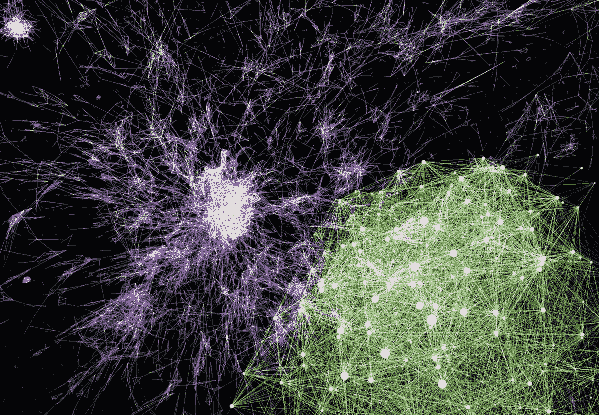
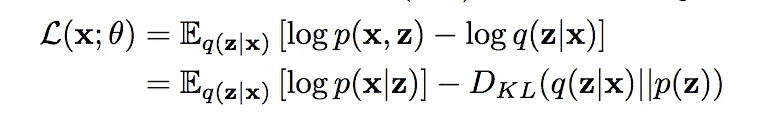
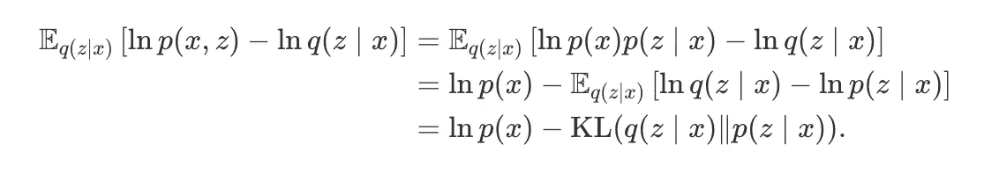
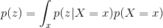
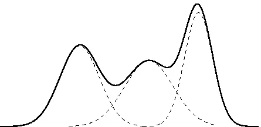
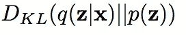
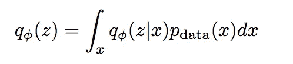
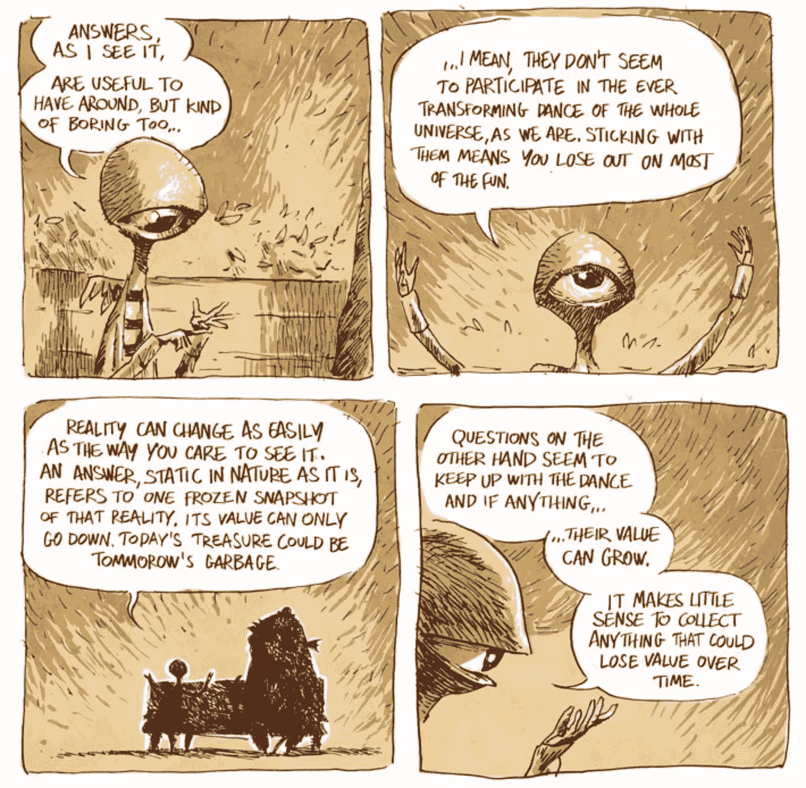

# 强大的力量伴随着贫乏的潜在代码:VAEs 中的表征学习(Pt。2)

> 原文：<https://towardsdatascience.com/with-great-power-comes-poor-latent-codes-representation-learning-in-vaes-pt-2-57403690e92b?source=collection_archive---------6----------------------->

*(如果你还没有这样做，我建议回去阅读本系列关于 VAE 故障模式* *的第一部分*[*；我花了更多的时间来解释一般的生成模型的基础，特别是 VAEs，因为这篇文章将从它停止的地方跳出来，那篇文章将提供有用的背景)*](/what-a-disentangled-net-we-weave-representation-learning-in-vaes-pt-1-9e5dbc205bd1)

我发现一个机器学习的想法特别引人注目，那就是嵌入、表示、编码:所有这些向量空间，当你放大并看到一个概念网络可以被漂亮地映射到数学空间的方式时，它们看起来几乎是神奇的。我已经在参数优化和向量代数的杂草中花了足够多的时间，知道即使我说，称机器学习的任何方面为“神奇的”都是异想天开，但是:像这样的方法不可避免地很诱人，因为它们提供了找到一些概念的最佳表示的可能性，一种“最佳数学语言”，我们可以用它向我们的机器提供世界上所有的信息。

TIL: it’s (un)surprisingly hard to find good visualizations of high-dimensional embedding spaces, especially if you don’t want the old “king — queen” trick

那个模糊的梦想，以及对我们目前离它有多远的敏锐意识，是我写这两篇文章的动机，探索我们目前在无监督表示学习方面的最大努力之一可能失败的方式。早先的帖子讨论了 VAE 表示法是如何失败的，它以一种过于密集、复杂和纠缠不清的方式将信息嵌入隐藏的代码中，而这种方式不符合我们的许多需求。这篇文章探讨了一个由不同困境驱动的解决方案:当我们使用一个容量如此之大的解码器时，它选择根本不在潜在代码中存储信息，这一结果将关于我们分布的重要信息锁定在解码器参数中，而不是作为内部表示整齐地提取出来。

如果你所关心的是建立一个生成模型，以便对新的(人工的)观察结果进行采样，那么这不是问题。然而，如果您希望能够通过修改 z 代码来系统地生成不同种类的样本，或者如果您希望使用编码器作为一种将输入观察结果压缩为另一个模型可以使用的有用信息的方式，那么您就有问题了。

# 无事生非

有时，当阅读技术论文时，你会看到一篇又一篇论文中的陈述被草率地做出，没有解释，好像它太明显而不值得解释。你开始怀疑自己是否出现了思维障碍，是否有一些其他人都有而你却忽略了的非常明显的洞察力。

这就是我不断阅读有关变分自动编码器(VAEs)的论文时的感受，这些变分自动编码器能够重建输入，但在它们的潜在代码中不存储关于每个输入的任何信息。

但是，在我们深入研究**为什么**和**如何**这种情况发生之前，让我们后退几步，并浏览一下上述陈述的实际含义。正如您(希望)在我之前的文章中读到的，vae 是围绕信息瓶颈构建的。编码器接受每个观察值 X，并计算压缩的低维表示 z，这在理论上应该可以捕捉关于该特定 X 的高级结构。然后，解码器接受 z 作为输入，并使用它来产生原始输入 X 的最佳猜测。解码器的重建猜测和原始 X 相互比较，两者之间的像素距离(以及推动每个 p(z|x)更接近典型高斯先验分布的正则化项)用于更新模型的参数。从概念上讲，在这样一个模型中，关于数据分布的信息存储在两个地方:代码 z 和将 z 转换为重构的 x 的网络权重。

当我们训练用于表示学习的 VAE 时，我们想要的是 z 表示描述该特定图像中存在的内容的高级概念，以及解码器参数，以学习关于如何将这些概念实例化为实际像素值的一般化信息。(题外话:同样的逻辑适用于你正在重建的任何给定的观察；我倾向于引用图像和像素，因为几乎所有最近的论文都关注图像，并使用这种语言)，

当我阅读的所有这些论文声称 z 分布无信息时，他们的意思是:网络收敛到一个点，在这个点上，编码器网络产生的 z 分布是相同的，而不管编码器给定哪个 X。如果 z 分布不随特定 X 的不同而不同，那么，根据定义，它不能携带关于这些特定输入的任何信息。在这种模式下，当解码器创建其重建时，它本质上只是从全局数据分布中采样，而不是由 x 的知识所通知的分布的特定角落。

我不能代表所有人，但我真的很难直观地理解这是如何发生的。VAE 的整个概念结构就像一个自动编码器:它通过计算重建输出和实际输出之间的像素距离来学习。即使我们想象我们有办法从真实的数据分布中完美地采样，使用 z 来传达一些关于我们试图重建的 X 的信息(例如，一个场景是一只猫，而不是一棵树)似乎也有明显的价值。为了建立更好的理解，我不得不进行两次智力旅行；首先是通过自回归解码器的**机制**，其次是通过 VAE 损失本身的经常棘手的**数学**。一旦我们从另一端走出来，我们就能更好地理解在赵等人的 InfoVAE 论文中提出的机械上简单的解决方案背后的概念基础。

# 当自动编码遇到自回归时

概率论中一个简单的基本方程是概率链规则，它控制着联合分布分解成先验概率分布和条件概率分布。如果想知道 p(x，Y)，也就是说 X 和 Y 都发生的概率，也就是说联合分布 P(X，Y)在点(X，Y)的值，可以写成:

> p(x，y) = p(x)p(y|x)

自回归生成模型(其中最著名的是 PixelRNN 和 PixelCNN)采用了这一思想，并将其应用于生成:与其试图独立生成每个像素(典型的 VAE 方法)，或试图将每个像素生成为每个其他像素的条件函数(计算上不可行的方法)，不如假设图像中的像素可以像序列一样处理， 和生成的像素，如上面的等式所示:首先基于 x1 像素值的无条件分布选择像素 x1，然后基于以你选择的 x1 为条件的分布选择 x2，然后以 x1 和 x2 为条件的 x3，等等。 PixelRNN 背后的想法是:在 RNN 中，你内在地将关于过去生成的像素的信息聚集到隐藏状态中，并可以使用它来生成下一个像素，从左上角开始并向下和向右移动。

虽然 PixelRNN 在与自回归模型的纯粹直觉保持一致方面做得更好，但更常见的自回归图像模型是 PixelCNN。这是由于 RNNs 的两个有意义的缺点:

1.  他们可能很难记住全球背景(即在长时间窗口内存储信息)
2.  您不能并行处理 RNN 的训练，因为图像中的每个像素都需要使用在您当前位置“之前”创建完整图像时生成的隐藏状态

Ahh, the smell of pragmatic-yet-effective hacks in the morning

在重视实际可训练性而不是密闭理论的伟大机器学习传统中，PixelCNN 诞生了。在 PixelCNN 中，每个像素都是通过使用其周围的像素计算的卷积来生成的，但重要的是，**只有在我们任意的从左上到右下的排序中出现在它“之前”的像素**。这就是上图中的暗灰色区域:一个应用于卷积的遮罩，以确保位置“e”处的像素没有使用任何“来自未来”的信息来调节自身。当我们从零开始生成图像时，这一点尤其重要，因为根据定义，如果我们从左到右生成，给定的像素将不可能根据尚未生成的更靠右和更靠下的像素来决定其值。

**PixelCNNs 解决了上面列出的两个 PixelRNN 问题，因为:** 1)随着增加更高的卷积层，每层都有更大的“感受域”，即它在卷积的金字塔上更高，因此有一个以更宽的像素范围为条件的基础。这有助于 PixelCNN 访问全局结构信息

2)因为每个像素仅取决于直接围绕它的像素，并且该模型的训练设置是逐像素值计算损失，所以通过将单个图像的不同片发送给不同的工作者，该训练很容易并行化

回到 VAEs 的土地上，这些自回归方法开始看起来相当有吸引力；历史上，VAEs 独立地生成图像的每个像素(以共享代码为条件)，这固有地导致模糊重建。这是因为，当所有像素同时生成时，每个像素的最佳策略是根据共享代码生成其期望值，而不知道每个其他像素选择了什么像素值。因此，人们开始对在 VAEs 中使用自回归解码器感兴趣。这是通过附加 z 作为附加的特征向量来完成的，旁边是当前由 PixelCNN 使用的附近像素值的卷积。正如预期的那样，这导致了更清晰、更详细的重建，因为像素能够更好地相互“协调”。

因为当我用隐喻思考时，我想得最好，所以独立像素生成的过程有点像委托不同制造厂制造机器的零件；由于每个工厂都不知道其他工厂在建造什么，所以它完全依赖于中央的指导，让各个部分协调一致地工作。相比之下，我认为自回归一代有点像那个故事游戏，每个人写一个故事的句子，然后传给下一个人，下一个人根据上一个写一个新的句子，以此类推。在那里，不是让中心指导来促进整体的各部分之间的协调，而是每个部分使用该部分之前的上下文来确保它是协调的。

这开始让我们了解为什么自回归解码器可能导致潜在代码中的信息减少:以前由共享潜在代码促进的多像素协调现在可以通过让您的网络在以前生成的像素范围内可见来处理，并让它调整其像素输出。

# 处理损失(功能)

以上都很好:我可以很好地理解自回归模型的更灵活的参数化如何使它能够在不使用潜在代码的情况下对复杂数据进行建模。但是，我花了更长时间才明白:表面上，这些模型是自动编码器，需要能够成功地像素重建它们的输入，以满足它们的损失函数。**如果模型不使用 z 来传达关于输入的图像类型的信息，解码器如何能够产生具有低重建损失的输入？**

为了理解这个模型的动机是如何排列的，我们应该从描述 VAE 目标函数的方程开始。

底部的等式是 VAE 函数的典型特征:

1.  一个激励 p(x|z)变高的术语，也就是说，激励模型生成作为输入的图像的概率，也就是说，如果输出分布全部为高斯分布，则输入和重构像素之间的平方距离
2.  激励编码 z|x 的分布接近全局先验的术语，它只是一个零均值高斯分布。(KL 散度测量这些分布相距多远，并且由于这是被最大化的目标中的负项，所以模型试图使 KL 散度的大小更小)

在这个框架下，很容易认为模型的主要功能是自动编码，惩罚项只是一个相对不重要的正则项。但是，上面的等式也可以排列如下:

严格遵循上面的数学公式并不是最重要的；我主要是展示求导，这样第二个方程就不会凭空出现了。在这一表述中，VAE 的目标也可以被看作是:

1.  增加 p(x ),也就是说，增加模型在数据 x 中生成每个观察值的概率和能力
2.  减小编码分布 q(z|x)和真实的基础后验分布 p(z|x)之间的 KL 散度

等式的第二位意味着什么？在这种情况下，你可能有点难以理解“后”到底是什么意思。这是一个有点模糊的想法。但是，我们知道的一件事是:

换句话说，这意味着先验 p(z)是所有条件分布 p(z|x)的混合，每个条件分布都根据其伴随的 x 值的可能性进行加权。VAE 的标准形式是对其所有条件分布 q(z|x)使用高斯分布。用更清楚的非概率的话来说，这意味着编码器网络从输入值 X 映射到高斯的均值和方差。我们通常还将先验设置为高斯分布:均值为零，方差为 1。这两个事实有一个有趣的含义，这个图表很好地体现了这一点:

这表明:将多个高斯函数相加，并使它们的和也是高斯函数的唯一方法是，如果所有相加的高斯函数具有相同的均值和方差参数。这意味着:如果你想让 q(z|x)完美地匹配 p(z|x ),或者

1.  你的 q(z|x)不需要是高斯型的，或者
2.  q(z|x)必须等价于 p(z):同一个无信息单位高斯，不考虑输入 x 的值。

如果 q(z|x)除了上面概述的两个选项之外做任何事情，它将不能与 p(z|x)相同，并且将因此通过 q(z|x)和 p(z|x)之间的 KL 发散产生一些成本。**因为我们通常在结构上选择只允许高斯 p(z|x ),这意味着网络唯一可用的选项，即允许它从第二项中零损失，是使条件分布无信息**。

向后遍历内容堆栈，这意味着网络将仅选择使其 z 值具有信息性，如果这样做对于建模完整的数据分布 p(x)是必要的话。否则，它因使用信息性 z 而遭受的损失通常会超过使用它所获得的单个图像准确性的好处。

# 供参考

有了这些背景知识，我们现在就能更好地理解 [InfoVAE](https://arxiv.org/abs/1706.02262) 论文针对这个问题提出的解决方案。该文件对“香草 VAE”目标提出的两个主要批评是

1.  信息偏好属性，这就是我们上面概述的:vae 倾向于不在他们的潜在代码中编码信息，如果他们可以避免的话。当正则项太强时，这往往会发生。
2.  “爆炸潜在空间”问题。这基本上就是我在之前的博客文章中讨论的内容，在没有足够的正则化的情况下，网络有动力使每个 x 的条件 z 分布不重叠，这通常会导致较差的采样能力和更复杂的表示。

尽管这个问题很难理解，但他们提出的解决方案实际上非常简单。还记得在最初的 VAE 方程中，我们如何惩罚 z 上的后验和 z 上的先验之间的 KL 散度吗？

这里要记住的重要一点是，这是为每个个体 x 计算的**。这是因为编码层是随机的，因此对于每个输入 x，我们不是简单地产生一个代码，而是产生代码上的*分布的平均值和标准偏差。对于每个单独的输入，它是与标准正态分布的先验进行比较的分布。***

与之相反，InfoVAE 论文提出了一个不同的正则项:激励聚集的 z 分布接近 p(x ),而不是推动每个单独的 z 接近。聚集的 z 分布为:

换句话说，基本上就是说，我们应该将所有 x 值产生的条件分布聚合在一起，而不是采用每个单独输入 x 定义的分布。如果你到目前为止一直在跟踪的话，这种方法的基本原理是相当一致的。信息偏好的特性来自于这样一个事实，当你激励每个个体有条件地接近先验时，你实际上是在激励它不提供信息。但是，当您激励聚合的 z 接近先验时，您允许每个单独的 z 代码有更多的空间偏离 N(0，1)，并且这样做携带了关于产生它的特定 X 的信息。然而，因为我们仍在推动聚集分布接近先验分布，所以我们不鼓励网络陷入“爆炸潜在空间”问题，在该问题中，网络将其平均值推动到较高的量级，以创建将提供最多信息的非重叠分布。

注意，这种新的公式需要某种基于样本的方式来测量一组样本和先验之间的差异，而不是能够分析计算参数化条件分布和先验之间的差异。这种情况的一个例子是对抗性损失，在这种情况下，您获取编码器采样的 z 值集合，并将这些集合与从先前提取的 z 值集合一起提供给鉴别器，并激励模型使这两个集合不可区分。论文作者探讨了更多这样的方法，但是由于它们与本文的主旨相当正交，如果您阅读了这篇论文，我将让您自己探索这些方法。

根据经验，作者发现这种修改导致自回归 VAEs 更多地利用潜在的代码，而重建精度没有明显下降

# 未解决的问题

Source: [http://kiriakakis.net/comics/mused/a-day-at-the-park](http://kiriakakis.net/comics/mused/a-day-at-the-park)

我比我第一次构思这个帖子系列时更了解表征学习，如果我做得对，你也一样。但是，以一个结论结尾意味着一些现成的答案，而且我认为问题通常比答案更有趣，所以我会把其中的一些留给你。

*   如果我们的目标实际上是表征学习，你是否有模糊重建真的有关系吗？这基本上是在问:像 PixelCNN 能给我们的那种清晰的重建，实际上是我们最关心的吗？
*   如果我们将早期文章中的一些解开技术与重建概念级特征(即除原始像素之外的编码网络层)的目标相结合，我们能获得更好的表征学习吗
*   为了便于特征学习，拥有随机代码有多大价值？如果你使用一个“聚合 z”优先执行方法，就像 InfoVAE 中概述的那样，那能让我们从使用高斯函数作为潜在代码中解放出来吗？
*   我们是否还可以在网络的重建部分有效地使用对抗性损失(即:让鉴别器尝试区分输入和重建)，以避免过度关注像素损失带来的精确细节重建

# 来源:

*   [变分有损自动编码器](https://arxiv.org/pdf/1611.02731.pdf)
*   [信息最大化变分自动编码器](https://arxiv.org/pdf/1706.02262.pdf)
*   [自动编码单个比特](http://ruishu.io/2017/01/14/one-bit/)