# 使用 Twitter 情感分析的品牌认知

> 原文：<https://towardsdatascience.com/with-the-emergence-of-social-media-high-quality-of-structured-and-unstructured-information-shared-b16103f8bb2e?source=collection_archive---------13----------------------->

随着社交媒体的出现，通过各种来源共享高质量的结构化和非结构化信息，如 Twitter 或脸书生成的描述用户情绪的数据。处理这些信息的能力对于使用 Twitter 情感分析深入了解品牌认知变得非常重要。文本分析是机器学习技术的一部分，其中从文本中获得高质量的信息，以挖掘客户对特定品牌的感知。

品牌感知是消费者对品牌体验的特殊结果。本文旨在了解消费者对品牌的形象和认知，以及他们对#nike 品牌的真实想法和感受。在这项研究中，我们从 twitter 上收集了用于品牌认知和情感分析的数据。

***照做*** 是鞋业公司耐克的商标，也是耐克品牌的核心组成部分之一。这个口号是在 1988 年的一次广告代理会议上提出的。

## 1)从 TWITTER 中提取数据

使用 Twitter 应用程序帐户从 Twitter 提取最新的推文。

```
install.packages("twitter")install.packages("ROAuth")library("twitter")library("ROAuth")cred <- OAuthFactory$new(consumerKey='XXXXXXXXXXXXXXXXXX',consumerSecret='XXXXXXXXXXXXXXXXXXXXXXXXXXXXXXX',requestURL='[https://api.twitter.com/oauth/request_token](https://api.twitter.com/oauth/request_token)',accessURL='[https://api.twitter.com/oauth/access_token](https://api.twitter.com/oauth/access_token)',authURL='[https://api.twitter.com/oauth/authorize](https://api.twitter.com/oauth/authorize)')
```

在清理用于分析的数据之前，让我们首先更改日期和文本列的格式。文本列可能包含数字、散列标签和其他正则表达式，将它们全部转换为字符值，使语料库易于阅读。

```
tweets$created <- **as.Date**(tweets$created, format= "%y-%m-%d")tweets$text <- **as.character**(tweets$text)
```

## 2)创建品牌语料库

语料库由文本文档组成。r 编程使用这个术语来包含一组被认为相似的文本。

```
*#Data Pre-processing***set.seed**(100)(n.tweet <- **length**(tweets))## [1] 17
```

上面的代码读入数据并返回指定的文本长度。

语料库包中的 corpus()是一个为文本挖掘创建文本集合的函数

*#用 tweet 文本创建文档语料库。*

```
corpus<- **Corpus**(**VectorSource**(tweets$text))corpus[[1]]
```

## 3)预处理和清洗

预处理文本可以显著提高单词袋方法的性能。做到这一点的第一步是创建一个语料库，简单地说，就是文本文档的集合。一旦创建了语料库，我们就可以进行预处理了。

首先，让我们去掉标点符号。处理这个问题的基本方法是删除所有不是标准数字或字母的东西。在我们的例子中，我们将删除所有标点符号。接下来，我们将单词的大小写改为小写，这样相同的单词就不会因为大小写不同而被视为不同。

我们必须做的另一个预处理任务是去除无意义的术语，以提高我们理解情感的能力。

通过 tm_map()函数完成文本转换。基本上，所有转换都在单个文本文档上工作，tm_map()只是将它们应用于语料库中的所有文档。

**删除网址**

这将从语料库文档中删除 URL

*#移除网址*

```
removeURL <- **function**(x) **gsub**("http[^[:space:]]*", "", x)corpus <- **tm_map**(corpus, **content_transformer**(removeURL))
```

**去掉标点符号**

构建外部函数并传递给 tm_map()来转换文本语料库。

*#去掉标点符号*

```
remove_punct<-**function**(x)**gsub**("[^[:alpha:][:space:]]*", "", x)corpus <- **tm_map**(corpus, **content_transformer**(remove_punct))
```

**去除空白**

这将从文本语料库中删除空白

*#修剪多余的空格*

```
corpus = **tm_map**(corpus, stripWhitespace)
```

**去掉@(用户名)**

语料库中的少数单词可能包含邮件 id 或以@开头的单词。

```
removeUsername <- **function**(x) **gsub**("@[^[:space:]]*", "", x)corpus <- **tm_map**(corpus, **content_transformer**(removeUsername))**writeLines**(**strwrap**(corpus[[750]]$content,60))## RT Nike Dont ask if your dreams are crazy Ask if theyre## crazy enough justdoit
```

## 4)文本规范化

规范化过程包括统一转换文本。

**将文本转换成小写**

```
corpus <- **tm_map**(corpus, **content_transformer**(stri_trans_tolower))**writeLines**(**strwrap**(corpus[[750]]$content,60))## rt nike dont ask if your dreams are crazy ask if theyre## crazy enough justdoit
```

**删除停止字**

停用词只是没有意义的常用词。如果我们看看停用词(“英语”)的结果，我们可以看到什么被删除。

```
corpus = **tm_map**(corpus, removeWords, **stopwords**('English'))**inspect**(corpus)##    [1] rt nike dont ask   dreams  crazy ask crazy theyre enough justdoit##    [2] rt statecrafthuff paint kap   person    people even   demonizes good cops  trys  sell americans   false narra
```

让我们创建自己的停用词删除字典来进一步挖掘文本

*#将停用词指定为字符向量*

```
Corpus<-**tm_map**(corpus, removeWords, **c**("keep", "check", "can","just","isnt","hey","ask","theyr","dont","theyre","cmon","htt","everything","even","enough","rt"))
```

**删除单字母单词**

```
removeSingle <- **function**(x) **gsub**(" . ", " ", x)corpus <- **tm_map**(corpus, **content_transformer**(removeSingle))**writeLines**(**strwrap**(corpus[[750]]$content,60))## nike dreams crazy crazy justdoit
```

## 5)术语-文档矩阵

一旦我们预处理了数据，我们现在就可以提取 twitter 数据中使用的词频了。tm 包提供了一个名为 Term Document Matrix 的函数，它生成一个矩阵，其中的行对应于文档，在我们的例子中是 tweets，列对应于 tweets 中的单词。

矩阵中的值是该单词在每个文档中出现的次数。文档矩阵是包含单词频率的表格。列名是单词，行名是文档。文本挖掘包中的函数 TermDocumentMatrix()使用如下:

```
dtm <- **TermDocumentMatrix**(corpus)
```

just doit just doit 1730 crazy crazy 1564 Nike Nike 1124 dreams dreams 786 means means 332

**最常用术语**

基于 termdocumentmatrix()输出试图根据关键字的频率对它们进行排序。高频词是用户在推特上发布的，而特朗普是语料库中出现频率最低的词。

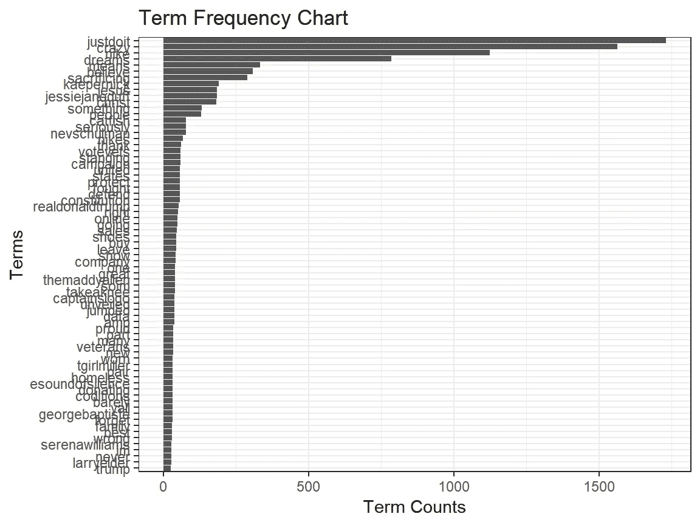

**低频术语**

低频@55 和@85 单词显示在下面的频率计数图中。

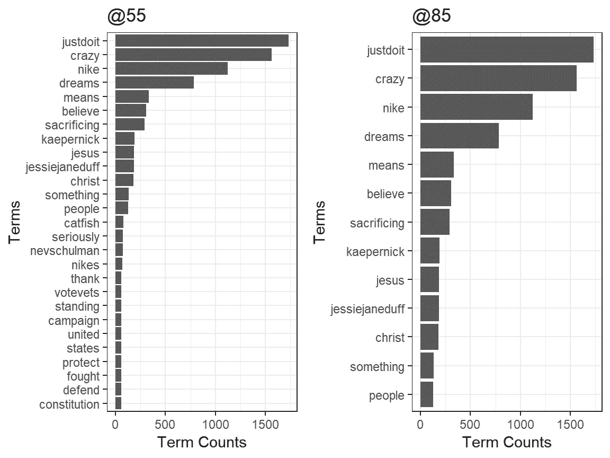

**绘制词频**

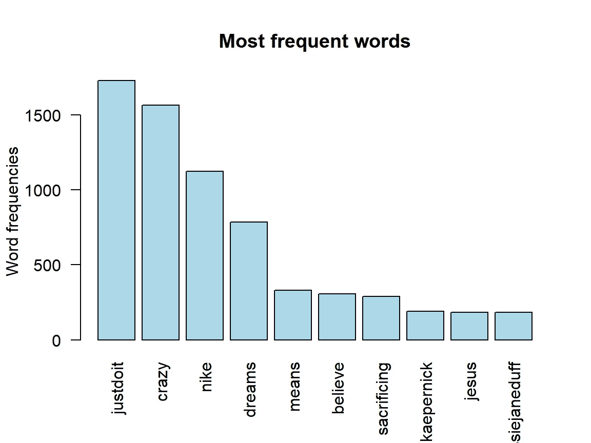

## 6)品牌词云

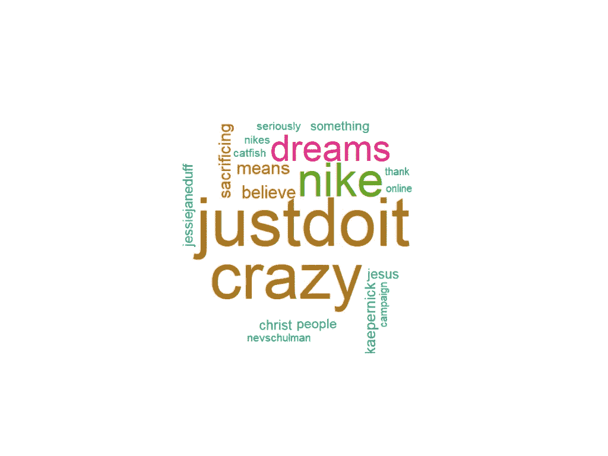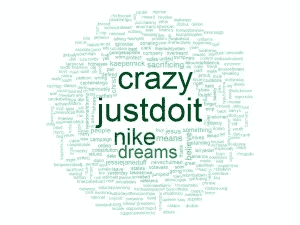

## 7)寻找关联

在这里，我们试图找到关键字之间的关联。

```
**barplot**(**t**(**as.matrix**(corrdf1)), beside=TRUE,xlab = "Words",ylab = "Corr",col = "blue",main = "nike",border = "black")
```

nike 这个词与“相信”、“基督”、“耶稣”、“Kaepernick”、“dems”和“run”等词密切相关

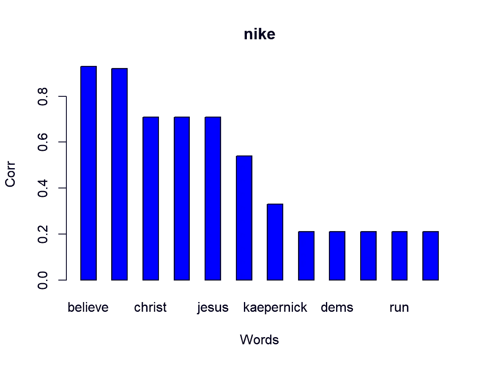

```
**barplot**(**t**(**as.matrix**(corrdf1)), beside=TRUE,xlab = "Words",ylab = "Corr",col = "yellow",main = "justdoit",border = "black")
```

同样的，justdoit 比 kaepernick 显示出更多与牺牲的联系

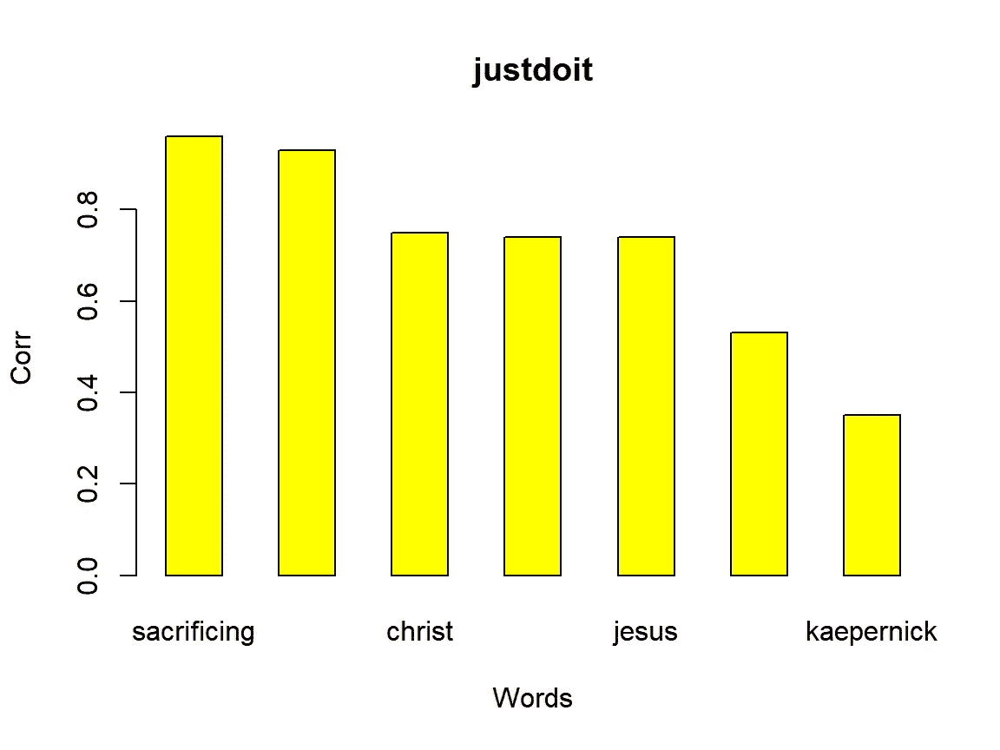

## 8)聚类

由于#nike 生成了许多类似的推文，从正在处理的海量数据中做出有意义的解释变得很有挑战性。我们试图将相似的推文聚集在一起。分层聚类试图构建不同级别的聚类。

函数 hclust()执行层次聚类分析。它使用凝聚法。为了完成这个操作，语料库被转换成文档矩阵。我们使用了沃德的方法进行等级聚类。下面的树状图显示了系统聚类的结果。

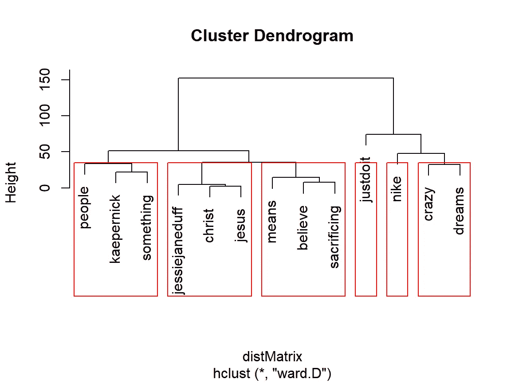

## 9)品牌感知建模

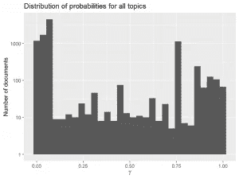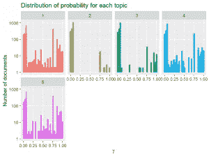

上图描述了所有术语的概率分布，每个 LDA 主题有 10 个术语，独立于其他 LDA 主题中的术语

## 10)推特情感分析

情感分析和观点挖掘是从书面语言中分析人们的观点、情感、评估、态度和情绪的研究领域。它是自然语言处理和人工智能中最活跃的研究领域之一，在数据挖掘、Web 挖掘和文本挖掘中也被广泛研究。

情绪分为积极、期待、恐惧、喜悦、惊讶和消极。

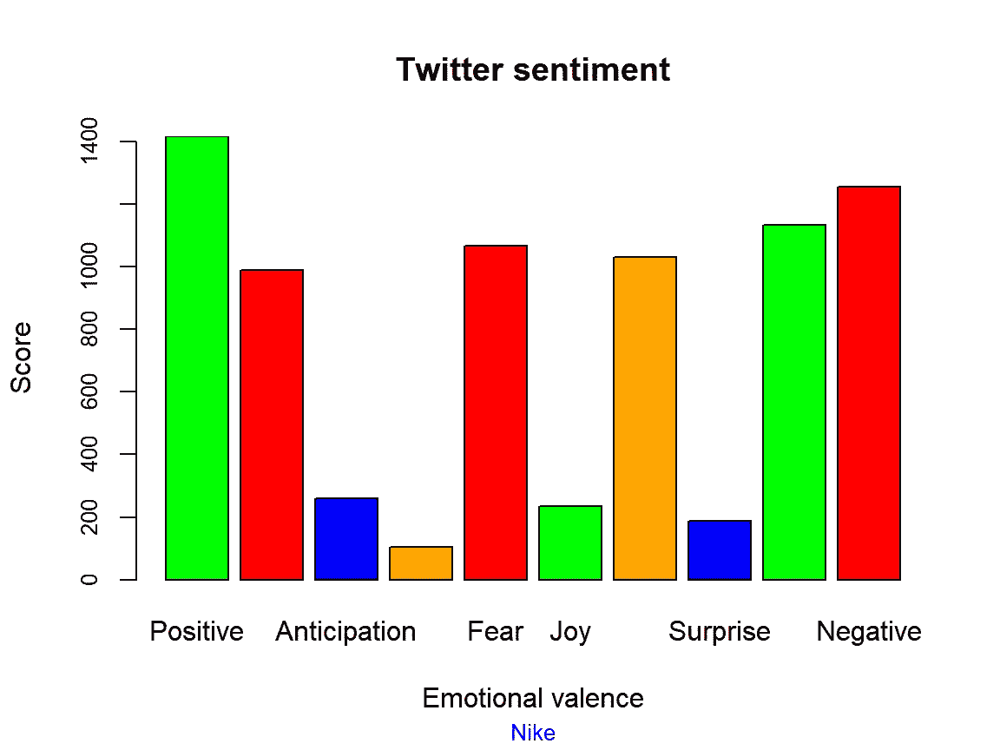

这表明，在 2000 个文本数据中，正面推文的得分相对高于其他情绪，约为 1400，其中有 1300 个关键词预期为负面，并且很少有情绪不能被分类。

## 结论

品牌认知在耐克 30 周年的“Just Do it”活动上，耐克与有争议的前 NFL 球星科林·卡佩尼克一起发起了一场活动。围绕 Kaepernick 的争议与他决定在 NFL 比赛开始时播放美国国歌时下跪有关，以抗议警察对有色人种的暴行。

Kaepernick 在过去的两个赛季中没有与 NFL 签约，但仍然被视为一个两极分化的人物。发起这项新的运动，耐克可能会疏远其美国消费者群中的一大部分，可能多达一半。他们为什么要这么做？也许他们认为这将使千禧一代的部落更加紧密，他们往往会参与抗议活动，特别是当政治领导人和其他权威人物与他们的感受和价值观不一致时。

因此，这场竞选分散了耐克部落的部分成员，分散了忠诚的美国爱国者和正在或曾经在我们的武装部队、政府或机构中服务的人，这些部队、政府或机构密切依赖于健康的政府和国家声誉。这些人认为，在体育赛事中不代表国歌是对美国理念和以国家名义所做牺牲的不尊重。他们认为科林·卡佩尼克采取的姿态是可疑性格的表现。他们认为他的公开姿态不合适，不合时宜。

这一最新版本的“就这么做”已经引发了一定程度的社会辩论，随着时间的推移，这将提高社会对耐克在这场运动中所冒风险的理解。对于许多城市和少数民族职业运动员来说，这一活动将拉近他们与品牌的距离。他们喜欢耐克支持运动员个人权利、道德良知、信念和抗议的行为。对于国联或国家来说，批评他们的言论或表达自由是不明智的。但是，我们可以就我们历史上这样一个事件和时刻的正反两面进行对话，大声地谈论美国价值观和人类价值观。当前的辩论可能会让美国的缔造者感到自豪。

[http://rpubs . com/mal vika 30/Brand-Perception-情操-分析-R](http://rpubs.com/Malvika30/Brand-Perception-Sentiment-Analysis-R)