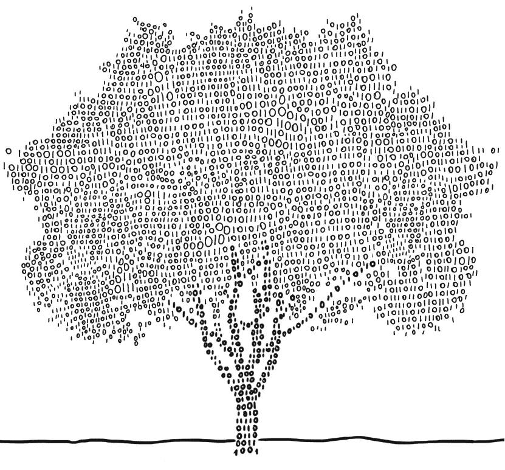
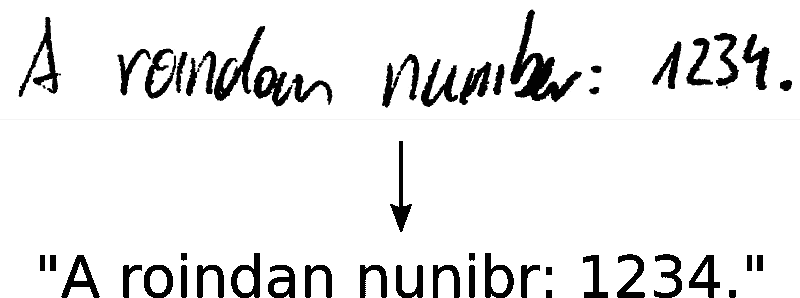
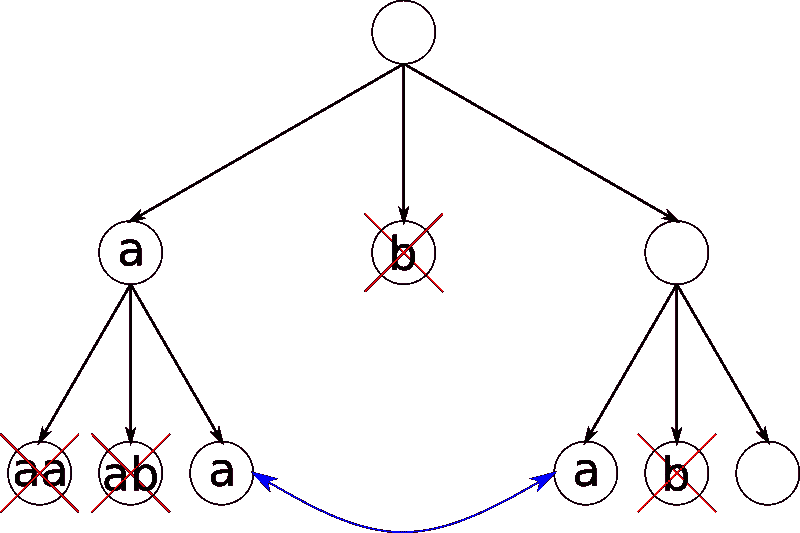
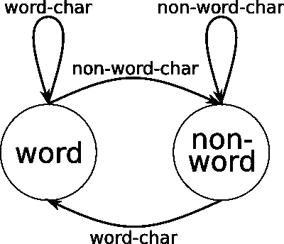
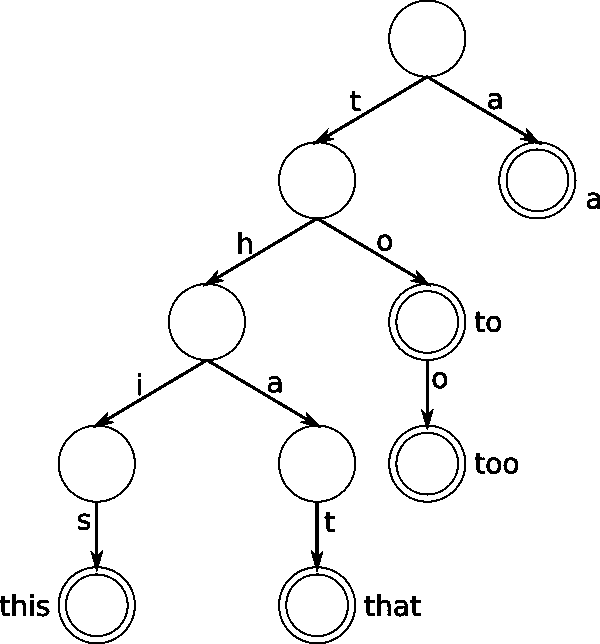
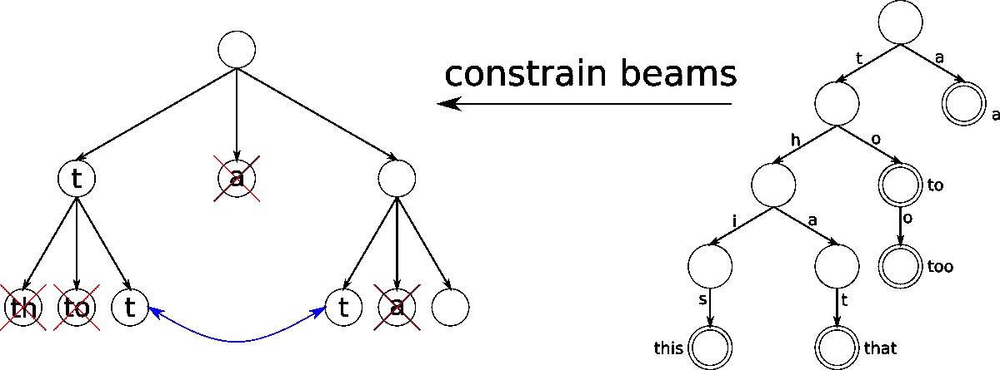
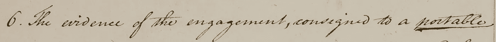
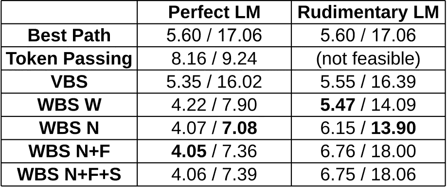

# 字束搜索:一种 CTC 解码算法

> 原文：<https://towardsdatascience.com/word-beam-search-a-ctc-decoding-algorithm-b051d28f3d2e?source=collection_archive---------1----------------------->

## **改善文本识别结果:避免拼写错误，允许任意数字和标点符号，并使用单词级语言模型**

Trees are an essential ingredient of the presented algorithm. (Taken from [http://turnoff.us/geek/binary-tree](http://turnoff.us/geek/binary-tree) with changes)

让我们假设我们有一个用于文本识别的[神经网络](/2326a3487cd5) (OCR 或 HTR)，它是用[连接主义者时间分类](/3797e43a86c) (CTC)损失函数训练的。我们将包含文本的图像输入神经网络，并从中获取数字化文本。神经网络只是输出它在图像中看到的字符。这种纯光学模型可能会引入误差，因为看起来相似的字符如“a”和“o”。

如果您已经研究过文本识别，那么类似图 1 所示的问题对您来说会很熟悉:结果当然是错误的，但是，当我们仔细观察手写文本时，我们可以想象为什么神经网络会将单词“random”中的“a”与“oi”混淆。

Fig. 1: Why does the NN make such mistakes?

# 我们能改进我们的结果吗？

那么，如何应对这种情况呢？有不同的[解码算法](/5a889a3d85a7)可用，有些还包括语言模型(LM)。让我们看看算法在我们的例子中输出了什么:

*   **最佳路径解码:**“A roindan nuni br:1234。”。这是图 1 所示的结果。最佳路径解码仅使用 NN 的输出(即无语言模型)，并通过在每个位置取最可能的字符来计算近似值。
*   **光束搜索:**“A 罗恩丹号:1234。”。它也只使用神经网络输出，但它使用更多的信息，因此产生一个更准确的结果。
*   **带字符的光束搜索-LM:** “随机号:1234。”它还对字符序列评分(例如“an”比“oi”更有可能)，这进一步改善了结果。
*   **令牌传递:**“一个随机数”。该算法使用字典和单词 LM。它在神经网络输出中搜索最可能的词典单词序列。但是它不能处理像“:1234”这样的任意字符序列(数字、标点符号)。

没有一个算法是正确的。但是我们观察到了波束搜索和令牌传递的良好特性:

*   波束搜索允许**任意字符串**，这是解码**数字和标点**符号所需要的。
*   令牌传递将其输出限制为**字典单词**，这**避免了拼写错误**。当然，字典必须包含所有需要识别的单词。

这两个属性的组合会很好:当我们看到一个单词时，我们只允许字典中的单词，但在任何其他情况下，我们都允许任意字符串。让我们看一个实现我们想要的行为的算法:字束搜索。

# 提出的算法:字束搜索

我们使用[普通波束搜索算法](/5a889a3d85a7)作为起点。该算法迭代通过 NN 输出，并创建被评分的候选文本(称为束)。图 2 示出了射束演变的图示:我们从空射束开始，然后在第一次迭代中向其添加所有可能的字符(在该示例中我们只有“a”和“b ”),并且仅保留得分最高的字符。光束宽度控制幸存光束的数量。重复这一过程，直到处理完完整的神经网络输出。

Fig. 2: Beams are iteratively created (from top to bottom), equal beams are merged and only the best 2 beams (beam width=2) per iteration are kept.

让我们来看看如何调整普通波束搜索来获得想要的行为。我们希望算法在识别单词和识别数字或标点符号时表现不同。因此，我们为每个梁添加一个状态变量(状态图见图 3)。射束或者处于字状态，或者处于非字状态。如果 beam-text 当前是“He **l** ，那么我们处于单词状态，只允许添加单词字符，直到我们有了一个完整的单词，如“Hell”或“Hello”。当前处于非单词状态的光束可能看起来像这样:“她是 **3** ”。

当一个单词完成时，从单词状态到非单词状态是允许的:然后我们可以给它添加一个非单词字符，就像如果我们有“Hello”并给它添加“”，我们就得到“Hello”。从非词态到词态的另一个方向总是允许的，就像在“她 33 岁”中，我们可能会加上词符“y”得到“她 33 y”(后来，也许，会得到“她 33 岁。”).

Fig. 3: Each beam can be in one of two states.

在 word 状态下，我们只允许添加最终会形成单词的字符。在每次迭代中，我们最多给每个梁添加一个字符，那么我们如何知道在添加足够多的字符后，哪些字符将形成一个单词呢？如图 4 所示的前缀树可以解决这个任务:来自字典的所有单词都被添加到树中。当添加像“too”这样的单词时，我们从根节点开始，添加(如果它还不存在)用第一个字符“t”标记的边和一个节点，然后向这个新节点添加边“o”，并再次添加“o”。最后一个节点被标记以表示一个单词的结束(双圆圈)。如果我们对单词“a”、“to”、“too”、“this”和“that”重复这一过程，就会得到如图 4 所示的树。

Fig. 4: Prefix tree containing words “a”, “to”, “too”, “this” and “that”.

现在很容易回答两个问题:

*   给定一个前缀，**哪些字符可以加**最终组成一个单词？简单地通过跟随用前缀的字符标记的边，转到前缀树中前缀的节点，然后收集这个节点的输出边的标签。如果我们被赋予前缀“th”，那么接下来可能的字符是“I”和“a”。
*   给定一个前缀，**可以造出哪些单词**出来呢？从前缀的节点中，收集所有标记为单词的后代节点。如果我们被赋予前缀“th”，那么可能的单词是“this”和“that”。

有了这些信息，我们就可以约束添加到梁(处于单词状态)的字符:我们只添加最终将形成单词的字符。参见图 5 的图示。

Fig. 5: The beams (left) are constrained by the prefix tree (right).

我们只保留每次迭代中得分最高的梁。分数取决于神经网络的输出。但是我们也可以将一个单词-LM 与不同的评分模式结合起来(在结果部分中使用了为这些模式提供的缩写):

*   **根本不用 LM(W)**，只用字典约束单词。这就是我们到目前为止所讨论的。
*   **每完全识别一个单词就按 LM 计分(N)** 。假设我们有一束“我的 nam”。只要添加一个“e ”,最后一个单词“name”就完成了，LM 的得分是“My”和“name”相邻。
*   **展望未来(N+F)** :在前缀树的帮助下，我们知道哪些单词可能会在以后的迭代中出现。射束“I g”可以扩展为“I go”、“I get”，…因此，我们可以在每次迭代中对所有可能的词的 LM 分数求和，而不是等到一个词完成后再对射束应用 LM 分数，在上述示例中，这将是“I”和“go”，“I”和“get”，…。仅通过取单词的**随机子集(N+F+S)** 就可以实现小的性能改进。

我们现在有一个算法，能够识别正确的文本“一个随机数:1234。”如图 1 所示。单词受字典约束，但所有其他字符只是以神经网络看到的方式添加。

# 词束搜索的表现如何？

令人高兴的是，该算法能够正确地识别来自图 1 的样本。但我们更感兴趣的是该算法在完整数据集上的表现如何。我们将使用[边沁 HTR 数据集](http://transcriptorium.eu/datasets/bentham-collection/)。它包含大约 1800 年的手写文本，图 6 中示出了一个示例。

Fig. 6: Sample from [Bentham dataset](http://transcriptorium.eu/datasets/bentham-collection/).

我们将相同的神经网络输出输入到所有解码算法中。这样，公平的比较是可能的。我们为 LM: 1 使用两种不同的训练文本。2)来自测试集的文本，它是理想的训练文本，因为它包含所有要识别的单词。2)从与包含 370000 个单词的单词列表连接的训练集的文本创建的基本训练文本。错误度量是字符错误率(CER)和单词错误率(WER)。CER 是地面真实文本和已识别文本之间的编辑距离，通过地面真实长度进行归一化。WER 也是这样定义的，但是是在词汇层面。

结果如表 1 所示。在这个数据集上，词束搜索优于其他算法。如果我们对于 LM 有一个好的训练文本，那么用它来对波束进行评分是有意义的(模式 N、N+F 或 N+F+S)。否则，最好只是约束文字，不要用 LM 来给梁打分(W 模式)。

如果我们不知道我们必须识别哪些单词，或者我们根本不需要识别单词，其他算法会执行得更好。

Table 1: Results given as CER [%] / WER [%] for different algorithms (VBS: vanilla beam search, WBS: word beam search, W: no LM used, N: LM used, N+F: LM with forecasting, N+F+S: LM with forecasting and sampling) and training texts for the LM (perfect and rudimentary LM). A small CER/WER means that we have a well performing algorithm.

# 履行

代码可以在 [GitHub](https://github.com/githubharald/CTCWordBeamSearch) 上找到。提供了一个 Python，C++和 TensorFlow 实现。

# 参考资料和进一步阅读

规范和出版物:

*   [实现字梁搜索](https://github.com/githubharald/CTCWordBeamSearch)
*   [ICFHR 2018 论文](https://repositum.tuwien.at/retrieve/1835)
*   [海报](https://www.dropbox.com/s/gvn5o51gzjc7vxy/Poster.pdf?dl=0)
*   [论文:在 5 个数据集上评估词束搜索](https://repositum.tuwien.at/retrieve/10807)

关于文本识别和 CTC 的文章:

*   [CTC 简介](/3797e43a86c)
*   [普通光束搜索](/5a889a3d85a7)
*   [实现文本识别系统](/2326a3487cd5)