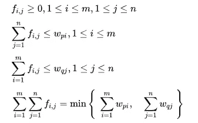
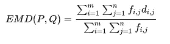
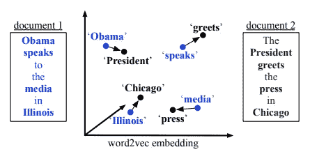
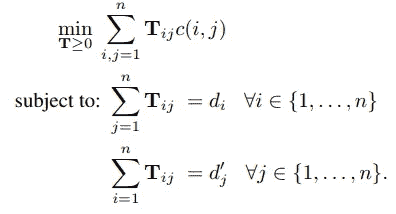
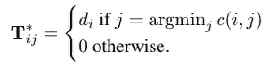

# 单词嵌入之间的单词距离

> 原文：<https://towardsdatascience.com/word-distance-between-word-embeddings-cc3e9cf1d632?source=collection_archive---------4----------------------->


Photo by [Rob Bates](https://unsplash.com/@inksurgeon?utm_source=medium&utm_medium=referral) on [Unsplash](https://unsplash.com?utm_source=medium&utm_medium=referral)

单词移动距离(WMD)被提出用于测量两个文档(或句子)之间的距离。它利用单词嵌入能力来克服这些基本的距离测量限制。

WMD[1]是由 Kusner 等人在 2015 年提出的。他们建议使用单词嵌入来计算相似度，而不是使用欧几里德距离和其他基于单词包的距离度量。准确地说，它使用标准化的[单词包](/3-basic-approaches-in-bag-of-words-which-are-better-than-word-embeddings-c2cbc7398016)和[单词嵌入](/3-silver-bullets-of-word-embedding-in-nlp-10fa8f50cc5a)来计算文档之间的距离。

看完这篇文章，你会明白:

*   推土机距离(EMD)
*   字移动器的距离
*   轻松单词移动距离(RWMD)
*   大规模杀伤性武器的实施
*   拿走

# 推土机距离(EMD)

在介绍大规模杀伤性武器之前，我必须先分享一下运土距离(EMD)的概念，因为大规模杀伤性武器的核心部分是 EMD。

EMD [2]解决运输问题。例如，我们有 m 和 n，而 m 和 n 表示一组供应商和仓库。目标是最小化运输成本，以便将所有货物从 m 运输到 n。给定约束条件:



Capture from wiki [3]

*   仅允许从 m 到 n 的传输。不允许从 n 到 m 的传输
*   发送货物总数不能超过总容量 m
*   收货总数量不能超过总容量 n
*   最大运输次数是 m 中的货物总量和 n 中的货物总量之间的最小值

外延是:

*   p:原产地设置
*   问:目的地集合
*   f(i，j):从 I 流向 j
*   m:原点数量
*   n:目的地编号
*   w(i，j):从 I 到 j 的货物运输次数

对于最佳流量 F，线性公式为



Capture from wiki [3]

# 字移动器的距离

在之前的[博客](/3-basic-distance-measurement-in-text-mining-5852becff1d7)中，我分享了我们如何用简单的方法找到两个文档(或句子)之间的“相似性”。当时引入了欧氏距离、余弦距离和 Jaccard 相似度，但都有一定的局限性。WMD 的设计是为了**克服** **同义词问题**。

典型的例子是

*   第一句:奥巴马在伊利诺伊州对媒体讲话
*   总统在芝加哥迎接媒体

除了停用词，两个句子之间没有共同的词，但两个句子都在谈论同一个话题(当时)。



Captured from Kusner et al. publication

WMD 使用单词嵌入来计算距离，这样即使没有共同的单词，它也可以计算。假设相似的单词应该有相似的向量。

首先，小写和删除停用词是减少复杂性和防止误导的必要步骤。

*   第一句:奥巴马对伊利诺伊州媒体讲话
*   第二句:总统问候芝加哥媒体

从任何预先训练的单词嵌入模型中检索向量。它可以是 GloVe、word2vec、fasttext 或自定义向量。然后用归一化的词袋(nBOW)来表示权重或重要性。它假设较高的频率意味着它更重要。



Captured from Kusner et al. publication

它允许将每个单词从句子 1 转移到句子 2，因为算法不知道“奥巴马”应该转移到“总统”。最后，它会选择最小的运输成本将每个单词从句子 1 运输到句子 2。

# 轻松单词移动距离(RWMD)

求解 WMD 的最佳平均时间约为 O(p log p ),而 p 是唯一字的个数。它有点慢，所以有两种方法来改善减少计算时间。第一个是**单词质心距离(WCD)** ，它概括了单词之间的下限距离。第二种方法是**放松单词移动距离(RWMD)** ，这是使用最近距离，而不考虑有多个单词转换成单个单词。



Captured from Kusner et al. publication

以上一句话为例。假设句子 1 中所有单词中最短的单词是“president ”,它将使用汇总这些得分，而不是逐个配对。从而使时间复杂度降低到 O(p)。

# 大规模杀伤性武器的实施

通过使用 gensim，我们只需要提供两个令牌列表，然后它将进行其余的计算

```
subject_headline = news_headlines[0]
subject_token = headline_tokens[0]print('Headline: ', subject_headline)
print('=' * 50)
print()for token, headline in zip(headline_tokens, news_headlines):
    print('-' * 50)
    print('Comparing to:', headline)
    distance = glove_model.wmdistance(subject_token, token)
    print('distance = %.4f' % distance)
```

输出

```
Headline:  Elon Musk's Boring Co to build high-speed airport link in Chicago
==================================================

--------------------------------------------------
Comparing to: Elon Musk's Boring Co to build high-speed airport link in Chicago
distance = 0.0000
--------------------------------------------------
Comparing to: Elon Musk's Boring Company to build high-speed Chicago airport link
distance = 0.3589
--------------------------------------------------
Comparing to: Elon Musk’s Boring Company approved to build high-speed transit between downtown Chicago and O’Hare Airport
distance = 1.9456
--------------------------------------------------
Comparing to: Both apple and orange are fruit
distance = 5.4350
```

在 gensim 实现中，OOV 将被删除，以便它不会抛出异常或使用随机向量。

# 拿走

对于源代码，你可以从我的 [github](https://github.com/makcedward/nlp/blob/master/sample/nlp-word_mover_distance.ipynb3) repo 查看。

*   WMD 的优点是没有超参数和克服同义词问题。
*   和那些简单的方法一样，WMD **不考虑订购**。
*   **时间复杂度是一个问题**。原版是 O(p log p)而增强版还是 O(p)。
*   **预训练向量可能不适用于所有场景**。

# 关于我

我是湾区的数据科学家。专注于数据科学、人工智能，尤其是 NLP 和平台相关领域的最新发展。你可以通过[媒体博客](http://medium.com/@makcedward/)、 [LinkedIn](https://www.linkedin.com/in/edwardma1026) 或 [Github](https://github.com/makcedward) 联系我。

# 参考

[1] Kusner Matt J，孙宇，Kolkin Nicholas I，Weinberger Kilian Q .从单词嵌入到文档距离.2015.[http://proceedings.mlr.press/v37/kusnerb15.pdf](http://proceedings.mlr.press/v37/kusnerb15.pdf)

[2] EMD 理论:[https://en.wikipedia.org/wiki/Earth_mover%27s_distance](https://en.wikipedia.org/wiki/Earth_mover%27s_distance)