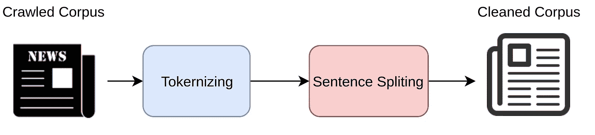
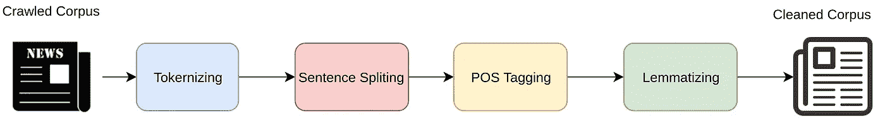
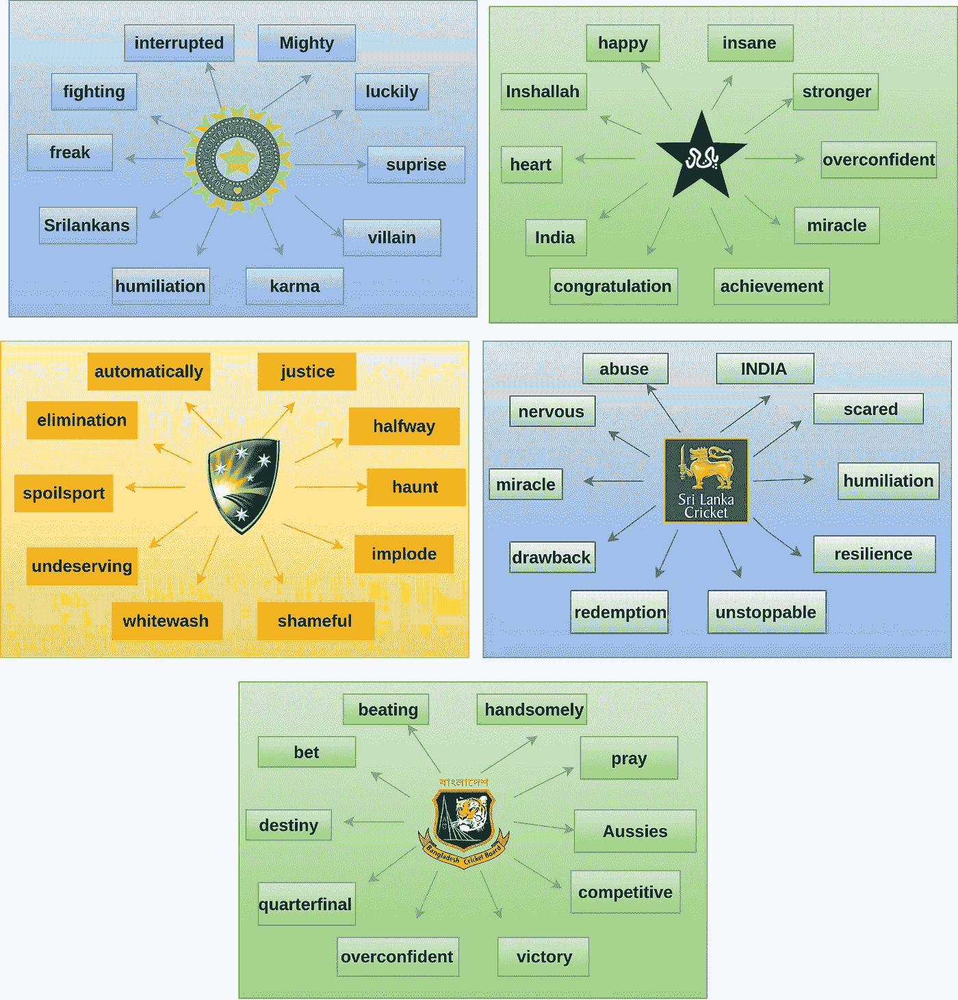
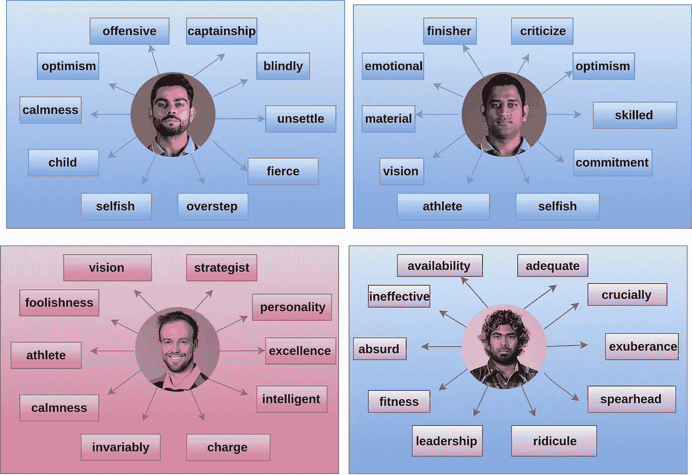
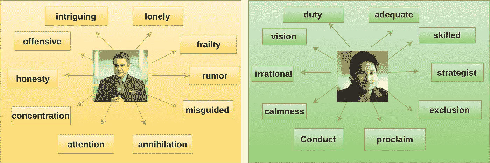

# 基于单词嵌入的 2017 年 ICC 冠军奖杯洞察

> 原文：<https://towardsdatascience.com/word-embedding-based-insights-of-icc-champions-trophy-2017-bde6f6589fc6?source=collection_archive---------7----------------------->

板球比赛以其无脚本的戏剧性、突然爆发的兴奋和悬念而闻名。比赛的节奏可以从慢热到激烈竞争。随着情节变得复杂，情感的复杂相互作用让每个人都坐立不安。

2017 年 6 月对于世界各地的板球爱好者来说的确是一个特殊的月份，因为这是国际板球理事会冠军奖杯的月份。ICC 冠军奖杯是由国际板球理事会(ICC)组织的为期一天的国际(ODI)板球锦标赛，其重要性仅次于板球世界杯。虽然我们能够见证所谓的失败者的戏剧性回归，但巴基斯坦在椭圆形办公室举行的 2017 年国际刑事法院冠军奖杯决赛中全面击败印度，创造了历史。Sarfraz Ahmed 的球队成为继西印度群岛、斯里兰卡和印度之后第四支赢得世界杯、世界 T20 锦标赛和冠军奖杯的球队。

嗯，整个比赛充满了意想不到的事情。斯里兰卡，年轻的上升队击败了卫冕冠军印度和强大的澳大利亚队被排除在小组赛之外，孟加拉虎(孟加拉国)进入半决赛，为比赛带来了戏剧性的推动。因此，我想分析一下媒体和粉丝对这一惊人的 ICC 事件的看法。哇哦。！结果看起来确实非常有趣和令人惊讶。

# 真正的分析游戏

## **基于语言环境的文本分析**

单词嵌入是自然语言处理(NLP)中一组语言建模和特征学习技术的统称，其中来自词汇表的单词或短语被映射到实数的向量。从概念上讲，它涉及从每个单词一维的空间到低得多的维的连续向量空间的数学嵌入。Word2vec 是一组用于产生单词嵌入的相关模型。这些模型是浅层的两层神经网络，被训练来重建单词的语言上下文。Word2vec 将大型文本语料库作为其输入，并产生一个向量空间，通常具有数百个维度，语料库中的每个唯一单词都被分配一个空间中的相应向量。单词向量被定位在向量空间中，使得语料库中共享共同上下文的单词在空间中彼此非常接近。所以我想把我的工作建立在 Word2Vec 之上，在语言上下文基础上进行文本分析。

## **文本语料库:ESPNCricinfo 生存**

ESPNCricinfo 是公认的板球网站之一，它收集了大量的新闻文章和相关的用户评论。为了创建文本语料库，我制作了一个网络爬虫，抓取这些写得很好的文章，日期范围是 2017 年 6 月 1 日到 2017 年 6 月 17 日。我也抓取了用户的评论。将所有这些加在一起，产生了我的用于训练 word2vec 模型的文本语料库。

## **令人喜欢:虽然不是很干净**

NLP pipeline for text pre-processing

为了预处理获得的文本语料库，我使用了上面所示的 NLP 管道。然而，它需要进一步的处理，如格泛化、拼写检查和语法检查。为了这项工作的简单，我将在这里省略它们。

如果将词性标注和词汇化也引入到管道中，它还可以产生更准确的结果。

Enhanced NLP pipeline for text pre-processing

下一步是从获得的预处理文本语料库中训练出 word2vec 模型。由于文本语料库相对较小，模型在几分钟内就创建好了。

好吧，那么，…是时候看看结果了…

# **结果**

从 word2vec 模型中，我获得了给定文本阶段上下文最相关的 100 个单词。以下部分基于每个查询词 100 个单词。但是，我从结果术语中手动提取了 10 个术语，出于可视化的目的，这些术语在给定主题下似乎是有趣的。

## **团队智慧相关词汇**

下图说明了基于团队的术语。考虑到锦标赛中各队收到的疫情，印度、巴基斯坦、澳大利亚、斯里兰卡和孟加拉国被选为本次分析的对象。

## **玩家明智相关词汇**

在众多令人惊讶的选手中，以下四位选手因其受欢迎程度而被选中。注意，只选择了动词/副词/形容词。

## **评论员睿智相关词汇**

由前明星板球运动员组成的 15 人评论员小组确实提高了冠军奖杯。其中，Sanjay Manjrekar 和 Kumar Sangakkara 被选为研究对象。注意，只选择了动词/副词/形容词。

## **帖子备注**

好吧，如果你更新了 2017 年冠军奖杯，那么显然，你应该对上述结果有相当好的解释。但是，得到的一些结果似乎有偏差。这是一种可能性，因为语料库的创建也包括获取用户的评论。嗯，差不多就是这样。如果你喜欢玩这个模型，这里的[是这个项目的完整代码示例。](https://github.com/Vindulamj/CT2Vec)

各位板球快乐！！