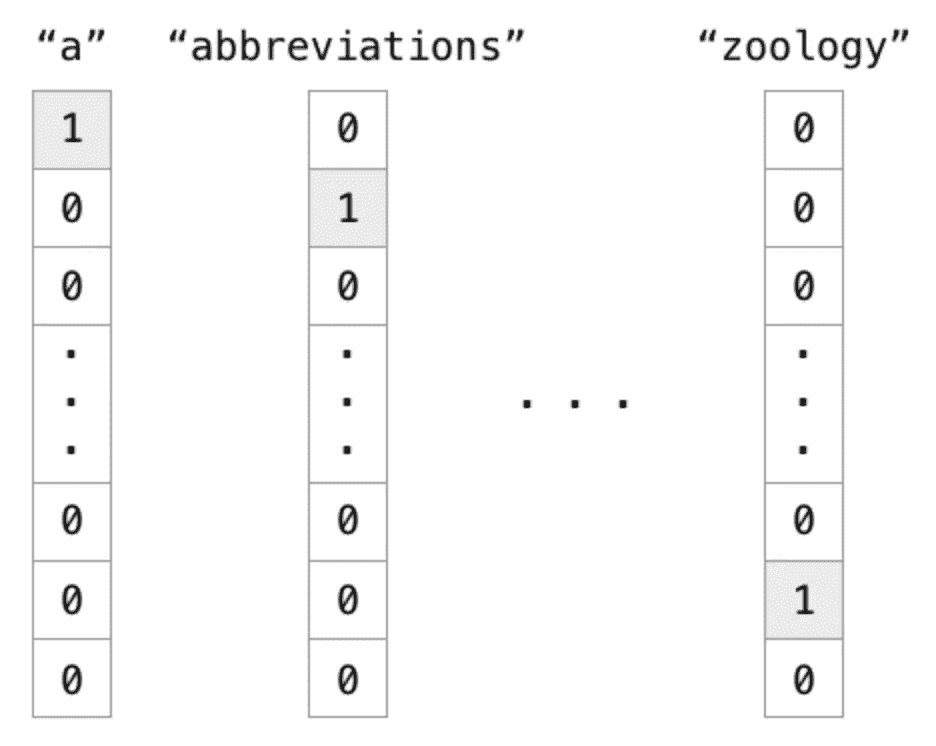
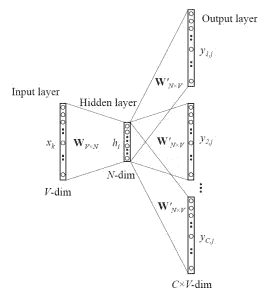
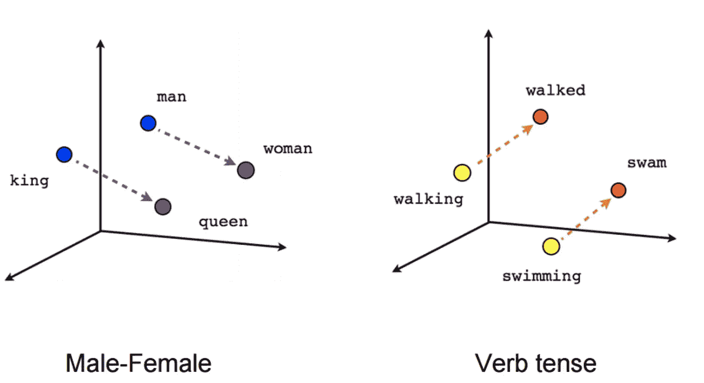
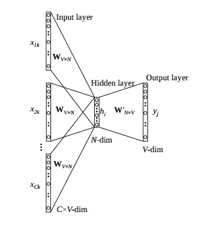
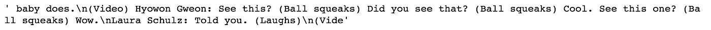
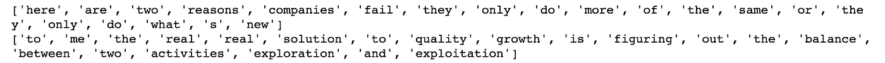
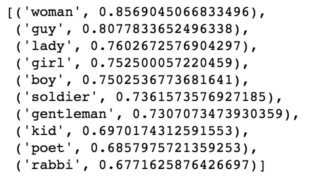
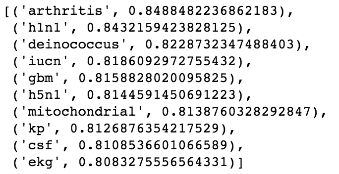

# 使用 Gensim 嵌入 Word2Vec 和 FastText 单词

> 原文：<https://towardsdatascience.com/word-embedding-with-word2vec-and-fasttext-a209c1d3e12c?source=collection_archive---------1----------------------->

([https://iwcollege-cdn-pull-zone-theisleofwightco1.netdna-ssl.com/wp-content/uploads/2017/05/2DGerAvyRM.jpg](https://iwcollege-cdn-pull-zone-theisleofwightco1.netdna-ssl.com/wp-content/uploads/2017/05/2DGerAvyRM.jpg))

在自然语言处理(NLP)中，我们经常将单词映射成包含数值的向量，以便机器能够理解。单词嵌入是一种映射类型，它允许具有相似含义的单词具有相似的表示。本文将介绍两种最先进的单词嵌入方法， **Word2Vec** 和 **FastText** 以及它们在 Gensim 中的实现。

# 传统方法

传统的表示单词的方式是 one-hot vector，本质上是一个只有一个目标元素为 1，其他为 0 的向量。向量的长度等于语料库中唯一词汇的总大小。按照惯例，这些独特的单词是按字母顺序编码的。也就是说，您应该预期以“a”开头的单词的单热向量具有较低的索引，而以“z”开头的单词的单热向量具有较高的索引。

[https://cdn-images-1.medium.com/max/1600/1*ULfyiWPKgWceCqyZeDTl0g.png](https://cdn-images-1.medium.com/max/1600/1*ULfyiWPKgWceCqyZeDTl0g.png)ㄨ

尽管这种单词表示简单且易于实现，但还是有几个问题。首先，你不能推断两个词之间的任何关系，因为它们只有一个热表示。例如，单词“忍受”和“容忍”，虽然有相似的意思，他们的目标“1”是远离对方。此外，稀疏性是另一个问题，因为向量中有许多冗余的“0”。这意味着我们浪费了很多空间。我们需要一种更好的文字表达来解决这些问题。

# Word2Vec

Word2Vec 是解决这些问题的有效方法，它利用了目标单词的上下文。本质上，我们希望使用周围的单词来用神经网络表示目标单词，神经网络的隐藏层对单词表示进行编码。

Word2Vec 有两种类型，Skip-gram 和连续单词包(CBOW)。我将在下面的段落中简要描述这两种方法是如何工作的。

## 跳跃图

对于 skip-gram，输入是目标单词，而输出是目标单词周围的单词。例如，在句子“*我有一只可爱的狗*”中，输入将是“ *a* ”，而输出是“ *I* ”、“*有*”、“*可爱的*”和“*狗*”，假设窗口大小为 5。所有输入和输出数据具有相同的维数，并且是一位热编码的。网络包含 1 个隐藏层，其尺寸等于嵌入尺寸，小于输入/输出向量尺寸。在输出层的末端，应用 softmax 激活函数，以便输出向量的每个元素描述特定单词在上下文中出现的可能性。下图显示了网络结构。

Skip-gram ([https://www.analyticsvidhya.com/blog/2017/06/word-embeddings-count-word2veec/](https://www.analyticsvidhya.com/blog/2017/06/word-embeddings-count-word2veec/))

目标单词的单词嵌入可以通过在将该单词的独热表示馈送到网络中之后提取隐藏层来获得。

使用 skip-gram，表示维度从词汇大小(V)减少到隐藏层的长度(N)。此外，向量在描述单词之间的关系方面更“有意义”。两个关联词相减得到的向量有时表达的是性别或动词时态等有意义的概念，如下图所示(降维)。

Visualize Word Vectors ([https://www.tensorflow.org/images/linear-relationships.png](https://www.tensorflow.org/images/linear-relationships.png))

## CBOW

连续单词包(CBOW)与 skip-gram 非常相似，只是它交换了输入和输出。这个想法是，给定一个上下文，我们想知道哪个单词最有可能出现在其中。

CBOW ([https://www.analyticsvidhya.com/blog/2017/06/word-embeddings-count-word2veec/](https://www.analyticsvidhya.com/blog/2017/06/word-embeddings-count-word2veec/))

Skip-gram 和 CBOW 之间最大的区别在于**生成单词向量的方式**。对于 CBOW，将所有以目标词为目标的样本输入到网络中，并对提取的隐含层取平均值。比如，假设我们只有两句话，“他是个不错的家伙”和“她是个睿智的女王”。为了计算单词“a”的单词表示，我们需要将这两个示例“他是好人”和“她是明智的女王”输入到神经网络中，并取隐藏层中值的平均值。Skip-gram 只输入一个且只有一个目标单词 one-hot 向量作为输入。

据说跳格法在生僻字中表现更好。尽管如此，Skip-gram 和 CBOW 的性能大体相似。

## 履行

我将向您展示如何使用 Gensim(一个强大的 NLP 工具包)和 TED Talk 数据集来执行单词嵌入。

首先，我们使用 urllib 下载数据集，从文件中提取字幕。

我们来看看 *input_text* 变量存储了什么，部分如下图所示。

input_text

显然，有一些多余的信息对我们理解演讲没有帮助，例如括号中描述声音的词和演讲者的名字。我们用正则表达式去掉这些词。

现在， *sentences_ted* 已经被转换成一个二维数组，每个元素都是一个单词。让我们打印出第一个和第二个元素。

sentences_ted

这是准备好输入 Gensim 中定义的 Word2Vec 模型的表单。Word2Vec 模型用下面一行代码就可以轻松训练出来。

*   *句子*:拆分句子列表。
*   *大小*:嵌入向量的维数
*   *窗口*:您正在查看的上下文单词数
*   *min_count* :告诉模型忽略总计数小于此数的单词。
*   *workers* :正在使用的线程数
*   *sg* :是使用 skip-gram 还是 CBOW

现在，我们来试试哪些词和“人”这个词最相似。

似乎与男人/女人/孩子相关的词与“男人”最为相似。

虽然 Word2Vec 成功地处理了一个热向量带来的问题，但是它有一些限制。最大的挑战是它不能代表没有出现在训练数据集中的单词。即使使用包含更多词汇的更大的训练集，一些很少使用的罕见单词也永远无法映射到向量。

# 快速文本

FastText 是脸书在 2016 年提出的 Word2Vec 的扩展。FastText 不是将单个单词输入到神经网络中，而是将单词分成几个 n-grams(子单词)。例如， *apple* 这个词的三元组是 *app、ppl* 和 *ple* (忽略单词边界的开始和结束)。*苹果*的单词嵌入向量将是所有这些 n 元文法的总和。在训练神经网络之后，给定训练数据集，我们将对所有 n 元语法进行单词嵌入。罕见的单词现在可以正确地表示，因为它们的一些 n 元语法很可能也出现在其他单词中。在下一节中，我将向您展示如何在 Gensim 中使用 FastText。

## 履行

类似于 Word2Vec，我们只需要一行来指定训练单词嵌入的模型。

我们用*肠胃炎*这个词试试，这个词很少用，也没有出现在训练数据集中。

即使单词*肠胃炎*不存在于训练数据集中，它仍然能够找出这个单词与一些医学术语密切相关。如果我们在前面定义的 Word2Vec 中尝试这样做，它会弹出错误，因为这样的单词在训练数据集中不存在。虽然训练一个 FastText 模型需要更长的时间(n-grams 的数量>单词的数量)，但它的性能比 Word2Vec 更好，并允许适当地表示罕见的单词。

# 结论

您已经学习了什么是 Word2Vec 和 FastText，以及它们在 Gensim toolkit 中的实现。如果你有任何问题，欢迎在下面留言。如果你喜欢这篇文章，确保你在 twitter 上关注我，这样你就不会错过任何伟大的机器学习/深度学习博客文章！