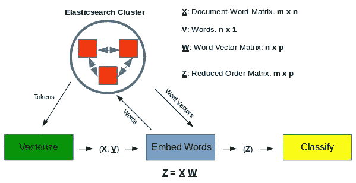
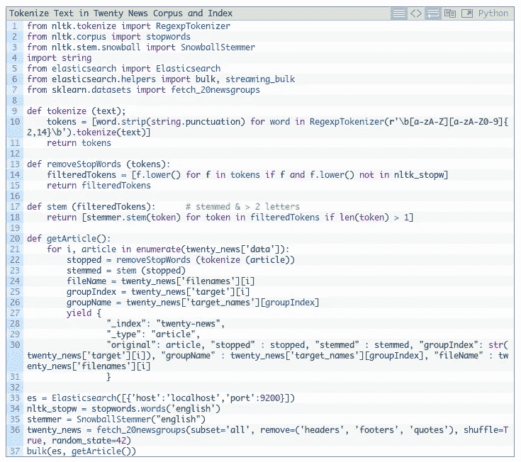
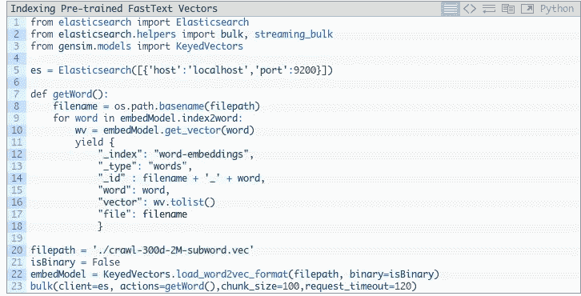
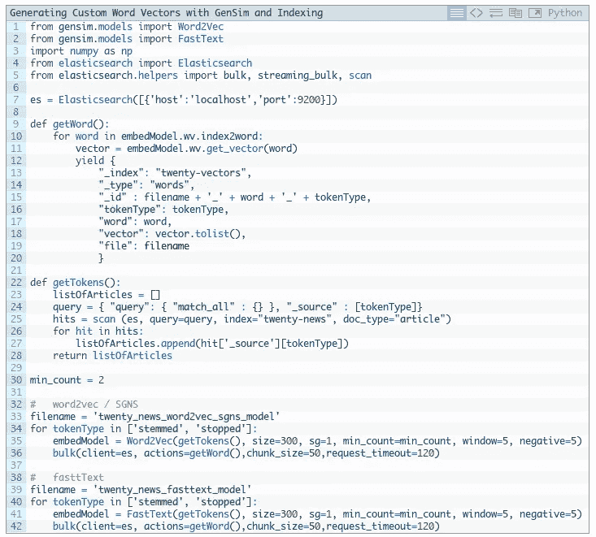
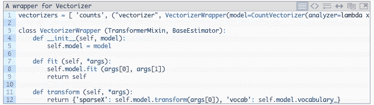
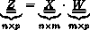
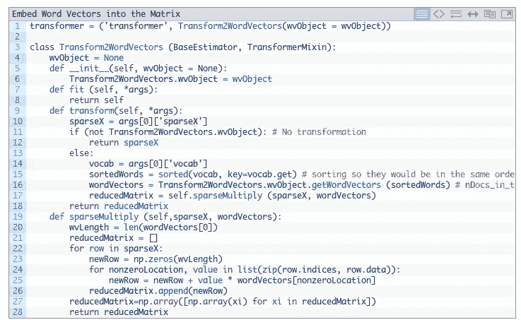
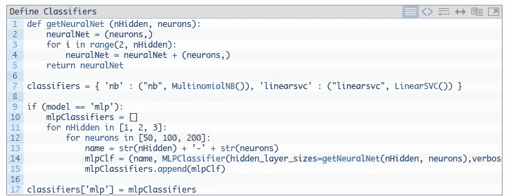

# 单词嵌入和文档向量:第 2 部分。订单缩减

> 原文：<https://towardsdatascience.com/word-embeddings-and-document-vectors-part-2-order-reduction-2d11c3b5139c?source=collection_archive---------9----------------------->

## 单词嵌入产生了从 *n* -long ( *n* 是组成文本语料库的词汇的大小)稀疏文档向量到 *p* -long 密集向量的线性变换，其中 *p* < < *n* 因此实现了顺序的减少…

在之前的文章[中，单词嵌入和文档向量:第 1 部分。相似性](http://xplordat.com/2018/09/27/word-embeddings-and-document-vectors-part-1-similarity/)我们为使用基于单词包的文档向量结合单词嵌入(预训练或定制训练)来计算文档相似性奠定了基础，作为分类的先驱。看起来,*文档+单词向量更善于发现我们看过的玩具文档中的相似之处(或缺乏之处)。我们想把它进行到底，并把这种方法应用到实际的文档库中，看看文档+单词向量如何进行分类。这篇文章关注的是实现这个目标的方法、机制和代码片段。结果将在本系列的下一篇文章中介绍。*

这篇文章的大纲如下。完整实现的代码可以从 [github](https://github.com/ashokc/Word-Embeddings-and-Document-Vectors) 下载。

1.  选择一个文档库(比如来自 SciKit pages 的 Reuter[20-news](http://scikit-learn.org/stable/datasets/twenty_newsgroups.html)for multi class，或者来自斯坦福的[大型电影评论数据集](http://ai.stanford.edu/~amaas/data/sentiment/)for binary 情感分类)
2.  对语料库进行标记化(停止/词干化),并获得标记的词向量(预训练和定制训练)。这只需要做一次，我们在所有的分类测试中都使用它们。我们将它们存储到 [Elasticsearch](https://www.elastic.co/) 中，以便在需要时方便快捷地检索。我们将考虑单词向量的 [Word2Vec/SGNS](https://drive.google.com/file/d/0B7XkCwpI5KDYNlNUTTlSS21pQmM/edit?usp=sharing) 和 [FastText](https://s3-us-west-1.amazonaws.com/fasttext-vectors/crawl-300d-2M.vec.zip) 算法。 [Gensim](https://radimrehurek.com/gensim/) API 用于生成自定义向量和处理预训练向量。
3.  构建一个 SciKit [管道](http://scikit-learn.org/stable/modules/generated/sklearn.pipeline.Pipeline.html),它执行图 1 所示的操作序列。

*   从 Elasticsearch 索引中获取文档标记(停止或词干化)。对它们进行矢量化(用 SciKit 的[计数矢量化器](http://scikit-learn.org/stable/modules/generated/sklearn.feature_extraction.text.CountVectorizer.html)或 [TfidfVectorizer](http://scikit-learn.org/stable/modules/generated/sklearn.feature_extraction.text.TfidfVectorizer.html#sklearn.feature_extraction.text.TfidfVectorizer) 得到高阶文档词矩阵)。
*   为每个令牌嵌入从 Elasticsearch 索引中提取的词向量(Word2Vec、FastText、预训练或自定义)。这导致了降阶的文档-单词矩阵。
*   运行 SciKit 提供的分类器[多项式朴素贝叶斯](http://scikit-learn.org/stable/modules/generated/sklearn.naive_bayes.MultinomialNB.html)、[线性支持向量、](http://scikit-learn.org/stable/modules/generated/sklearn.svm.LinearSVC.html)和[神经网络](http://scikit-learn.org/stable/modules/generated/sklearn.neural_network.MLPClassifier.html)进行训练和预测。所有分类器都采用默认值，除了神经网络中所需的神经元和隐藏层的数量。

Figure 1\. A schematic of the process pipeline

这篇文章中展示的代码片段就是它们的本来面目——*片段*，是从完整的实现中截取的，为了简洁起见，我们对其进行了编辑，以专注于一些事情。 [github repo](https://github.com/ashokc/Word-Embeddings-and-Document-Vectors) 是参考。在进入完整的流程管道之前，我们将简要地详细说明上面的标记化和词向量生成步骤。

## 1.标记化

虽然 SciKit 中的文档矢量化工具可以对文档中的原始文本进行标记，但我们可能希望使用自定义停用词、词干等来控制它。下面是一段代码，它将 20 条新闻的语料库保存到一个 elasticsearch 索引中，以供将来检索。

**Code Listing 1**: Tokenizing the 20-news corpus and indexing to Elasticsearch

在上面的第 10 行中，我们删除了所有标点符号，删除了不以字母开头的标记，以及过长(> 14 个字符)或过短(< 2 个字符)的标记。标记被小写，停用词被删除(第 14 行)，并被词干化(第 18 行)。在第 36 行，我们删除了每篇文章的页眉、页脚等信息，因为这些信息会泄露文章属于哪个新闻组。基本上，我们使分类变得更加困难。

## 2.词向量

下面的代码片段将发布的 fasttext 单词向量处理成一个 elasticsearch 索引。

**Code Listing 2**: Processing pre-trained word-vectors with Gensim and indexing into Elasticsearch

在上面的第 22 行中，我们读取了预先训练的向量。第 23 行将它们索引到 elasticsearch 中。我们还可以从手头的任何文本语料库中生成自定义的词向量。Gensim 也为此提供了方便的 api。

**Code Listing 3**: Generating custom word-vectors with Gensim

在第 35 行和第 41 行，使用从我们在第 1 节中创建的语料库索引中获得的标记(停止或词干化)来训练模型。向量的选择长度是 300。第 30 行中的 *min_count* 指的是为了考虑某个标记，该标记在语料库中必须出现的最小次数。

## 3.工艺管道

我们对 repo 中的文档进行矢量化，如果要使用单词嵌入，则转换并降低模型的阶数，并应用分类器进行拟合和预测，如前面的图 1 所示。让我们依次看看他们中的每一个。

**3.1 矢量化**

我们之前说过可以使用 SciKit 的 count/tf-idf 矢量器。它们肯定会产生一个文档术语矩阵 *X* ，但是我们管道中的*单词嵌入*步骤需要由矢量器获得的词汇/单词。因此，我们围绕 SciKit 的矢量器编写了一个定制的包装器类，并用词汇表增加了转换响应。

**Code Listing 4**: A wrapper to SciKit’s vectorizers to augment the response with corpus vocabulary

包装器在第 1 行使用实际的 SciKit 矢量器进行初始化，并将 min_df(词汇表中需要考虑的令牌在存储库中的最小频率)设置为 2。第 8 行使用所选矢量器的 fit 过程，第 12 行的 transform 方法发出一个响应，其中包含第二步所需的 *X* 和派生词汇 *V* 。

**3.2 嵌入文字**

我们有 *m* 个文档和 *n* 个其中唯一的单词。这里工作的核心部分如下。

1.  从我们在第 2 节准备的索引中获得这些 *n* 单词中每一个的 *p* 维单词向量。
2.  准备一个 *nxp* 单词向量矩阵 *W* ，其中每一行对应于分类词汇表中的一个单词
3.  通过简单乘法将 *mxn* 原始稀疏文档字矩阵 *X* 转换为 *mxp* 密集矩阵 *Z* 。我们已经在[上一篇文章中讨论过这个问题。](http://xplordat.com/2018/09/27/word-embeddings-and-document-vectors-part-1-similarity/)但是请注意，SciKit 使用文档作为行向量，所以这里的 *W* 是那篇文章中等式 1 的转置。没什么复杂的。

*p* 当然是 word-vector 的长度，原来的 1-hot *n* 维向量到这个假的*p*word-space 的投影。然而，我们应该小心矩阵乘法，因为 *X* 来自矢量器，是一个[压缩稀疏行](https://docs.scipy.org/doc/scipy/reference/generated/scipy.sparse.csr_matrix.html#scipy.sparse.csr_matrix)矩阵，而我们的 *W* 是一个普通矩阵。一点指数戏法就能做到。下面是管道中这一步的代码片段。

**Code Listing 5**: Building the reduced order dense matrix Z

第 1 行用一个 wordvector 对象初始化转换器(查看 [github](https://github.com/ashokc/Word-Embeddings-and-Document-Vectors) 中的代码),该对象具有从索引中获取向量的方法。第 15 行从矢量器步骤传递的词汇表中获得一个排序后的单词列表。csr *X* 矩阵对其非零条目使用相同的顺序，我们也需要以相同的单词顺序获得 *W* 。这是在第 16 行完成的，最后第 17 行的稀疏矩阵乘法产生了我们所追求的降阶矩阵 *Z* 。

**3.3 分类**

这很简单。分类器得到矩阵*m*x pZ，其中每一行都是一个文档。它还在拟合模型时获得标签的 *m x 1* 向量。我们将评估三种分类器——朴素贝叶斯、支持向量机和神经网络。我们在不调整任何默认 SciKit 参数的情况下运行它们。在神经网络的情况下，我们尝试了一些不同数量的隐藏层(1、2 或 3)和(50、100 和 200)内的神经元，因为没有好的默认设置。

**Code Listing 6**: Preparing a list of classifiers for the pipeline

第 1 行中的方法 *getNeuralNet* 生成了我们用隐藏层和神经元初始化神经网络所需的元组。我们准备了一套分类器，用于矢量器和转换器的各种组合。

## 4.后续步骤

在之前的[帖子](http://xplordat.com/2018/09/27/word-embeddings-and-document-vectors-part-1-similarity/)中，我们研究了带有单词嵌入的文档相似性。在这篇文章中，我们展示了在文档库中使用这些概念来获得简化的文档单词矩阵的机制。在下一篇文章中，我们将运行模拟，并研究不同的标记化方案、词向量算法、预训练与自定义词向量对不同分类器的质量和性能的影响。

— — — — — — — — — — — — — — — — — — — — — — — — — — — — — — — -

*本文的修改版最初发表于 2018 年 9 月 27 日*[*【xplordat.com】*](http://xplordat.com/2018/09/27/word-embeddings-and-document-vectors-part-1-similarity/)*。*