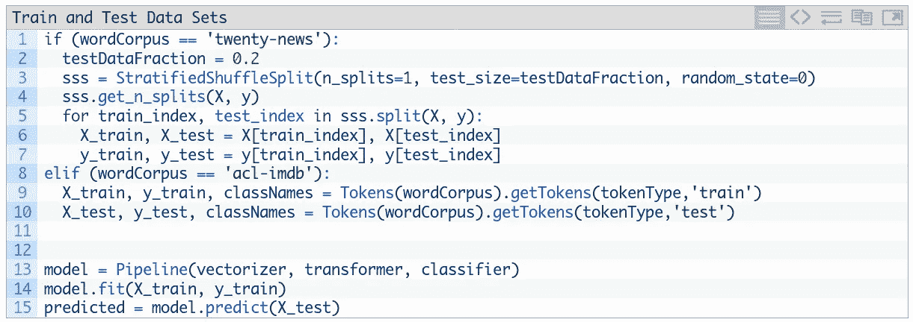
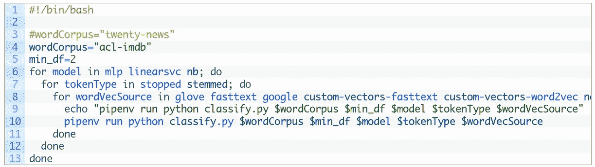
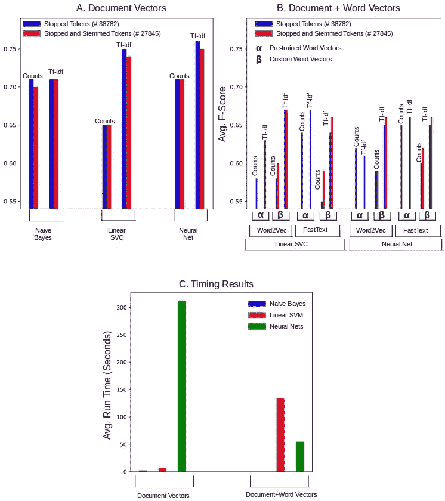
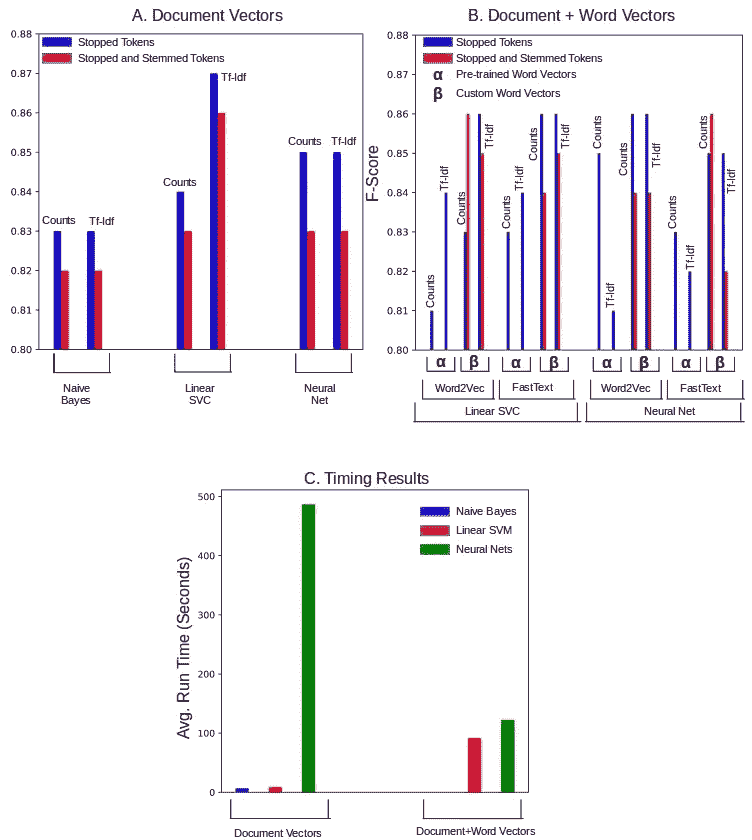

# 单词嵌入和文档向量——如有疑问，请简化

> 原文：<https://towardsdatascience.com/word-embeddings-and-document-vectors-when-in-doubt-simplify-8c9aaeec244e?source=collection_archive---------6----------------------->

## 对一些文本集的分类精度和性能指标表明，朴素贝叶斯分类器是一个强有力的竞争者

这是关于在 NLP 任务中使用单词向量和文档向量的系列文章的第三篇也是最后一篇。这里的重点是文本分类。当单词向量与文档向量相结合时，我们总结了其结果和建议。代码可以从 [github](https://github.com/ashokc/Word-Embeddings-and-Document-Vectors) 下载。让我们快速总结一下过去的两篇文章。

1.  [相似度](/word-embeddings-and-document-vectors-part-1-similarity-1cd82737cf58):单词向量是一个单词的表示，它是一个选定长度的数字向量 *p* 。它们是通过对文本语料库应用 Word2vec、Glove 和 FastText 等工具而获得的。具有相似含义的单词通常产生余弦相似度更接近 1 而不是 0 的数字单词向量。
2.  [降阶](/word-embeddings-and-document-vectors-part-2-order-reduction-2d11c3b5139c):将单词向量与基于单词包的文档向量相结合，在文本语料库的模型 *Z* 中产生大的(通常几个数量级，等于 *m/p* 其中 *m* 是文本语料库中唯一单词的数量，而 *p* 是单词向量的长度)降阶。我们构建了一个 scikit 管道(vectorize =>embed words =>classify ),在单词向量矩阵 *W* 的帮助下，从高阶的 *X* 导出 *Z* 。每一行 *W* 都是文本语料库中一个单词的 *p* 维数值表示。

这样，我们就可以评估单词向量对文本分类的影响，并在流水线步骤中使用我们可以选择的选项来限定结果。我们坚持三个步骤中的每一步都有几个主要选项。

1.  **记号化**。我们将使用 scikit 的[计数矢量器](http://scikit-learn.org/stable/modules/generated/sklearn.feature_extraction.text.CountVectorizer.html)和[tfidfvectorizer](http://scikit-learn.org/stable/modules/generated/sklearn.feature_extraction.text.TfidfVectorizer.html#sklearn.feature_extraction.text.TfidfVectorizer)。
2.  **词向量**。我们将对 [Word2Vec/SGNS](https://drive.google.com/file/d/0B7XkCwpI5KDYNlNUTTlSS21pQmM/edit?usp=sharing) 和 [FastText](https://s3-us-west-1.amazonaws.com/fasttext-vectors/crawl-300d-2M.vec.zip) 进行评测。预培训和定制生成(通过 [Gensim](https://radimrehurek.com/gensim/) )
3.  **量词**。我们将使用 scikit 的[多项式朴素贝叶斯](http://scikit-learn.org/stable/modules/generated/sklearn.naive_bayes.MultinomialNB.html)、[线性支持向量、](http://scikit-learn.org/stable/modules/generated/sklearn.svm.LinearSVC.html)和[神经网络](http://scikit-learn.org/stable/modules/generated/sklearn.neural_network.MLPClassifier.html)

# 1.模拟

我们使用两个文档库。来自斯坦福的大型电影评论数据集[用于二元情感分类，来自 scikit pages 的 reuter](http://ai.stanford.edu/~amaas/data/sentiment/) [20-news](http://scikit-learn.org/stable/datasets/twenty_newsgroups.html) 用于多元分类。为了简单起见，我们坚持使用单一的训练集和单一的测试集。在 20 条新闻的情况下，我们进行分层分割，80%用于训练，20%用于测试。imdb 电影评论数据集带有定义的训练和测试集。下面代码片段中的第 9 行和第 10 行使用了一个令牌类(查看 [github](https://github.com/ashokc/Word-Embeddings-and-Document-Vectors) code repo ),它有从索引中提取令牌的方法。

Code Listing 1\. Train and Test data sets. Define a pipeline instance for fit and predict.

要运行的模型是管道的一个实例——矢量器、转换器和分类器的特定组合。第 13 行到第 15 行定义了模型并运行预测。模拟是通过下面的 shell 脚本运行的，该脚本循环遍历管道步骤的不同选项。

Code Listing 2\. A script to evaluate different options for the pipeline steps

mlp 分类器实际上由 9 种变体组成，每种变体有 1、2 或 3 个隐藏层，每层有 50、100 或 200 个神经元。此处报告的结果是针对使用 2 个隐藏层，每个隐藏层有 100 个神经元的情况。其他 *mlp* 分类器运行基本上用于验证分类的质量在隐藏层和神经元的这个级别不是非常敏感。

然而，有些组合是不允许的，在 Python 实现中会被跳过。这些是:

1.  朴素贝叶斯分类器不允许文档向量中有负值。但是我们用文档+词向量的时候， *Z* 会有一些否定。应该有可能统一转换/缩放所有矢量以避免负面影响，但我们并不担心，因为我们有足够的模拟来运行。所以基本上朴素贝叶斯分类器在这里只用于纯文档向量。
2.  预先训练的词向量只适用于正常的词，不适用于词干化的词。因此，我们通过词干标记和预训练向量的组合来跳过运行。

# 2.结果

我们看的唯一度量是分类质量的 F 分数和效率的 cpu 时间。在 20 个新闻数据集的多类分类的情况下，F 分数是所有 20 个类的平均值。分类器+向量组合的运行时间是使用相同组合的所有运行的平均值。

## 2.1 20 条新闻数据集的多类分类

下面的图 1 总结了 20 条新闻数据集的结果。

Figure 1\. Nulticlass classification of the 20-news data set. (1A) Classification with pure document vectors (1B) Classification with document+word vectors (1C) Run time with pure document vectors and document+word vectors

这里的图中包含了很多细节，所以让我们逐点总结一下。

**1。文档向量 vs 文档+单词向量**:看一眼 1A 和 1B，我们会发现 1A 的分类质量更好，也许好不了多少，但却是真实的，而且是全面的。也就是说，如果分类质量是最重要的，那么在这种情况下，文档向量似乎具有优势。

**2。Stopped vs Stemmed** : Stemmed 词汇产生更短的向量，因此对所有分类器的性能更好。对于 *mlp* 分类器来说尤其如此，在这种分类器中，输入神经元的数量等于输入文档向量的大小。当单词被词干化时，唯一单词的数量从 39k 下降到 28k，减少了大约 30%,这大大减小了纯文档向量的大小。

*   *文档向量*。图 1A 表明，当纯文档向量是分类的基础时，对获得的 F 分数没有实质性影响。
*   *文档+词向量*。然而，在这种情况下，使用词干标记似乎有一些好处。虽然改进很小，但通过对词干化的标记进行训练获得的定制向量显示出比对停止的标记进行训练的向量更好的 F 分数。这如图 1B 所示。

**3。频率计数与 Tf-Idf:** Tf-Idf 矢量化允许根据单词在语料库中出现的频率对单词进行不同的加权。对于基于关键字的搜索方案，它有助于提高搜索结果的相关性。

*   *文件向量*。虽然*朴素贝叶斯*没有被 tf-idf 打动，但是 *linearsvc* 和 *mlp* 分类器通过 tf-idf 矢量化产生了更好的 F 分数。这如图 1A 所示。
*   *文档+词向量。*图 1B 显示，使用 tf-idf 矢量化后，F 值有了很大的提高。既有预先训练的词向量，也有定制的词向量。唯一的例外似乎是当预训练的 word2vec 向量与 *mlp* 分类器结合使用时。但是将隐藏层的数量从 2 增加到 3，将神经元的数量从 100 增加到 200，tf-idf 矢量化又得到了更好的分数。

**4。预训练矢量与定制矢量:**这仅适用于图 1B。自定义单词向量似乎有优势。

*   自定义向量显然会产生更好的 F 值，尤其是使用 tf-idf 矢量化时
*   预训练的向量似乎稍微好一点

**5。计时结果:**图 1C 显示了 fit &预测运行的平均 cpu 时间。

*   当使用纯文档向量时， *mlp* 分类器的运行时间更长是可以理解的。有许多(39k，如果停止和 28k，如果阻止)输入神经元工作。这是我们在之前的文章中讨论的单词嵌入出现的原因之一。
*   使用更小但更密集的*Z*,*linear SVC*分类器需要更长时间才能收敛。
*   朴素贝叶斯分类器是所有分类器中最快的。

## 2.2 电影评论的二元分类

下面的图 2 显示了从电影评论数据集获得的二进制分类结果。

Figure 2\. Binary classification of the movie review data set. (2A) Classification with pure document vectors (2B) Classification with document+word vectors (2C) Run time with pure document vectors and document+word vectors

这里的观察与上面的没有本质上的不同，所以我们不会在这上面花太多时间。这里分类的整体质量更好，F 值在 0.8 以上(相比之下，20 个新闻语料库的 F 值约为 0.6)。但这只是这个数据集的本质。

1.  **文档向量 vs 文档+单词向量:**看一下 2A 和 2B，我们可以说文档+单词向量似乎总体上在分类质量上有优势(除了 *linearsvc* 与 tf-idf 一起使用的情况)。20 条新闻数据集的情况正好相反。
2.  **Stopped vs Stemmed**:Stopped 令牌似乎在大多数情况下表现更好。在 20 条新闻的数据集上，情况正好相反。词干化导致词汇表的大小减少了 34%,从 44k 减少到 29k。我们对两个数据集应用了相同的词干分析器，但是对于这个语料库中的文本的性质来说，这可能太激进了。
3.  **频率计数与 Tf-Idf:** Tf-Idf 向量在大多数情况下表现更好，就像它们在 20 个新闻数据集的表现一样。
4.  **预训练向量与定制向量:**定制单词向量在所有情况下都比预训练向量产生更好的 F 分数。这在某种程度上证实了我们对 20 条新闻数据的评估，而这些数据并不那么清晰。
5.  计时结果:朴素贝叶斯仍然是最好的。

# 3.那么有哪些大的收获呢？

不幸的是，我们不能仅仅根据对两个数据集进行的有些肤浅的测试就得出明确的结论。此外，正如我们上面提到的，在数据集之间，同一管道的分类质量也存在一些差异。但是从高层次上来说，我们或许可以得出以下结论——不要全信！

**1。当有疑问时——简化。**很明显，这是这篇文章的标题。按照下面的方法做，你就不会犯太大的错误，你会很快完成你的工作。使用:

*   朴素贝叶斯分类器
*   Tf-idf 文档向量
*   想干就干。

**2。理解语料库。**适用于一个语料库的特定流水线(标记化方案= >矢量化方案= >单词嵌入算法= >分类器)对于不同的语料库可能不是最好的。即使通用管道可以工作，细节(特定词干分析器、隐藏层数、神经元等)也需要调整，以在不同的语料库上获得相同的性能。

**3。单词嵌入很棒。**对于维数减少和运行时间的并行减少来说，肯定的。他们工作得很好，但还有更多工作要做。如果你必须使用神经网络进行文档分类，你应该试试这些。

**4。使用自定义矢量**。使用从手边的语料库生成的定制单词向量可能产生更好质量的分类结果