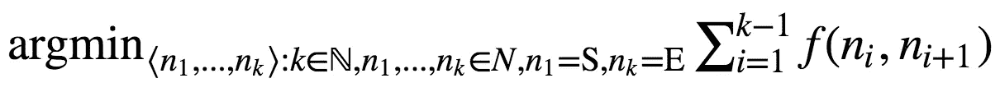
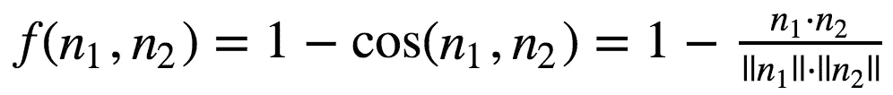
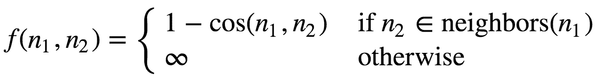
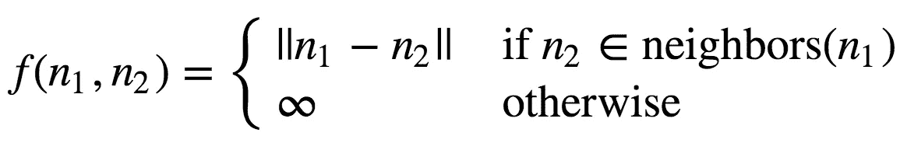

# 单词变形

> 原文：<https://towardsdatascience.com/word-morphing-9f87ee577775?source=collection_archive---------6----------------------->


Smooth image transition (morphing) from a tiger to a human (image courtesy: Google Images)

在这篇文章中，我将描述我如何使用 word2vec 的嵌入和 A*搜索算法在单词之间变形。

为了执行单词变形，我们将定义一个图 *G* ，其中节点集 *N* 表示单词，并且有一些非负的权重函数*f*:*n*×*n*→ℝ.给定一个起始字 *S* 和一个结束字 *E* ，我们的目标是在图中找到一条路径，该路径最小化由 *f* 导出的权重之和:



Fig. 1\. Optimal path with minimal cost induced by f

通常当人们谈论单词变形时，他们指的是在 *S* 和 *E* 之间寻找一条路径，在那里单词之间只有一条边，这样一个可以通过改变一个字母从另一个获得，正如这里可以看到的。在这种情况下，当这种变化存在时， *f* ( *n* ₁， *n* ₂)为 1，否则为∞。

在这篇文章中，我将向你展示如何在语义相似的词之间变形，也就是说 *f* 将与语义相关。这里有一个例子来说明这两种方法的区别:给定 *S* = *齿*， *E* = *光*，一次改变一个字符的方法[可以导致](http://wordmorph.sarangconsulting.com/?source=tooth&target=light&submit=MORPH+WORDS)出现

`tooth, booth, boots, botts, bitts, bitos, bigos, bigot, bight, light`

虽然本文将要定义的语义方法会导致

`tooth, retina, X_ray, light`

你可以在这里找到完整的代码。

# 词汇语义学

为了捕捉单词语义，我们将使用预训练的 word2vec 嵌入[1]。对于那些不熟悉该算法的人，这里有一段来自维基百科的摘录:

> *Word2vec 将大型文本语料库作为其输入，并产生通常具有数百维的向量空间，语料库中的每个唯一单词被分配给该空间中的相应向量。单词向量被定位在向量空间中，使得语料库中共享共同上下文的单词在空间中彼此非常接近。*

这意味着图中的每个节点都可以与高维空间中的某个向量相关联(在我们的例子中是 300)。因此，我们可以自然地定义每两个节点之间的距离函数。我们将使用余弦相似度，因为这是在想要对单词嵌入进行语义比较时通常使用的度量。从现在开始，我将重载一个节点符号 *n* 作为其关联单词的嵌入向量。

为了使用 word2vec 嵌入，我们将从[这里](https://drive.google.com/uc?id=0B7XkCwpI5KDYNlNUTTlSS21pQmM&export=download)下载 Google 的预训练嵌入，并使用`gensim`包来访问它们。

# 选择权重函数

给定余弦相似距离函数，我们可以将我们的 *f* 函数定义为



Eq. 1\. Definition of weight function using cosine similarity

然而，使用这种方法，我们将面临一个问题:最佳路径可能包括具有高权重的边，这将导致语义不相似的连续单词。

为了解决这个问题，我们可以将 *f* 改为



Eq. 2\. Definition of weight function using cosine similarity limited to nearest neighbors

其中*邻居* ( *n* ₁)表示在余弦相似性方面，图中距离 *n* ₁最近的节点。邻居的数量是可配置的。

# A*搜索

现在我们已经定义了我们的图，我们将使用一个众所周知的搜索算法 A* [2]。

在该算法中，每个节点都有一个由两项组成的成本-*g*(*n*)+*h*(*n*)。

*g* ( *n* )是从 *S* 到 *n* 的最短路径的代价， *h* ( *n* )是估算从 *n* 到 *E* 的最短路径的代价的启发式方法。在我们的例子中，启发式函数将是 *f* 。

搜索算法维护一个叫做*开集*的数据结构。最初，这个集合包含 *S* ，在算法的每次迭代中，我们弹出开集中具有最小成本*g*(*n*)+*h*(*n*)的节点，并将其邻居添加到开集。当具有最小成本的节点是 *E* 时，算法停止。

这个算法适用于我们选择的任何启发式函数。但是，为了实际找到最佳路径，启发式函数必须是可接受的，这意味着它不能高估真实成本。不幸的是， *f* 是不可接受的。然而，我们将使用[观察结果](https://en.wikipedia.org/wiki/Cosine_similarity#Properties),即如果向量长度为 1，那么余弦相似性可以通过欧几里德距离上的单调变换来获得。这意味着这两个词在相似度排序方面是可以互换的。欧几里德距离是容许的(你可以用三角形不等式来证明它)，所以我们可以用它来代替，通过定义



Eq. 3\. Definition of weight function using euclidean distance

总之，我们将标准化单词嵌入，使用欧几里得距离作为寻找语义相似的单词的手段，并使用相同的欧几里得距离来指导搜索过程，以便找到最佳路径。

我选择了*邻居* ( *n* )来包含它的 1000 个最近的节点。然而，为了使搜索更有效，我们可以使用 10 的`dilute_factor`来稀释这些:我们选择最近的邻居、第 10 个最近的邻居、第 20 个邻居等等——直到我们有 100 个节点。其背后的直觉是，从某个中间节点到 *E* 的最佳路径可能经过其最近的邻居。如果它不通过，可能也不会通过第二个邻居，因为第一个和第二个邻居可能几乎相同。所以为了节省一些计算，我们跳过一些最近的邻居。

有趣的部分来了:

结果是:

```
['tooth', u'retina', u'X_ray', u'light']
['John', u'George', u'Frank_Sinatra', u'Wonderful', u'perfect']
['pillow', u'plastic_bag', u'pickup_truck', u'car']
```

# 最后的想法

实现单词变形项目很有趣，但没有在我能想到的任何一对单词上玩这个工具有趣。我鼓励你继续前进，自己玩这个游戏。请在评论中告诉我你发现了哪些有趣和令人惊讶的变形:)

*本帖原帖*[*www.anotherdatum.com*](http://www.anotherdatum.com)*。*

## 参考

[1][https://papers . nips . cc/paper/5021-distributed-presentations-of-words-and-phrases-and-they-compositivity](https://papers.nips.cc/paper/5021-distributed-representations-of-words-and-phrases-and-their-compositionality)
【2】[https://www . cs . Auckland . AC . NZ/courses/compsci 709s 2 c/resources/Mike . d/astarnilsson . pdf](https://www.cs.auckland.ac.nz/courses/compsci709s2c/resources/Mike.d/astarNilsson.pdf)