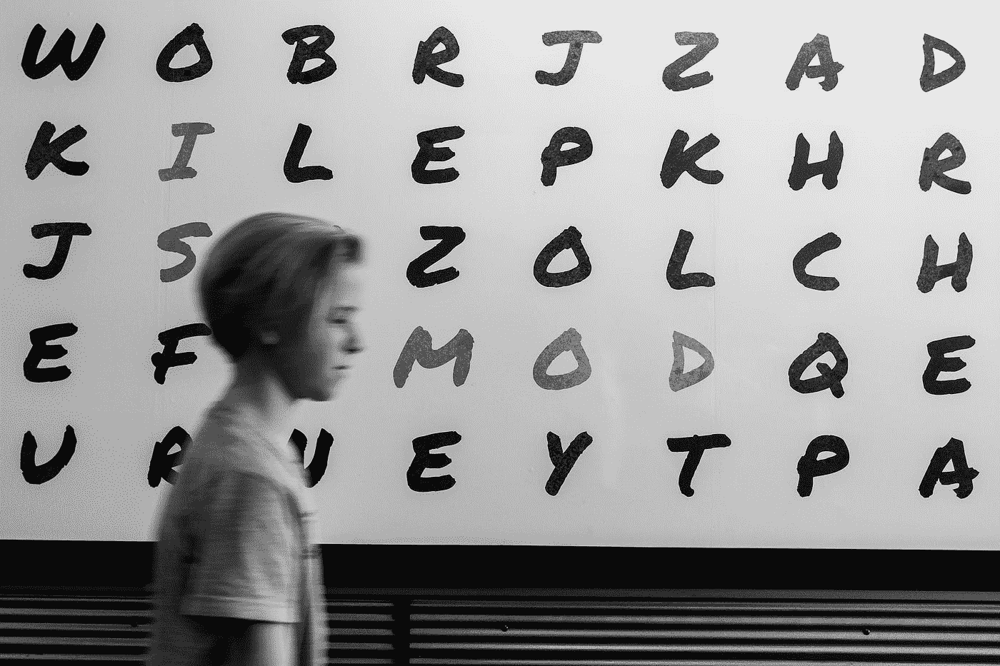

# 来自手写文本的单词预测器

> 原文：<https://towardsdatascience.com/word-predictor-from-handwritten-text-cfa1c5c092d3?source=collection_archive---------6----------------------->

r 语言中图像到文字预测器的实现。

我已经很久没有为社区做贡献了。我回来是为了付出我应得的。但在此之前，让我告诉你我一直在做什么。这几个月职业生涯的亮点有两件事。第一，我在三月份的一次数据科学会议上发言(孟买版 [WiDS](https://www.widsconference.org/) )。第二，我成为了一个开源贡献者，并得到了一个合并到 numpy 包中的 pull 请求。Yayyy！

好吧，让我们从一些机器学习开始。我将简要介绍建模过程，并向您介绍 github repo，它包含实现建模的所有文件和代码。

# 工作

创建一个模型，从手写文本图像中识别 5 个字母的英语单词。这些单词是使用 EMNIST 数据集的字母创建的，该数据集是一组手写字符数字，转换为 28x28 像素的图像格式和数据集结构，与 [MNIST 数据集](http://yann.lecun.com/exdb/mnist/)直接匹配。你可以从[这里](http://What is it? The EMNIST dataset is a set of handwritten character digits derived from the NIST Special Database 19  and converted to a 28x28 pixel image format and dataset structure that directly matches the MNIST dataset)了解详情。

**Example Image for Prediction**

# **解决方案**

为了解决这个问题，我们将建立两个模型。

1.  **图像模型:**单词预测器，通过使用多层感知器执行图像识别，它将接收图像并猜测图像中写了什么。
2.  **文本模型:**这将补充图像模型。该模型的任务是利用隐马尔可夫模型，根据前一个字符给出下一个字符的概率。例如，字母 n 或 a 或 x 后面的 e 的概率是多少。

# 步伐

请参考此 git 报告，以遵循以下步骤-

 [## krit hi07/字符识别

### 字符识别-使用 MLP 从图像中识别单词

github.com](https://github.com/Krithi07/Character_Recognition/blob/master/Code_image_text.R) 

## 1.从 EMNIST [网站](https://www.nist.gov/itl/iad/image-group/emnist-dataset)下载数据集:

1.  向下滚动并点击“Matlab 格式数据集”
2.  将会下载一个“Matlab.zip”文件。解压后你会发现 6 个 MS Access 数据集。我们使用“emnist-byclass”数据集来完成此任务，因为它包含所有字符
3.  第一次使用“R.matlab”库读取 R 中的数据集
4.  加载数据集后，将其保存为 R 格式(Rdata ),以备后用

EMNIST 数据集在训练集中包含 697，932 幅大小为 28 x 28 的标记图像，在测试集中包含 116，323 幅标记图像。图像以灰度表示，其中从 0 到 255 的每个像素值表示其暗度。

**测试设置:**下载文件**em NIST 字。Rdata'** 来自 github repo。该文件包含长度为 5 的 1000 个单词的示例。该测试集是使用 EMNIST 数据集中的字母图像创建的。变量 X 包含单词的图像，变量 y 包含真实单词(标签)，变量 y_hat 包含由 2 层神经网络结合 2 阶马尔可夫模型进行的预测。

**用于预测的数据集格式:**在调用预测函数之前，我们需要获得特定格式的原始输入数据。预测函数采用的输入 X 的大小为 28n×28L，其中 n 是输入样本的数量，L 是单词的长度(例如，对于长度为 5 的 100 个单词，X 的大小为 2800×140)。预测函数在**‘Word _ Predictor _ Champ’中定义。R'** 文件。

## 2.从 github 下载支持文件:

**'EMNIST_general_functions。这个文件有帮助函数，允许访问 EMNIST 数据集，计算误差，使用 EMNIST 数据集创建新单词。**

**'EMNIST_run。R'-** 这是代码执行文件。将 github repo 中的所有文件放在您选择的目录中，并运行' EMNIST_run。r '文件。这将给出字符准确度和单词准确度来评估模型。

## 3.构建模型:

**'Code_image_text。R'** 文件有训练图像和文本模型的代码。文件“EMNIST_Model_Champ.h5”和“TEXT_Model_Champ”。“Rdata”是使用该文件中的代码创建的。这两者分别是图像和文本模型。我们来谈谈这里的代码-

**安装需求:** 我们将使用 tensorflow 构建图像识别的多层神经网络。您只需要这样做一次，以后，只需要从代码中调用库函数()来将需求加载到您的环境中

**为图像模型准备数据:** 我们下载的 EMNIST 数据已经分别有了训练和测试数据集。使用通用函数文件中定义的 EMNIST_read()函数读取数据。因为数据集中定义的每个字母或数字都是一个标签，而不是一个连续的值，所以让我们也将 y 转换成一个包含 62 个类的分类变量(emnist_byclass 数据集)

**建立图像模型:** 我们将通过交替密集层和[脱落层](https://en.wikipedia.org/wiki/Dropout_(neural_networks))来建立一个简单的多层神经网络。丢弃层通过丢弃两个密集层之间的指定百分比的连接来帮助模型的一般化。

我们使用了 [Adam optimizer](https://en.wikipedia.org/wiki/Stochastic_gradient_descent#Adam) 和准确性作为衡量标准来拟合模型。最后，我们以 h5 格式保存模型。“h5”格式用于保存使用 keras 学习的模型，这些模型使用 R 的“保存”命令无法正确保存。

这里的想法是使用神经网络建立一个简单的图像识别模型，该模型将图像像素值作为特征，并将相应的标签作为目标变量。

**为文本模型准备数据:** 就像我们为构建图像模型做数据准备一样，我们需要为文本分析准备数据集。这里的尝试是训练一个懂英语的模型，这样它就可以补充来自图像的预测。例如“从不”这个词。如果图像模型由于字迹不清楚而将“e”预测为“c ”,则文本模型可以纠正它，因为它知道该语言。文本模型将知道，对于 5 个字母的单词，与“c”的概率相比，“nev”之后的“e”的概率更高

为了实现这一点，我们将采用英语语料库(书面文本的集合)，从中构建词汇，然后告诉模型从中学习特征。具体来说，就是在给定前一个字符的情况下，学习下一个字符的概率。

我们在这里编写了一个函数，该函数执行数据清理部分，首先从文本中删除标点符号，过滤 5 个字母的单词，将所有单词转换为小写，提取只有字母(而不是数字)的单词，最后从这个精炼的语料库中只选择唯一的单词。

**构建文本模型:** 现在我们有了一个预处理过的语料库，我们可以用它来学习语言特征。对于这个任务，我们已经编写了一个[隐马尔可夫模型](https://en.wikipedia.org/wiki/Hidden_Markov_model)，它基本上使用频率表得到给定 X(i)的 X(i+1)的概率。最后，让我们将这个模型保存为‘Text _ Model _ Champ’。Rdata '文件。

注意:您可以使用任何文本语料库来构建这个模型。通常，模型的性能取决于所提供的训练数据的质量和数量。在 github repo 上，我放了一个例子语料库(War_and_Peace.txt)供大家参考/使用。

## **4。预测单词:**

' Word_Predictor_Champ '。r’文件包含预测函数，该函数将具有像素值的 2D 阵列 X、图像的学习模型 m:image 和学习的文本模型 m:text 作为输入。该函数返回字符串标签 y 的 1D 数组，其中数组的每个元素都是长度为 l 的字符串

该函数首先将输入图像转换成所需的(nxl，28x28)形状的矩阵形式。然后使用图像模型得到每个字符的概率。使用文本模型获取下一个字符的概率(第一个字符除外)。将这两者的概率结合起来进行最终预测。

Photo by [John Jennings](https://unsplash.com/@john_jennings?utm_source=medium&utm_medium=referral) on [Unsplash](https://unsplash.com?utm_source=medium&utm_medium=referral)

## 5.模型改进:

这是一个基本的模型，在字符级给出了大约 95%的准确率。以下是一些你可以尝试改进这种模式的想法:

1.  使用一个巨大的文本语料库来改进文本模型。你可以使用[维基百科](https://www.wikipedia.org/)语料库来训练一个更好的文本模型。或者，使用网络上预先训练好的模型
2.  通过添加更多的隐藏层/隐藏单元来改进 MLP 模型。或者，使用更复杂的图像模型，如 CNN
3.  通过编辑 Code_image_text 文件来概括模型。目前，守则有一些限制，如下所述。通过编辑这个文件中的一些硬编码部分，可以使模型更通用。a .仅预测来自 EMNIST 数据集的 28 x 28 像素图像 b .仅预测 5 个字母单词并接受训练 EMNIST_general_functions 文件包含帮助您从 EMNIST 数据集创建单词图像的函数。此功能可用于创建不同的训练/测试集，消除 5 个单词长度的限制

感谢阅读！希望它能帮助你开始字符识别。

如果您有任何问题/建议，请随时在这里发表您的评论，或者通过 [LinkedIn](https://www.linkedin.com/in/kritikajalan/) / [Twitter](https://twitter.com/Kritika_Jalan) 与我联系