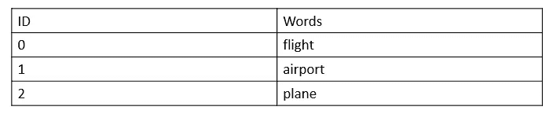
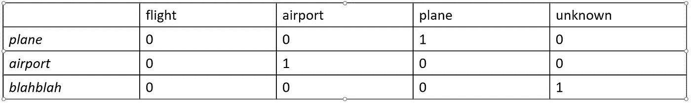

# 自然语言处理中的词表示(一)

> 原文：<https://towardsdatascience.com/word-representation-in-natural-language-processing-part-i-e4cd54fed3d4?source=collection_archive---------7----------------------->

在这篇博文中，我将讨论自然语言处理(NLP)中单词的表示。它是自然语言处理，尤其是神经网络的基本构件之一。它对深度学习模型的性能有着重要的影响。在博客文章的这一部分，我将描述相对简单的方法及其特点。

## 字典查找

最简单的方法是在字典中查找单词 ID。这种方法的基本步骤如下。

首先，取语料库，可以是单词、句子或文本的集合。将它们预处理成预期的格式。一种方法是使用词汇化，这是一个将单词转换为其基本形式的过程。例如，给定单词 *walk，walking，walks* 和*walk，*它们的引理将是 *walk* 。然后，将预处理后的词汇保存到文件中，如*“vocabulary . txt”。*

之后，通过创建单词和 ID 之间的映射来构建查找字典，即词汇表中的每个唯一单词都被分配一个 ID。

因此，将构建一个简单的查找字典，如下所示，从中可以查找单词 id。

Example of sample lookup dictionary.

然后，对于每个给定的单词，通过在字典中查找返回相应的整数表示。如果字典中不存在该单词，则应该返回与词汇外标记相对应的整数。在实践中，通常将词汇外令牌的值设置为字典的大小加 1，即长度(字典)+ 1。

虽然这是一种相对容易的方法，但它也有需要考虑的缺点。通过将标记视为整数，该模型可能会错误地假设自然排序的存在。例如，字典中包含的条目有 *1:“机场”和 2:“飞机”。*具有较大 ID 值的标记可能被深度学习模型认为比具有较小值的标记更重要，这是一个错误的假设。用这种类型的数据训练的模型容易失败。相反，带有序数值的数据如 size measures *1:“小”，2:“中”，3:“大”*适合这种情况。因为数据中有一个自然的顺序。

## 一键编码

单词表示的第二种方法是一键编码。主要思想是创建一个词汇大小向量，其中除了 1 之外都填充了 0。对于单个单词，只有相应的列用值 1 填充，其余的是零值。编码的记号将由维度为 *1 × (N+ 1)* 的向量组成，其中 *N* 是字典的大小，并且对于超出词汇表的记号，额外的 1 被加到 N。让我们看看字典中的单词是如何转换成一键编码的:

正如我们所看到的，对于每个单词，只有对应于单词的列被激活。

这种顺序表示编码的优点是它不会遭受不希望的偏差。然而，其巨大而稀疏的矢量表示需要大量的计算内存。

## 分布表示

第三种方法是一系列分布式表示。这种方法背后的主要思想是，通常出现在相似上下文中的单词将具有相似的含义。其思想是存储单词-上下文共现矩阵 ***F*** ，其中行代表词汇表中的单词，列代表上下文。上下文可以是训练句子上的滑动窗口，甚至是文档。矩阵条目包括频率计数或 tf-idf(术语频率-逆文档频率)得分。这里有一个简单的例子:

波士顿有飞往美国主要城市的航班。

由于恶劣的天气状况，飞往波士顿的航班被取消了。

此外，一些函数 *g* 可以应用于 *F* 以降低噪声、平滑频率或降低表示向量的维数。函数 *g* 可以做简单的变换，比如线性分解，但是也有高级的方法，比如潜在的狄利克雷分配。由于上下文的数量可能非常大，例如文档可能包含数千个句子，这些方法被认为是低效的。

上述方法易于使用，但具有难以训练和需要大内存的缺点。此外，它们不像高级方法那样将单词的意思结合到表示中。在下面的自然语言处理中的单词表示系列中，我将描述更高级的方法。下一个系列可以在 [**这里找到**](https://medium.com/p/1aee2094e08a) 。