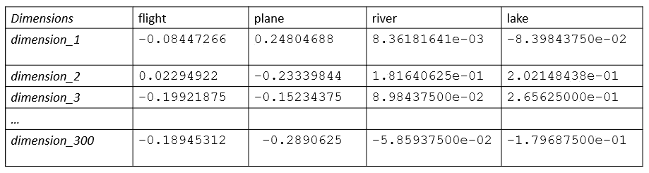

# 自然语言处理中的词表示第二部分

> 原文：<https://towardsdatascience.com/word-representation-in-natural-language-processing-part-ii-1aee2094e08a?source=collection_archive---------10----------------------->

在单词表征系列的前一部分( [**第一部分**](https://medium.com/p/e4cd54fed3d4/edit) **)** 中，我谈到了固定的单词表征，它对单词的语义(意义)和相似性不做任何假设。在这一部分，我将描述一系列的**分布式单词表示**。主要思想是将单词表示为特征向量。vector 中的每个条目代表单词含义中的一个隐藏特征。它们可以揭示语义或句法依赖性。在下面的例子中，我们看到了 *300 维的*单词表示。我们可以观察到*‘flight’*和*‘plane’*的向量值与 *s* 的值相似，它们之间的数值差异很小。这同样适用于*‘河’*和*‘湖’*，因为它们具有密切相关的含义。

因此，它生成有用的属性，如线性关系。一个广为使用的例子是这样的类比:国王对女王就像男人对女人*一样。*国王和王后之间的差异几乎等同于向量空间中男人和女人之间的差异，这导致以下运算有效。

> *“国王—王后+男人”最接近“女人”*

## Word2Vec

一个广泛使用的分布式单词表示是 Skip-Gram 模型，它是 Word2Vec 库的一部分。它是由谷歌的托马斯·米科洛夫领导的研究小组创造的。主要思想是通过单词的邻居来表示单词。它试图预测给定单词的所有相邻单词(上下文)。

根据[文件](https://papers.nips.cc/paper/5021-distributed-representations-of-words-and-phrases-and-their-compositionality.pdf)，模型的目标定义如下:

Objective function for Skip-Gram model

其中 *w* 是训练字， *c* 是上下文的大小。所以它的目标是找到可以预测周围单词的单词表征。

我们可以在我们的数据集上训练 Word2Vec，或者加载预训练的向量。谷歌公布了在谷歌新闻数据集(约 1000 亿字)的一部分上训练的预训练向量。该模型包含 300 万个单词和短语的 300 维向量。这里有[这里有](https://code.google.com/archive/p/word2vec/)。

这些步骤使我们能够使用 Word2Vec 库中预先训练好的向量。

我们可以使用 gensim 加载预训练的单词向量，例如:

预训练向量表示的查找是这样的

## 手套

分布式单词表示的另一个成员是 Glove，它是全局向量的缩写。虽然 Word2Vec 捕获某些局部上下文窗口，但 GloVe 利用了来自语料库(一个大型文本集合)的单词的总体共现统计。它包括两个重要步骤。首先，构建一个词共现矩阵。对于每个单词，我们计算条件概率，例如对于单词 *water P(k|water)* ，其中 *k* 是来自词汇表的单词。如果 *k* 是*流*，则 *P* 的值为高，如果 *k* 是*时尚*，则期望值为低，因为它们通常不会同时出现。在完成所有的统计计算后，大矩阵就形成了。然后通过归一化计数和对数平滑来减少高维上下文矩阵，如下所示。

我们还可以使用 gensim 加载预训练的手套向量，这些向量是在维基百科数据上训练的。

我们需要将 GloVe 格式转换为 Word2Vec，以便与 gensim 一起使用，例如:

更多技术细节可以在[这里](https://nlp.stanford.edu/projects/glove/)找到。

Glove 和 Word2Vec 都允许对单词进行有用的操作，比如查找语义相似的单词。让我们比较一下最相似单词的结果。

使用 Glove 获得与' *flight* '意思相似的单词。

使用 Word2Vec 获得与'*航班*'意思相似的单词。

正如我们所观察到的，这两个向量的输出并不精确。不同之处在于相似度得分和返回的单词。

在上述方法中，分布式单词表示是一种强大的技术。它没有简单方法的不良特性，并且可能将单词的语义信息合并到它们的表示中。然而，它不能为不在词汇表中的单词产生向量。此外，罕见词的向量表示法学得不够好。在这些情况下，最好使用 FastText 模型，这将在下一部分描述。